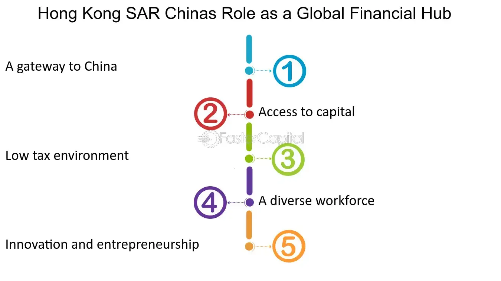

## Table of Contents

## What is Hong Kong SAR, China?

Hong Kong SAR, China, stands for Hong Kong Special Administrative Region of the People's Republic of China. It is a city and a special region located on the southeastern coast of China. Hong Kong was a British colony for many years but was returned to China in 1997. Since then, it has been governed under a unique system called "one country, two systems." This means that while Hong Kong is part of China, it has its own laws, currency, and systems that are different from the rest of the country.

Hong Kong is known for its busy streets, tall buildings, and being a major center for business and finance in Asia. It is also famous for its mix of cultures, with influences from both China and the West. People in Hong Kong enjoy a high level of freedom and have a different way of life compared to other parts of China. The city is also a popular place for tourists, who come to see its famous skyline, try its delicious food, and explore its vibrant markets.

## Why is Hong Kong considered a global financial center?

Hong Kong is considered a global financial center because it has a strong economy and a lot of money moving in and out of the city. It is a place where many big banks and companies have their offices. Hong Kong has good laws that make it easy for businesses to work and make money. The city also has a stock market where people can buy and sell parts of companies, and it is one of the biggest in the world. This makes Hong Kong a very important place for people who want to invest their money.

Another reason is that Hong Kong has a special position in the world. It is a gateway between China and the rest of the world. Many companies use Hong Kong to do business with China because it is easier and has fewer rules. Also, Hong Kong has a good location near many other countries in Asia, which makes it easy to do business with them too. The city is also known for having a lot of skilled workers who understand finance and business, which helps make it a global financial center.

## What are the key financial institutions in Hong Kong?

Hong Kong has many important financial institutions that help make it a big financial center. One of the most well-known is the Hong Kong Monetary Authority (HKMA). This group makes sure that the money in Hong Kong is safe and that the banks follow good rules. Another big bank is the Hong Kong and Shanghai Banking Corporation (HSBC). It is one of the largest banks in the world and has its main office in Hong Kong. HSBC helps people and businesses with their money and is very important for the city's economy.

The Hong Kong Stock Exchange (HKEX) is also a key financial institution. It is where people buy and sell parts of companies, and it is one of the biggest stock markets in the world. The HKEX helps companies get money they need to grow and helps people invest their money. Another important group is the Securities and Futures Commission (SFC). This group makes sure that the stock market and other investments are fair and safe for everyone. Together, these institutions help make Hong Kong a strong place for money and business.

## How does Hong Kong's legal system support its role in global finance?

Hong Kong's legal system plays a big role in making it a good place for global finance. The city follows a common law system, which is similar to what is used in many Western countries like the United Kingdom and the United States. This makes it easier for international businesses to work in Hong Kong because they understand the laws better. The legal system also has strong rules that protect people's rights and make sure businesses follow fair practices. This helps build trust, which is very important in the world of finance.

Another way the legal system supports Hong Kong's role in global finance is by having clear and strong laws about money and investments. The laws are set up to make it easy for businesses to start and grow in Hong Kong. They also make sure that the financial markets are safe and fair. This attracts a lot of big banks and companies to set up their offices in Hong Kong. The legal system also works well with other parts of the government to make sure everything runs smoothly, which helps keep Hong Kong a top place for global finance.

## What is the impact of the Hong Kong Stock Exchange on global markets?

The Hong Kong Stock Exchange (HKEX) has a big impact on global markets because it is one of the biggest stock markets in the world. When companies want to get money to grow, they can sell parts of their business on the HKEX. This helps them get the money they need, and it also lets people from all over the world invest in these companies. Because so many people and businesses use the HKEX, what happens there can affect stock markets in other countries too. If the HKEX goes up or down a lot, it can make other stock markets move in the same way.

The HKEX is also important because it connects China with the rest of the world. Many Chinese companies use the HKEX to sell parts of their business to people outside of China. This helps Chinese companies get money from around the world, and it also lets people invest in China's growing economy. The HKEX has special programs that make it easier for people in mainland China to buy and sell on the HKEX, and for people outside of China to invest in Chinese companies. This makes the HKEX a key part of the global financial system.

## How does Hong Kong's currency peg to the US dollar affect its financial role?

Hong Kong's currency is pegged to the US dollar, which means the Hong Kong dollar's value is always the same as a certain amount of US dollars. This peg helps make Hong Kong's money stable and predictable. When businesses and investors know that the value of the Hong Kong dollar won't change much, they feel more confident about doing business there. This stability is a big reason why Hong Kong is a popular place for global finance. People and companies from all over the world trust that their money will be safe in Hong Kong.

The peg to the US dollar also makes it easier for Hong Kong to do business with other countries. Because the US dollar is used a lot around the world, many businesses and investors already work with it. When Hong Kong's money is tied to the US dollar, it's easier for these businesses to move their money in and out of Hong Kong. This helps make Hong Kong a busy place for international trade and finance. The peg also helps Hong Kong stay connected to the global economy, which is important for its role as a financial center.

## What role do fintech and innovation play in Hong Kong's financial sector?

Fintech and innovation are really important for Hong Kong's financial sector. They help make things easier and faster for people and businesses. Fintech is short for financial technology, and it includes things like using apps on your phone to pay for things, or using the internet to invest your money. Hong Kong has a lot of fintech companies that are coming up with new ideas to make finance better. The government also helps by making rules that support these new ideas, which makes Hong Kong a good place for fintech to grow.

These new technologies and ideas help Hong Kong stay a top place for global finance. They make it easier for people from all over the world to do business in Hong Kong. For example, with fintech, someone in another country can quickly send money to Hong Kong or invest in a company there without having to go through a lot of steps. This makes Hong Kong more connected to the world and helps it keep its important role in the global financial system.

## How does Hong Kong facilitate international trade and investment?

Hong Kong makes it easy for people and businesses from different countries to trade and invest. It has a special place between China and the rest of the world. This makes it a good spot for companies that want to do business with China but find it easier to work in Hong Kong because of its different rules and systems. Hong Kong also has good laws that protect businesses and make it simple to start and run a company. These laws help build trust, which is important for trade and investment.

Another way Hong Kong helps with international trade and investment is by having a strong financial system. Its currency is tied to the US dollar, which makes it stable and easy for businesses to use. The city also has a big stock market where companies can get money to grow and where people can invest. Plus, Hong Kong is known for its fintech and new ideas, which make trading and investing faster and easier. All these things together make Hong Kong a key place for international trade and investment.

## What are the challenges Hong Kong faces as a global financial hub?

Hong Kong faces some challenges as a global financial hub. One big challenge is the political situation. Since Hong Kong is part of China, changes in China's laws and policies can affect Hong Kong. For example, new laws from China can make businesses and investors worried about their freedom and safety. This can make them think twice about doing business in Hong Kong. Also, protests and disagreements between the government and the people can make the city feel less stable, which is not good for a financial center.

Another challenge is competition from other cities. Places like Singapore, Shanghai, and Dubai are also trying to be big financial centers. They are making their laws better and building new things to attract businesses and investors. Hong Kong needs to keep improving its own laws and systems to stay ahead. It also needs to keep coming up with new ideas and using technology to make things easier for people and businesses. If it doesn't, other cities might take away some of its business.

Lastly, the global economy can be a challenge too. Things like trade wars, changes in the world's money markets, and big events like pandemics can make it harder for Hong Kong to keep its role as a financial hub. These events can slow down trade and make investors more careful about where they put their money. Hong Kong needs to be ready to handle these ups and downs and keep showing the world why it's a good place for finance.

## How has the political situation in Hong Kong affected its financial status?

The political situation in Hong Kong has had a big impact on its financial status. Since Hong Kong is part of China, new laws and policies from China can make businesses and investors worried. For example, a new security law from China made some people think that Hong Kong might not be as free as before. This can make companies think twice about setting up offices in Hong Kong or moving their money there. When businesses and investors are unsure, they might choose to go to other places like Singapore or Dubai, which can hurt Hong Kong's role as a financial center.

Also, protests and disagreements between the government and the people can make Hong Kong seem less stable. When a city is not stable, it can scare away businesses and investors who want a safe place to work and put their money. This has been a challenge for Hong Kong because its strength as a financial hub depends a lot on trust and stability. Even though Hong Kong still has a strong financial system and good laws, these political issues can make it harder for the city to keep its important role in the global financial world.

## What are the future prospects for Hong Kong in global finance?

Hong Kong has a good chance to keep being a big player in global finance. It has a strong financial system and good laws that help businesses and investors feel safe. The city is also known for its new ideas and technology, which make things easier and faster for people and companies. Hong Kong's special position between China and the rest of the world is also a big advantage. It helps companies that want to do business with China but find it easier to work in Hong Kong. As long as Hong Kong keeps improving its laws and using new technology, it can stay a top place for global finance.

However, there are some challenges that could affect Hong Kong's future in global finance. The political situation with China can make businesses and investors worried about their freedom and safety. This can make them choose other cities like Singapore or Dubai. Also, other cities are trying to become big financial centers too, so Hong Kong needs to keep working hard to stay ahead. Big events like trade wars or pandemics can also make things harder for Hong Kong. But if the city can handle these challenges well, it can keep its important role in the global financial world.

## How does Hong Kong compare to other major financial centers like New York and London?

Hong Kong is a big financial center like New York and London, but it has some things that make it different. One big thing is that Hong Kong is the gateway between China and the rest of the world. This makes it a special place for companies that want to do business with China. Hong Kong also has a strong financial system with good laws that protect businesses and investors. Its money is tied to the US dollar, which makes it stable and easy for businesses to use. But Hong Kong faces challenges too, like the political situation with China and competition from other cities.

New York and London are also very important financial centers, but they have their own strengths. New York is home to Wall Street, which is famous for its stock market and big banks. It's a busy place where a lot of money moves in and out every day. London is known for its long history in finance and has a lot of big banks and financial companies. Both cities have strong laws and a lot of skilled workers, but they don't have the same special connection to China that Hong Kong has. They also face their own challenges, like changes in the world's economy and new rules after big events like the financial crisis.

## References & Further Reading

[1]: Agarwal, V., & Narayan, S. (2012). ["Role of Algorithmic Trading in Capital Markets."](https://www.semanticscholar.org/paper/Performance-Evaluation-of-Hedge-Funds-with-and-Agarwal-Naik/835f8aa35ef0eae9739ccfc7f06aa49cd3188501) ResearchGate.

[2]: Fishwick, P. A. (1995). ["Simulation Model Design and Execution: Building Digital Worlds"](https://archive.org/details/simulationmodeld0000fish) by Prentice Hall.

[3]: Hasbrouck, J., & Saar, G. (2013). ["Low-Latency Trading."](https://papers.ssrn.com/sol3/papers.cfm?abstract_id=1695460) The Review of Financial Studies, 26(9), 2395-2427.

[4]: Kukies, J., & Whitehead, C. K. (2011). ["The Effects of High-Frequency Trading on Market Quality."](https://www.annualreviews.org/content/journals/10.1146/annurev-financial-121415-033010) European Commission.

[5]: Lhabitant, F.-S., & Gregory, W. E. (2008). ["Handbook of Hedge Funds"](https://onlinelibrary.wiley.com/doi/book/10.1002/9781119202028) by Wiley Finance.

[6]: Zhang, Y., & Bian, J. (2013). ["Algorithmic Trading: A Literature Review."](https://www.sciencedirect.com/science/article/pii/S156849461500438X) Journal of Financial Markets, Institutions & Instruments.

[7]: Beber, A., Brandt, M. W., & Kavajecz, K. A. (2009). ["What Does Equity Sector Orderflow Tell Us about the Economy?"](https://papers.ssrn.com/sol3/papers.cfm?abstract_id=891736) The Review of Financial Studies, 22(10), 3775-3814.