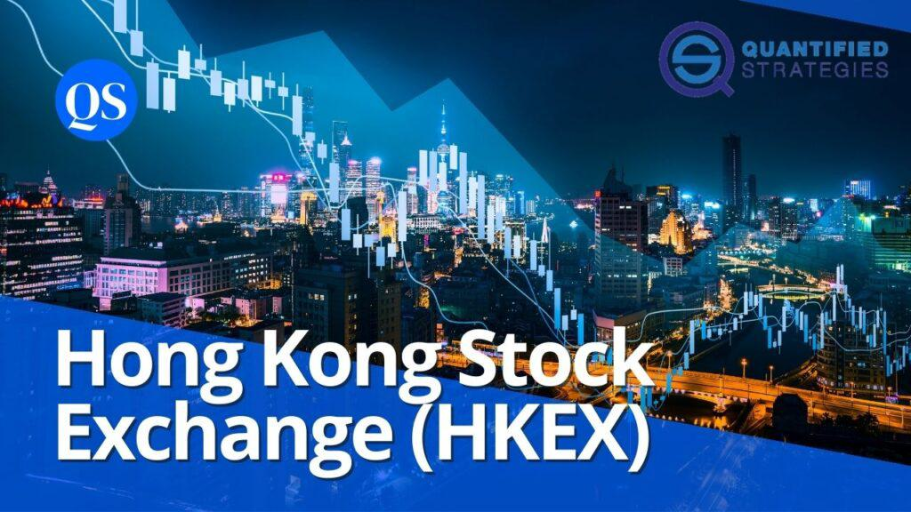

The Hong Kong Exchange, operated by Hong Kong Exchanges and Clearing Limited (HKEX), stands as a pivotal institution in the global financial market. As one of the largest and most dynamic exchanges worldwide, HKEX plays a crucial role in facilitating stock trading and financial operations. It serves as a vital bridge between mainland China and international investors, fostering a robust platform for capital flow and investment diversification.

HKEX enables the trading of a wide array of financial instruments, including equities, derivatives, bonds, and commodities. Its strategic position and diverse offerings have made it a preferred choice for investors seeking to engage with Asian markets. Additionally, HKEX has been instrumental in the development of financial innovations and market trends that influence global trading practices.

One such trend is algorithmic trading, which has gained prominence in modern financial markets. Algorithmic trading leverages computer programs and algorithms to execute trades at optimal prices, offering significant advantages such as speed, accuracy, and reduced transaction costs. By automating the trading process, algorithms can analyse vast datasets in real-time, responding to market fluctuations faster than any human trader could manage. This has revolutionized trading strategies, allowing firms to implement complex models and execute trades with minimal human intervention.

This article aims to explore the integral role of HKEX and the transformative impact of algorithmic trading within its ecosystem. Readers will gain insights into how HKEX has evolved over time, its diverse financial product offerings, and the technological advancements that have shaped its current operations. Moreover, the discussion will illuminate the significance of algorithmic trading, detailing its benefits and the future trajectory within the HKEX platform. Through this examination, stakeholders can better understand and embrace the innovations that are increasingly defining the landscape of global financial trading.

## Table of Contents

## The Evolution of Hong Kong Exchanges and Clearing Limited

Hong Kong Exchanges and Clearing Limited (HKEX) has a rich history dating back to its formation in 2000. It emerged from the merger of the Stock Exchange of Hong Kong, the Hong Kong Futures Exchange, and their respective clearing houses. This strategic consolidation was aimed at enhancing Hong Kong’s position as a leading financial hub by streamlining its financial market operations. HKEX is headquartered in Hong Kong and has played a pivotal role in shaping the dynamics of the financial industry not only locally but also globally. 

One of the significant milestones in HKEX's trajectory was its decision to go public and list on its own exchange in 2000, allowing it to harness capital from investors keen on participating in Asia’s economic growth. This move reinforced its commitment to transparency and accountability, fostering investor confidence.

A landmark achievement for HKEX was its acquisition of the London Metal Exchange (LME) in 2012 for £1.4 billion. This acquisition extended HKEX's global influence in the commodity trading sector, integrating precious and base metals into its portfolio and enhancing its stature in international markets. The LME, as a world-leading metal market, has been leveraged to provide diversified trading options to participants and achieve strategic growth outside Asia.

Analyzing historical trends in trading volumes and market capitalization reveals HKEX's robust performance as a platform for capital formation. Over the years, the exchange has witnessed notable growth in its trading volumes, reflecting increased investor activity and growing confidence in its systems. For instance, in 2020, despite the global economic disruptions caused by the COVID-19 pandemic, HKEX reported a total market capitalization of over HKD 47 trillion. This resilience underscores its crucial role in maintaining market stability and providing [liquidity](/wiki/liquidity-risk-premium) even in challenging times.

The overall expansion of trading volumes can be attributed to several factors, including HKEX's diverse product offerings, technological advancements, and strategic partnerships, which have served to broaden its market reach and enhance accessibility for a global investor base. This historical evolution paints a picture of a dynamic entity continuously seeking growth opportunities and adapting to changes in the financial landscape.

## HKEX: A Platform for Diverse Financial Products

Hong Kong Exchanges and Clearing Limited (HKEX) is a crucial hub for a variety of financial products, catering to both local and international investors. The exchange facilitates trading in equities, bonds, exchange-traded funds (ETFs), and derivatives, providing a broad spectrum of investment opportunities.

**Equities, Bonds, and ETFs**

HKEX offers a robust platform for equity trading, accommodating a wide array of companies from different sectors. The exchange is known for its stringent listing requirements, ensuring the quality and reliability of the equities available to investors. Additionally, HKEX provides trading in bonds, allowing for diversified investment options encompassing government, corporate, and green bonds. The availability of ETFs further broadens investment choices, giving investors access to diverse portfolios that can track indices, commodities, or sectors.

**Derivatives Market**

The derivatives market at HKEX includes a comprehensive range of products, such as futures and options, which are crucial for hedging and speculative strategies. These derivatives are not limited to traditional asset classes but also include products denominated in the Chinese renminbi (RMB), enhancing the appeal of HKEX to investors interested in the Chinese economy. The introduction of RMB-denominated futures is particularly significant, offering investors direct access to emerging opportunities in mainland China.

**Innovative Products and Thematic Investments**

In response to evolving market trends, HKEX has continued to innovate with new product offerings. One notable development is the introduction of renminbi-denominated futures, which allow international investors to manage exposure to the Chinese currency directly. The exchange also offers thematic investments such as the Hang Seng TECH Index, which includes technology sector companies. This index caters to investors seeking to capitalize on the growth of technology and innovation in the region.

**Ultra High-Net-Worth Individual (UHNW) Trading**

For ultra high-net-worth individuals interested in commodities and thematic investments, HKEX provides tailored products that cater to sophisticated investment strategies. These include advanced derivatives and structured products that offer exposure to specific sectors or themes, aligning with the investment objectives of UHNW clients.

HKEX's diverse array of financial products underscores its role as a pivotal exchange within the global financial ecosystem, supporting a wide range of investment needs and preferences.

## Algorithmic Trading on HKEX

Algorithmic trading refers to the use of complex algorithms, [artificial intelligence](/wiki/ai-artificial-intelligence), and high-speed computations to facilitate trading decisions and execute orders in the financial markets. Its significance in modern financial markets cannot be overstated, as it enhances efficiency, minimizes human errors, and increases trading volumes. By automating trading strategies, [algorithmic trading](/wiki/algorithmic-trading) enables investors to capitalize on market opportunities faster than would be possible through manual trading. The algorithmic approach to trading is essential for handling the vast amount of data processed in today's highly dynamic markets.

In recent years, the Hong Kong Exchanges and Clearing Limited (HKEX) has embraced algorithmic trading as part of its strategy to enhance the trading experience for investors. A notable development in this space has been the launch of Quantitative Brokers' algorithmic execution strategies on HKEX. Quantitative Brokers, a well-known provider of advanced execution algorithms and data-driven analytics, commenced offering their services on the HKEX platform, providing market participants with sophisticated tools to optimize their trading performance. These strategies are designed to reduce the market impact and execution costs, providing a more efficient solution for executing large volumes of trades.

The benefits of algorithmic trading on HKEX are manifold. First and foremost, algorithmic trading significantly increases the speed at which trades are executed. Given that these trades capitalize on small price movements that occur in fractions of a second, speed is paramount. Algorithms can continuously monitor multiple markets simultaneously and execute trades at lightning-fast speeds, often in milliseconds, which would be impossible for a human trader to achieve.

Furthermore, algorithmic trading enhances accuracy in trade execution. By following a set of well-defined rules and parameters, algorithmic systems can minimize the possibility of human error, reducing the likelihood of costly mistakes. This accuracy extends to complex trading strategies that require precision and consistency, making algorithmic trading an indispensable tool for institutional investors and high-frequency traders.

Another significant advantage of algorithmic trading on HKEX is the reduction in trading costs. Algorithms can efficiently parse market data to identify the best prices and execute trades at optimal moments, thereby reducing transaction costs and slippage. In addition, by minimizing human intervention, these systems can reduce labor costs associated with manual trading.

In conclusion, the integration of algorithmic trading on HKEX marks a strategic enhancement to the platform, reflecting the broader trend of digital transformation in financial markets. By offering superior speed, accuracy, and cost efficiency, algorithmic trading represents a critical development for both novice and seasoned investors seeking to optimize their trading operations on HKEX.

## Technological Advancements and Trading Infrastructure

Hong Kong Exchanges and Clearing Limited (HKEX) has undergone a comprehensive transformation in its trading infrastructure, marking significant advancements toward a fully electronic platform. This transition has been pivotal for enhancing efficiency, speed, and competitiveness in global financial markets. 

The shift to a fully electronic trading platform was a crucial step for HKEX, allowing for seamless and rapid execution of trades. This transition enabled the exchange to handle greater trading volumes with increased accuracy and reduced human error, ensuring reliable and efficient transaction processing. The digital infrastructure supports various automated trading systems, paving the way for algorithmic trading and high-frequency trading strategies.

One of the significant enhancements in HKEX's trading infrastructure is the introduction of after-hours trading. This feature extends the traditional trading hours, allowing market participants to react promptly to global financial events occurring in different time zones. After-hours trading facilitates greater market liquidity and provides investors with more opportunities to trade based on international developments.

HKEX has also engaged in several strategic partnerships and technological collaborations to augment its trading capabilities. These partnerships have been aimed at integrating cutting-edge technology, enhancing operational efficiency, and broadening trading options available on the platform. Through collaborations with technology firms and financial institutions, HKEX has bolstered its infrastructure, offering innovative trading solutions and improved user experience.

Overall, these technological advancements have positioned HKEX as a leading financial hub in the region, adept at meeting the demands of modern financial markets. The focus on electronic trading, extended trading hours, and collaborations for technological growth underscores HKEX's commitment to providing a robust, efficient, and accessible trading environment for global investors.

## Global Connectivity and Market Expansion

Hong Kong Exchanges and Clearing Limited (HKEX) plays a crucial role in linking international financial markets, underscored by initiatives like the Shanghai-Hong Kong Stock Connect. Launched in 2014, this program enables investors from Mainland China and Hong Kong to trade shares listed on each other's exchanges, thus promoting cross-border investment opportunities. The Stock Connect serves as a pivotal bridge, facilitating the flow of capital and expanding the investment horizon for stakeholders across the two regions. 

HKEX continually seeks to expand its market reach by launching various initiatives aimed at international trading. One significant effort is the Bond Connect program, which permits foreign investors access to China's onshore bond market. Introduced in 2017, it enhances market dynamics by increasing the diversity of participants and products, attracting a global pool of investors. Additionally, HKEX's strategic acquisitions, such as the purchase of the London Metal Exchange, underscore its commitment to diversify product offerings and strengthen its international presence.

The global strategy of HKEX markedly influences market liquidity and investor access. By offering products and services that cater to a wider audience, HKEX enhances the liquidity pool available to traders and investors, which is a critical [factor](/wiki/factor-investing) for efficient market functioning. The inclusion of diverse products such as renminbi-denominated futures broadens the scope for hedging and investment, drawing attention from institutional investors globally.

The connectivity initiatives and global outreach strategies implemented by HKEX significantly bolster investor access by lowering geographical and procedural barriers. The seamless integration with international markets ensures that investors can engage with a broad spectrum of securities and derivatives. This promotes a more dynamic and resilient market environment that benefits both local and international participants.

In summary, HKEX's continuous efforts to forge connections with international markets and expand its influence underscore its pivotal role in global finance. Through strategic programs, partnerships, and acquisitions, HKEX enhances liquidity and provides broader access to investors worldwide, thus solidifying its position as a leading global financial hub.

## The Future of Algo Trading on HKEX

Algorithmic trading on the Hong Kong Exchanges and Clearing Limited (HKEX) is poised for significant evolution, driven by advancements in technology and increasing integration with global financial markets. As trading strategies become more sophisticated, it is expected that algorithmic trading will continue to grow, providing a competitive edge for traders seeking to optimize execution and manage risk more effectively.

### Predictions for Ongoing Evolution

The adoption of [machine learning](/wiki/machine-learning) and artificial intelligence in trading algorithms is anticipated to gain [momentum](/wiki/momentum) on HKEX. These technologies enhance the ability of trading systems to analyze vast datasets, identify patterns, and predict price movements, potentially leading to improved trading decisions and higher efficiency. As these algorithms become more advanced, the demand for high-speed data processing infrastructure is expected to increase.

The role of big data analytics is forecasted to become more prominent, as traders increasingly rely on data-driven insights to inform their strategies. This trend will likely result in the development of more complex trading models and a shift toward [quantitative trading](/wiki/quantitative-trading) approaches that exploit market inefficiencies.

### Potential Challenges and Opportunities

Traders on the HKEX platform are likely to encounter several challenges as algorithmic trading evolves. One significant challenge is the risk of market disruption due to the high-speed nature of algo trading. The potential for systemic risk must be mitigated through robust risk management practices and advanced monitoring systems.

However, these challenges are accompanied by substantial opportunities. Traders can leverage improved liquidity and reduced transaction costs associated with algorithmic trading. There is also potential for increased market participation from institutional investors who are drawn to the precision and speed offered by algos.

### The Role of Regulatory Frameworks

As algorithmic trading continues to expand, regulatory frameworks will play a crucial role in ensuring market stability. It is imperative that HKEX collaborates with regulatory bodies to establish guidelines that prevent market abuse and protect investor interests. This may include regulations on the transparency of trading algorithms, limits on trading speeds, and measures to prevent market manipulation.

The future of algorithmic trading on HKEX will also depend on international cooperation between regulators, as cross-border trading becomes more prevalent. Harmonized regulations will be essential to facilitate seamless trading and maintain investor confidence.

In conclusion, the future of algorithmic trading on HKEX is marked by technological advancements and global integration, offering both challenges and opportunities. With the support of robust regulatory frameworks, traders can harness the benefits of algorithmic trading while safeguarding market integrity.

## Conclusion

The Hong Kong Exchanges and Clearing Limited (HKEX) has firmly established itself as a pivotal entity in the global financial market. Throughout its evolution, HKEX has achieved significant milestones, such as key acquisitions and its own public listing, while consistently expanding its range of financial offerings. This includes equities, bonds, derivatives, and innovative products like renminbi-denominated futures. The platform's commitment to embracing cutting-edge technology and infrastructure has played a central role in enhancing its efficiency and global reach.

Algorithmic trading has emerged as a transformative force within HKEX, bringing notable benefits to market participants. The adoption of these advanced trading strategies has allowed for increased trading speed, enhanced accuracy, and reduced transaction costs. Initiatives like the launch of Quantitative Brokers' algorithmic execution strategies demonstrate HKEX's dedication to fostering a modern trading environment.

Looking ahead, the importance of technology in shaping stock trading at HKEX cannot be overstated. Technological advancements facilitate improved trading experiences and enable market expansion through global connectivity, such as the integration with the Shanghai-Hong Kong Stock Connect. In light of these developments, stakeholders are encouraged to embrace these innovations to remain competitive in an ever-evolving market landscape. As algorithmic trading continues to grow, regulatory frameworks will play a crucial role in ensuring market stability and protecting investor interests, paving the way for a sustainable financial future at HKEX.

## References & Further Reading

[1]: Bergstra, J., Bardenet, R., Bengio, Y., & Kégl, B. (2011). ["Algorithms for Hyper-Parameter Optimization."](https://dl.acm.org/doi/10.5555/2986459.2986743) Advances in Neural Information Processing Systems 24.

[2]: ["Advances in Financial Machine Learning"](https://www.amazon.com/Advances-Financial-Machine-Learning-Marcos/dp/1119482089) by Marcos Lopez de Prado

[3]: ["Evidence-Based Technical Analysis: Applying the Scientific Method and Statistical Inference to Trading Signals"](https://www.amazon.com/Evidence-Based-Technical-Analysis-Scientific-Statistical/dp/0470008741) by David Aronson

[4]: ["Machine Learning for Algorithmic Trading"](https://github.com/stefan-jansen/machine-learning-for-trading) by Stefan Jansen

[5]: ["Quantitative Trading: How to Build Your Own Algorithmic Trading Business"](https://www.amazon.com/Quantitative-Trading-Build-Algorithmic-Business/dp/1119800064) by Ernest P. Chan