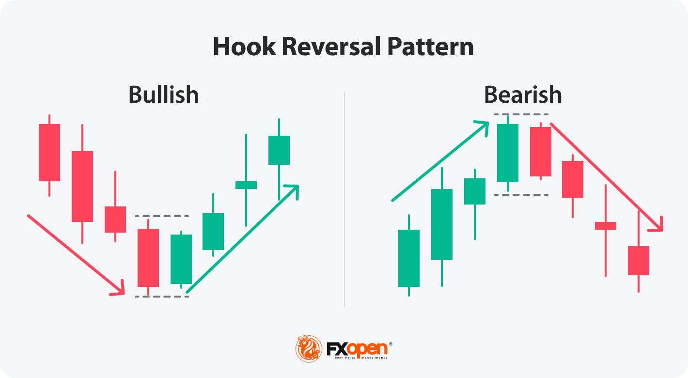

## Table of Contents

## What is a hook reversal in trading?

A hook reversal in trading is a pattern that shows up on a price chart. It looks like a hook and signals that the current trend might be about to change direction. Traders watch for this pattern because it can help them decide when to buy or sell.

The pattern forms when the price moves in one direction, but then suddenly reverses and goes the other way. For example, if the price has been going up, a hook reversal would show the price starting to go down instead. This can be a sign that the upward trend is losing strength and a downward trend might start soon.

## How does a hook reversal pattern form on a chart?

A hook reversal pattern forms when the price of a stock or other asset makes a sudden change in direction. Imagine the price has been going up for a while, making higher highs and higher lows. Then, suddenly, instead of continuing to go up, the price starts to drop. This drop creates a shape on the chart that looks like a hook, showing that the upward trend might be over and a new downward trend could be starting.

To see this pattern clearly, traders look at the peaks and troughs of the price movement. If the price was going up and then makes a sharp turn downwards, forming a peak with a hook shape, it's a sign of a potential reversal. This pattern can also happen in reverse, where the price has been going down and then suddenly starts to go up, creating a hook at the bottom. Recognizing these hooks helps traders decide when to buy or sell, based on the new direction the price might take.

## Can you explain the basic components of a hook reversal?

A hook reversal pattern has two main parts: the initial trend and the sudden change in direction. The initial trend can be either an uptrend, where the price keeps going up, or a downtrend, where the price keeps going down. This trend continues until it reaches a peak or a trough, depending on whether it's an uptrend or a downtrend.

Then, the sudden change happens. If the price was going up, it suddenly starts to go down, forming a hook shape at the top of the chart. If the price was going down, it suddenly starts to go up, forming a hook shape at the bottom of the chart. This hook shows that the old trend is ending and a new trend might be starting in the opposite direction.

## What are the key differences between a hook reversal and other reversal patterns?

A hook reversal is different from other reversal patterns because it looks like a hook on the chart. Other patterns, like head and shoulders or double tops and bottoms, have different shapes. The hook reversal shows a quick and clear change in direction, which makes it easy to spot. For example, a head and shoulders pattern takes longer to form and has three peaks, while a hook reversal is simpler and quicker.

Another key difference is how the hook reversal forms. It happens when the price suddenly reverses after moving in one direction, making a sharp turn that looks like a hook. Other patterns might take more time and show more gradual changes. For instance, a double top shows two peaks at about the same level before the price drops, while a hook reversal shows a single, sharp turn. This makes the hook reversal a good signal for traders who want to act quickly on a potential trend change.

## How can a beginner identify a hook reversal on a price chart?

To identify a hook reversal on a price chart, a beginner should first look for a clear trend. This means the price should be either going up steadily, making higher highs and higher lows, or going down steadily, making lower highs and lower lows. Once you see this trend, watch for a sudden change. If the price was going up, keep an eye out for when it suddenly starts to go down instead. If the price was going down, look for when it suddenly starts to go up. This sudden change will form a hook shape on the chart.

The hook shape is what makes the hook reversal pattern easy to spot. If the price was going up, the hook will appear at the top of the chart, where the price makes a peak and then turns down sharply. If the price was going down, the hook will appear at the bottom of the chart, where the price makes a trough and then turns up sharply. By watching for these sudden changes and the hook shapes they create, beginners can start to recognize when a trend might be reversing and make better trading decisions.

## What are the common time frames where hook reversals are most effective?

Hook reversals can be seen on different time frames, but they are most effective on shorter time frames like the 1-hour or 4-hour charts. These shorter time frames let traders see quick changes in the price. When the price suddenly turns and makes a hook shape, it's easier to spot on these charts. This helps traders act fast when they think the trend might be changing.

On longer time frames like daily or weekly charts, hook reversals can also be useful, but they might not give the same quick signals. These longer time frames show bigger trends, so the hook might take longer to form. Still, if a trader is looking at the bigger picture, a hook reversal on a daily or weekly chart can be a strong sign that a major trend change is happening.

## What psychological factors contribute to the formation of a hook reversal?

Hook reversals happen because of how people feel about the price of a stock or other asset. When the price is going up, people start to feel hopeful and excited. They think the price will keep going up, so they keep buying. But then, some people start to feel worried that the price might be too high. They decide to sell, and when enough people do this, the price suddenly drops. This quick drop makes a hook shape on the chart, showing that the trend might be changing because people's feelings changed.

On the other hand, when the price is going down, people start to feel scared and unsure. They think the price will keep dropping, so they keep selling. But then, some people start to see the price as a good deal. They decide to buy, and when enough people do this, the price suddenly goes up. This quick rise makes a hook shape on the chart, showing that the trend might be changing because people's feelings changed again. So, hook reversals are all about how people's emotions can make the price move suddenly in a new direction.

## How can traders use hook reversals to set entry and exit points?

Traders can use hook reversals to find good times to buy or sell. When the price has been going up and then makes a hook shape by suddenly dropping, it might be a good time to sell. This is because the hook shows that the upward trend could be over, and the price might start going down. So, a trader might decide to sell their stock right after seeing the hook, to avoid losing money if the price keeps dropping.

On the other hand, if the price has been going down and then makes a hook shape by suddenly going up, it might be a good time to buy. The hook shows that the downward trend could be over, and the price might start going up. So, a trader might decide to buy the stock right after seeing the hook, hoping to make money if the price keeps rising. By watching for these hook shapes, traders can set their entry and exit points to make better trading decisions.

## What are some common mistakes traders make when trading hook reversals?

One common mistake traders make with hook reversals is jumping in too early. They see the hook shape and think the trend will change right away, so they buy or sell quickly. But sometimes, the price might go back to the old trend for a little bit before really changing. This can make traders lose money if they didn't wait to make sure the new trend was strong.

Another mistake is not using other tools to check the hook reversal. Traders might only look at the hook shape and not use things like support and resistance levels or other chart patterns to see if the reversal is real. This can lead to bad trades because they might miss important signs that the hook isn't a good signal to trade on. By using more tools, traders can be more sure about their decisions and avoid some losses.

## How can advanced technical indicators enhance the detection of hook reversals?

Advanced technical indicators can help traders see hook reversals more clearly and with more confidence. One way they do this is by using indicators like the Relative Strength Index (RSI) or the Moving Average Convergence Divergence (MACD). These indicators can show when a stock is overbought or oversold, which can help confirm if a hook reversal is likely to happen. For example, if the RSI shows a stock is overbought right before the price makes a hook shape and starts dropping, it adds more proof that the upward trend might be ending.

Another way advanced indicators help is by showing the strength of the trend. Indicators like the Average Directional Index (ADX) can tell traders how strong the current trend is. If the ADX shows a weakening trend right before a hook reversal, it can give traders more confidence that the trend is really about to change. By using these indicators along with watching for hook shapes on the chart, traders can make better decisions about when to buy or sell, and they can feel more sure about their trades.

## Can you provide examples of successful trades using hook reversals in different markets?

In the stock market, a trader noticed a hook reversal on a 1-hour chart for a tech company's stock. The stock had been going up for days, but suddenly it made a hook shape and started dropping. The trader quickly sold their shares right after seeing the hook, avoiding further losses as the stock continued to drop for the next few days. By using the hook reversal as a signal to sell, the trader was able to get out before the price fell too much.

In the [forex](/wiki/forex-system) market, a trader was watching the EUR/USD currency pair on a 4-hour chart. The pair had been going down for a while, but then it made a hook shape and started going up. The trader saw this as a sign that the downward trend might be over, so they bought the pair right after the hook. The EUR/USD continued to rise over the next week, and the trader made a good profit by getting in early on the new upward trend. The hook reversal helped the trader spot the right time to buy and make money from the change in direction.

## What are the statistical probabilities of success when trading hook reversals, and how do they vary across different market conditions?

The success rate of trading hook reversals can change a lot depending on the market conditions. In a strong, clear trend, hook reversals can be very useful. They can help traders spot when the trend might be about to change. In these conditions, the success rate might be higher because the hook is a strong signal that the trend is losing strength. But, if the market is moving sideways or is very choppy, hook reversals might not work as well. The price might make a hook shape, but then go back to the old trend quickly. This can make the success rate lower because the signal is not as strong.

Different markets also affect how well hook reversals work. In the stock market, where trends can last for a long time, hook reversals might have a higher success rate if traders use them to spot big changes in direction. In the forex market, where prices can move quickly and trends can change often, hook reversals might be less reliable. Traders need to be careful and use other tools to check if the hook is a real signal. Overall, the key to success with hook reversals is understanding the market conditions and using other indicators to make sure the signal is strong.

## What are the mechanics of a Hook Reversal Pattern?

A hook reversal pattern is a technical analysis tool used to identify potential market reversals. It is characterized by a distinct candlestick formation where the pricing dynamics indicate a possible change in the prevailing trend. The key formation of a hook reversal involves two main characteristics: the higher low and the lower high candlestick formation. 

In a hook reversal, the first candlestick closes near its high and opens within the body of the prior candlestick. For bullish hook reversals, this means the market initially exhibits bearish characteristics, often following a downtrend where the first candle forms a higher low. Conversely, the second candlestick reverses direction, forming a lower high, and closes above the close of the first candle. This indicates a potential bullish reversal as the higher low suggests that sellers are losing [momentum](/wiki/momentum), potentially paving the way for buyers to take control. 

Mathematically, if $C_1$ and $O_1$ represent the close and open prices of the first candlestick, and $C_2$ and $O_2$ represent the close and open prices of the second candlestick, a bullish hook reversal pattern can be summarized as:

$$

O_2 > C_1 \quad \text{and} \quad C_2 > O_1 
$$

In contrast, a bearish hook reversal occurs following an upward trend, whereby the first candlestick forms a lower high and the second candlestick opens below the close of the first and closes below its open. This indicates a potential bearish reversal as the lower high suggests that buyers might be losing control, opening opportunities for sellers.

In formula terms, for a bearish hook reversal:

$$

O_2 < C_1 \quad \text{and} \quad C_2 < O_1 
$$

It is essential to distinguish hook reversals from other reversal patterns such as engulfing and harami patterns. While all these patterns signal reversals, hook reversals are particularly useful due to their simplicity and clarity, as they focus on the relationship of highs and lows rather than the body sizes of candlesticks.

Understanding these dynamics is crucial for traders. Recognizing higher lows in bullish contexts, and lower highs in bearish scenarios can be a powerful indicator of trend changes, assisting traders in making informed entry and [exit](/wiki/exit-strategy) decisions.

## References & Further Reading

[1]: ["Technical Analysis of the Financial Markets: A Comprehensive Guide to Trading Methods and Applications"](https://www.amazon.com/Technical-Analysis-Financial-Markets-Comprehensive/dp/0735200661) by John J. Murphy.

[2]: ["Candlestick Charting Explained: Timeless Techniques for Trading Stocks and Futures"](https://www.amazon.com/Candlestick-Charting-Explained-Timeless-Techniques/dp/007146154X) by Gregory L. Morris.

[3]: ["Algorithmic Trading: Winning Strategies and Their Rationale"](https://www.amazon.com/Algorithmic-Trading-Winning-Strategies-Rationale-ebook/dp/B00CY5HC0U) by Ernie Chan.

[4]: Lo, A. W., & MacKinlay, A. C. (1999). ["A Non-Random Walk Down Wall Street"](https://www.jstor.org/stable/j.ctt7tccx) Princeton University Press.

[5]: ["Trading Price Action Reversals: Technical Analysis of Price Charts Bar by Bar for the Serious Trader"](https://www.amazon.com/Trading-Price-Action-Reversals-Technical/dp/1118066618) by Al Brooks.