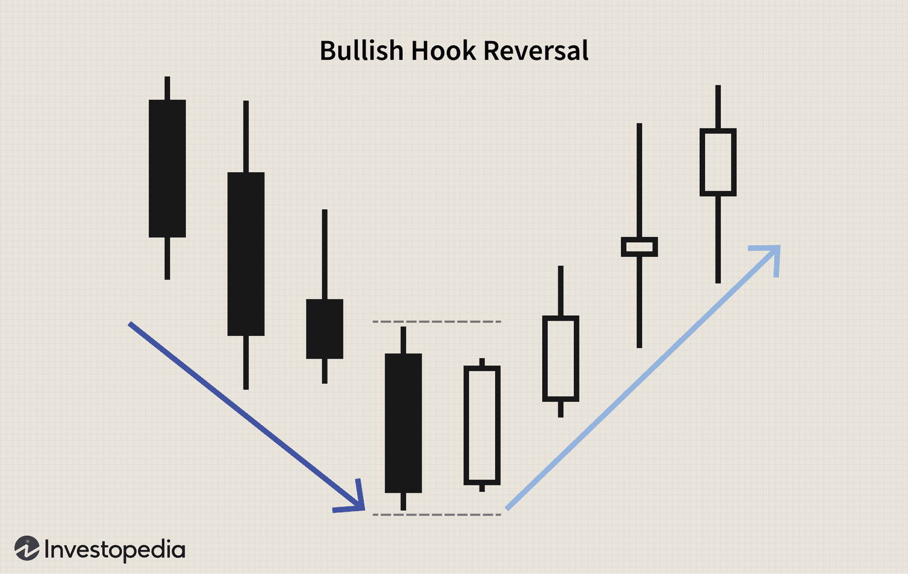

Technical analysis is a methodology used in trading to forecast the direction of asset prices through the study of past market data, primarily price and volume. Its core principle is that market prices reflect all available information, thereby following trends that are attributable to market psychology, behavioral finance, and other associated factors. Traders use technical analysis to identify patterns and trends in market movements, which can be leveraged to make informed trading decisions.

Reversal patterns are a crucial subset of technical analysis that indicate a change in the prevailing trend. They gain significance as they provide traders the opportunity to enter or exit positions at strategic points, potentially maximizing returns. Common reversal patterns include the head and shoulders, double tops and bottoms, and hammer and hanging man formations. Understanding these patterns enables traders to predetermine potential reversal zones, offering a strategic advantage in volatile markets.



With the advent of advanced computing, algorithmic trading has become prevalent, relying heavily on technical patterns for decision-making. Algorithms are designed to identify and exploit repetitive patterns, executing trades at speeds and frequencies unachievable by human traders. This reliance on automated systems underscores the role of technical patterns, such as moving averages, support and resistance levels, and reversal indicators, in algorithmic strategies.

Within the domain of reversal patterns, the hook reversal holds a unique position. It is characterized by a specific candlestick pattern that can signal a potential reversal in the market’s current trend. This pattern is pivotal for detecting shifts in momentum and can be integral in forming effective trading plans. By understanding and recognizing a hook reversal, traders can enhance their ability to anticipate and capitalize on market transitions, integrating this knowledge into both manual and algorithmic trading strategies.

## Table of Contents

## Understanding Hook Reversal in Technical Analysis

A hook reversal pattern in technical analysis is a specific candlestick formation that traders use to identify potential reversals in market trends. This pattern can occur in both upward and downward trends, signaling a possible change in the current price direction. In an ideal hook reversal pattern, the market forms a higher low and a lower high compared to the previous candlestick, creating a 'hook' shape.

The distinction between a hook reversal and other well-known reversal patterns, such as engulfing and harami, lies in the specifics of their formation. An engulfing pattern occurs when a candlestick's body completely engulfs the body of the previous candle, indicating a robust shift in momentum. Conversely, a harami pattern is identified when a small candle is contained within the prior candle's body, suggesting indecision and a potential reversal. A hook reversal, however, does not require the current candle to envelop or be enveloped by its predecessor entirely but instead emphasizes the formation of a higher low and a lower high, signaling a transition point in market sentiment.

Candlestick patterns, including the hook reversal, play a crucial role in identifying market reversals because they provide visual insights into the underlying market psychology. Each candlestick reflects the battle between buyers (bulls) and sellers (bears) within a specific time frame, condensing vital information such as opening, closing, high, and low prices. Recognizing a hook reversal involves understanding how these elements converge to indicate a likely change in direction, thus offering traders an actionable signal. 

These patterns help traders anticipate potential market movements, allowing them to make informed decisions about entering or exiting positions. However, relying solely on candlestick patterns without considering the broader market context or additional indicators might increase the risk of misinterpreting signals. Therefore, while hook reversals can be highly useful, they are most effective when integrated into a comprehensive trading strategy that considers other factors influencing market conditions.

## Mechanics of a Hook Reversal Pattern

A hook reversal pattern is a technical analysis tool used to identify potential market reversals. It is characterized by a distinct candlestick formation where the pricing dynamics indicate a possible change in the prevailing trend. The key formation of a hook reversal involves two main characteristics: the higher low and the lower high candlestick formation. 

In a hook reversal, the first candlestick closes near its high and opens within the body of the prior candlestick. For bullish hook reversals, this means the market initially exhibits bearish characteristics, often following a downtrend where the first candle forms a higher low. Conversely, the second candlestick reverses direction, forming a lower high, and closes above the close of the first candle. This indicates a potential bullish reversal as the higher low suggests that sellers are losing [momentum](/wiki/momentum), potentially paving the way for buyers to take control. 

Mathematically, if $C_1$ and $O_1$ represent the close and open prices of the first candlestick, and $C_2$ and $O_2$ represent the close and open prices of the second candlestick, a bullish hook reversal pattern can be summarized as:

$$

O_2 > C_1 \quad \text{and} \quad C_2 > O_1 
$$

In contrast, a bearish hook reversal occurs following an upward trend, whereby the first candlestick forms a lower high and the second candlestick opens below the close of the first and closes below its open. This indicates a potential bearish reversal as the lower high suggests that buyers might be losing control, opening opportunities for sellers.

In formula terms, for a bearish hook reversal:

$$

O_2 < C_1 \quad \text{and} \quad C_2 < O_1 
$$

It is essential to distinguish hook reversals from other reversal patterns such as engulfing and harami patterns. While all these patterns signal reversals, hook reversals are particularly useful due to their simplicity and clarity, as they focus on the relationship of highs and lows rather than the body sizes of candlesticks.

Understanding these dynamics is crucial for traders. Recognizing higher lows in bullish contexts, and lower highs in bearish scenarios can be a powerful indicator of trend changes, assisting traders in making informed entry and [exit](/wiki/exit-strategy) decisions.

## Examples of Hook Reversal Patterns

In technical analysis, a hook reversal pattern is an important indicator for predicting changes in market direction. Visualizing these patterns involves examining candlestick charts to identify specific formations that signal potential reversals in trends.

A bullish hook reversal pattern is characterized by an initial higher open relative to the close of the previous day and a lower low compared to that day. This formation indicates a potential switch from a downtrend to an uptrend. In a typical candlestick chart, the body of the candlestick representing the reversal day will be lighter, indicating upward movement. A classic bullish hook reversal is often seen in conjunction with oversold conditions identified through indicators like the Relative Strength Index (RSI), increasing its predictive strength.

Conversely, a bearish hook reversal pattern occurs when the candlestick opens lower than the previous day’s close and forms a higher high. This suggests a possible transition from an uptrend to a downtrend. In the candlestick representation, the reversal day’s body will be darker, symbolizing downward movement. Bearish hook reversals often align with overbought conditions, marked by a high RSI, providing additional confirmation for traders.

Real-world examples of hook reversal patterns can be observed in the historical price movements of various stocks and financial instruments. For instance, during periods of significant market corrections or rallies, stocks like Apple Inc. (AAPL) or indices such as the S&P 500 often showcase hook reversals at critical turning points. In these scenarios, the candlestick patterns reveal whether the forthcoming trend is reversal-driven, providing traders with insights into potential buying or selling opportunities. While identifying these patterns, it is crucial to integrate other technical indicators and market signals to make informed trading decisions.

## Integrating Hook Reversals in Trading Strategies

Hook reversals are pivotal in trading strategies as they can signal crucial entry and exit points. Traders closely monitor these patterns to identify potential market reversals, thus allowing them to capitalize on price changes. A hook reversal pattern occurs when a higher low and a lower high are observed in two consecutive candlesticks, indicating a potential trend reversal. When utilizing hook reversals, traders often wait for additional confirmation from other indicators before making trades to reduce the likelihood of false signals.

Combining hook reversals with indicators such as the Relative Strength Index (RSI) and [volume](/wiki/volume-trading-strategy) analysis is vital for enhancing trading accuracy. The RSI is a momentum oscillator that measures the speed and change of price movements and ranges from 0 to 100. When an asset is overbought (typically indicated by an RSI above 70) or oversold (RSI below 30), it may be ripe for a reversal. By using hook reversals in conjunction with RSI readings, traders can improve their chances of accurately predicting market turning points.

In addition to RSI, volume analysis is another crucial [factor](/wiki/factor-investing). Volume trends can confirm the strength of a hook reversal pattern. A reversal pattern accompanied by strong trading volume is more likely to signify a genuine market shift than one with low volume. Volume analysis can reveal whether the market has enough momentum to sustain a newly suggested trend.

For practical implementation, traders set both stop-loss and take-profit orders to manage risk and secure profits. A stop-loss order is designed to limit an investor's loss on a position by setting a predetermined price point at which the position will be automatically sold. When using hook reversals, traders often place stop-loss orders slightly below the recent low for bullish reversals and just above the recent high for bearish reversals. This approach helps ensure that the strategy remains profitable even if the market does not move as predicted.

Take-profit orders allow traders to establish a price level at which a position will be automatically closed with a profit. An effective take-profit strategy following a hook reversal might involve setting an order at a point just below significant resistance levels for bullish reversals or above support levels for bearish reversals, ensuring gains are captured before potential market corrections.

In summary, while hook reversals alone are a powerful tool to identify potential market reversals, their effectiveness is significantly enhanced when combined with other indicators like RSI and volume analysis. Proper risk management through stop-loss and take-profit orders is also crucial in exploiting the full potential of hook reversals in trading strategies.

## Hook Reversal in Algorithmic Trading

Algorithmic trading has become a dominant force in modern financial markets, moving vast amounts of capital with speed and efficiency that human traders could never match. This form of trading relies heavily on computer programs that follow predefined instructions to execute trades. Such instructions are often based on various technical analysis patterns, among which the hook reversal pattern can be integrated. 

### Coding Hook Reversal Patterns

Hook reversal patterns, characterized by a higher low and a lower high in candlestick formations, can be incorporated into trading algorithms. To achieve this, traders often use programming languages like Python due to its extensive libraries and ease of implementation. Below is a simple example of how a hook reversal might be identified using Python:

```python
def is_hook_reversal(highs, lows):
    # highs and lows are lists or arrays containing price data

    # Check if we have enough data points
    if len(highs) < 3 or len(lows) < 3:
        return False

    # Hook reversal condition: Middle candle has a lower high and a higher low
    if highs[1] < highs[0] and highs[1] < highs[2] and lows[1] > lows[0] and lows[1] > lows[2]:
        return True
    return False

# Example usage
highs = [105, 102, 104]
lows = [100, 101, 99]
print(is_hook_reversal(highs, lows))  # Output: True indicates a hook reversal pattern
```

### Benefits and Challenges

**Benefits:**

1. **Automated Decision-Making:** Algorithms can process technical patterns like hook reversals far faster than manual methods. This provides the ability to rapidly exploit market inefficiencies.

2. **Backtesting and Strategy Optimization:** Algorithms allow traders to backtest hook reversal strategies against historical data, offering insights into potential performance without financial risk.

3. **Scalability and Consistency:** Once programmed, these algorithms operate consistently across multiple markets and timeframes, maintaining discipline that human traders might lack.

**Challenges:**

1. **False Signals:** While hook reversals offer valuable entry and exit signals, they can generate false positives, leading to potential losses. Algorithms must thus incorporate additional filters or indicators to combat this issue.

2. **Over-Optimization Risk:** There is a danger of overfitting a trading strategy to historical data. Hook reversal patterns need a careful balance in algorithms to avoid making strategies too tailored to past performance.

3. **Market Adaptability:** Financial markets are in constant flux, and an algorithm might need regular adjustments to cope with changing market conditions, which can be a complex process.

Incorporating hook reversal patterns into [algorithmic trading](/wiki/algorithmic-trading) can significantly enhance a trader's ability to capitalize on market trends and reversals, albeit with awareness of potential pitfalls. Execution relies on the thoughtful design and continuous improvement of algorithms, ensuring they remain robust and effective in ever-evolving markets.

## Advantages and Limitations of Hook Reversal Patterns

Hook reversal patterns in technical analysis offer distinct advantages and challenges, making their application a nuanced exercise for traders. 

One of the primary advantages of hook reversals is their frequent occurrence in financial markets. This pattern, characterized by a candlestick with a higher low and lower high relative to the previous candlestick, is relatively easy for traders to spot. The straightforward visual identification of hook reversals facilitates its use, even for those with a basic understanding of candlestick charting.

However, the simplicity of hook reversals also poses several challenges, particularly the issue of frequent false positives. Because market dynamics are influenced by numerous factors, this pattern can sometimes signal reversals that do not materialize. To address this limitation, traders should avoid relying solely on hook reversals. Instead, integrating hook reversals with other indicators can enhance predictive accuracy. Indicators like the Relative Strength Index (RSI) or moving averages can offer additional confirmation. For example, in Python, traders might use an RSI threshold to filter potential hook reversals:

```python
import pandas as pd
import talib as ta

# Assuming 'data' is a DataFrame with 'close' prices
rsi = ta.RSI(data['close'])

# Define hook reversal and RSI condition
hook_reversal = ((data['low'] > data['low'].shift(1)) & (data['high'] < data['high'].shift(1)))
rsi_condition = (rsi < 30)  # Example for bullish reversal

# Filtered potential hook reversals
filtered_reversals = data[hook_reversal & rsi_condition]
```

In addition to employing indicators, traders often adjust their analysis by integrating volume analysis. Significant volume during the formation of a hook reversal can add weight to its validity as a reversal pattern. Furthermore, leveraging statistical tools and [backtesting](/wiki/backtesting) can help traders understand the reliability and context-specific performance of hook reversals.

Finally, it's essential for traders using hook reversals to implement robust risk management strategies. They should utilize stop-loss orders to limit potential losses if the anticipated reversal does not take place. By carefully analyzing and combining data from various sources, traders can better anticipate market movements and optimize the use of hook reversals in their trading strategy.

## Conclusion

Recognizing hook reversal patterns is crucial for traders seeking to identify potential turning points in the market. These patterns offer insights into possible shifts in market sentiment, enabling traders to anticipate and respond to changes in trend direction. By effectively identifying these patterns, traders can enhance their decision-making processes and improve their ability to capitalize on market moves.

Integrating technical analysis, including hook reversals, into broader trading strategies requires a nuanced approach. It is essential to combine hook reversal patterns with other technical indicators to confirm signals, thereby reducing the likelihood of false positives and increasing the robustness of trade decisions. For example, incorporating indicators such as the Relative Strength Index (RSI) or moving averages can provide additional confirmation of hook reversal signals, making trading strategies more resilient.

As technology continues to evolve, the landscape of market analysis is transforming. Algorithmic trading, in particular, is increasingly reliant on the identification and implementation of technical patterns like hook reversals. The ability to code these patterns into algorithms allows for systematic and efficient trading, minimizing emotional bias and optimizing execution speeds. The adaptability and precision offered by algorithmic trading enhance its effectiveness, but it also presents challenges such as the need for continual refinement of algorithms and data analysis techniques.

In conclusion, recognizing and implementing hook reversal patterns effectively requires a balanced approach that leverages both human insight and technological advancements. As markets continue to evolve, the integration of pattern recognition within complex trading strategies will remain a pivotal component of successful market participation. Traders must remain vigilant and adapt to ongoing innovations, ensuring their strategies are robust and responsive to the dynamic nature of financial markets.

## References & Further Reading

[1]: ["Technical Analysis of the Financial Markets: A Comprehensive Guide to Trading Methods and Applications"](https://www.amazon.com/Technical-Analysis-Financial-Markets-Comprehensive/dp/0735200661) by John J. Murphy.

[2]: ["Candlestick Charting Explained: Timeless Techniques for Trading Stocks and Futures"](https://www.amazon.com/Candlestick-Charting-Explained-Timeless-Techniques/dp/007146154X) by Gregory L. Morris.

[3]: ["Algorithmic Trading: Winning Strategies and Their Rationale"](https://www.amazon.com/Algorithmic-Trading-Winning-Strategies-Rationale-ebook/dp/B00CY5HC0U) by Ernie Chan.

[4]: Lo, A. W., & MacKinlay, A. C. (1999). ["A Non-Random Walk Down Wall Street"](https://www.jstor.org/stable/j.ctt7tccx) Princeton University Press.

[5]: ["Trading Price Action Reversals: Technical Analysis of Price Charts Bar by Bar for the Serious Trader"](https://www.amazon.com/Trading-Price-Action-Reversals-Technical/dp/1118066618) by Al Brooks.