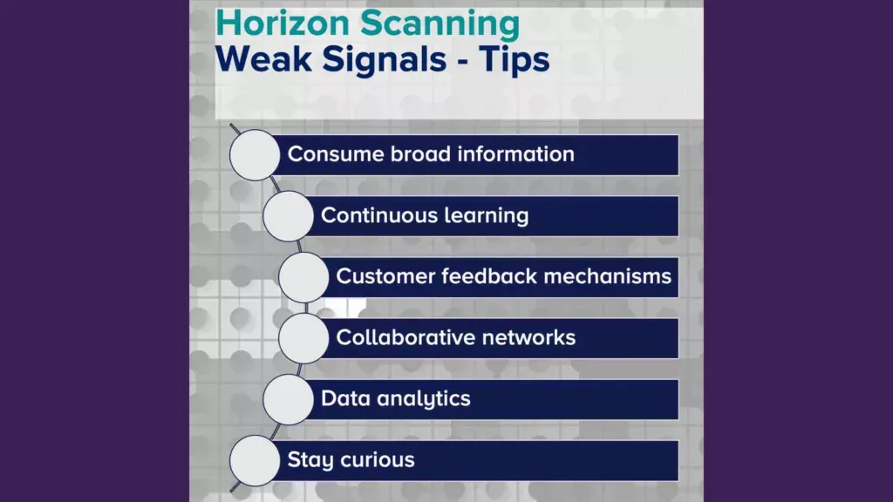

## Table of Contents

## What is horizon analysis?

Horizon analysis is a way to look at different kinds of investments based on how long you plan to keep them. It helps you decide which investments might be best for you depending on whether you want to use your money soon, in a few years, or much later. This method divides investments into three groups: short-term, medium-term, and long-term horizons. Each group has different risks and rewards, so knowing your horizon can help you pick the right investments.

For example, if you need your money in the next few years, you might choose safer investments like savings accounts or short-term bonds. These are in the short-term horizon and usually have lower risk but also lower returns. If you can wait longer, like five to ten years, you might look at medium-term investments such as stocks or real estate. These can offer higher returns but come with more risk. Finally, if you're saving for something far in the future, like retirement, you might go for long-term investments like retirement funds or long-term stocks, which can grow a lot over time but can be very risky in the short term.

## Why is horizon analysis important in financial planning?

Horizon analysis is important in financial planning because it helps people match their investments with their goals and how soon they need their money. If you know when you'll need your money, you can pick the right investments that fit that time frame. This makes your financial plan more effective because you're not putting money into something that might not be ready when you need it.

For example, if you're saving for a house in a few years, you wouldn't want to put all your money in stocks that might go up and down a lot. Instead, you'd choose safer investments that will be there when you need them. On the other hand, if you're saving for retirement that's many years away, you can take more risks with your investments because you have time to recover from any losses. This way, horizon analysis helps you make smarter choices and feel more confident about your financial future.

## How does horizon analysis differ from other investment strategies?

Horizon analysis is different from other investment strategies because it focuses on when you need your money, not just on how much you might earn. Many other strategies, like value investing or growth investing, look at the potential returns of an investment without thinking about how long you can keep your money invested. Horizon analysis helps you match your investments with your personal timeline, making sure your money is available when you need it.

For example, with horizon analysis, if you need money in the next couple of years, you'll choose safe investments like savings accounts or short-term bonds. This is different from strategies like [momentum](/wiki/momentum) investing, where you might buy and sell stocks quickly to make a profit, without considering when you'll need the money. Horizon analysis puts your needs first, helping you avoid risky investments if you can't afford to wait for them to pay off.

Overall, horizon analysis is about planning for the future in a way that fits your life. Other strategies might aim for the highest possible returns, but they don't always consider your personal situation. By using horizon analysis, you can make choices that are safer and more suited to your goals, whether you're saving for a house, your kids' education, or your retirement.

## What are the basic steps involved in conducting a horizon analysis?

To conduct a horizon analysis, start by figuring out when you will need your money. This could be soon, like in a few years, or much later, like when you retire. Once you know your time frame, you can sort your goals into short-term, medium-term, and long-term. Short-term goals might be things like buying a car or taking a vacation. Medium-term goals could be saving for a down payment on a house, and long-term goals might include saving for retirement.

Next, match each goal with the right type of investment. For short-term goals, pick safe investments like savings accounts or short-term bonds because they are less risky and you'll need the money soon. For medium-term goals, you can take a bit more risk, maybe with stocks or real estate, because you have more time to wait for them to grow. For long-term goals, you can go for investments that might be riskier but can grow a lot over time, like stocks or retirement funds. By matching your investments to your time frame, you can make sure your money is there when you need it.

## Can you explain the concept of investment horizons in horizon analysis?

Investment horizons in horizon analysis are all about figuring out when you'll need your money. It's like planning a trip and knowing how long it will take to get there. In this case, your trip is your financial goal, and the time it takes is your investment horizon. There are three main types of horizons: short-term, medium-term, and long-term. Short-term horizons are for goals you want to reach soon, like buying a new laptop or going on a vacation. Medium-term horizons are for goals that will take a few years, like saving for a down payment on a house. Long-term horizons are for goals far in the future, like saving for retirement.

Each type of horizon has different kinds of investments that fit best. For short-term horizons, you want safe investments like savings accounts or short-term bonds because you need your money soon and can't risk losing it. For medium-term horizons, you can take a bit more risk with things like stocks or real estate because you have more time for them to grow. And for long-term horizons, you can go for investments that might be riskier but can grow a lot over time, like stocks or retirement funds. By matching your investments to your horizon, you make sure your money is there when you need it, and you can feel more confident about reaching your goals.

## What role do risk tolerance and time horizon play in horizon analysis?

Risk tolerance and time horizon are really important when you're doing horizon analysis. Risk tolerance is about how much risk you're okay with when you invest your money. Some people are fine with a lot of risk if it means they might get a bigger reward, while others want to play it safe. Time horizon is about when you'll need your money. If you need it soon, you have a short time horizon, and if you can wait a long time, you have a long time horizon. Both of these things help you pick the right investments.

When you're looking at your investments, you need to think about both your risk tolerance and your time horizon. If you have a short time horizon and need your money soon, you should go for safer investments, even if your risk tolerance is high. That's because you don't have time to wait for risky investments to pay off. But if you have a long time horizon, you can take more risks, especially if you're okay with that. This way, you can match your investments to both how soon you need your money and how much risk you're willing to take, making your financial plan work better for you.

## How can horizon analysis be applied to different asset classes?

Horizon analysis helps you pick the right investments for different times in your life. For short-term goals, like saving for a vacation or buying a new phone, you would choose safe investments like savings accounts or short-term bonds. These are good because you need your money soon and can't risk losing it. For example, if you're saving for a trip next year, putting your money in a savings account means it will be there when you need it, even if it doesn't grow a lot.

For medium-term goals, like saving for a down payment on a house, you can take a bit more risk. Stocks or real estate might be good choices because you have a few years before you need the money. These can grow more than safe investments, but they can also go down in value. If you're saving for a house in five years, investing in a mix of stocks and bonds might give you a better return without too much risk. 

For long-term goals, like saving for retirement, you can go for riskier investments like stocks or retirement funds. Since you won't need the money for many years, you have time for these investments to grow a lot, even if they go up and down along the way. For example, if you're in your 30s and saving for retirement, putting most of your money in stocks could help it grow a lot by the time you're ready to stop working. By matching your investments to your time horizon, you can make sure your money is working hard for you, no matter what your goals are.

## What are some common tools and software used for horizon analysis?

Horizon analysis can be done using different tools and software that help you plan and keep track of your investments. Some popular ones are financial planning software like Quicken or Microsoft Money. These programs let you see all your money in one place, set up different goals, and figure out which investments are best for each goal based on when you need the money. They also have tools to help you see how your investments might grow over time, so you can make smart choices.

Another tool you might use is investment management platforms like Morningstar or Bloomberg Terminal. These are more advanced and often used by financial advisors or people who really like to dive deep into investing. They give you lots of information about different investments, like stocks, bonds, and mutual funds, and help you see how they might fit into your plans. They also have tools to help you understand the risks and rewards of each investment, making it easier to match them with your time horizon.

There are also simpler online tools and apps, like Betterment or Wealthfront, which are designed for people who want an easy way to do horizon analysis. These apps ask you about your goals and when you need your money, then they suggest investments that fit your time horizon. They take care of a lot of the hard work for you, making it easier to plan for the future without needing to know a lot about investing.

## How does horizon analysis help in optimizing portfolio performance?

Horizon analysis helps in optimizing portfolio performance by matching your investments with when you need your money. If you know you'll need your money soon, you can pick safe investments like savings accounts or short-term bonds. These don't grow a lot, but they're there when you need them. If you can wait longer, you can choose riskier investments like stocks or real estate that might grow more over time. By [picking](/wiki/asset-class-picking) the right investments for each goal, you can make sure your money is working hard for you and not sitting around doing nothing.

This approach also helps you manage risk better. If you need money in a few years, you don't want to lose it by taking big risks. Horizon analysis lets you put your money in safer places for short-term goals and take more risks for long-term goals. This way, you can feel more confident about your investments because you know they fit your life and your plans. By using horizon analysis, you can make your portfolio work better for you, no matter what your goals are.

## What are the challenges and limitations of horizon analysis?

Horizon analysis can be tricky because it's hard to know exactly when you'll need your money. Life can change a lot, and your plans might too. If you think you'll need money in five years but then something happens and you need it in two, your investments might not be ready. Also, guessing how well different investments will do over time is tough. The stock market can go up and down, and even safe investments like bonds can change value. So, you might not get the returns you were hoping for, which can mess up your plans.

Another challenge is that horizon analysis doesn't take into account everything about your life. It focuses a lot on when you'll need your money, but it doesn't think about other things like how much risk you can handle or if you might need to change your plans. For example, if you lose your job, you might need to use your money sooner than you thought. And while horizon analysis is helpful, it's just one part of a bigger plan. You also need to think about other things like taxes, inflation, and how your investments fit together. So, while horizon analysis is a good tool, it's not perfect and needs to be used with other strategies to make the best financial plan.

## Can you discuss a case study where horizon analysis significantly impacted investment decisions?

Let's talk about a case study where horizon analysis really made a difference in someone's investment choices. Imagine a young couple, Sarah and Mike, who were saving for different goals: a new car in two years, a down payment on a house in five years, and their retirement which was 30 years away. They used horizon analysis to figure out the best investments for each goal. For the car, they chose a high-yield savings account because they needed the money soon and couldn't risk losing it. For the house, they decided to invest in a mix of stocks and bonds, knowing they had a few years to wait for the money to grow. And for retirement, they put most of their money in stocks, since they had a long time horizon and could handle more risk.

Horizon analysis helped Sarah and Mike make smart choices that fit their life plans. They didn't lose money they needed soon by putting it in risky investments, and they also didn't miss out on growing their money for the future. A few years later, they were able to buy their car without any problems, and their investments for the house and retirement were doing well. By matching their investments to when they needed the money, they felt more confident about reaching their goals. This case shows how horizon analysis can help people make better financial decisions and feel more secure about their future.

## What advanced techniques can be used to enhance the accuracy of horizon analysis?

To make horizon analysis more accurate, you can use something called Monte Carlo simulations. This is a fancy way of saying that you run a bunch of different scenarios to see how your investments might do over time. It's like playing out different futures to see what might happen. By doing this, you can get a better idea of the risks and rewards of your investments, and it helps you plan better for the future. For example, if you're saving for retirement, a Monte Carlo simulation can show you how likely it is that you'll have enough money when you need it, even if things don't go perfectly.

Another way to improve horizon analysis is by using something called dynamic asset allocation. This means changing your investments as time goes on and as your life changes. For example, if you're getting closer to needing your money, you might move it from riskier investments like stocks to safer ones like bonds. This way, you're always making sure your money is in the right place for your current needs. By keeping an eye on your investments and adjusting them as needed, you can make your horizon analysis more accurate and make sure your money is working hard for you, no matter what life throws at you.

## What is the Comparative Analysis with Advanced Techniques?

A comparison between the fixed-time horizon and the triple-barrier methods highlights significant differences in their adaptability and precision in [algorithmic trading](/wiki/algorithmic-trading). The fixed-time horizon method involves labeling financial data within predetermined time frames, offering a straightforward approach to categorize asset performance. However, this method's rigidity can result in a failure to capture significant variability within the time frame.

Triple-barrier methods address this limitation by utilizing adaptive thresholds to manage risk more precisely. These methods incorporate upper and lower barriers in addition to a time barrier, which helps traders respond to market dynamics more flexibly. By adjusting these barriers according to market conditions and asset characteristics, the method enhances the prediction accuracy and risk mitigation.

Mathematically, the determination of events or the labeling based on the triple-barrier method can be implemented as follows:

1. When price crosses an upper or lower barrier before the time barrier, a profit or loss event is recorded:
$$
   \text{Return} = 
   \begin{cases} 
   \text{upper barrier} & \text{if price crosses upper} \\
   \text{lower barrier} & \text{if price crosses lower} 
   \end{cases}

$$

2. If the time barrier is reached without crossing either the price barriers, an expiration event occurs, often denoting a neutral or no event classification.

Furthermore, the integration of meta-labeling within the triple-barrier framework refines predictions, enhancing the precision and reliability of trade decisions. Meta-labeling involves using a secondary model to determine the probability of success for the identified opportunities, thus allowing finer discrimination of trading signals. This approach enables algorithmic systems to rank and prioritize trades optimized for performance under current market conditions.

An example in Python demonstrating the application of a triple-barrier method with meta-labeling is shown below:

```python
import numpy as np
import pandas as pd

# Example price data
price_data = pd.Series([100, 102, 105, 103, 108, 110, 107])

# Define the barriers
initial_price = price_data[0]
upper_barrier = initial_price * 1.05  # 5% gain
lower_barrier = initial_price * 0.95  # 5% loss
time_barrier = len(price_data) - 1

def apply_triple_barrier(price_series, upper, lower, time_limit):
    for i in range(1, time_limit):
        if price_series[i] >= upper:
            return 'Profit'
        elif price_series[i] <= lower:
            return 'Loss'
    return 'No Event'

result = apply_triple_barrier(price_data, upper_barrier, lower_barrier, time_barrier)
```

This structured approach provided by triple-barrier methods, coupled with meta-labeling, augments algorithmic trading strategies by enabling dynamic adaptation to market conditions, thus offering more significant insights and potential trading opportunities compared to the fixed-time horizon labeling method.

## References & Further Reading

[1]: ["Advances in Financial Machine Learning"](https://www.amazon.com/Advances-Financial-Machine-Learning-Marcos/dp/1119482089) by Marcos Lopez de Prado

[2]: Dixon, M., Klabjan, D., & Bang, J. (2016). ["Classification-Based Financial Markets Prediction Using Deep Neural Networks."](https://arxiv.org/abs/1603.08604)

[3]: ["Machine Learning for Algorithmic Trading, Second Edition"](https://github.com/PacktPublishing/Machine-Learning-for-Algorithmic-Trading-Second-Edition) by Stefan Jansen

[4]: ["Quantitative Trading: How to Build Your Own Algorithmic Trading Business"](https://www.amazon.com/Quantitative-Trading-Build-Algorithmic-Business/dp/1119800064) by Ernest P. Chan

[5]: MlFinLab documentation and resources by [Hudson & Thames](https://www.mlfinlab.com/).