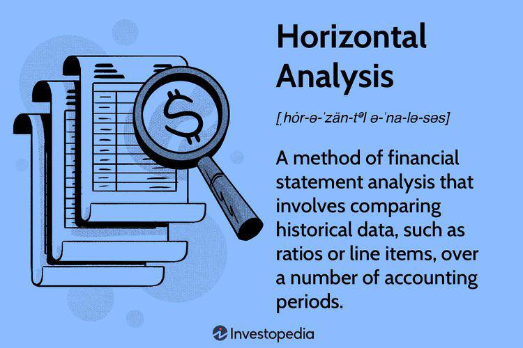

## Table of Contents

## What is horizontal analysis?

Horizontal analysis is a way to look at financial statements over time. It helps you see how numbers like sales, costs, and profits change from one year to the next. You do this by comparing the amounts from different years and figuring out the percentage change. For example, if sales went from $100,000 last year to $110,000 this year, that's a 10% increase.

This type of analysis is useful because it shows trends and helps you understand if a company is growing or shrinking. It can also highlight areas that need attention. For instance, if costs are going up faster than sales, that might be a problem. By using horizontal analysis, business owners and investors can make better decisions about where to focus their efforts and resources.

## What is vertical analysis?

Vertical analysis is a way to look at financial statements by comparing different parts of them to a single number. For example, in an income statement, you might compare each line item to the total sales. This helps you see what percentage each part is of the whole. If sales are $100,000 and the cost of goods sold is $60,000, then the cost of goods sold is 60% of sales.

This type of analysis is useful because it lets you see the structure of a company's finances at a specific time. It helps you understand how much of the company's resources are used for different things, like how much goes to making the product versus how much goes to running the business. By using vertical analysis, you can compare companies of different sizes more easily, because you're looking at percentages rather than raw numbers.

## How do horizontal and vertical analysis differ?

Horizontal and vertical analysis are two ways to look at financial statements, but they focus on different things. Horizontal analysis looks at how numbers change over time. It compares the same items, like sales or costs, from one year to the next and figures out the percentage change. This helps you see trends and understand if a company is growing or shrinking. For example, if sales went up by 10% from last year, that's a good sign.

On the other hand, vertical analysis looks at the structure of financial statements at one point in time. It compares different parts of the statement to a single number, usually total sales or total assets. This helps you see what percentage each part is of the whole. For instance, if the cost of goods sold is 60% of total sales, you know that's a big chunk of the company's expenses. Vertical analysis is great for comparing companies of different sizes because it uses percentages, not just raw numbers.

Both types of analysis are useful, but they give you different information. Horizontal analysis is about seeing changes over time, while vertical analysis is about understanding the makeup of a company's finances at a specific moment. Together, they can give you a fuller picture of a company's financial health.

## What are the steps to perform a horizontal analysis?

To perform a horizontal analysis, start by gathering the financial statements for the periods you want to compare. This could be yearly, quarterly, or any other time frame. Choose the items you want to analyze, like sales, costs, or profits. Then, pick a base year to compare against. This is usually the earliest year in your data set. For each item, subtract the base year's amount from the amount in the year you're comparing. For example, if sales were $100,000 in the base year and $110,000 in the next year, the difference is $10,000.

Next, calculate the percentage change for each item. To do this, divide the difference by the base year's amount and then multiply by 100 to get a percentage. Using the sales example, $10,000 divided by $100,000 is 0.1, and multiplying by 100 gives you a 10% increase. Repeat this process for all the items you're analyzing. Once you have all the percentage changes, you can look at them to see trends and understand how the company is doing over time. This helps you spot areas that are growing or shrinking and make better decisions.

## What are the steps to perform a vertical analysis?

To do a vertical analysis, first get the financial statement you want to look at, like an income statement or balance sheet. Pick a main number to compare everything to. For an income statement, this is usually total sales. For a balance sheet, it's often total assets. Then, take each item on the statement and divide it by the main number. For example, if total sales are $100,000 and the cost of goods sold is $60,000, you divide $60,000 by $100,000 to get 0.6. Multiply by 100 to turn it into a percentage, so the cost of goods sold is 60% of sales. Do this for every item on the statement.

Once you have all the percentages, you can see what part each item plays in the whole picture. This helps you understand the company's financial structure at that moment. For example, you can see how much of the company's money goes to making the product versus running the business. Vertical analysis is good for comparing companies of different sizes because you're looking at percentages, not just big or small numbers. It gives you a clear view of how the company's finances are set up.

## What financial statements are typically used for horizontal and vertical analysis?

Horizontal and vertical analysis are usually done on the three main financial statements: the income statement, the balance sheet, and the cash flow statement. The income statement shows a company's revenues, expenses, and profits over a period of time, like a year or a quarter. The balance sheet shows what a company owns and owes at a specific point in time. The cash flow statement shows how money moves in and out of the business during a period.

For horizontal analysis, you compare these statements over different periods to see how numbers change. For example, you might look at the income statement from last year and this year to see if sales went up or down. This helps you spot trends and understand if the company is growing or shrinking. Vertical analysis, on the other hand, looks at these statements at one point in time. You compare each item on the statement to a main number, like total sales on the income statement or total assets on the balance sheet. This helps you see what percentage each part is of the whole and understand the company's financial structure at that moment.

## How can horizontal analysis help in understanding a company's performance over time?

Horizontal analysis helps you see how a company is doing over time by comparing numbers from different years. You look at things like sales, costs, and profits to see if they are going up or down. For example, if sales went up by 10% from last year, that's a good sign that the company is growing. By doing this for many years, you can spot trends and understand if the company is getting better or worse. This helps you make smart decisions about where to focus your efforts and resources.

It's also useful for finding problems early. If costs are going up faster than sales, that could be a warning sign. Horizontal analysis can show you this so you can fix it before it gets worse. By looking at the numbers over time, you can see if the company is on the right track or if it needs to change direction. This kind of analysis is important for business owners and investors who want to keep the company healthy and growing.

## How can vertical analysis help in understanding a company's financial structure?

Vertical analysis helps you understand a company's financial structure by showing what percentage each part of the financial statement is of the whole. For example, if you look at an income statement, you can see how much of the total sales goes to costs like making the product or running the business. This helps you see where the money is going and how the company spends its resources. If the cost of goods sold is 60% of sales, that tells you a lot about how the company is set up and where it might need to focus on cutting costs or increasing efficiency.

By using vertical analysis, you can also compare companies of different sizes more easily. Instead of looking at big or small numbers, you look at percentages. This makes it fair to compare a small company with a big one because you're seeing how their finances are structured, not just how much money they have. For example, if two companies both have a cost of goods sold that is 60% of sales, they are similar in that way, even if one company is much bigger than the other. This kind of analysis is really helpful for understanding the financial health and structure of a company at a specific point in time.

## What are common pitfalls to avoid when conducting horizontal and vertical analysis?

When doing horizontal and vertical analysis, it's important to watch out for a few common mistakes. One big mistake is not picking the right base year for horizontal analysis. If you choose a year that had unusual results, like a big one-time sale or a big loss, your analysis might not show the real trend. Another mistake is not looking at the big picture. You might focus too much on one number going up or down without seeing how it fits with the rest of the company's finances. It's also easy to forget about things like inflation, which can make numbers look different over time even if the company's performance hasn't really changed.

For vertical analysis, a common pitfall is not using the right main number to compare everything to. If you use the wrong number, like comparing everything to net income instead of total sales on an income statement, your percentages won't make sense. Another mistake is not looking at the whole financial statement. You might see that one cost is a big percentage of sales, but if you don't look at the other costs and revenues, you might miss important information. Also, it's easy to forget that vertical analysis only shows you a snapshot in time, so you need to use it with other tools to get a full picture of the company's financial health.

## How can horizontal and vertical analysis be used together to provide deeper insights?

Using horizontal and vertical analysis together can give you a much better understanding of a company's financial health. Horizontal analysis helps you see how things like sales, costs, and profits change over time. This lets you spot trends and understand if the company is growing or shrinking. For example, if sales have been going up by 10% each year, that's a good sign. But if costs are going up faster than sales, that could be a problem. By looking at these changes over time, you can see if the company is on the right track or if it needs to make some changes.

Vertical analysis, on the other hand, shows you what percentage each part of the financial statement is of the whole at one point in time. This helps you see where the company's money is going and how it's set up. For example, if the cost of goods sold is 60% of sales, that tells you a lot about how the company spends its resources. When you use vertical analysis with horizontal analysis, you get a fuller picture. You can see not just how the company's finances are changing over time, but also how the structure of those finances is changing. This combination helps you make better decisions about where to focus your efforts and resources to keep the company healthy and growing.

## What advanced techniques can be applied to enhance the effectiveness of horizontal analysis?

To make horizontal analysis even better, you can use something called trend analysis. This means looking at the percentage changes over many years, not just two. By doing this, you can see if a company is growing steadily or if there are ups and downs. For example, if sales go up by 5% every year for five years, that's a good trend. But if sales go up one year and down the next, that might be a problem. Trend analysis helps you see the big picture and understand if the company is on a good path or if it needs to change direction.

Another advanced technique is to use ratios in your horizontal analysis. Ratios like the profit margin or return on assets can show you how well the company is doing in different areas. By comparing these ratios over time, you can see if the company is getting better at making money or using its resources. For example, if the profit margin goes up over time, that means the company is keeping more of its sales as profit. Using ratios with horizontal analysis gives you a deeper look into the company's performance and helps you make smarter decisions about where to focus your efforts.

## What advanced techniques can be applied to enhance the effectiveness of vertical analysis?

To make vertical analysis even better, you can use common-size statements. This means turning all the numbers on the financial statement into percentages of a main number, like total sales or total assets. By doing this, you can see how the company's financial structure changes over time. For example, if the cost of goods sold goes from 60% of sales to 55% over a few years, that's a good sign that the company is getting better at managing its costs. Common-size statements make it easier to compare the company's finances at different points in time and see where it's improving or where it needs to work harder.

Another advanced technique is to use industry benchmarks with vertical analysis. This means comparing the company's percentages to what's normal for its industry. For example, if the average cost of goods sold in the industry is 50% of sales, and your company's cost is 60%, that might be a problem. By using industry benchmarks, you can see if the company's financial structure is good compared to other companies in the same field. This helps you understand if the company is doing well or if it needs to make changes to keep up with the competition.

## What is Vertical Analysis Explained?

Vertical analysis is a method used in financial analysis to assess the relative proportions of account balances within a single reporting period. This technique is instrumental in examining the internal structure and financial efficiency of a company by expressing each line item in the financial statements as a percentage of a base figure, typically total sales for the income statement and total assets for the balance sheet.

### Insights into Structure and Efficiency

Vertical analysis provides critical insights into the operational structure and efficiency of a company. By converting financial statement figures into percentages, it becomes easier to identify the composition and relative significance of each financial component. For example, the analysis can reveal what proportion of sales is retained as profit, how much is spent on costs of goods sold, and the allocation towards operating expenses. Such insights help in evaluating cost management effectiveness and profitability trends, which are key to understanding financial health and making strategic adjustments.

### Techniques for Conducting Vertical Analysis

The primary technique in vertical analysis involves calculating the percentage of each financial statement item relative to a base item. For the income statement, each entry is typically expressed as a percentage of total sales, while for the balance sheet, it's relative to total assets. For instance, if sales are $500,000 and the cost of goods sold (COGS) is $300,000, the vertical analysis expresses COGS as 60% of sales. 

Mathematically, this can be represented as:

$$

\text{Vertical Percentage} = \left( \frac{\text{Line Item Value}}{\text{Base Item Value}} \right) \times 100
$$

This method allows analysts to quickly ascertain whether particular costs or expenses have increased disproportionately over the period and to make comparisons with industry standards or historical company performance.

### Comparison Across Companies and Periods

Vertical analysis is particularly useful for comparing the financial performance and position of different companies, as well as examining changes over time within a single company. This method enables an analyst to identify variances in cost structures between companies of different sizes or within the same industry. For example, if Company A's administrative expenses are 10% of sales while Company B's are 15%, Company A may be more efficient in managing its administrative costs.

Moreover, vertical analysis can be applied to assess a company's financial evolution across different periods. By observing changes in the vertical analysis over several years, stakeholders can gain insights into shifts in operational priorities, cost management strategies, or responses to external economic conditions. Such comparative analysis facilitates insightful benchmarking and strategic planning, enabling informed decision-making for investors and management. 

In summary, vertical analysis is an essential tool that elucidates the financial profile of a company, providing vital data on cost efficiency, operational priorities, and financial structure. This information is indispensable for assessing a company's strategic positioning and long-term viability.

## How can analysis techniques be integrated into algorithmic trading?

Financial analysis plays a crucial role in shaping [algorithmic trading](/wiki/algorithmic-trading) strategies by offering insights into market data and trends, thereby facilitating the development of robust trading algorithms. Horizontal and vertical analyses are instrumental in informing these strategies, as they enable traders to dissect and interpret financial data efficiently.

Algorithmic traders utilize horizontal analysis to evaluate financial statements over sequential periods, helping them recognize trends and patterns that influence asset prices. For example, by calculating the percentage change in revenue or expenses over multiple quarters or years using the formula:

$$
\text{Percentage Change} = \frac{\text{Current Period Value} - \text{Base Period Value}}{\text{Base Period Value}} \times 100
$$

traders can predict future movements and adjust their trading algorithms accordingly to optimize returns. For instance, an algorithm might be programmed to short a stock if it recognizes a consistent decline in revenue growth over several periods.

Vertical analysis, on the other hand, allows algorithmic traders to examine the proportional relationships within a single financial statement. By assessing each line item as a percentage of a base figure, such as total assets or sales, traders gain insights into a company’s operational efficiency and capital structure. For example, determining the percentage of operating expenses relative to sales could inform a trading algorithm to favor companies with lower overhead costs when other factors are equal.

Trading strategies are significantly enhanced by integrating these analyses. For instance, a [momentum](/wiki/momentum) trading strategy might leverage horizontal analysis to identify securities with improving financial health, thus predicting positive momentum. Concurrently, vertical analysis could be used in a value investing strategy to compare companies' profit margins or debt ratios, favoring those with more favorable metrics.

Real-time data and analysis are indispensable in algorithmic trading, as they allow traders to react promptly to market movements. Implementing horizontal and vertical analyses on a real-time basis ensures that trading algorithms are fed with the most current data, which is critical for capitalizing on short-term market inefficiencies. Traders often rely on advanced computing systems to process vast quantities of data nearly instantaneously, employing languages like Python to develop algorithms that continuously integrate fresh financial data. For example, traders could use Python libraries such as pandas for real-time data handling and analysis:

```python
import pandas as pd

# Example of calculating percentage change using pandas
data = pd.DataFrame({'Revenue': [1000, 1100, 1150]})
data['Percentage Change'] = data['Revenue'].pct_change() * 100
print(data)
```

This focus on real-time data not only enhances the responsiveness of algorithmic trading systems but also supports strategic adaptations in high-frequency trading environments where decisions are made in fractions of a second.

## References & Further Reading

[1]: Bergstra, J., Bardenet, R., Bengio, Y., & Kégl, B. (2011). ["Algorithms for Hyper-Parameter Optimization."](https://papers.nips.cc/paper/4443-algorithms-for-hyper-parameter-optimization) Advances in Neural Information Processing Systems 24.

[2]: ["Advances in Financial Machine Learning"](https://www.amazon.com/Advances-Financial-Machine-Learning-Marcos/dp/1119482089) by Marcos Lopez de Prado

[3]: ["Evidence-Based Technical Analysis: Applying the Scientific Method and Statistical Inference to Trading Signals"](https://www.amazon.com/Evidence-Based-Technical-Analysis-Scientific-Statistical/dp/0470008741) by David Aronson

[4]: ["Machine Learning for Algorithmic Trading"](https://github.com/stefan-jansen/machine-learning-for-trading) by Stefan Jansen

[5]: ["Quantitative Trading: How to Build Your Own Algorithmic Trading Business"](https://www.amazon.com/Quantitative-Trading-Build-Algorithmic-Business/dp/1119800064) by Ernest P. Chan