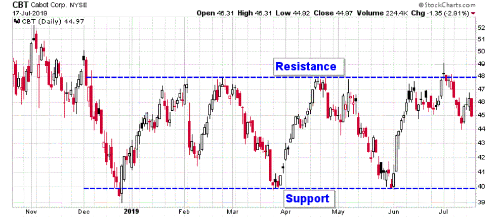

Horizontal channel trading patterns, also known as sideways trends or ranges, are technical price patterns characterized by movement between two horizontal lines representing support and resistance levels. These patterns occur when market prices oscillate within a confined range, neither trending upward nor downward. This behavior signals an equilibrium between buying and selling forces, making horizontal channels vital for traders seeking to capitalize on predictable price oscillations. In financial markets, identifying horizontal channels can guide traders in making strategic decisions, such as buying near the support line and selling at the resistance line.

Technical analysis is crucial for identifying and leveraging horizontal channel patterns. It involves analyzing historical price data, chart patterns, and technical indicators to forecast future price movements. This form of analysis offers traders a systematic approach to decipher market trends, price patterns, and other trading signals that may not be immediately obvious. Key technical tools, such as moving averages and volume indicators, aid traders in understanding the momentum within horizontal channels and predicting potential price breakouts or breakdowns.



Algorithmic trading, or algo trading, has become increasingly significant in contemporary financial strategies. It employs computer algorithms to execute orders based on pre-set criteria, such as timing, price, or volume. Algorithmic trading offers advantages like speed, precision, and the ability to process large volumes of data, allowing traders to capitalize on quantitative insights and market efficiencies. Additionally, algorithms can be programmed to recognize horizontal channel patterns, providing automated trading decisions that align with identified support and resistance levels.

This article focuses on the integration of horizontal channel trading patterns with algorithmic trading strategies. By combining the analytical precision of technical analysis with the efficiency of algorithmic execution, traders can enhance their strategy effectiveness. Readers will learn about the synergy between these two domains, gaining insights into developing, testing, and deploying trading algorithms that leverage horizontal channels. This synthesis of traditional technical analysis and modern algorithmic technology represents a dynamic and evolving approach in trading, promising enhanced decision-making and potential profitability.

## Table of Contents

## Understanding Horizontal Channel Trading Patterns

Horizontal channel trading patterns, often referred to simply as horizontal channels, are widely recognized formations in technical analysis. These patterns are characterized by a series of price fluctuations between two parallel horizontal lines that delineate the upper resistance level and the lower support level. The price of an asset repeatedly bounces between these two boundaries without exhibiting any significant trend in either direction, hence depicting a sideways movement.

Visual Representation:
On price charts, horizontal channels are visually represented by two parallel lines encapsulating the price movements of the underlying security. These lines mark the points of support and resistance. When charting such patterns, traders typically observe the price touching the support and resistance levels multiple times, consolidating within this range without breaking out. The upper boundary acts as a price ceiling, where selling pressure typically overcomes buying pressure, preventing the price from rising further. Conversely, the lower boundary serves as a price floor, where buying interest predominates, preventing the price from falling further.

Common Markets and Securities:
Horizontal channel patterns are notably prevalent in a variety of financial markets, including equities, commodities, and [forex](/wiki/forex-system). Securities where these patterns are commonly found include stable, heavily traded stocks and currency pairs where market conditions are non-trending for extended periods. For example, in a stock market scenario, high-[liquidity](/wiki/liquidity-risk-premium) shares of large-cap companies may exhibit horizontal channels during phases of market stability or consolidation, often preceding major news events or economic reports.

Usage in Identifying Support and Resistance:
Traders use horizontal channels to effectively identify and trade around support and resistance levels. The lower line or the support level represents a price point where demand is strong enough to prevent further declines, often leading to buy signals when the price approaches this level. Conversely, the upper line or resistance level marks a threshold where selling pressures override buys, often triggering sell signals. Trading strategies often revolve around buying near the support and selling near the resistance, aiming to capitalize on potential reversals at these levels. The predictability of these patterns makes them valuable in crafting range-bound trading strategies where profit is derived from repeated entries and exits within these boundaries.

Psychological Factors:
The formation of horizontal channels is also deeply intertwined with trader psychology. A horizontal channel often reflects a period of market indecision or balance, where bulls and bears are in equilibrium. Traders' perceptions and reactions to support and resistance contribute to the establishment and sustainability of these patterns. For instance, repeated rejections at resistance levels may instill a collective bearish sentiment, just as recurring support tests that hold may reinforce bullish psychology. Moreover, anticipation of significant news or events can lead to horizontal channels, as traders await clarity before committing to directional trades.

In summary, horizontal channel trading patterns play a crucial role in technical analysis by identifying key levels of support and resistance and providing a framework for range-bound trading strategies. Understanding the psychological aspects and behavioral dynamics of market participants further enhances the ability to interpret and trade these patterns effectively.

## Technical Analysis in Trading

Technical analysis serves as a foundational tool for traders, enabling them to analyze past market data, primarily price and [volume](/wiki/volume-trading-strategy), to forecast future price movements. By studying historical price patterns, traders aim to identify potential trading opportunities. The core assumption of technical analysis is that all known information is already reflected in the stock price, and that past price movements tend to repeat themselves over time.

Key indicators and tools in technical analysis particularly relevant to horizontal channels include support and resistance levels, trend lines, volume analysis, and moving averages. Support and resistance are pivotal concepts in horizontal channel trading patterns. A horizontal channel is characterized by a series of price highs (resistance) and lows (support) that are roughly parallel on a price chart. Traders seek to buy at the support level and sell at the resistance level within the channel.

Trend lines are used to delineate these levels. A trend line connecting the lows (support) and another connecting the highs (resistance) help visualize the horizontal channel visually, making it easier to identify potential entry and [exit](/wiki/exit-strategy) points. Volume analysis is another essential tool; an increase in volume at resistance or support levels can signal a potential [breakout](/wiki/breakout-trading) or breakdown, providing confirmation for the price action observed in the trend lines.

Moving averages, such as the simple moving average (SMA) and exponential moving average (EMA), help smooth out price data to identify the direction of the trend or the lack thereof in a horizontal channel. When the price is oscillating around a flat moving average, it often indicates a horizontal trend.

Technical analysis is also instrumental in predicting potential breakouts or breakdowns from horizontal channels. A breakout occurs when the price moves above the resistance level with strong [momentum](/wiki/momentum), typically accompanied by a surge in volume, signaling strength and the potential for continued upward movement. Conversely, a breakdown happens when the price falls below the support level with increased volume, indicating weakness and the potential for further decline. Indicators such as the Relative Strength Index (RSI) or the Moving Average Convergence Divergence (MACD) can provide additional signals about market momentum and potential price direction changes when breakouts or breakdowns occur.

Historical data plays a vital role in technical analysis by allowing traders to identify recurring patterns and test their strategies. Backtesting, which involves applying a trading strategy to historical data to assess its effectiveness, is crucial for refining trading strategies. By analyzing past performance, traders can tweak their strategies and algorithms to enhance their robustness and reliability before deploying them in live markets.

The integration of technical analysis in trading is a systematic approach to deciphering market data through various tools and indicators. It empowers traders to make informed decisions based on historical patterns and market psychology, improving the likelihood of successful trades, especially when integrated with sophisticated trading algorithms.

 to Algorithmic Trading

Algorithmic trading is the use of computer algorithms to automate trading decisions and execute orders in financial markets. Unlike traditional trading, which relies on human intuition and manual execution, [algorithmic trading](/wiki/algorithmic-trading) leverages predefined instructions and mathematical models to make decisions. This type of trading offers the advantage of speed, accuracy, and the ability to process large volumes of data, which are crucial in today's fast-paced market environment.

One of the key benefits of algorithmic trading is its speed. Algorithms can analyze and execute trades in fractions of a second, far outpacing any human trader. This enables traders to capitalize on short-lived opportunities in the market. Accuracy is another significant advantage. Algorithms follow their programming instructions rigorously, minimizing the chances of human error that can occur due to emotions or cognitive biases. Additionally, algorithms can handle complex datasets and apply sophisticated statistical and mathematical models to identify profitable trading opportunities.

There are several types of algorithms commonly used in trading. Trend-following algorithms focus on identifying and exploiting trends within the market, such as moving average crossovers and breakouts. Arbitrage algorithms aim to capitalize on price discrepancies across different markets or instruments, executing trades simultaneously to lock in profits with minimal risk. Another type of algorithm, mean-reversion, assumes that prices will return to an average value over time and trades accordingly.

Specifically for horizontal channel patterns, algorithms are designed to detect when a security's price is moving within a well-defined range, i.e., between support and resistance levels. These algorithms can identify entry and exit points based on breakouts or breakdowns from the channel, allowing traders to automate strategies that capitalize on the pattern's predictability.

Technological advancements have made algorithmic trading increasingly accessible to retail traders. High-performance computing, improved data feeds, and low-latency internet connections empower individual traders to utilize algorithmic strategies that were once exclusive to institutional investors. Additionally, user-friendly programming languages like Python and sophisticated trading platforms have lowered the barrier to entry, enabling traders to develop and test complex trading models with relative ease.

Overall, algorithmic trading is transforming the way financial markets operate, offering a blend of speed, precision, and data-driven decision-making to both professional and retail traders alike.

## Integrating Horizontal Channel Patterns with Algorithmic Trading

Developing algorithms specifically for trading horizontal channels involves several key steps, each integral to achieving effective and reliable automated trading systems. These steps include the incorporation of technical analysis insights, the utilization of real-time data feeds, strategic [backtesting](/wiki/backtesting), and the integration of successful case practices.

**Technical Analysis Insights in Algorithms**

Technical analysis serves as the backbone for algorithmic strategies targeting horizontal channel trading. In programming trading algorithms, insights from technical analysis, such as identification of support and resistance levels in horizontal channels, must be systematically codified. For instance, in Python, one might define support and resistance through logic that assesses recent price lows and highs within a defined timeframe:

```python
import pandas as pd

def identify_channels(data, window=20):
    data['Low'] = data['Close'].rolling(window=window).min()
    data['High'] = data['Close'].rolling(window=window).max()
    channels = data[(data['Close'] >= data['Low']) & (data['Close'] <= data['High'])]
    return channels
```

This function checks a moving window of historical closing prices to ascertain local minima and maxima, which can suggest resistance and support levels.

**Data Feed and Real-Time Analysis**

Real-time data feeds are essential in the execution of algorithmic trading strategies based on horizontal channel patterns. A reliable data feed ensures that algorithms can react promptly to market changes, allowing them to execute trades efficiently as prices approach or rebound from channel boundaries. Automated trading systems often use APIs provided by data service providers to fetch live market data, which these systems analyze to make quick decisions driven by predefined rules.

**Successful Integration Examples**

Successful implementation of horizontal channel patterns in algorithmic trading is seen across various asset classes. For instance, a firm trading forex might deploy a system where algorithms constantly monitor price charts for currencies like EUR/USD or GBP/USD, identifying when prices move into or out of a channel. When a breakout from the horizontal channel is detected, the algorithm swiftly executes buy or sell orders to capitalize on potential price movements.

**Backtesting Process**

Backtesting is a critical stage in algorithm development, allowing traders to evaluate the potential effectiveness of their strategies without financial risk. It involves running algorithms with historical data to assess how they would have performed. This process helps refine the set parameters and rules of the algorithm before deploying it in live markets. In Python, backtesting can be facilitated using libraries like `Backtrader`:

```python
import backtrader as bt

class ChannelStrategy(bt.Strategy):
    def __init__(self):
        self.dataclose = self.datas[0].close
        self.low = bt.ind.Lowest(self.dataclose, period=20)
        self.high = bt.ind.Highest(self.dataclose, period=20)

    def next(self):
        if self.dataclose[0] < self.low[0]:
            self.buy()
        elif self.dataclose[0] > self.high[0]:
            self.sell()

cerebro = bt.Cerebro()
cerebro.addstrategy(ChannelStrategy)
cerebro.run()
```

Backtesting not only validates the viability of a trading approach but also aids in optimizing parameters for future performance under various market conditions.

In conclusion, integrating horizontal channel patterns with algorithmic trading involves a systematic approach to embedding technical insights into algorithms, using real-time data analytics, learning from successful implementations, and rigorous backtesting. These elements together create a robust trading system that aims to maximize profits while mitigating risks in asset trading.

## Advantages and Challenges of Algo Trading Horizontal Channels

Algorithmic trading of horizontal channel patterns offers several advantages that appeal to both professional and retail traders. One of the key benefits is precision. Algorithms can execute trades at optimal prices by precisely following predetermined parameters and eliminating human emotion, which often leads to impulsive trading decisions. This automated approach allows for consistent adherence to trading strategies, significantly reducing the likelihood of behavioral biases such as fear and greed impacting trading outcomes.

Despite its advantages, algorithmic trading is not without challenges. Market [volatility](/wiki/volatility-trading-strategies) poses a significant risk; sudden price swings can lead to unexpected results, particularly if the algorithm is not equipped to handle such changes. Additionally, algorithmic errors, whether due to coding mistakes or unanticipated market conditions, can lead to significant financial losses. This emphasizes the importance of regular algorithm audits to ensure they function as intended.

There are scenarios where algo trading might not be advantageous. For instance, during times of low liquidity, algorithms might struggle to execute trades without impacting market prices negatively. Similarly, unprecedented market events or black swan occurrences can disrupt algorithmic strategies, causing substantial losses if not managed properly.

Risk management is crucial in enhancing the resilience of trading algorithms. One effective strategy involves setting limits on maximum drawdowns and employing stop-loss mechanisms to prevent excessive losses. Diversification across multiple trading strategies and instruments can also mitigate risk by balancing potential losses in one area with gains in another.

For ensuring the smooth operation of trading algorithms, continuous monitoring and optimization are essential. Real-time analytics allow traders to track algorithm performance closely and make necessary adjustments. For instance, employing Python can facilitate this by offering tools for processing and analyzing data streams in real-time. Here is a simple Python code snippet for monitoring algorithm performance:

```python
import numpy as np
import pandas as pd

def monitor_performance(trade_data):
    trade_data['returns'] = trade_data['close'].pct_change()
    rolling_sharpe = (trade_data['returns'].mean() / trade_data['returns'].std()) * np.sqrt(252)
    return rolling_sharpe

# Example usage
trade_data = pd.DataFrame({'close': [100, 102, 101, 105, 107]})
print("Rolling Sharpe Ratio:", monitor_performance(trade_data))
```

Advanced [machine learning](/wiki/machine-learning) techniques can also refine algorithmic models by learning from historical data to predict future patterns more accurately. Regular backtesting against historical data sets assists in refining algorithms before deployment, ensuring they are robust against various market conditions.

In conclusion, while algorithmic trading of horizontal channels offers precision and emotional neutrality benefits, it requires careful management to mitigate risks associated with volatility and unforeseen market events. By employing robust risk management strategies and continuous performance monitoring, traders can maximize the effectiveness of their algorithmic trading strategies.

## Case Studies and Examples

In recent years, several traders and financial firms have successfully integrated algorithmic trading with horizontal channel patterns, creating sophisticated strategies for maximizing returns. This section presents noteworthy case studies and examples that illuminate the practical application and effectiveness of these strategies.

One prominent case involves a [hedge fund](/wiki/hedge-fund-trading-strategies) that incorporated horizontal channel pattern recognition into its trading algorithms. The fund leveraged historical and real-time data to identify securities displaying horizontal channel formations, thereby allowing the algorithms to execute trades precisely when prices approached support and resistance levels. By using technical indicators such as moving averages and stochastic oscillators, the algorithm continuously assessed market conditions, adjusting positions in response to perceived shifts in trend dynamics. This strategic approach resulted in significant returns, particularly during periods of market lateral movement where trend-following strategies faltered.

In another instance, a proprietary trading firm developed an algorithm that dynamically adjusted its trading parameters based on volatility measurements. During testing, the firm noticed that volatility spikes often led to false breakouts from horizontal channels, causing potential losses. Consequently, the algorithm was modified to reduce position sizes or avoid trades in high-volatility environments altogether, thereby mitigating risks associated with unexpected market movements. Through iterative testing and real-world trading, this adaptive algorithm demonstrated a notable reduction in loss frequency, enhancing the overall profitability of the strategy.

Additionally, individual traders have also capitalized on algorithmic trading of horizontal channels by employing custom-built strategies tailored to specific asset classes. For example, a forex trader developed a Python-based algorithm to trade currency pairs within well-defined horizontal channels. Utilizing libraries such as pandas and NumPy, the trader conducted extensive backtesting to optimize entry and exit points, taking into account currency-specific behaviors and macroeconomic factors influencing currency movements. This meticulous approach allowed for more informed decision-making and improved profitability.

However, not all instances of algorithmic trading with horizontal channels have been successful. Some algorithms underestimated the complexity of market dynamics, leading to significant losses. A case in point is an equity trader whose algorithm was calibrated based on historical data from a relatively stable market period. When market conditions became more erratic, the algorithm failed to account for increased volatility, resulting in substantial drawdowns. This highlighted the importance of continuously monitoring algorithms and incorporating a diverse range of market scenarios during the development and testing phases.

From these examples, several key lessons emerge. First, the integration of algorithmic trading with horizontal channel patterns can yield substantial benefits, provided that traders remain vigilant to market changes and adapt their strategies accordingly. Second, continuous improvement and backtesting are essential to refine algorithms and ensure their effectiveness across different market conditions. Lastly, risk management should be an integral component of any trading strategy, with mechanisms in place to address potential algorithmic errors and market volatility.

These case studies underscore the potential of combining technical analysis with algorithmic trading while also highlighting the importance of adaptability and rigorous testing in crafting successful trading strategies.

## Conclusion

Horizontal channel trading patterns and algorithmic trading represent the intersection of traditional technical analysis and cutting-edge technology, offering new avenues for traders to optimize their strategies. Throughout this article, we examined the nature of horizontal channels, characterized by price movements that oscillate between defined support and resistance levels. These patterns are significant for identifying potential entry and exit points, thus maximizing trading opportunities.

Integrating technical analysis with algorithmic trading leverages the strengths of both approaches. Algorithms can be programmed to recognize horizontal channel patterns and make trading decisions based on pre-determined technical indicators such as trend lines and moving averages. This combination enhances precision and efficiency, allowing traders to capitalize on brief market opportunities that might be missed through manual analysis.

Readers are encouraged to experiment with these strategies, keeping in mind their unique risk tolerance and financial goals. While algorithmic trading brings significant advantages in speed and accuracy, caution is advised against relying exclusively on algorithms without human oversight. Market conditions can change rapidly, and maintaining a level of supervision ensures that unexpected volatility does not lead to substantial financial losses.

Continuous learning and adaptation are crucial as algorithmic trading technologies evolve. Traders are invited to enhance their understanding through further research and by engaging with educational resources, professional groups, and online communities. By doing so, they can stay informed of innovations in trading algorithms and refine their strategies to suit a continuously changing financial landscape.

## Additional Resources

### Books, Online Courses, and Tutorials for Technical Analysis and Algorithmic Trading

For individuals interested in expanding their understanding of technical analysis and algorithmic trading, several high-quality resources are available. Books like "Technical Analysis of the Financial Markets" by John J. Murphy provide a comprehensive overview of the foundational concepts and tools used in technical analysis. For a more specific focus on algorithmic trading, "Algorithmic Trading: Winning Strategies and Their Rationale" by Ernest P. Chan offers valuable insights into the development of algorithmic strategies.

Online platforms such as Coursera and Udemy host courses that cater to varying levels of expertise. For beginners, "Technical Analysis Masterclass" on Udemy offers a step-by-step guide to understanding market indicators and trading patterns. For those with a focus on algorithmic aspects, "Algorithmic Trading and Stocks Essential Training" on LinkedIn Learning provides an excellent foundation.

Tutorials available on platforms like YouTube also offer accessible and often free options for learning. Channels such as "The Trade Risk" provide tutorials and daily market insights that are invaluable for both novice and experienced traders.

### Forums and Online Communities

Engaging with like-minded individuals in forums and communities is crucial for continuous learning and strategy development. Websites such as Trade2Win and Elite Trader provide vibrant forums where traders discuss trends, share strategies, and exchange insights. These platforms are invaluable for gaining different perspectives and learning from the experiences of other traders.

### Software Tools and Platforms for Algorithm Development

Developing and testing trading algorithms require robust software tools. Python, due to its versatility and extensive libraries like NumPy and pandas, is a favored choice among algorithmic traders. Integrated Development Environments (IDEs) such as Jupyter and PyCharm offer efficient environments for coding and testing.

Platforms like MetaTrader 4 and TradingView offer comprehensive tools for backtesting strategies and executing trades. QuantConnect and Quantopian (although Quantopian has ceased its operations, its open-source project remains accessible) are also notable platforms where traders can test algorithms in simulated environments.

### Seminars and Webinars

Participating in seminars and webinars is a practical way to stay updated with the latest trends and techniques in trading. Financial market events hosted by institutions like the CFA Institute often include sessions on technical analysis and algorithmic trading. Attending these can provide valuable networking opportunities and deeper insights into market dynamics.

### Professional Groups and Networking

Joining professional groups such as the Market Technicians Association or the Algorithmic Traders Association can significantly enhance a trader's network and expertise. These organizations frequently offer workshops, certifications, and seminars that can keep members abreast of the latest industry trends and strategic innovations.

By leveraging these resources, individuals can enhance their understanding and practice of technical analysis and algorithmic trading, positioning themselves to make informed and strategic trading decisions.

## References & Further Reading

[1]: Murphy, J. J. (1999). ["Technical Analysis of the Financial Markets: A Comprehensive Guide to Trading Methods and Applications."](https://archive.org/details/technicalanalysi0000murp) New York Institute of Finance.

[2]: Chan, E. P. (2013). ["Algorithmic Trading: Winning Strategies and Their Rationale."](https://github.com/ftvision/quant_trading_echan_book) Wiley.

[3]: Lopez de Prado, M. (2018). ["Advances in Financial Machine Learning."](https://www.amazon.com/Advances-Financial-Machine-Learning-Marcos/dp/1119482089) Wiley.

[4]: Aronson, D. R. (2006). ["Evidence-Based Technical Analysis: Applying the Scientific Method and Statistical Inference to Trading Signals."](https://www.amazon.com/Evidence-Based-Technical-Analysis-Scientific-Statistical/dp/0470008741) Wiley.

[5]: Jansen, S. (2020). ["Machine Learning for Algorithmic Trading: Predictive models to extract signals from market and alternative data for systematic trading strategies with Python."](https://www.amazon.com/Machine-Learning-Algorithmic-Trading-alternative/dp/1839217715) Packt Publishing.