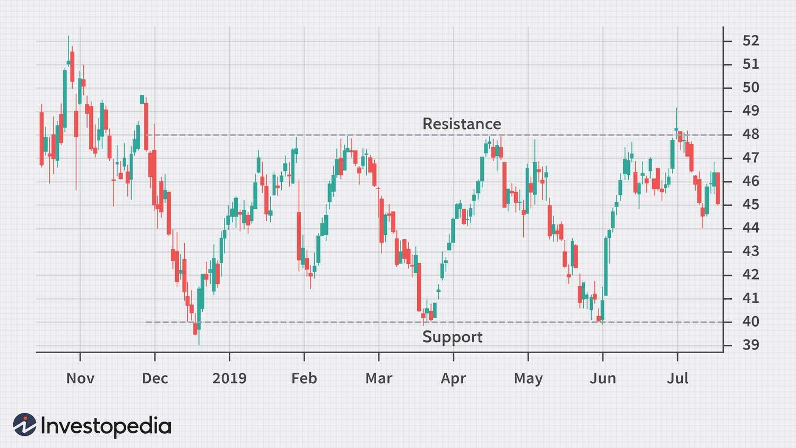

## Table of Contents

## What is a horizontal channel in trading?

A horizontal channel in trading is a chart pattern where the price of a stock or asset moves sideways between two parallel lines. These lines represent levels of support and resistance. Support is the price level where the price tends to stop falling, and resistance is where it tends to stop rising. Traders use horizontal channels to identify potential buying and selling opportunities. When the price reaches the lower line (support), it might be a good time to buy, and when it reaches the upper line (resistance), it might be a good time to sell.

Horizontal channels can last for different amounts of time, from a few days to several months. They show that the market is in a state of balance, with neither buyers nor sellers taking control. Traders often look for a breakout from the channel, which happens when the price moves above the resistance or below the support. A breakout can signal that the price is about to move in a new direction, either up or down. This can be a signal for traders to enter or exit their trades, depending on the direction of the breakout.

## How is a horizontal channel identified on a price chart?

To identify a horizontal channel on a price chart, you need to look for two important lines that run parallel to each other. The bottom line is called the support line, and it's where the price stops going down and starts to go up again. The top line is called the resistance line, and it's where the price stops going up and starts to go down again. You can draw these lines by connecting the lowest points of the price movements for the support line and the highest points for the resistance line.

Once you have these lines drawn, you can see if the price keeps bouncing between them. If it does, then you have a horizontal channel. The price should touch or come close to the support line several times without breaking through it, and the same should happen with the resistance line. If the price stays within these two lines for a while, it means the market is in a balance, and traders can use this to decide when to buy or sell.

## What are the key components of a horizontal channel?

A horizontal channel has two main parts: the support line and the resistance line. The support line is the bottom line of the channel. It's where the price stops going down and starts to go up again. Traders draw this line by connecting the lowest points where the price has been. The resistance line is the top line of the channel. It's where the price stops going up and starts to go down again. Traders draw this line by connecting the highest points where the price has been.

These two lines should be parallel to each other. The price should keep bouncing between them, touching or coming close to the support line and the resistance line several times without breaking through them. This shows that the market is in a balance, with neither buyers nor sellers taking control. Traders use this pattern to decide when to buy or sell. When the price gets close to the support line, it might be a good time to buy. When it gets close to the resistance line, it might be a good time to sell.

## How does a horizontal channel differ from other chart patterns?

A horizontal channel is different from other chart patterns because it shows that the price is moving sideways between two parallel lines. These lines are called support and resistance. In a horizontal channel, the price keeps going up to the resistance line and then back down to the support line, without breaking out of the channel. This shows that the market is balanced, with neither buyers nor sellers taking control. Other patterns, like triangles or wedges, show the price moving in a way that suggests it might break out soon, either up or down.

Unlike a horizontal channel, patterns like a head and shoulders or a double top or bottom show clear signs that the price might reverse its direction. For example, a head and shoulders pattern shows three peaks, with the middle one being the highest, suggesting that the price might start going down. A double top shows two peaks at about the same level, also suggesting a possible downward move. These patterns give traders different signals about what might happen next, compared to the steady back-and-forth movement of a horizontal channel.

In addition, trends like uptrends and downtrends show the price moving consistently in one direction, either up or down. An uptrend has higher highs and higher lows, while a downtrend has lower highs and lower lows. These trends are different from a horizontal channel because they show a clear direction, whereas a horizontal channel shows a lack of direction. Traders use these different patterns and trends to make decisions about when to buy or sell, based on what the price is doing and what it might do next.

## What are the basic trading strategies for a horizontal channel?

When trading in a horizontal channel, one common strategy is to buy near the support line and sell near the resistance line. The idea is that when the price gets close to the bottom of the channel, it's a good time to buy because it's likely to go back up. When it gets close to the top, it's a good time to sell because it's likely to go back down. This strategy works well as long as the price stays within the channel. Traders can make small profits by repeating this process, buying low and selling high, until the price breaks out of the channel.

Another strategy involves watching for a [breakout](/wiki/breakout-trading) from the channel. A breakout happens when the price moves above the resistance line or below the support line. If the price breaks above the resistance, it might be a good time to buy because the price could keep going up. If it breaks below the support, it might be a good time to sell or even short sell because the price could keep going down. Traders need to be careful with breakouts because sometimes the price can fake a breakout and then go back into the channel. It's important to wait for a strong move and maybe even a close outside the channel before acting on a breakout.

## Can you explain the significance of support and resistance levels within a horizontal channel?

Support and resistance levels are very important in a horizontal channel. The support level is the bottom line of the channel. It's where the price stops going down and starts to go back up. Traders watch this line because when the price gets close to it, it might be a good time to buy. They think the price will bounce back up from the support level. The resistance level is the top line of the channel. It's where the price stops going up and starts to go back down. When the price gets close to this line, traders might think it's a good time to sell because they expect the price to go back down from the resistance level.

These levels help traders make decisions. In a horizontal channel, the price keeps going up to the resistance and then back down to the support, over and over. This shows that the market is balanced, with neither buyers nor sellers taking control. Traders can use this pattern to make small profits by buying near the support and selling near the resistance. If the price breaks out of the channel, either above the resistance or below the support, it can signal a big change. A breakout above the resistance might mean it's time to buy, and a breakout below the support might mean it's time to sell or short sell.

## How do traders use horizontal channels to predict price movements?

Traders use horizontal channels to predict price movements by watching how the price moves between the support and resistance lines. The support line is the bottom of the channel, where the price stops going down and starts to go back up. The resistance line is the top of the channel, where the price stops going up and starts to go back down. Traders look for the price to bounce between these lines. When the price gets close to the support line, traders might think it's a good time to buy because they expect the price to go up again. When the price gets close to the resistance line, traders might think it's a good time to sell because they expect the price to go down again.

If the price stays inside the channel, traders can make small profits by buying low near the support and selling high near the resistance. They keep doing this until the price breaks out of the channel. A breakout happens when the price moves above the resistance line or below the support line. If the price breaks above the resistance, traders might buy because they think the price will keep going up. If the price breaks below the support, traders might sell or short sell because they think the price will keep going down. By watching the price in a horizontal channel, traders can predict when to buy or sell based on where the price is likely to go next.

## What are the common mistakes traders make when trading within a horizontal channel?

One common mistake traders make when trading within a horizontal channel is not waiting for clear signs before making a move. They might buy or sell too early, before the price actually touches the support or resistance lines. This can lead to losses if the price doesn't go in the direction they expected. Traders should wait for the price to get close to or touch the support or resistance lines before making a trade. This way, they have a better chance of the price moving in their favor.

Another mistake is ignoring false breakouts. Sometimes, the price might look like it's breaking out of the channel, but then it goes back inside. Traders who act too quickly on a breakout might end up losing money if the price doesn't keep going in the direction of the breakout. It's important to wait for a strong move outside the channel and maybe even a close outside the channel before acting on a breakout. This helps to make sure the breakout is real and not just a fake move.

Lastly, some traders might not have a good [exit](/wiki/exit-strategy) strategy. They might hold onto a trade too long, hoping for more profit, even when the price starts to move against them. It's important to have a plan for when to get out of a trade, whether it's making a profit or cutting a loss. Setting stop-loss orders can help traders limit their losses if the price doesn't go as planned. Having a clear exit strategy can help traders make better decisions and avoid big losses.

## How can technical indicators enhance the analysis of a horizontal channel?

Technical indicators can help traders better understand what's happening in a horizontal channel. One useful indicator is the moving average. Traders can use a moving average to see if the price is staying in the middle of the channel or if it's starting to move towards the top or bottom. If the moving average is in the middle of the channel, it can show that the price is likely to keep moving between the support and resistance lines. If the moving average starts to move closer to one of the lines, it might mean the price is getting ready to break out of the channel.

Another helpful indicator is the Relative Strength Index (RSI). The RSI can show if the price is overbought or oversold. If the RSI is above 70, it means the price might be too high and could go back down to the support line soon. If the RSI is below 30, it means the price might be too low and could go back up to the resistance line soon. By using the RSI, traders can get a better idea of when to buy or sell within the channel. Combining these indicators with the support and resistance lines can give traders more confidence in their decisions and help them predict price movements more accurately.

## What are some advanced techniques for trading breakouts from a horizontal channel?

One advanced technique for trading breakouts from a horizontal channel is to use [volume](/wiki/volume-trading-strategy) as a confirmation tool. When the price breaks out of the channel, traders should look for a big increase in trading volume. This increase in volume shows that a lot of traders are interested in the breakout, making it more likely to be real and not just a fake move. If the volume doesn't go up when the price breaks out, it might be a false breakout, and traders should be careful about acting on it. By waiting for high volume, traders can have more confidence that the price will keep moving in the direction of the breakout.

Another technique involves using multiple timeframes to confirm the breakout. Traders can look at the price on different timeframes, like daily and hourly charts, to see if the breakout is happening on all of them. If the price breaks out on both the daily and hourly charts, it's a stronger signal that the breakout is real. This can help traders avoid false breakouts and make better trading decisions. By combining volume and multiple timeframes, traders can improve their chances of successfully trading breakouts from a horizontal channel.

## How do market conditions affect the reliability of horizontal channels?

Market conditions can change how well horizontal channels work. When the market is calm and not moving a lot, horizontal channels are more reliable. The price stays between the support and resistance lines, making it easier for traders to buy low and sell high. But if the market is very busy and moving a lot, horizontal channels can be less reliable. The price might break out of the channel more often, making it harder for traders to predict what will happen next.

In times of big news or events, like economic reports or company announcements, the market can get very unpredictable. This can make horizontal channels less useful because the price might move a lot and break out of the channel quickly. Traders need to be careful and watch the market closely during these times. They might need to use other tools and strategies to help them make good trading decisions when horizontal channels are not as reliable.

## Can you provide real-world examples of horizontal channels in different markets?

In the stock market, a good example of a horizontal channel happened with Apple Inc. (AAPL) in early 2020. From January to March, the stock price of Apple moved between a support level around $275 and a resistance level around $325. Traders could see the price going up to the resistance and then back down to the support several times. This showed that the market was balanced, with neither buyers nor sellers taking control. Traders who bought near the support and sold near the resistance could make small profits. But when the price broke below the support in March due to the global economic uncertainty caused by the start of the COVID-19 pandemic, it signaled a big change, and the price started to go down a lot.

In the [forex](/wiki/forex-system) market, the EUR/USD pair showed a horizontal channel in late 2019. From October to December, the exchange rate moved between a support level around 1.09 and a resistance level around 1.11. Traders could see the price bouncing between these levels, showing that the market was in a balance. Traders who bought near the support and sold near the resistance could make small profits. But when the price broke above the resistance in early 2020, it signaled that the price might keep going up. This breakout was confirmed by a big increase in trading volume, showing that many traders were interested in the move.

## References & Further Reading

[1]: Murphy, J. J. (1999). ["Technical Analysis of the Financial Markets: A Comprehensive Guide to Trading Methods and Applications."](https://archive.org/details/technicalanalysi0000murp) New York Institute of Finance.

[2]: Chan, E. P. (2013). ["Algorithmic Trading: Winning Strategies and Their Rationale."](https://github.com/ftvision/quant_trading_echan_book) Wiley.

[3]: Lopez de Prado, M. (2018). ["Advances in Financial Machine Learning."](https://www.amazon.com/Advances-Financial-Machine-Learning-Marcos/dp/1119482089) Wiley.

[4]: Aronson, D. R. (2006). ["Evidence-Based Technical Analysis: Applying the Scientific Method and Statistical Inference to Trading Signals."](https://www.amazon.com/Evidence-Based-Technical-Analysis-Scientific-Statistical/dp/0470008741) Wiley.

[5]: Jansen, S. (2020). ["Machine Learning for Algorithmic Trading: Predictive models to extract signals from market and alternative data for systematic trading strategies with Python."](https://www.amazon.com/Machine-Learning-Algorithmic-Trading-alternative/dp/1839217715) Packt Publishing.