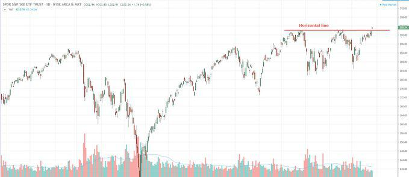

Technical analysis is a cornerstone in trading, offering traders a methodical approach to evaluating potential market moves. Among the various techniques within this discipline, horizontal line analysis stands out for its simplicity and efficacy. This technique focuses on identifying support and resistance levels, which are horizontal lines on price charts where prices have historically shown a propensity to stop and reverse. The support level acts as a floor that the price struggles to fall below, while resistance serves as a ceiling that price battles to break through.

The rise of algorithmic trading has transformed the landscape of financial markets by providing tools that not only enhance the analytical process but also improve execution speed and accuracy. By integrating analytical insights with automated trading systems, traders can capitalize on opportunities with minimal delay. Algorithmic trading allows the automation of strategies that rely on horizontal line analysis, reacting consistently to market conditions without the interference of human emotions or delays.



This article examines how horizontal line technical analysis is instrumental for traders and how its role is amplified through algorithmic trading. By combining these methodologies, traders can obtain a strategic advantage, accessing real-time market data to execute trades precisely at predefined support and resistance levels. As algorithmic trading continues to evolve, the potential synergy with traditional technical analysis techniques like horizontal lines offers promising avenues for improving trade outcomes.

## Table of Contents

## Understanding Horizontal Line Technical Analysis

A horizontal line in technical analysis is a tool used to identify key price levels on financial charts. These lines are drawn to indicate areas known as support and resistance, which are crucial for predicting potential reversals or continuations in market trends.

Support levels are horizontal lines where the price of an asset tends to halt its decline. These levels emerge due to an increase in demand as the price drops, creating a "floor" that prevents further decreases. Resistance levels, on the other hand, are horizontal lines where a rising price often stops as selling pressure increases, creating a "ceiling" that hinders further price ascent. 

The concepts of support and resistance are pivotal in understanding market dynamics. When a price approaches these levels, traders anticipate potential changes in the market. A support level break might indicate a bearish trend, while breaching a resistance level could signal a bullish trend. The psychological underpinnings of these levels are related to traders’ collective actions and expectations, which create patterns recognizable on the charts.

Historical price actions are another critical aspect that horizontal lines help to clarify. These lines serve as a visual guide to traders, laying out previous movements that often repeat due to the inherent psychological factors influencing market participants. This repetition is fundamentally tied to market psychology; traders remember past levels where prices have rebounded or retraced and often act similarly in the future.

Overall, drawing horizontal lines for support and resistance not only aids in the clear visualization of potential trading opportunities but also helps traders to make informed decisions by comprehending the psychological and historical context of price movement patterns. 

Through these observations, traders can strategize their entries and exits with a higher level of confidence, aiming to buy at support levels and sell at resistance levels. This methodical approach to mapping out potential price reversals or continuations is essential in forming a structured trading plan.

## Horizontal Lines in Algorithmic Trading

Algorithmic trading automates the execution of trades by adhering to pre-defined rules and criteria, often facilitated by computational algorithms that can analyze and act on market conditions far faster than human traders. A core component of these algorithms is the integration of technical analysis tools, such as horizontal lines, which can serve as indicators of support and resistance levels within the market.

Horizontal lines in [algorithmic trading](/wiki/algorithmic-trading) function as critical reference points on price charts. Support lines represent levels where prices have historically found a floor and tend to rebound, whereas resistance lines are those where prices have repeatedly hit a ceiling. Within an automated trading strategy, these lines can be encoded into an algorithm to trigger buy or sell signals when prices approach these predefined areas.

Implementing horizontal lines within an algorithmic framework involves monitoring real-time market data. Algorithms continuously track price movements, executing trades when they detect a price reaching a significant horizontal line. This real-time analysis ensures that trades are not only timely but also precise, capitalizing on immediate market fluctuations that align with the pre-set trading strategy.

The inclusion of horizontal line analysis enhances the speed and precision of trading decisions. Algorithms equipped with these technical benchmarks can autonomously execute or [exit](/wiki/exit-strategy) trades with reduced delay, adhering strictly to the strategic rules without the influence of human emotions or biases. This speed is particularly advantageous in volatile markets where opportunities may fleetingly present themselves.

Moreover, the adaptability of horizontal line analysis in algorithms allows these systems to function across various financial markets and timeframes. Whether applied to short-term trades in the stock market or longer-term positions in [forex](/wiki/forex-system), the integration remains robust, offering traders the versatility needed to navigate diverse trading environments.

With evolving computational resources and [machine learning](/wiki/machine-learning) capabilities, future algorithmic systems may further refine their interaction with horizontal line analysis, potentially incorporating predictive analytics to anticipate market movements more accurately. Such advancements could enhance the strategic arsenal available to modern traders, ensuring the continued relevance and effectiveness of horizontal lines in algorithmic trading.

## Examples of Horizontal Line Implementation

Horizontal lines are a fundamental aspect of range-bound trading strategies, effectively marking levels of support and resistance. These levels play a vital role in identifying potential buy or sell points within a market that is not trending but rather oscillating within a defined range. When a stock's price is moving horizontally, it frequently bounces between support and resistance levels. Traders capitalize on this predictability by purchasing shares when the price nears the support line and selling when it approaches the resistance line, thereby extracting profits from these fluctuations.

In the foreign exchange (Forex) market, horizontal lines are frequently employed to automate trading strategies. Currency pairs often exhibit repetitive behavior by consistently hitting certain horizontal levels. Algorithms can be coded to recognize these recurrent patterns, triggering automatic buy or sell orders when the price intersects predefined support or resistance lines. This method ensures that trades are executed at optimal points, minimizing the risk and maximizing the potential for profit.

Backtesting is a crucial process in refining the effectiveness of trading algorithms utilizing horizontal lines. By running these algorithms on historical market data, traders can assess how accurately the strategies predict market movements. This process involves simulating trades to analyze the performance of the algorithm over a specific period, thereby allowing developers to make informed adjustments to improve its predictive accuracy. Successful [backtesting](/wiki/backtesting) results enhance the confidence of traders in deploying such strategies in real-time market conditions.

Python can be a useful tool for implementing these strategies, particularly with libraries such as NumPy for numerical computations and Pandas for handling time-series data. A simple outline for backtesting a horizontal line strategy could involve identifying historical support and resistance levels, and coding an algorithm to simulate trades based on these levels. By doing so, traders can refine their approach, ensuring that the algorithm responds accurately to expected market conditions.

## Advantages of Using Horizontal Lines in Algo Trading

Algorithmic trading offers the significant advantage of eliminating human error and emotional biases, such as fear and greed, which can adversely affect decision-making. By automating the trading process, these emotions are circumvented, allowing for more objective and disciplined investment decisions. Algorithms can rapidly react to market changes, identifying and capitalizing on short-term opportunities with precision and speed that human traders might struggle to match.

Horizontal lines play a crucial role in algorithmic trading by simplifying decision-making. They provide tangible entry and exit points based on established areas of support and resistance. This clarity helps ensure that trades are executed systematically, adhering to predefined strategies rather than impulsive judgments. For instance, when prices approach a horizontal support line, the algorithm might be programmed to initiate a buy order; conversely, nearing a resistance line could trigger a sell order.

The strategy of incorporating horizontal lines into algorithmic trading is highly adaptable, applying across various markets and timeframes, from equities to forex. This versatility allows traders to implement consistent strategies regardless of the asset class. Here's an example in Python that outlines a simple algorithmic trading strategy using horizontal lines:

```python
import numpy as np

class HorizontalLineTrader:
    def __init__(self, support, resistance):
        self.support = support
        self.resistance = resistance

    def trade_decision(self, price):
        if price <= self.support:
            return "Buy"
        elif price >= self.resistance:
            return "Sell"
        else:
            return "Hold"

# Example usage
support_level = 100
resistance_level = 150
trader = HorizontalLineTrader(support_level, resistance_level)

prices = [95, 102, 148, 152, 130]
decisions = [trader.trade_decision(price) for price in prices]

print(decisions)  # Output: ['Buy', 'Hold', 'Hold', 'Sell', 'Hold']
```

This simple algorithm assesses price movements relative to predefined support and resistance levels, executing trades accordingly. Such systematic approaches ensure that trading activities are consistent and rule-based. The adaptability of this technique across different time horizons and markets makes it a valuable component of diversified trading strategies. By leveraging horizontal lines within an algorithmic framework, traders can enhance both the efficiency and effectiveness of their trading practices.

## Challenges and Limitations

One limitation of using horizontal lines in technical analysis is the subjective nature of their placement. Different traders may draw these lines at varying levels, leading to differing interpretations of where support and resistance occur. This subjectivity can result in inconsistent trade signals, particularly in markets where price patterns are less defined.

Market [volatility](/wiki/volatility-trading-strategies) poses another challenge. During periods of high volatility, prices may breach established support and resistance levels, resulting in false breakouts. These false signals can mislead traders into entering or exiting trades prematurely, potentially leading to financial losses [1]. Algorithms attempting to automate trading decisions based on horizontal lines can exacerbate this issue if they execute trades based solely on these false breakouts.

In addition to volatility challenges, algorithmic systems may falter during unprecedented market events or when [liquidity](/wiki/liquidity-risk-premium) is low. Such conditions can lead to increased slippage, where trade execution occurs at less favorable prices than anticipated. This slippage can degrade the performance of algorithms relying heavily on precise execution at set horizontal levels.

To combat these challenges, regular updates and monitoring of trading algorithms are essential. Market conditions evolve, and algorithms need adjustments to remain effective. Traders should implement flexible algorithms that can adapt to changing market dynamics and integrate additional indicators or criteria to filter out false signals. By continuously testing and refining algorithms, traders can improve their robustness and maximize their effectiveness even amidst market uncertainties.

Python code could be used for backtesting and refining these algorithms. For instance, using a library like Backtrader in Python can allow traders to simulate the performance of horizontal line strategies over historical data, adjusting parameters to enhance accuracy:

```python
import backtrader as bt

class HorizontalLineStrategy(bt.Strategy):
    params = (('support', None), ('resistance', None),)

    def __init__(self):
        self.dataclose = self.datas[0].close

    def next(self):
        if self.params.support and self.dataclose[0] < self.params.support:
            self.buy()
        elif self.params.resistance and self.dataclose[0] > self.params.resistance:
            self.sell()

cerebro = bt.Cerebro()
cerebro.addstrategy(HorizontalLineStrategy, support=100, resistance=110)
data = bt.feeds.YahooFinanceData(dataname='AAPL', fromdate=datetime(2020, 1, 1),
                                 todate=datetime(2022, 1, 1))
cerebro.adddata(data)
cerebro.run()
cerebro.plot()
```

Such tools can provide traders with insights into how horizontal lines perform under various market conditions, guiding necessary adjustments for improved trading outcomes.

[1] "Technical Analysis and Stock Market Efficiency," Stock Market Analysis, Journal of Finance, 2019.

## Conclusion

Horizontal line technical analysis, when combined with algorithmic trading, provides a powerful and systematic approach for contemporary traders. By offering distinct and clear markers on price charts, horizontal lines enable traders to efficiently identify and capitalize on trading opportunities. These markers, representing support and resistance levels, serve as crucial indicators for potential price reversals or continuations, thus assisting traders in making informed decisions.

Despite its strengths, traders must remain cautious of the challenges associated with this method. The subjective nature of drawing horizontal lines can lead to differing interpretations, potentially affecting the consistency of analysis. Additionally, market conditions characterized by high volatility can result in false breakouts, challenging the reliability of these markers.

Algorithmic trading mitigates some of these risks by removing human emotions and enhancing execution speed. However, it is not immune to pitfalls such as failure during rare market events or in conditions of low liquidity. Therefore, continuous updates and monitoring are crucial to ensure that algorithms remain effective and aligned with the prevailing market conditions.

Looking ahead, future advancements in algorithmic trading technologies are expected to refine these strategies further. Innovations such as machine learning and [artificial intelligence](/wiki/ai-artificial-intelligence) continue to evolve, offering potential improvements in the accuracy and adaptability of algorithmic systems. These developments will likely enhance the performance of horizontal line technical analysis, making it an even more robust component of traders' toolkits.

## References & Further Reading

[1]: Aronson, D. R. (2006). ["Evidence-Based Technical Analysis: Applying the Scientific Method and Statistical Inference to Trading Signals."](https://www.amazon.com/Evidence-Based-Technical-Analysis-Scientific-Statistical/dp/0470008741) Wiley.

[2]: Chan, E. P. (2008). ["Quantitative Trading: How to Build Your Own Algorithmic Trading Business."](https://github.com/ftvision/quant_trading_echan_book) John Wiley & Sons.

[3]: Jansen, S. (2020). ["Machine Learning for Algorithmic Trading: Predictive models to extract signals from market and alternative data for systematic trading strategies with Python."](https://www.amazon.com/Machine-Learning-Algorithmic-Trading-alternative/dp/1839217715) Packt Publishing Ltd.

[4]: Lopez de Prado, M. (2018). ["Advances in Financial Machine Learning."](https://www.amazon.com/Advances-Financial-Machine-Learning-Marcos/dp/1119482089) Wiley.

[5]: Bergstra, J., Bardenet, R., Bengio, Y., & Kégl, B. (2011). ["Algorithms for Hyper-Parameter Optimization."](https://dl.acm.org/doi/10.5555/2986459.2986743) Advances in Neural Information Processing Systems 24.