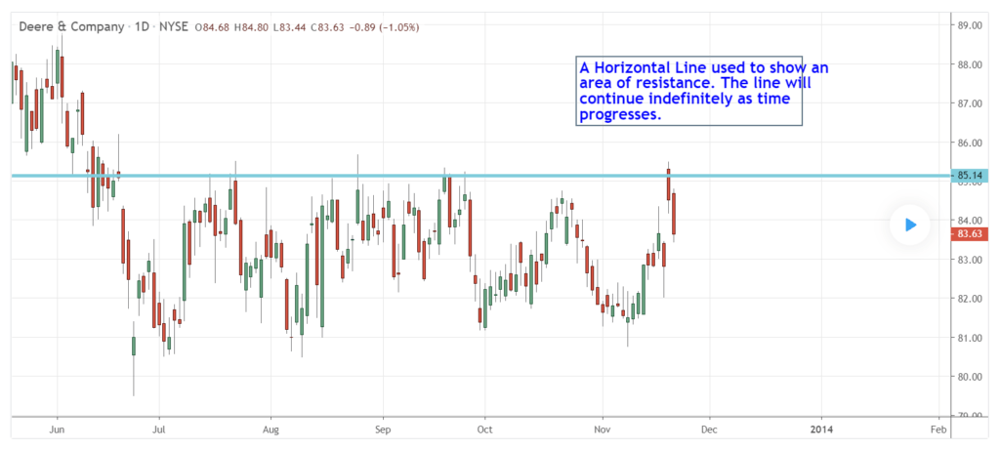

## Table of Contents

## What is a horizontal line in technical analysis?

A horizontal line in technical analysis is a straight line drawn on a chart that runs from left to right. It is used to mark important price levels where the price of an asset has either stopped or reversed in the past. Traders use these lines to identify potential support and resistance levels. Support is a price level where the price tends to find support as it falls, and resistance is a price level where the price tends to find resistance as it rises.

These lines help traders make decisions about when to buy or sell an asset. For example, if the price of a stock approaches a horizontal line that has acted as support in the past, a trader might decide to buy the stock, expecting the price to bounce back up. Conversely, if the price approaches a horizontal line that has acted as resistance, a trader might decide to sell, expecting the price to fall back down. By using horizontal lines, traders can better understand market trends and make more informed trading decisions.

## How is a horizontal line used in stock charts?

A horizontal line on a stock chart is a straight line that goes from left to right. It helps traders see important prices where the stock has stopped or turned around before. These lines are called support and resistance levels. Support is a price where the stock often stops falling and starts going up again. Resistance is a price where the stock often stops rising and starts going down again.

Traders use these horizontal lines to decide when to buy or sell a stock. If the stock price gets close to a support line, a trader might buy the stock, thinking it will go up again. If the stock price gets close to a resistance line, a trader might sell the stock, thinking it will go down again. By looking at these lines, traders can make better guesses about what the stock might do next and make smarter choices about trading.

## What does a horizontal line represent in terms of price levels?

A horizontal line on a stock chart shows important price levels where the stock price has stopped or turned around in the past. These levels are called support and resistance. Support is a price where the stock often stops dropping and starts to go up again. Resistance is a price where the stock often stops rising and starts to go down again.

Traders use these horizontal lines to help them decide when to buy or sell a stock. If the stock price gets close to a support line, a trader might buy the stock because they think it will start going up again. If the stock price gets close to a resistance line, a trader might sell the stock because they think it will start going down again. By looking at these lines, traders can make better guesses about what the stock might do next and make smarter trading choices.

## Can you explain the significance of support and resistance using horizontal lines?

Support and resistance are important ideas in trading. They help traders see where a stock's price might stop and turn around. A horizontal line on a chart shows these levels. Support is like a floor for the stock price. It's where the price often stops falling and starts to go up again. Traders watch this line because if the price gets close to it, they might buy the stock, hoping it will go up.

Resistance is like a ceiling for the stock price. It's where the price often stops rising and starts to go down again. Traders pay attention to this line because if the price gets near it, they might sell the stock, thinking it will go down. By using these horizontal lines, traders can make better guesses about what the stock will do next and make smarter choices about when to buy or sell.

## How do traders identify key horizontal levels on a chart?

Traders identify key horizontal levels on a chart by looking at past price movements. They find where the price has stopped or turned around a lot. These spots are called support and resistance. To find them, traders draw a horizontal line where the price has touched the same level many times. If the price has bounced off this level several times, it's a good sign that it's an important level.

Once traders see these levels, they watch them closely. If the price gets close to a support level, traders might think it's a good time to buy because the price often goes up from there. If the price gets near a resistance level, traders might think it's a good time to sell because the price often goes down from there. By paying attention to these horizontal lines, traders can make better decisions about when to buy or sell a stock.

## What time frames are most effective for using horizontal lines in analysis?

Horizontal lines work well on many different time frames, but some are better than others. For short-term trading, like [day trading](/wiki/day-trading-spy), using horizontal lines on shorter time frames like 1-minute, 5-minute, or 15-minute charts can help traders see quick changes in the market. These short time frames show fast movements, so traders can spot support and resistance levels that might only last for a short time.

For longer-term trading, like swing trading or investing, using horizontal lines on longer time frames like daily, weekly, or monthly charts is more useful. These longer time frames show bigger trends and patterns that last longer. Traders can see where the price has stopped or turned around over weeks or months, which helps them make decisions about buying or selling that fit with their longer-term plans.

## How can horizontal lines be combined with other technical indicators for better predictions?

Horizontal lines can be used with other technical indicators to make better guesses about what the stock price might do next. One way to do this is by using moving averages. A moving average is a line that shows the average price of a stock over a certain time. If a horizontal line that shows support or resistance is close to a moving average, it can make that level even more important. Traders might watch these spots more closely because they think the price is more likely to stop or turn around there.

Another way to use horizontal lines with other indicators is by looking at the Relative Strength Index (RSI). The RSI tells traders if a stock is overbought or oversold. If the RSI shows that a stock is overbought and the price is near a resistance line, traders might think the price will go down soon. If the RSI shows that a stock is oversold and the price is near a support line, traders might think the price will go up soon. By using horizontal lines with the RSI, traders can get a better idea of when to buy or sell a stock.

## What are the common mistakes traders make when using horizontal lines?

One common mistake traders make when using horizontal lines is drawing too many lines on the chart. This can make the chart hard to read and can confuse traders. Instead of helping, too many lines can make it tough to see which levels are really important. Traders should only draw lines where the price has stopped or turned around a lot in the past. This way, they can focus on the levels that matter most.

Another mistake is not updating the lines as the market changes. Prices and trends can move, so lines that were important before might not be as important now. Traders need to keep an eye on their charts and move or remove lines that no longer match what the price is doing. If they don't, they might miss out on new support and resistance levels that could help them make better trading choices.

## How does the validity of a horizontal line change over different market conditions?

The validity of a horizontal line can change a lot depending on what's happening in the market. In a strong trend, where the price is going up or down a lot, horizontal lines might not be as useful. The price might keep moving past old support and resistance levels because the market is moving so fast. But in a market that's not moving much, where the price is going up and down in a small range, horizontal lines can be very helpful. They can show where the price might stop and turn around, helping traders make good choices about when to buy or sell.

In different market conditions, traders need to watch how well their horizontal lines are working. If the market is very busy and the price is moving a lot, traders might need to draw new lines or change where the old ones are. This helps them keep up with what the market is doing now. In a quiet market, where the price isn't moving much, the same lines might stay useful for a longer time. Traders can use these lines to see where the price might go next and make better trading decisions.

## Can horizontal lines be used effectively in all types of financial markets?

Horizontal lines can be used in many types of financial markets, like stocks, [forex](/wiki/forex-system), and commodities. They help traders see where the price has stopped or turned around before. This can be useful in any market where prices move up and down. But how well they work can depend on the market. In markets that move a lot, like fast-moving forex markets, horizontal lines might not be as helpful because the price can quickly go past old levels. In markets that don't move as much, like some stocks, horizontal lines can be very useful because the price often stays in the same range.

In different markets, traders need to think about how the market works and how prices move. For example, in the stock market, horizontal lines can show where a stock's price might find support or resistance over time. In the forex market, where prices can change a lot in a short time, traders might need to draw new lines more often to keep up with the fast changes. By understanding the market they are trading in, traders can use horizontal lines to make better guesses about where the price might go next and make smarter trading choices.

## What advanced techniques exist for drawing and interpreting horizontal lines?

One advanced technique for drawing horizontal lines is to use multiple time frames. Traders can look at the same stock on different charts, like a daily chart and a weekly chart, to find where the price has stopped or turned around on both. If a price level shows up as important on both time frames, it's a strong sign that it's a key level. This can help traders feel more sure about where to draw their lines and make better guesses about where the price might go next.

Another technique is to use [volume](/wiki/volume-trading-strategy) data along with horizontal lines. Volume shows how many people are buying or selling a stock. If the price hits a horizontal line and the volume is high, it means a lot of people are interested in that price level. This can make the line even more important. Traders can use this information to decide if a support or resistance level is strong or weak, helping them make smarter choices about when to buy or sell.

A third technique is to combine horizontal lines with trend lines. Trend lines show the direction the price is moving, either up or down. When a horizontal line crosses a trend line, it can show a place where the price might change direction. Traders can watch these spots closely because they might be good times to buy or sell. By using horizontal lines with trend lines, traders can get a better picture of what the market might do next and make more informed trading decisions.

## How can algorithmic trading systems incorporate horizontal lines for automated decision-making?

Algorithmic trading systems can use horizontal lines to make choices about when to buy or sell a stock. These systems can be set up to watch the price and see when it gets close to a support or resistance level. If the price touches a support line, the system might decide to buy the stock because it thinks the price will go up again. If the price touches a resistance line, the system might decide to sell the stock because it thinks the price will go down again. By using these lines, the system can make quick decisions without a person having to watch the chart all the time.

To make these systems work even better, they can also use other information like how many people are buying or selling the stock, or how the price has been moving over time. For example, if the price hits a horizontal line and a lot of people are trading at that price, the system might think that line is very important. It can then use this information to decide if it should buy or sell the stock. By combining horizontal lines with other data, the system can make smarter choices and help traders make more money.

## References & Further Reading

[1]: Aronson, D. R. (2006). ["Evidence-Based Technical Analysis: Applying the Scientific Method and Statistical Inference to Trading Signals."](https://www.amazon.com/Evidence-Based-Technical-Analysis-Scientific-Statistical/dp/0470008741) Wiley.

[2]: Chan, E. P. (2008). ["Quantitative Trading: How to Build Your Own Algorithmic Trading Business."](https://github.com/ftvision/quant_trading_echan_book) John Wiley & Sons.

[3]: Jansen, S. (2020). ["Machine Learning for Algorithmic Trading: Predictive models to extract signals from market and alternative data for systematic trading strategies with Python."](https://www.amazon.com/Machine-Learning-Algorithmic-Trading-alternative/dp/1839217715) Packt Publishing Ltd.

[4]: Lopez de Prado, M. (2018). ["Advances in Financial Machine Learning."](https://www.amazon.com/Advances-Financial-Machine-Learning-Marcos/dp/1119482089) Wiley.

[5]: Bergstra, J., Bardenet, R., Bengio, Y., & Kégl, B. (2011). ["Algorithms for Hyper-Parameter Optimization."](https://dl.acm.org/doi/10.5555/2986459.2986743) Advances in Neural Information Processing Systems 24.