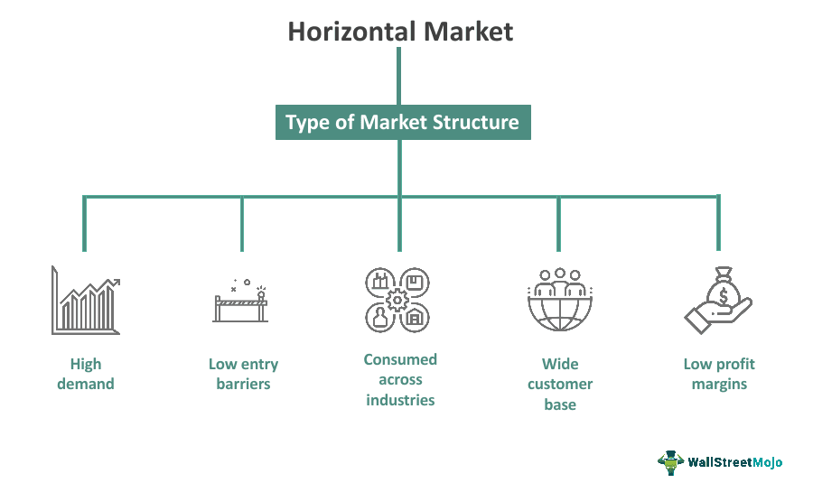

In the rapidly evolving domain of finance and trading, businesses continuously strive for a competitive advantage. With the global marketplace becoming increasingly interconnected, understanding the intricate interplay between horizontal markets, algorithmic trading, and strategic adaptation has become crucial for achieving success. Horizontal markets involve products and services that cater to a wide array of industries, offering companies the potential to reduce demand risk and enhance operational efficiency. By engaging with multiple sectors, businesses can achieve a streamlined distribution of products and services, thereby minimizing vulnerability to market fluctuations in any single industry.

Algorithmic trading, on the other hand, leverages advanced technology and data analytics to facilitate rapid decision-making processes. It allows trading strategies to be executed with precision and efficiency, often leading to enhanced market opportunities and improved profitability. Through a systematic evaluation of large datasets, businesses can predict market trends, identify lucrative opportunities, and mitigate risks associated with volatile market conditions. This technological advancement has essentially transformed trading activities, enabling organizations to respond swiftly to shifts in market dynamics.



The convergence of horizontal markets and algorithmic trading presents vast potential for businesses to sharpen their competitive strategies. By integrating these components, organizations can develop robust frameworks that leverage the expansive reach of horizontal markets alongside the precision and agility of algorithmic trading. Such integration enables businesses to optimize their operations, sustain growth, and maintain relevance in an increasingly competitive landscape.

This article explores the crucial intersection of horizontal markets and algorithmic trading within modern business strategies. By analyzing foundational concepts and their practical applications, the article provides insights into how businesses can harness these elements to achieve strategic success. As we study the dynamics that define these markets and trading approaches, it becomes evident how vital strategic adaptation is, enabling organizations to thrive amidst constant changes in the global economy.

## Table of Contents

## Understanding Horizontal Markets

Horizontal markets involve the production and distribution of goods and services that are applicable across multiple sectors and industries. This broad-based market approach enables companies to cater to a wide range of industries simultaneously. The primary advantage of horizontal markets is the reduced demand risk associated with their products or services. Because the offerings are not limited to a single industry, downturns in one sector can be mitigated by stability or growth in another. This diversification provides a buffer against economic fluctuations that might affect a particular industry.

A notable feature of successful horizontal market strategies is their adaptability and scalability. Companies operating in horizontal markets can leverage a single core technology or product line to deliver value across various industries. This ability to repurpose technology or products to meet the needs of different sectors not only enhances the potential customer base but also spreads risks associated with demand and sector-specific economic cycles.

Conglomerates, such as General Electric or Siemens, exemplify successful horizontal market strategies. These large corporations manage a diverse range of products and services, from medical equipment to financial services, thereby capitalizing on their extensive industry reach. They employ strategic planning and resource allocation to maintain competitive advantages in these varied markets. This ability to effectively manage and allocate resources across different sectors is critical to maintaining a competitive edge.

Understanding the dynamics of horizontal markets is crucial for businesses aiming to create competitive advantages across multiple sectors. By analyzing market trends and customer demands across industries, companies can devise strategies that optimize their production and distribution for broader applicability. Moreover, technological innovation plays a significant role in enhancing these strategies, allowing businesses to address the unique requirements of various industries effectively.

Thus, the strategic use of horizontal markets requires a comprehensive understanding of market needs and the ability to implement flexible, scalable solutions that meet these diverse demands. Businesses that can successfully navigate these dynamics are better positioned to sustain growth and mitigate risks, ensuring long-term success across multiple sectors.

## Market Dynamics: Challenges and Opportunities

Market dynamics are influenced by a complex interplay of internal and external factors that ultimately impact business profitability. Recognizing and responding effectively to these dynamics is crucial for businesses striving to maintain a competitive edge. 

### Key Challenges

Firstly, competition is a significant pressure point. Companies operate in an environment where competitors continuously seek new ways to attract customers. To remain viable, businesses must constantly innovate and differentiate their offerings. Competitive strategies involve analyzing market conditions and competitor actions to find unique selling propositions that set a business apart. This is essential for capturing and maintaining market share.

Demographic shifts also pose challenges. As populations age or as cultural and economic migration occur, consumer preferences and demands may change. Businesses need to adapt their products and services to meet the evolving needs of different demographic segments. For instance, an aging population might increase the demand for healthcare services, while a younger demographic could drive the technology and entertainment sectors.

Technological advancements are pivotal in redefining market dynamics. Rapid technological change creates both challenges and opportunities. For many industries, technology offers tools that can improve efficiency and product development. However, keeping up with constant technological innovation requires significant investment and agility. Businesses must integrate new technologies to improve processes, enhance customer experiences, and streamline operations.

### Opportunities for Growth

Despite the challenges presented, market dynamics also offer substantial opportunities. By analyzing these factors, businesses can identify growth avenues that align with their strategic objectives.

1. **Embracing Innovation**: Companies that actively embrace innovation often find opportunities to develop new products or services that meet emerging needs. This can involve investing in research and development or collaborating with startups and technology firms to incorporate cutting-edge solutions into operational frameworks.

2. **Market Diversification**: Another opportunity lies in market diversification. Businesses that identify under-served markets or expand into new geographic regions can tap into new customer bases. This can mitigate the risks associated with market saturation in current regions and reduce dependency on a single market demographic.

3. **Leveraging Data Analytics**: With the advent of big data, businesses have access to a wealth of information about consumer behavior, market trends, and operational performance. By leveraging advanced data analytics, companies can make informed decisions that drive efficiency and improve outcomes. Predictive analytics can also help anticipate market movements, giving businesses a proactive stance in strategic planning.

4. **Sustainability and Corporate Responsibility**: Increasingly, consumers are drawn to brands that demonstrate a commitment to sustainability and ethical practices. Businesses that integrate environmental and social governance into their operations can not only improve their brand image but also attract a broader customer base that values these initiatives. This shift towards more sustainable practices can open up new market sectors and opportunities for responsible growth.

In conclusion, while market dynamics present a multitude of challenges, they also offer rich opportunities for businesses willing to adapt and innovate. By understanding these dynamics and effectively employing strategic initiatives, businesses can enhance their competitive advantage and position themselves for long-term growth and profitability.

## The Role of Algorithmic Trading in Market Strategy

Algorithmic trading is a cornerstone of modern financial markets, leveraging technology to make rapid, data-driven decisions. This approach capitalizes on the ability of computer algorithms to analyze vast quantities of market data, executing trades at speeds and efficiencies impossible for human traders. By automating the trading process, [algorithmic trading](/wiki/algorithmic-trading) reduces transaction costs and the risk of human error, thereby enhancing a firm's market presence.

Successful implementation of algorithmic trading strategies requires an understanding of different market contexts. Broadly, these strategies can be classified into several categories, including statistical [arbitrage](/wiki/arbitrage), [market making](/wiki/market-making), and [trend following](/wiki/trend-following), each with its unique effectiveness depending on market conditions.

### Statistical Arbitrage

Statistical arbitrage utilizes mathematical models to identify price discrepancies across related financial instruments. By executing trades simultaneously, algorithms can exploit these inefficiencies, ensuring a profit when prices converge to their predicted relationships. This strategy is particularly effective in markets with high [liquidity](/wiki/liquidity-risk-premium) and frequent price fluctuations.

### Market Making

Market-making algorithms generate profits by providing liquidity to the market. These algorithms continuously place bid and ask orders to capitalize on the bid-ask spread. Success in market making hinges on the ability to quickly adapt to market conditions and efficiently manage inventory risks. High-frequency trading, a form of algorithmic trading that executes a large number of orders in fractions of a second, often uses market-making strategies.

### Trend Following

Trend-following strategies identify and trade in the direction of established market trends. Algorithms use technical indicators, such as moving averages or [momentum](/wiki/momentum) oscillators, to determine entry and [exit](/wiki/exit-strategy) points. This strategy is effective in trending markets but may result in losses during periods of market consolidation.

### Integrating Technical and Fundamental Analysis

For optimal results, algorithmic trading should incorporate both technical and fundamental market insights. Technical analysis involves statistical examination of market data, such as price and [volume](/wiki/volume-trading-strategy), while [fundamental analysis](/wiki/fundamental-analysis) considers factors affecting market value, like economic indicators or company financials. Merging these approaches allows algorithms to formulate more comprehensive trading strategies.

For example, a Python-based approach could involve the use of libraries such as `pandas` and `numpy` for data manipulation and `scikit-learn` for predictive modeling. A simple moving average crossover strategy might be implemented as follows:

```python
import pandas as pd

data = pd.read_csv('market_data.csv')  # Load market data
data['SMA_50'] = data['Close'].rolling(window=50).mean()
data['SMA_200'] = data['Close'].rolling(window=200).mean()

signals = pd.DataFrame(index=data.index)
signals['signal'] = 0.0

signals['signal'][50:] = np.where(data['SMA_50'][50:] > data['SMA_200'][50:], 1.0, 0.0)
signals['positions'] = signals['signal'].diff()

buy_signals = signals[signals['positions'] == 1.0].index
sell_signals = signals[signals['positions'] == -1.0].index
```

This script creates buy/sell signals based on the crossover of short-term and long-term moving averages, automating decisions that align with trend-following logic.

The integration and optimization of such strategies require rigorous [backtesting](/wiki/backtesting) on historical data, as well as continual refinement in response to changing market dynamics. By leveraging both algorithmic precision and comprehensive market insights, businesses can significantly enhance their competitive edge in diverse trading environments.

## Strategic Integration: Horizontal Markets and Algorithmic Trading

Integrating algorithmic trading into horizontal market strategies offers distinct synergies that help businesses optimize their operations and expand market presence. Businesses operating in horizontal markets benefit from the broad applicability of their products across various sectors. By leveraging the speed and precision of algorithmic trading, these companies can efficiently respond to market needs and capitalize on opportunities across diverse industries.

Successful integration requires companies to adjust their strategies to align with the multifaceted nature of horizontal markets. For instance, an enterprise operating in the consumer goods sector might deploy algorithmic trading to more accurately forecast demand across different geographical locations or demographic groups, thus tailoring supply chain operations accordingly. By anticipating consumer behavior using algorithms, companies can reduce excess inventory and enhance profitability, essentially managing resources with higher efficiency.

To harness these synergies, businesses can adopt several adaptive strategies. For example, leveraging big data analytics can improve the predictive accuracy of algorithmic models, resulting in better decision-making across varying market conditions. Algorithms can be employed to monitor market trends and consumer preferences in real time, allowing firms to adjust pricing strategies dynamically and maintain competitive pricing across different market segments.

Case studies illustrate how integrating algorithmic trading within horizontal markets leads to increased market share. One striking example is the application of algorithms in retail conglomerates to streamline their supply chain logistics and inventory management. By utilizing algorithmic techniques to analyze consumer trends and market data, these conglomerates are able to synchronize product distribution with actual demand effectively. This synergy not only reduces costs but also enhances customer satisfaction by ensuring product availability.  

Another case involves the financial sector, where algorithmic trading has been integrated into asset management to provide personalized investment strategies catering to diverse client profiles. Investment firms utilizing algorithms can offer products that appeal to a broad array of investors, stabilizing income by diversifying market exposure.

Thus, the strategic integration of algorithmic trading into horizontal market strategies enables businesses to exploit technology effectively for market expansion. By adapting their models to align with technology-driven insights, firms can secure a competitive edge and sustain growth despite fluctuations in market dynamics.

## Case Studies and Best Practices

While the concepts of horizontal markets and algorithmic trading are independently impactful, their integration has demonstrated remarkable potential for driving business success. This section provides an analysis of case studies where these strategies have been effectively merged, highlighting best practices and lessons learned across various industries.

### Case Study 1: General Electric (GE) 

General Electric (GE) has a long history of operating across horizontal markets, spanning multiple industries such as aviation, energy, healthcare, and finance. GE's strategic approach emphasizes cross-industry innovation and leverages the vast applicability of its products. By implementing algorithmic trading solutions within its financial services and energy trading segments, GE has enhanced its decision-making processes and operational efficiency. Algorithms have enabled GE to analyze vast datasets to forecast market trends, optimize pricing, and reduce operational risks. Such integration has not only improved financial performance but also driven technological advancements across its business units.

### Case Study 2: Amazon

Amazon's business model exemplifies the successful integration of horizontal market strategies and algorithmic trading. While Amazon originally focused on the online retail landscape, it has extended its reach to various sectors, including cloud computing (Amazon Web Services) and entertainment (Amazon Prime Video). By utilizing advanced algorithms for supply chain optimization, dynamic pricing, and customer recommendation systems, Amazon maintains its competitive edge across these diverse markets. The company leverages vast amounts of consumer data to personalize shopping experiences, ensuring higher customer satisfaction and retention rates.

### Case Study 3: Goldman Sachs

Goldman Sachs, an eminent player in the financial sector, illustrates the power of algorithmic trading when integrated with a horizontal market strategy. The firm has expanded its operations into areas such as asset management, securities trading, and investment banking. By employing sophisticated trading algorithms, Goldman Sachs achieves high-frequency trading that capitalizes on small price movements in stock markets. These algorithms are enhanced with [machine learning](/wiki/machine-learning) models to adapt to changing market conditions, thereby improving trading efficiency and profitability. The strategy underscores the necessity of balancing technical sophistication with market insights for optimal results.

### Best Practices

1. **Cross-Industry Synergies**: Firms should identify and exploit synergies across different sectors to optimize resource utilization and innovation. By sharing technological advancements across divisions, businesses can enhance overall performance.

2. **Advanced Data Analytics**: The extensive use of data analytics and machine learning technologies can optimize decision-making and forecasting. Companies should invest in robust data infrastructures and analytical tools to harness the full potential of their datasets.

3. **Scalability and Flexibility**: Developing scalable and flexible strategies is essential to accommodate diverse market demands and technological advancements. Businesses should emphasize modularity in their systems to quickly adapt to new opportunities and challenges.

### Lessons Learned

- **Adaptation and Innovation**: Businesses must continuously innovate and adapt their strategies to remain competitive. This involves integrating new technologies and re-evaluating market positions regularly to seize emerging opportunities.

- **Risk Management**: Effective risk management is crucial when deploying algorithmic strategies, especially in volatile markets. Designing algorithms with risk constraints and conducting stress-tests can mitigate potential losses.

- **Collaboration and Talent Acquisition**: Assembling a knowledgeable team that understands both market dynamics and technological intricacies is vital. Encouraging collaboration across departments can foster a culture of innovation and shared goals.

In summary, the successful integration of horizontal market strategies and algorithmic trading is achieved through careful coordination, technological investment, and continuous innovation. These case studies highlight that businesses across industries can harness these strategies to gain competitive advantages and drive market success.

## Conclusion and Future Outlook

In today's highly competitive financial landscape, strategic adaptation within horizontal markets is crucial for businesses seeking sustained success. Horizontal markets, characterized by their multi-industry applicability, offer businesses opportunities to mitigate demand risk and diversify revenue streams. The adaptability within these markets is vital, as businesses must continually adjust their strategies to remain competitive across different sectors.

One key insight is the increasing importance of integrating technology, specifically algorithmic trading, with traditional market strategies. Algorithmic trading plays a significant role in market strategies by enabling rapid, data-informed decision-making processes, which are essential given today's fast-paced trading environments. Strategies that harness the power of algorithmic trading and align them with horizontal market opportunities stand a better chance of optimizing market presence and gaining competitive advantage.

Looking ahead, market dynamics will likely be influenced by several emerging trends. The advancement in [artificial intelligence](/wiki/ai-artificial-intelligence) and machine learning is expected to further refine algorithmic trading strategies, leading to more precise predictions and optimized trade executions. Additionally, the growing importance of sustainability and ethical considerations in trading will shape future market behaviors and strategies.

To remain competitive amidst these evolving conditions, businesses should prioritize continual innovation and strategic flexibility. Investing in technology to leverage big data and analytics will be essential in identifying new market opportunities and adapting to shifts in consumer behavior. Moreover, developing agile frameworks that allow for swift strategic adjustments in response to technological and demographic changes will be critical for businesses aiming to maintain their edge.

In conclusion, the intersection of horizontal market strategies and algorithmic trading offers businesses a path to enhanced competitiveness. By understanding and adapting to market dynamics, investing in technology, and fostering a culture of innovation, businesses can not only survive but thrive in the ever-evolving financial landscape. As future uncertainties unfold, those willing to embrace change and leverage emerging technological tools will be best positioned for long-term success.

## References & Further Reading

[1]: Bergstra, J., Bardenet, R., Bengio, Y., & Kégl, B. (2011). ["Algorithms for Hyper-Parameter Optimization."](https://dl.acm.org/doi/10.5555/2986459.2986743) Advances in Neural Information Processing Systems 24.

[2]: ["Advances in Financial Machine Learning"](https://www.amazon.com/Advances-Financial-Machine-Learning-Marcos/dp/1119482089) by Marcos Lopez de Prado

[3]: ["Evidence-Based Technical Analysis: Applying the Scientific Method and Statistical Inference to Trading Signals"](https://www.amazon.com/Evidence-Based-Technical-Analysis-Scientific-Statistical/dp/0470008741) by David Aronson

[4]: ["Machine Learning for Algorithmic Trading"](https://github.com/stefan-jansen/machine-learning-for-trading) by Stefan Jansen

[5]: ["Quantitative Trading: How to Build Your Own Algorithmic Trading Business"](https://www.amazon.com/Quantitative-Trading-Build-Algorithmic-Business/dp/1119800064) by Ernest P. Chan