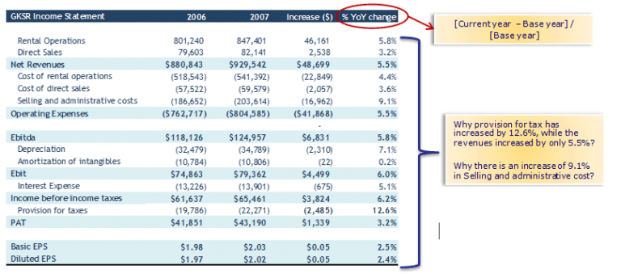

Options trading is a versatile and complex area of the financial markets, offering a variety of strategies that cater to both risk-averse investors and aggressive speculators. Before diving into complex strategies like horizontal spreads, understanding basic options trading concepts is essential. Options are financial derivatives that grant the holder the right, but not the obligation, to buy or sell an underlying asset at a predetermined price—known as the strike price—before the option expires. Market participants utilize options for various purposes, including hedging, speculation, and income generation.

A horizontal spread, also referred to as a calendar spread, is a sophisticated options trading strategy involving the simultaneous purchase and sale of options with the same strike price but differing expiration months. Traders leverage this approach to profit from time decay and volatility changes in the underlying asset. The main objective of a horizontal spread is to exploit the differences in time decay—referred to as theta—between the two expiration dates of the options involved. 



Implementing horizontal spreads within options trading strategies can be particularly beneficial when combined with algorithmic trading. Algorithmic trading involves using computer programs to execute trades at speeds and frequencies that human traders cannot match. This integration allows for enhanced precision in identifying optimal entry and exit points, thereby potentially increasing the efficiency and profitability of trades. 

The subsequent sections of this article will elucidate the components of horizontal spreads and their application in various market conditions. By demystifying horizontal spreads and presenting their strategic implementations, this exploration aims to enrich the toolkit of traders and investors. Understanding these components is crucial for anyone looking to augment their financial strategies using options.

## Table of Contents

## What is Horizontal Spread Options Trading?

Horizontal spread options trading, often referred to as a calendar spread, is a strategic approach that involves the simultaneous purchase and sale of options tied to the same underlying asset but with differing expiration dates. This strategy is fundamental for traders looking to leverage market movements, specifically regarding volatility and time decay, to optimize their trading outcomes.

A horizontal spread is constructed by buying and selling options that have the same strike price but differ in their expiration months. For example, a trader might purchase a call option with a certain strike price set to expire in December and concurrently sell a call option with the same strike price but an expiration in November. This pairing forms the horizontal spread.

The significance of horizontal spreads in options trading is primarily linked to their ability to capitalize on the difference in time decay rates between the two options. Time decay, or theta, is a crucial [factor](/wiki/factor-investing) in options pricing, reflecting the erosion of an option's value as it approaches its expiration date. Since shorter-term options decay faster than their longer-term counterparts, traders can potentially benefit from the time decay of the short position (option sold) outpacing that of the long position (option bought).

In terms of market [volatility](/wiki/volatility-trading-strategies), horizontal spreads are versatile tools. They are most effective when there is an expectation of limited movement in the underlying asset's price over the near term. Under these conditions, the volatility can often lead to profitable outcomes when the short-term option expires worthless, allowing the trader to retain the premium from that option while still holding the longer-term position.

The strategy hinges on predicting time decay and volatility more accurately than direction. Traders typically implement horizontal spreads when they anticipate a contraction in implied volatility. If the market does not move significantly, the time decay works in favor of the trader, especially as the nearer expiration date approaches.

To illustrate the mechanics mathematically, let’s assume:
- $C_t$ and $C_T$ represent the premiums of the short-term and long-term call options, respectively.

The profit/loss from a horizontal spread might then be modeled as:
$$

\text{Profit/Loss} = C_t - C_T + \text{Intrinsic Value of } C_T 
$$

Traders seek to maximize the difference $C_t - C_T$ due to the higher decay rate of the short-term option.

In summary, horizontal spread options trading is a strategic play rooted in temporal differentials rather than directional price bets. By utilizing options with the same strike price but different expirations, traders can exploit time decay and volatility dynamics to create potentially profitable trading opportunities.

## Key Components of Horizontal Spread

Horizontal spreads are sophisticated financial strategies that primarily involve the interplay of several key components: the underlying asset, strike price, expiration dates, and premiums.

The underlying asset is the financial instrument for which the options are being traded. It can be a stock, an index, or any other asset for which options are available. The selection of the underlying asset is fundamental as it determines the nature of the market behavior that the trader might anticipate.

The strike price in a horizontal spread remains constant between the options being bought and sold. It represents the price at which the holder of the option can buy (call option) or sell (put option) the underlying asset. In a horizontal spread, the strategy hinges on the same strike price across different expiration dates, setting the stage for capitalizing on the volatility between these timelines.

Expiration dates are critical since horizontal spreads leverage the temporal differences between option contracts. By purchasing the further-out expiration date and selling the nearer one, traders aim to exploit the differential rate of time decay, or theta, of the options involved. Time decay affects the value of the options, and with horizontal spreads, traders expect the short-term option to experience faster time decay compared to the long-term one. This difference in decay can provide potential profits if the conditions are favorable and the underlying asset doesn't move significantly away from the strike price during the shorter term.

Premiums, the prices paid or received for the options, play a pivotal role in the overall strategy of horizontal spreads. The net premium, which is the difference between the premium paid for the long-term option and the premium received from the short-term option, represents the initial investment required for establishing the spread. The value of this spread can fluctuate based on changes in volatility, time decay, and the movement of the underlying asset. Hence, understanding and analyzing the premium dynamics is crucial for assessing the risk and profit potential of horizontal spreads.

Moreover, it is essential to consider the implied volatility of the options, as it can have a significant impact on the premiums. Higher implied volatility generally increases option premiums, benefiting the holder of the short option in a horizontal spread, since their decay is more rapid. Conversely, lower implied volatility can erode potential gains if not properly accounted for.

In summary, successful execution of a horizontal spread strategy requires meticulous consideration of these components. The interaction between the strike price, expiration dates, and premiums, coupled with market conditions such as volatility, forms the backbone of this trading approach, allowing traders to potentially profit from the strategic alignment of options with varying expiration dates.

## Algorithmic Trading and Horizontal Spreads

The integration of [algorithmic trading](/wiki/algorithmic-trading) with horizontal spreads represents a convergence of strategic insights and technological advancement. Horizontal spreads, also known as calendar spreads, leverage the differences in time decay between short and long-term options to capitalize on market conditions. Algorithmic trading enhances this process by employing computer algorithms to execute trades at high speed and frequency, which optimizes the trading strategy's efficiency.

Algorithmic trading algorithms can be designed to analyze vast amounts of financial data to identify optimal entry and [exit](/wiki/exit-strategy) points for trades that involve horizontal spreads. These algorithms leverage historical data, statistical models, and real-time market information to make informed decisions. For instance, an algorithm might be programmed to enter a horizontal spread trade when the implied volatility of an option is higher than historical averages, suggesting a potential profit from time decay as the expiration date approaches.

One of the fundamental aspects of using algorithms in horizontal spreads is their ability to process high-frequency data and execute trades automatically. This capability reduces the latency and human error associated with manual trading, ensuring that trades are executed at the precise moment required to maximize profit or minimize risk.

Consider a Python script that uses pandas for data handling and numpy for calculations to identify potential trades:

```python
import numpy as np
import pandas as pd

# Load historical option data
data = pd.read_csv('option_data.csv')

# Calculate historical volatility
data['returns'] = np.log(data['close'] / data['close'].shift(1))
historical_volatility = np.std(data['returns']) * np.sqrt(252)

# Define a function to identify optimal entry points
def find_entry_points(data, threshold=1.5):
    current_iv = data['implied_volatility'].iloc[-1]
    if current_iv > threshold * historical_volatility:
        return True  # Signal to enter a horizontal spread
    return False

# Apply the function to the dataset
entry_signal = find_entry_points(data)
```

In the script above, historical volatility is used as a benchmark to detect when the implied volatility rises significantly, signaling a potential opportunity for a horizontal spread. Such algorithms are capable of constantly monitoring these indicators, which facilitates timely trades that can exploit inefficiencies in the market.

Moreover, these algorithms may incorporate [machine learning](/wiki/machine-learning) techniques, allowing them to adapt to changing market conditions by learning from new data patterns. By continuously improving their predictive accuracy, algorithms provide traders with a dynamic toolset to manage horizontal spreads more effectively.

In conclusion, the synergy between algorithmic trading and horizontal spreads significantly enhances the ability to execute trades efficiently. Algorithms provide a sophisticated means to analyze complex market data, identify profitable opportunities, and respond swiftly to changing market dynamics, thereby augmenting the strategic deployment of horizontal spreads in an overall trading strategy.

## Examples of Horizontal Spread Strategies

Horizontal spreads, commonly referred to as calendar spreads, are versatile strategies in options trading that can be employed to capitalize on various market conditions. These strategies involve the purchase and sale of options with the same strike price but different expiration dates. Below are some real-world scenarios and considerations when implementing horizontal spread strategies, along with an evaluation of their associated risks and rewards.

### Real-World Implementation

#### Scenario 1: Predicting Market Stability

A trader anticipates that a stock will remain stable over the short term. By employing a horizontal spread, the trader can purchase a long-term option (farther expiry) and sell a short-term option (closer expiry) at the same strike price. This configuration can profit from time decay as the shorter-term option's theta decay accelerates, potentially resulting in a net gain if the asset remains relatively stable.

#### Scenario 2: Navigating Earnings Announcements

Earnings season often introduces volatility, and traders can use horizontal spreads to position for these events. For instance, a trader expecting post-earnings volatility might buy a long-term call option and write a call option with a shorter expiration date, allowing them to benefit if the implied volatility drops post-announcement while maintaining long exposure.

#### Scenario 3: Volatility Bets

Horizontal spreads can also be beneficial in scenarios where implied volatility is expected to rise or fall. By adjusting the placement of expiration dates, traders can align their positions with anticipated changes in market sentiment and volatility levels.

### Risks and Rewards

#### Rewards

1. **Time Decay Advantage**: The primary reward in horizontal spreads is the positive impact of time decay (theta) on the written option, where the value of the option diminishes as expiration approaches.

2. **Volatility Shield**: If executed correctly, horizontal spreads can provide barriers against spikes or drops in volatility, allowing traders to potentially profit from non-directional market movement.

3. **Limited Capital Requirement**: Compared to outright long option positions, horizontal spreads usually require less capital due to the premium offset from the short leg.

#### Risks

1. **Market Movement**: If the underlying asset moves significantly beyond the selected strike price, potential profits from the spread may not materialize, leading to reduced or negative returns.

2. **Expiration Misalignments**: Misjudging the timing and magnitude of market volatility can lead to suboptimal performance, particularly if the long and short options are not balanced in terms of implied volatility and expiration date.

3. **Complexity**: Horizontal spreads require careful management and an understanding of options pricing dynamics, making them unsuitable for inexperienced traders without sufficient market insight or modeling capabilities.

To effectively employ horizontal spreads, traders often utilize algorithmic trading systems designed to automate the identification of optimal trade setups. These systems can analyze a barrage of market data, calculate potential outcomes, and execute precise trades aligned with strategic objectives.

In conclusion, horizontal spreads offer nuanced opportunities for traders to capitalize on stable market conditions, impending volatility changes, and time decay. However, understanding and managing associated risks is crucial to maximize the benefits of this strategy.

## Advantages and Challenges of Horizontal Spreads

Horizontal spreads, also known as calendar spreads, present a range of advantages and challenges for traders aiming to optimize their options trading strategies. This section will explore both aspects, providing a comprehensive understanding of their implementation in financial markets.

One of the primary advantages of horizontal spreads is risk minimization. By purchasing and selling options with the same strike price but different expiration dates, traders create a position that is typically less vulnerable to adverse market movements. This structure allows the trader to benefit from the time decay or "theta" of the options, where the short option in the near-term expiration tends to lose value faster than the long option in the later expiration. The primary risk with an options trade is that the underlying asset moves against the position, but with horizontal spreads, the risk is often reduced because the movement's impact is cushioned by having positions in different timeframes.

Additionally, horizontal spreads can contribute to profit maximization. The strategy particularly thrives in low volatility environments where the market is not expected to move dramatically. In such scenarios, the value of the short-term option decreases more rapidly than that of the long-term option, potentially allowing traders to buy back the short-term option at a lower price than what they initially sold it for while maintaining the long position. The profit potential can be significant if the underlying asset remains near the strike price of the options through the expiration of the short-term option.

Despite these benefits, horizontal spreads come with challenges. The complexity associated with timing and execution requires a sophisticated understanding of options pricing and market conditions. Traders must anticipate not only the market's direction but also its timing, which can be particularly daunting in volatile or unpredictable markets.

Moreover, while horizontal spreads can minimize risk, they also often limit potential profits relative to other strategies. The maximum profit is typically realized when the underlying asset is exactly at the strike price of the options at the expiration of the short option. This specificity can be a drawback, as it requires precise forecasting and market behavior alignment. The limited profit potential might not justify the transaction costs and efforts involved, especially if the market moves significantly, leading to potential losses if the underlying asset shifts dramatically from the strike price.

In conclusion, while horizontal spreads can serve as a valuable tool for minimizing risk and seeking profits in stable conditions, traders must weigh these advantages against the inherent complexities and limitations. Successful implementation demands careful market analysis, timing precision, and an understanding of options dynamics, making them suitable for informed traders aware of the potential for both rewards and risks.

## Conclusion and Strategic Implementation

Horizontal spread strategies, also known as calendar spreads, are vital tools in options trading for managing risk and harnessing market dynamics. Throughout this discussion, we have unraveled the components and mechanisms of horizontal spreads, focusing on how they can be strategically employed to capitalize on time decay and market volatility. These strategies enable traders to simultaneously purchase and sell options with the same strike price but different expiration dates, providing a balanced approach to speculative and hedging activities.

Integrating horizontal spreads into a broader trading strategy can be significantly enhanced by incorporating algorithmic trading. Algorithms can meticulously analyze vast amounts of market data to pinpoint optimal entry and exit points, improving the timing and efficiency of trades. For instance, algorithms can evaluate historical volatility patterns and current market conditions to identify favorable opportunities where a horizontal spread might yield the most advantageous outcomes. This integration aids in executing more precise trades, especially in fast-paced or highly volatile markets, where human decision-making might fall short.

When employing horizontal spread strategies, it is crucial to assess various market conditions and personal risk tolerance levels. Market conditions are inherently unpredictable, and factors such as implied volatility changes can significantly impact the success of a horizontal spread. Traders must, therefore, continually monitor their positions and adjust their strategies accordingly. Additionally, individual risk tolerance plays an equally critical role; understanding one's financial capacity to absorb potential losses or gains is essential for maintaining a sustainable trading practice.

In conclusion, horizontal spread options trading offers a nuanced approach to managing financial portfolios, blending risk management with the potential for profit. By strategically implementing these spreads and leveraging algorithmic tools, traders can enhance the precision and efficacy of their trades. However, success in using horizontal spreads is contingent on thorough market analysis and an acute awareness of one's risk limits, ensuring that these strategies align with broader investment goals and financial circumstances.

## References & Further Reading

[1]: ["Options, Futures, and Other Derivatives"](https://www.amazon.com/Options-Futures-Other-Derivatives-10th/dp/013447208X) by John C. Hull

[2]: Ng, A.Y. (2004). ["Feature selection, L1 vs. L2 regularization, and rotational invariance"](https://dl.acm.org/doi/10.1145/1015330.1015435). Proceedings of the twenty-first international conference on Machine learning.

[3]: ["The Complete Guide to Option Pricing Formulas"](https://www.amazon.com/Complete-Guide-Option-Pricing-Formulas/dp/0786312408) by Espen Gaarder Haug

[4]: Kissell, R. (2014). ["The Science of Algorithmic Trading and Portfolio Management."](https://www.sciencedirect.com/book/9780124016897/the-science-of-algorithmic-trading-and-portfolio-management) Academic Press.

[5]: Jabbour, R., Sula, E. (2019). ["Financial Derivatives: Pricing and Risk Management."](https://books.google.com/books/about/Financial_Derivatives.html?id=NJ5mBgAAQBAJ) Routledge.