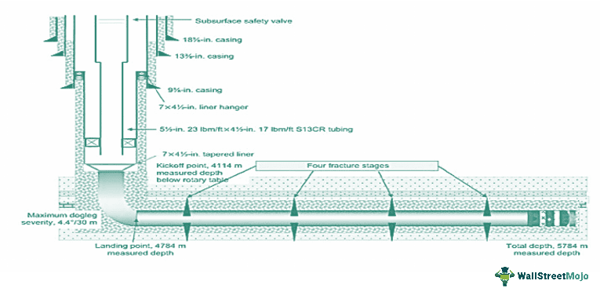

The integration of advanced drilling technology and algorithmic trading has sparked a revolution in how both industries operate. In recent years, the convergence of these seemingly disparate fields has opened new avenues for operational excellence and strategic advantages. At the heart of this transformation is horizontal well drilling technology, which provides significant improvements over traditional drilling methods. This technology, characterized by drilling non-vertical wells to increase exposure to the oil and gas reservoir, has dramatically enhanced resource extraction efficiency.

Algorithmic trading, on the other hand, represents a transformative force in financial markets by utilizing computer algorithms to automate and optimize trading processes. The synergy between horizontal well drilling and algorithmic trading lies in their mutual emphasis on precision, real-time data utilization, and resource optimization. By examining these technological synergies, we aim to illustrate the potential for operational efficiencies and economic benefits arising from their integration.

This exploration not only highlights the individual advancements within each sector but underscores the broader trend of cross-industry innovations that are increasingly shaping modern business practices. In today's competitive global markets, leveraging technology across different sectors is crucial for gaining strategic advantages. The objective of this article is to provide insights into how such cross-industry innovations can enhance operational practices and contribute to sustainable economic growth. Through this examination, we aim to foster a better understanding of the potential these technologies hold when combined, ultimately illustrating the future landscape shaped by their integration.

## Table of Contents

## Understanding Horizontal Well Drilling Technology

Horizontal drilling technology revolutionizes the oil and gas sector by significantly expanding the reach and efficiency of resource extraction. Unlike traditional vertical drilling, which involves drilling a well straight down to access oil and gas deposits, horizontal drilling allows the wellbore to be steered horizontally within the reservoir. This directional drilling capability substantially increases the surface area in contact with the reservoir, thereby enhancing extraction rates and enabling access to previously unreachable reserves.

Key components of horizontal drilling include rotary steerable systems, measurement-while-drilling (MWD) technology, and logging while drilling (LWD) systems. Rotary steerable systems enable precise directional control of the drill bit, making it possible to steer the borehole with high accuracy and flexibility. This technology is crucial for navigating complex geological formations and staying within the optimal drilling path.

Measurement-while-drilling technology plays a vital role in providing real-time data on the borehole's trajectory, formation properties, and drilling conditions. MWD tools typically convey information such as azimuth, inclination, and toolface orientation to the surface while drilling operations continue. This continuous data flow allows drillers to make swift, informed decisions, adjusting the well path as needed to maximize reservoir contact and optimize drilling performance.

Logging while drilling systems complement MWD by collecting detailed petrophysical data about the formation being drilled. LWD tools measure parameters like resistivity, porosity, and gamma ray emissions, which help assess the quality and extent of the reservoir. This real-time logging capability ensures that drilling operations can adapt to the geological conditions encountered, leading to more efficient and productive wells.

The integration of digital technologies and real-time data analytics further enhances horizontal drilling operations. By leveraging advanced computational tools, operators can process vast amounts of data to optimize drilling parameters, predict equipment failures, and improve overall decision-making processes. For instance, [machine learning](/wiki/machine-learning) algorithms can analyze historical drilling data to forecast potential drilling hazards or optimize drilling speed and efficiency.

Overall, horizontal drilling technology represents a significant advancement in the oil and gas industry. It provides the means to access more extensive portions of the reservoir, increases recovery efficiency, and reduces the overall environmental footprint through minimized surface disturbance. By adopting cutting-edge technologies and data-driven approaches, the industry can consistently improve operational efficiency and economic viability.

## Algorithmic Trading: An Overview

Algorithmic trading has revolutionized the financial markets by employing sophisticated computer algorithms to automate and optimize trading processes. These algorithms execute trades based on predefined criteria, providing a strategic advantage by minimizing the time required for order placement and execution. Using computational algorithms in trading leverages the capabilities of big data, machine learning, and advanced analytics to refine trading strategies, enhance execution efficiency, and improve overall market performance.

At the core of [algorithmic trading](/wiki/algorithmic-trading) is the use of big data to analyze market trends and patterns, thereby identifying profitable opportunities that might be missed by conventional trading methods. Machine learning models are trained on vast datasets to predict price movements and implement strategies with precision and speed. The incorporation of advanced analytics allows traders to backtest their strategies against historical data, optimizing them for better performance in live markets.

One of the notable benefits of algorithmic trading is the reduction of emotional biases that often influence human traders' decisions. Algorithms operate under logical rules and set parameters, making them less susceptible to the emotional reactions that can lead to suboptimal financial outcomes. As a result, algorithmic systems can quickly adapt to volatile market conditions, implementing trade executions that support consistent strategy adherence.

Algorithmic trading has also paved the way for high-frequency trading ([HFT](/wiki/high-frequency-trading-strategies)), a subset that involves executing a large number of orders at extremely high speeds. HFT firms utilize complex algorithms capable of processing and executing orders within fractions of a second, exploiting small price movements with significant trading volumes to secure profits. This rapid trade execution not only augments market efficiency but also provides [liquidity](/wiki/liquidity-risk-premium), thereby facilitating smoother and more liquid marketplaces.

Beyond HFT, algorithmic trading supports sophisticated risk management techniques and enables effective portfolio diversification. Through dynamic risk assessment and adjustment mechanisms, algorithms ensure that trading activities align with the predefined risk appetite, thus safeguarding against potential losses. Portfolio diversification strategies are intensified through algorithmic processes, systematically reallocating assets in reaction to market changes to balance risk and reward effectively.

Participants of algorithmic trading benefit from reduced transaction costs owing to the efficiencies in trade execution and the ability to bypass traditional brokerage fees. Furthermore, the increased liquidity contributed by algorithmic trading enhances market robustness and stability, enabling greater participation and competition within financial markets. This widespread adoption and integration of algorithmic trading, driven by technological advancements, continue to transform the trading landscape, suggesting a continuously evolving future rich with innovation and enhanced financial strategies.

## Synergies Between Horizontal Well Technology and Algorithmic Trading

Exploring the parallels between horizontal well technology and algorithmic trading reveals intriguing insights into how both fields leverage precision, efficiency, and data-driven decision-making to enhance their respective operations. By embedding advanced technologies, stakeholders in these industries aim to maintain a competitive edge.

### Precision and Efficiency

In horizontal well technology, the ability to drill with precision is achieved through sophisticated systems such as rotary steerable systems and measurement-while-drilling (MWD) technology, which enable operators to adjust their drilling path in real-time. Similarly, algorithmic trading relies on highly precise algorithms that execute trades at optimal times to capitalize on market opportunities. Both domains aim to increase efficiency through detailed planning and execution.

### Data-Driven Decision Making

Both horizontal drilling and algorithmic trading prioritize data analytics. In drilling, real-time data analytics provide immediate insights into subsurface conditions, facilitating timely and accurate decision-making. This parallels the adaptive strategies employed in algorithmic trading, where algorithms process market data continuously to make informed trading decisions. The core objective is to transform raw data into actionable insights, optimizing performance while reducing risks.

### Risk Mitigation and Operational Improvement

Lessons drawn from algorithmic trading can enhance risk management in well drilling operations. For instance, the ability to pre-define trading criteria based on historical data helps in anticipating market changes and mitigating risks. In a similar vein, applying predictive analytics in drilling can foresee potential drilling issues and reduce costly downtimes. By simulating various scenarios, stakeholders can identify optimal strategies that improve operational activities.

### Cross-Industry Collaboration

Innovative collaborations between these fields could lead to the development of cutting-edge technologies. For instance, methodologies from algorithmic trading, such as machine learning models, could be adapted to predict and optimize the performance of drilling operations. Conversely, the precision technologies from drilling can inform algorithm development processes, potentially leading to more robust trading strategies.

The confluence of these industries opens doors for new technologies that could benefit both energy extraction and financial markets, ultimately fostering innovation across different sectors.

## Economic and Environmental Implications

Technological integration across industries enhances economic returns primarily by optimizing resource allocation and significantly reducing operational costs. In the context of horizontal drilling, this translates into more efficient extraction processes, which minimize the amount of land disturbed and lower overall resource consumption. The advancements in drilling technology, such as rotary steerable systems and real-time data analytics, enable precise targeting of reservoirs, thus reducing waste and improving yield per well. This optimization not only contributes to higher financial returns for operators but also furthers environmental conservation efforts by minimizing ecological disruption.

Algorithmic trading, similarly, plays a crucial role in enhancing market stability. By utilizing automated systems to execute trades based on complex, pre-defined algorithms, the system provides real-time responses to market fluctuations. This swift actionability reduces systemic risk and helps stabilize financial markets by avoiding the pitfalls of human error and emotional decision-making. As market efficiencies increase, trading becomes more cost-effective, contributing to decreased transaction costs and improved liquidity.

However, the rapid advances in both horizontal drilling technologies and algorithmic trading demand adaptive regulatory frameworks that ensure these industries remain accountable and sustainable. Regulatory bodies must keep pace with technological innovations to properly address the potential socioeconomic and environmental implications. This includes implementing standards that mitigate negative impacts while promoting best practices.

As industries continue to evolve, integrating sustainable practices and driving innovation will be critical to overcoming emerging economic and environmental challenges. The future of these sectors will not only depend on cutting-edge technologies but also on their ability to operate within frameworks that support sustainable growth. Cross-industry collaboration will drive innovations that are environmentally considerate and economically beneficial, paving the way for a future where technological advancements yield comprehensive benefits across the board.

## Future Trends and Innovations

Advances in digital and automated technologies continue to revolutionize operational efficiencies in horizontal drilling and algorithmic trading. In these industries, adopting technologies such as [artificial intelligence](/wiki/ai-artificial-intelligence) (AI) and machine learning (ML) is set to significantly enhance innovation. AI and ML facilitate intelligent automation, enable complex decision-making processes, and advance predictive analytics. For instance, in drilling, algorithms can predict equipment failures before they occur, optimizing maintenance schedules and reducing downtime. In trading, ML models can analyze vast datasets in real time to identify profitable opportunities, adapt strategies to evolving market conditions, and mitigate risk effectively.

Environmental sustainability is increasingly becoming a central focus in technological development strategies. The integration of green technologies and sustainable practices is paramount, particularly in the energy sector, to minimize ecological footprints. Technologies like carbon capture and storage (CCS) and the use of environmentally friendly drilling fluids are gaining [momentum](/wiki/momentum), aligning industry practices with global sustainability goals. Moreover, algorithmic trading platforms are embedding sustainability filters, allowing investors to prioritize environmentally responsible businesses, thus driving capital towards greener projects.

Interdisciplinary approaches are proving to be fertile grounds for innovation, with collaboration across various scientific and technological domains leading to the creation of groundbreaking solutions. For instance, combining insights from geology, data science, and engineering in drilling technology facilitates more precise and efficient resource extraction. Similarly, in financial markets, integrating economic theories with advanced computational tools leads to more robust trading algorithms.

Looking ahead, the future presents vast opportunities for industries to collaborate and leverage technological advancements for mutual benefit. Cross-industry synergies can lead to the development of multifunctional technologies that enhance performance and sustainability across sectors. For example, the data analytics capabilities honed in algorithmic trading can improve real-time decision-making in drilling operations, while advanced materials developed for drilling could find applications in financial networks' hardware.

By embracing these technological and interdisciplinary collaborations, industries can address the challenges of efficiency, sustainability, and innovation more effectively, paving the way for robust economic expansion and environmental stewardship. This forward-thinking approach not only promises to elevate individual sector performance but also to build resilient, sustainable systems that thrive in a rapidly changing global landscape.

## Conclusion

The convergence of horizontal well drilling technology and algorithmic trading reflects a significant innovation potential when diverse industries intersect. This cross-industry application illustrates how leveraging technology can significantly drive efficiencies, enhance economic outcomes, and reduce environmental impacts across both sectors. The integration of advanced drilling technologies such as rotary steerable systems and data analytics mirrors the precision-driven strategies of algorithmic trading, highlighting a shared focus on optimizing processes and decision-making through data.

By sharing insights and innovations, businesses in these fields can foster novel solutions leading to sustainable and economically viable practices. For instance, the adaptive algorithms utilized in financial markets can inform risk management and optimization strategies in well drilling operations. Conversely, the precision and efficiency of modern drilling technologies can inspire improvements in trade execution and strategy refinement.

The interconnected future of these sectors relies on continuous exploration and adoption of cross-disciplinary opportunities. As technologies evolve, industries must capitalize on their shared advancements, with sustainability and efficiency as guiding principles. Artificial intelligence and machine learning are set to play a critical role in shaping future innovations, driving intelligent automation across both industries.

Ultimately, the path forward for horizontal well drilling and algorithmic trading hinges on collaboration and the willing exchange of ideas to leverage joint technological progress. This synergy has the potential to not only enhance performance but also contribute to broader economic stability and environmental sustainability, underscoring the mutual benefits of such interdisciplinary approaches.

## References & Further Reading

[1]: Ezell, R.L., & Phung, T.T. (2013). ["Horizontal Drilling: A Technology Home Run for the Oil and Gas Industry"](https://www.jstage.jst.go.jp/article/arr/4/3/4_300/_pdf/-char/en) Journal of Petroleum Technology.

[2]: ["Directional Drilling and Deviation Control Technology"](https://www.osti.gov/biblio/5383736) by Tom Inglis

[3]: Aldridge, I. (2010). ["High-Frequency Trading: A Practical Guide to Algorithmic Strategies and Trading Systems"](https://onlinelibrary.wiley.com/doi/pdf/10.1002/9781119203803.fmatter) John Wiley & Sons.

[4]: ["Algorithmic and High-Frequency Trading"](https://www.amazon.com/Algorithmic-High-Frequency-Trading-Mathematics-Finance/dp/1107091144) by Álvaro Cartea, Sebastian Jaimungal, and José Penalva

[5]: ["Algorithmic Trading and DMA: An Introduction to Direct Access Trading Strategies"](https://www.amazon.com/Algorithmic-Trading-DMA-introduction-strategies/dp/0956399207) by Barry Johnson