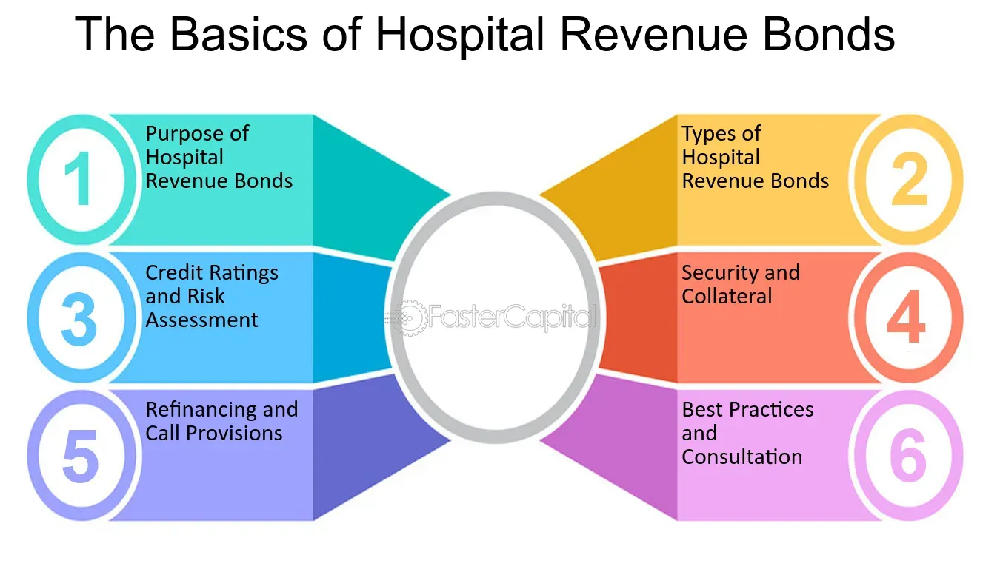

## Table of Contents

## What are hospital revenue bonds?

Hospital revenue bonds are a type of bond that hospitals use to raise money. These bonds are paid back using the money the hospital earns from its services, like treatments and surgeries. When people or organizations buy these bonds, they are lending money to the hospital. In return, the hospital promises to pay back the money with interest over time.

These bonds help hospitals to build new facilities, buy equipment, or make improvements without having to pay for everything at once. This can be really helpful because big projects can be very expensive. By using revenue bonds, hospitals can spread out the cost over many years. This makes it easier for them to manage their finances and continue providing good care to patients.

## How do hospital revenue bonds differ from general obligation bonds?

Hospital revenue bonds and general obligation bonds are two ways that governments or organizations can borrow money. The big difference between them is what they use to pay back the money they borrow. Hospital revenue bonds are paid back using the money that the hospital makes from its services, like patient care and treatments. This means that if the hospital doesn't make enough money, it might have trouble paying back the bond.

On the other hand, general obligation bonds are backed by the full faith and credit of the government that issues them. This means that the government promises to use its taxing power to pay back the bond, not just the money it makes from a specific project. So, general obligation bonds are seen as safer because the government can raise taxes if needed to make sure the bond is paid back.

Because of these differences, hospital revenue bonds might be riskier for investors since they depend on the hospital's earnings. But they can also offer higher interest rates to make up for that risk. General obligation bonds, being backed by the government's taxing power, are usually seen as less risky and might have lower interest rates.

## Who typically issues hospital revenue bonds?

Hospital revenue bonds are usually issued by the hospitals themselves or by special authorities set up to help hospitals. These authorities are often part of the local or state government. They work with hospitals to issue the bonds and manage the money that comes from them.

When a hospital wants to build a new wing or buy new equipment, it can go to one of these authorities and ask for help. The authority will then issue the bonds, using the hospital's expected future earnings to pay back the investors. This way, the hospital can get the money it needs without having to pay it all back right away.

## What is the primary purpose of issuing hospital revenue bonds?

The main reason hospitals issue revenue bonds is to raise money for big projects. These projects can include building new parts of the hospital, buying new equipment, or making other improvements. Hospitals need a lot of money for these projects, and they can't always pay for everything at once. By issuing revenue bonds, they can borrow the money they need and pay it back over time.

The money hospitals get from issuing these bonds comes from the people or organizations that buy them. These buyers are lending money to the hospital and will get paid back with interest. This way, the hospital can spread out the cost of their big projects and keep providing good care to patients without having to worry about paying for everything all at once.

## How are hospital revenue bonds repaid?

Hospital revenue bonds are paid back using the money the hospital makes from its services. This means the hospital uses the money it gets from patients for treatments, surgeries, and other care to pay back the people who bought the bonds. If the hospital does well and makes a lot of money, it can pay back the bonds easily. But if it doesn't make enough money, it might have trouble paying back the bonds.

The people who buy these bonds are lending money to the hospital. They expect to get their money back with some extra, called interest. The hospital promises to pay back this money over time, usually in regular payments. This way, the hospital can borrow money for big projects like building new parts of the hospital or buying new equipment, and then pay it back slowly as it earns money from its services.

## What are the risks associated with investing in hospital revenue bonds?

Investing in hospital revenue bonds can be risky because they are paid back with the money the hospital makes from its services. If the hospital doesn't make enough money, it might have trouble paying back the bond. This can happen if fewer people need hospital services or if the hospital has to charge less for its services. Also, if the hospital runs into other problems, like needing to fix old buildings or dealing with lawsuits, it might not have enough money left to pay back the bond.

Another risk is that hospital revenue bonds are not backed by the government's taxing power like general obligation bonds. This means that if the hospital can't pay back the bond, the government won't step in to help. Because of these risks, hospital revenue bonds might offer higher interest rates to make up for the chance that the hospital might not be able to pay back the money. But even with higher interest rates, there's still a chance that investors could lose money if the hospital's finances don't go well.

## Can you explain the tax implications of hospital revenue bonds for investors?

When you invest in hospital revenue bonds, you need to think about taxes. The good news is that the interest you earn from these bonds is often not taxed by the federal government. This means you keep more of the money you make from the bonds. But, you need to check because some bonds might be taxed differently depending on where you live. If the bonds are from your state or city, they might not be taxed there either.

On the other hand, if you sell your hospital revenue bonds for more money than you paid for them, you might have to pay capital gains tax. This is a tax on the profit you make from selling something. But if you lose money when you sell the bonds, you might be able to use that loss to lower your taxes in other ways. It's a good idea to talk to a tax expert to understand all the tax rules that apply to your situation.

## What role do credit ratings play in the issuance and investment in hospital revenue bonds?

Credit ratings are really important when hospitals issue revenue bonds and when people think about investing in them. A credit rating is like a report card that tells investors how likely it is that the hospital will pay back the money it borrows. If a hospital has a good credit rating, it means that people think the hospital is doing well and will be able to pay back the bonds. This makes it easier for the hospital to sell the bonds because more people will want to buy them.

On the other hand, if a hospital has a bad credit rating, it means that people are worried the hospital might not be able to pay back the money. This can make it harder for the hospital to sell the bonds because fewer people will want to take the risk. For investors, a good credit rating means the bond is safer, but it might also mean the interest rate is lower. A bad credit rating means the bond is riskier, but the hospital might have to offer a higher interest rate to get people to buy the bonds.

## How does the financial health of a hospital affect the pricing and demand for its revenue bonds?

The financial health of a hospital has a big impact on how much people are willing to pay for its revenue bonds and how many people want to buy them. If a hospital is doing well financially, it means it is making enough money from its services to pay back the bonds easily. When investors see that a hospital is in good financial shape, they feel more confident that they will get their money back with interest. This makes the hospital's revenue bonds more attractive, so more people want to buy them. Because there is a lot of demand, the hospital might not have to offer a high interest rate to sell the bonds.

On the other hand, if a hospital is not doing well financially, it might struggle to pay back the bonds. This worries investors because they might not get their money back. When a hospital is in a weak financial position, fewer people want to buy its bonds. To make the bonds more appealing, the hospital might have to offer a higher interest rate. But even with a higher interest rate, there might still be less demand for the bonds because people are worried about the hospital's ability to pay back the money.

## What are some case studies of successful hospital revenue bond issuances?

One example of a successful hospital revenue bond issuance is the case of the Mayo Clinic in Rochester, Minnesota. In 2019, the Mayo Clinic issued $400 million in revenue bonds to help fund a major expansion project. The bonds were well-received by investors because the Mayo Clinic has a strong reputation and a solid financial track record. This meant that investors felt confident that the Mayo Clinic would be able to pay back the bonds with interest. The money from the bonds helped the Mayo Clinic build new facilities and improve its services, which in turn helped the hospital continue to provide excellent care to its patients.

Another successful case is the University of California, San Francisco (UCSF) Medical Center. In 2017, UCSF issued $1.4 billion in revenue bonds to finance a major expansion of its medical campus. The bonds were popular with investors because UCSF is known for its high-quality medical care and strong financial management. The funds from the bonds were used to build new hospitals and research facilities, which helped UCSF expand its capacity to treat more patients and conduct more research. This successful bond issuance allowed UCSF to grow and improve its services without putting a strain on its finances.

## How have regulatory changes impacted the hospital revenue bond market?

Regulatory changes can affect the hospital revenue bond market in big ways. One big change that happened was the Affordable Care Act (ACA), also called Obamacare, which was passed in 2010. This law changed how hospitals got paid for their services. Some hospitals got more money, but others got less. This made some investors worry about whether hospitals could pay back their bonds. Because of this, some hospitals had to offer higher interest rates on their bonds to make them more attractive to investors.

Another important change was the Tax Cuts and Jobs Act of 2017. This law changed how much tax investors had to pay on the interest they earned from bonds. Before this law, the interest from hospital revenue bonds was not taxed by the federal government, which made them very popular. But after the law, some investors had to pay more taxes on their bond earnings. This made hospital revenue bonds a bit less attractive to some investors. As a result, hospitals sometimes had to offer higher interest rates to sell their bonds.

## What future trends might influence the use and effectiveness of hospital revenue bonds?

In the future, changes in healthcare laws and how hospitals get paid could affect hospital revenue bonds. If new laws make it easier for hospitals to get more money from insurance companies or the government, hospitals might find it easier to pay back their bonds. This could make the bonds more attractive to investors because they would feel more confident about getting their money back. On the other hand, if new laws make it harder for hospitals to get paid, it could make it tougher for them to pay back their bonds. This might make investors more worried and could lead to hospitals having to offer higher interest rates to sell their bonds.

Another trend that could influence hospital revenue bonds is technology. If hospitals use new technology to make their services better and cheaper, they might make more money. This would help them pay back their bonds more easily, making the bonds more appealing to investors. But if the new technology is very expensive and doesn't help hospitals make more money right away, it could make it harder for them to pay back their bonds. This might make investors more cautious and could affect how much they are willing to pay for the bonds.

## What are the key considerations for hospitals issuing revenue bonds?

When issuing hospital revenue bonds, hospitals must thoroughly evaluate their financial capabilities and internal strategies to ensure successful bond issuance and management. A critical metric to examine is the debt service coverage ratio (DSCR), which indicates a hospital's ability to cover debt obligations based on its revenue. A higher DSCR suggests a stronger capacity to meet these obligations, making the bond more attractive to investors and potentially securing more favorable terms. The formula for DSCR is:

$$
\text{DSCR} = \frac{\text{Net Operating Income}}{\text{Total Debt Service}}
$$

Where:  
- Net Operating Income is the hospital's total revenue minus operating expenses.
- Total Debt Service includes both the principal and interest payments on existing debt commitments.

Another essential consideration is the choice between fixed and variable interest rates. Fixed rates provide consistent, predictable payments, insuring against [interest rate](/wiki/interest-rate-trading-strategies) fluctuations, a significant [factor](/wiki/factor-investing) during rising interest rate periods. Conversely, variable rates might initially offer lower costs but [carry](/wiki/carry-trading) the risk of increasing expenses if interest rates rise unexpectedly. Selecting the appropriate interest rate structure requires careful analysis of market conditions, interest rate forecasts, and the hospital's risk tolerance.

Moreover, hospitals should explore the option of bond insurance. This insurance provides a guarantee to bondholders that interest and principal payments will be made even if the hospital defaults. This additional layer of security can improve the hospital's credit rating and lower borrowing costs, making the bond issuance more attractive.

Finally, maintaining a robust credit rating is crucial. A high credit rating reflects financial health and management stability, fostering investor confidence and enabling the hospital to issue bonds at more favorable rates. Continuous financial performance tracking and adherence to sound fiscal policies are important to preserve or enhance the credit rating.

By attentively managing these considerations — DSCR, interest rate selection, bond insurance, and credit rating — hospitals can optimize their bond issuance strategy, reducing financial risks and ensuring the procurement of required funds for growth and expansion.

## References & Further Reading

[1]: Choi, J. H., & Jeong, J. H. (2013). ["Determinants of hospital financial distress and insolvency in the US: the impact of revenue bond financing."](https://link.springer.com/chapter/10.1007/978-981-96-0191-2_20) The Journal of Economics and Business, 68, 1-20.

[2]: Saunders, A., & Cornett, M. M. (2018). ["Financial Institutions Management: A Risk Management Approach."](https://www.mheducation.com/highered/product/Financial-Institutions-Management-A-Risk-Management-Approach-Saunders.html) McGraw-Hill Education.

[3]: Lopez de Prado, M. (2018). ["Advances in Financial Machine Learning."](https://www.amazon.com/Advances-Financial-Machine-Learning-Marcos/dp/1119482089) Wiley.

[4]: Aronson, D. R. (2006). ["Evidence-Based Technical Analysis: Applying the Scientific Method and Statistical Inference to Trading Signals."](https://www.amazon.com/Evidence-Based-Technical-Analysis-Scientific-Statistical/dp/0470008741) Wiley.

[5]: Jansen, S. (2020). ["Machine Learning for Algorithmic Trading."](https://github.com/stefan-jansen/machine-learning-for-trading) Packt Publishing.

[6]: Chan, E. P. (2008). ["Quantitative Trading: How to Build Your Own Algorithmic Trading Business."](https://github.com/ftvision/quant_trading_echan_book) Wiley.

[7]: Ehlers, T. (2014). ["Understanding the challenges for infrastructure finance."](https://papers.ssrn.com/sol3/papers.cfm?abstract_id=2494992) BIS Quarterly Review, March 2014. Bank for International Settlements.

[8]: Fabozzi, F. J., & de Nahlik, C. (2012). ["Project Finance in Theory and Practice: Designing, Structuring, and Financing Private and Public Projects."](https://www.gbv.de/dms/zbw/71543537X.pdf) Academic Press.