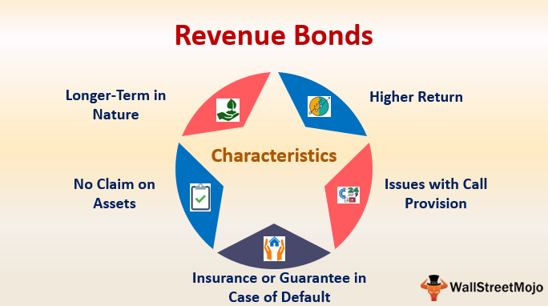

The investment landscape in healthcare infrastructure is undergoing significant changes, particularly in how hospital bonds are employed to fund essential hospital expansions. Hospital bonds, which include various types such as revenue bonds, serve as a pivotal financial instrument for realizing hospital projects. These bonds enable hospitals and related institutions to maintain and improve healthcare accessibility within their communities by financing the construction of new facilities and the upgrade of existing ones.

Among hospital bonds, revenue bonds are noteworthy due to their reliance on the income generated by the hospitals themselves. This income primarily comes from patient fees and other ancillary services, providing a direct source of repayment for the bonds. This structure allows hospitals to undertake large-scale projects without heavily depending on governmental tax allocations or general funds, thus fostering healthcare development even in resource-constrained settings.

The advent of algorithmic trading has further revolutionized how hospital bonds are traded in the financial markets. This technology-driven approach streamlines the buying and selling process, enhancing liquidity and market efficiency. Algorithmic trading allows for the real-time processing of large transactions, which can reduce the market impact and potentially lower transaction costs. However, it also brings challenges, such as heightened market volatility and the necessity for advanced risk management strategies to navigate the complex trading environment effectively. As such, both opportunities and challenges arise for stakeholders in the hospital bond market, necessitating a nuanced understanding of these financial instruments and the technological advancements that are reshaping their dynamics.

## Table of Contents

## Understanding Hospital Revenue Bonds

Hospital revenue bonds represent a vital component within the spectrum of municipal bonds, specifically designated for funding projects associated with healthcare infrastructure. These bonds are instrumental in facilitating the construction of new hospital facilities or the enhancement of existing infrastructure, thus playing a crucial role in expanding healthcare access and improving service delivery. A fundamental characteristic of hospital revenue bonds is their backing, which is predominantly derived from the revenues generated by the hospitals themselves. These revenues typically include patient fees, insurance reimbursements, and auxiliary income streams linked to hospital operations.

The allure of hospital revenue bonds to investors often stems from their potential for higher yields compared to other municipal bonds. This higher yield compensates for the relatively higher risk associated with these bonds, given that the repayment is contingent on the hospital's ability to generate revenue. Despite this risk, hospital revenue bonds remain an attractive investment vehicle due to their tax advantages. In many jurisdictions, the interest income earned from municipal bonds, including hospital revenue bonds, is exempt from federal income tax and may also be exempt from state and local taxes for residents of the issuing state. This tax-exempt feature enhances the after-tax return for investors, making hospital revenue bonds a compelling choice for those seeking tax-efficient investment options.

The intrinsic link between a hospital’s financial performance and the security of revenue bonds underscores the necessity for robust financial and operational management within healthcare institutions. Hospitals issuing these bonds must ensure sustainable revenue streams and maintain financial health to honor their bond obligations, thereby safeguarding investor interests and ensuring the viability of the funded healthcare projects.

## The Role and Benefits of Revenue Bonds

Revenue bonds offer a strategic financing method primarily used by municipalities and hospitals to support large-scale projects without relying on general tax revenue. A distinguishing feature of revenue bonds is their backing by the income generated from the financed projects rather than being supported by the issuer's general credit. This can be especially advantageous in the healthcare sector, where hospitals aim to expand facilities or upgrade infrastructure.

One of the principal benefits of revenue bonds is the typically lower interest rates they offer compared to traditional loan mechanisms. This can be particularly compelling for projects requiring significant capital investment. By securing financing through revenue bonds, hospitals can undertake expansive projects with the repayment tied directly to the revenue stream generated. This aligns financial accountability and incentivizes the efficient operation and management of healthcare facilities.

For hospital projects, the tax-exempt status of revenue bonds amplifies their attractiveness. Investors are often drawn to these bonds because the interest earned is exempt from federal income taxes—and in some cases, state and local taxes—making them a more appealing investment option. This tax advantage often translates into lower interest costs for hospitals, facilitating more accessible and economical project financing.

These characteristics make revenue bonds a pivotal tool in funding healthcare infrastructure, ensuring hospitals can expand capacity and enhance services while managing financial obligations effectively. This mode of financing not only supports capital-intensive projects but also underpins efforts to meet growing healthcare demands in communities.

## Challenges and Risks of Hospital Revenue Bonds

Hospital revenue bonds, while beneficial for financing essential healthcare infrastructure, present several challenges and risks that issuers must consider. One significant risk is the potential for projects funded by these bonds to not generate the expected revenue, which can directly impact the ability to meet bond repayment obligations. The revenue streams backing these bonds are typically derived from patient fees and other hospital income sources. If these project revenues fall short due to lower patient volumes or reimbursement issues, the hospital may struggle to pay bondholders.

Regulatory changes represent another formidable risk. Healthcare regulations can vary significantly, impacting hospital operations and financial performance. Changes in reimbursement policies, healthcare coverage laws, or regulatory compliance requirements can introduce unforeseen financial burdens on hospitals. These burdens could detract from the revenue available for servicing bond debt.

Moreover, economic downturns can affect hospital revenue bonds adversely by reducing the general populace's ability to afford healthcare services, thus potentially decreasing hospital revenue. During economic slowdowns, hospitals might also encounter increased operating costs or decreased funding from public and private sources, complicating the financial landscape further.

Another consideration is the risk of unexpected additional project costs that exceed initial estimates. Infrastructure projects can encounter unforeseen expenses such as construction delays, material cost increases, or technical challenges, which can inflate the capital required and strain financial resources meant for servicing debt obligations.

Maintaining financial health and sound credit ratings is crucial for hospitals issuing revenue bonds. A hospital's creditworthiness reflects its ability to meet financial obligations and plays a significant role in determining the interest rates attached to the bonds. A lower credit rating can lead to higher interest costs and reduced investor confidence, making it more challenging to issue bonds on favorable terms. Therefore, hospitals must maintain robust financial management practices and risk mitigation strategies to sustain investor confidence and secure advantageous bond issuance conditions.

Consequently, effectively managing the risks associated with hospital revenue bonds requires a comprehensive approach that incorporates strategic financial planning, constant monitoring of regulatory and economic conditions, and proactive management of project costs and hospital operations.

## Impact of Algorithmic Trading on Bond Markets

Algorithmic trading, a method employing computer programs and algorithms to execute financial market trades, has significantly reshaped the bond market landscape. The shift from traditional trading practices to algorithmic-based methodologies has brought about substantial improvements in [liquidity](/wiki/liquidity-risk-premium) and efficiency.

One of the principal benefits of [algorithmic trading](/wiki/algorithmic-trading) in bond markets is the enhancement of liquidity. By automating trading processes, algorithmic systems facilitate the continuous matching of buyers and sellers, thereby maintaining market fluidity. This ensures that transactions are executed promptly, contributing to tighter bid-ask spreads and more stable market prices. Real-time pricing has become a hallmark of modern bond trading, enabled by algorithms that quickly analyze vast amounts of data to offer instantaneous price updates and trade executions. This capability is particularly beneficial in handling large transactions that would otherwise have a significant market impact if executed manually.

Additionally, the efficiency of bond markets has improved as algorithms enable high-frequency trades that capitalize on minute price discrepancies across different platforms or market segments. The automation reduces the latency between trade decision and execution, optimizing the timing and precision of trades.

However, the introduction of algorithmic trading also presents certain challenges. One notable issue is increased market [volatility](/wiki/volatility-trading-strategies), as rapid and frequent trades can lead to dramatic price swings, particularly in less liquid market segments. Algorithms, primarily based on historical data and predictive models, might react to market stimuli in ways that escalate volatility. Consequently, the need for sophisticated risk management strategies is paramount. Traders and institutions must develop and implement comprehensive risk controls to mitigate adverse effects such as automated sell-offs or flash crashes, sparked by algorithmic anomalies or external market shocks.

Moreover, the complexity inherent in designing and maintaining trading algorithms necessitates advanced technical expertise and continual adjustments to the trading models. Failure to adapt algorithms to changing market conditions or regulatory environments can lead to suboptimal performance or regulatory non-compliance.

In summary, while algorithmic trading has transformed bond markets by enhancing liquidity and efficiency, it also demands careful management to curtail associated risks, underscoring the necessity for robust risk strategies and adaptive algorithm designs.

## Key Considerations for Hospitals Issuing Revenue Bonds

When issuing hospital revenue bonds, hospitals must thoroughly evaluate their financial capabilities and internal strategies to ensure successful bond issuance and management. A critical metric to examine is the debt service coverage ratio (DSCR), which indicates a hospital's ability to cover debt obligations based on its revenue. A higher DSCR suggests a stronger capacity to meet these obligations, making the bond more attractive to investors and potentially securing more favorable terms. The formula for DSCR is:

$$
\text{DSCR} = \frac{\text{Net Operating Income}}{\text{Total Debt Service}}
$$

Where:  
- Net Operating Income is the hospital's total revenue minus operating expenses.
- Total Debt Service includes both the principal and interest payments on existing debt commitments.

Another essential consideration is the choice between fixed and variable interest rates. Fixed rates provide consistent, predictable payments, insuring against [interest rate](/wiki/interest-rate-trading-strategies) fluctuations, a significant [factor](/wiki/factor-investing) during rising interest rate periods. Conversely, variable rates might initially offer lower costs but [carry](/wiki/carry-trading) the risk of increasing expenses if interest rates rise unexpectedly. Selecting the appropriate interest rate structure requires careful analysis of market conditions, interest rate forecasts, and the hospital's risk tolerance.

Moreover, hospitals should explore the option of bond insurance. This insurance provides a guarantee to bondholders that interest and principal payments will be made even if the hospital defaults. This additional layer of security can improve the hospital's credit rating and lower borrowing costs, making the bond issuance more attractive.

Finally, maintaining a robust credit rating is crucial. A high credit rating reflects financial health and management stability, fostering investor confidence and enabling the hospital to issue bonds at more favorable rates. Continuous financial performance tracking and adherence to sound fiscal policies are important to preserve or enhance the credit rating.

By attentively managing these considerations — DSCR, interest rate selection, bond insurance, and credit rating — hospitals can optimize their bond issuance strategy, reducing financial risks and ensuring the procurement of required funds for growth and expansion.

## Successful Case Studies of Hospital Expansion with Bonds

Successful case studies of hospital expansion financed by revenue bonds offer valuable insights into the strategic planning and disciplined execution necessary for such projects. These cases underscore the significance of precise revenue generation strategies and the maintenance of financial and operational discipline to ensure both the enhancement of healthcare facilities and meeting financial obligations.

### Case Study 1: Nationwide Children's Hospital, Columbus, Ohio

Nationwide Children's Hospital embarked on a significant expansion project in the early 2010s, employing revenue bonds as a key financing tool. The project included the construction of new facilities, such as a research building and additional patient care spaces. The strategic plan emphasized enhancing service offerings and accommodating a growing patient population. Revenue bonds financed these expansions, and the hospital's well-structured plan ensured financial stability through:

1. **Clear Revenue Generation Plans**: The hospital projected increased patient volume and services, bolstered by the expanded facilities, to generate sufficient revenue for bond repayment.
2. **Operational Discipline**: Nationwide Children's maintained a tight control on operational costs and capitalized on efficiencies from new technologies and facility design.
3. **Financial Health**: By continuously monitoring financial metrics and maintaining a strong credit rating, the hospital secured favorable borrowing terms.

This project exemplified how a thoughtful approach to revenue generation and financial management can facilitate successful hospital expansions, ultimately leading to enhanced healthcare delivery capabilities.

### Case Study 2: University of California, San Francisco Medical Center

The University of California, San Francisco (UCSF) Medical Center's expansion, which included the construction of a state-of-the-art hospital at Mission Bay, was partially funded by issuing revenue bonds. This initiative demonstrated several success factors:

- **Strategic Planning**: UCSF carefully projected the additional revenue expected from cutting-edge facilities and new medical services that would attract more patients and collaborations.
- **Financial Strategies**: UCSF executed an integrated financing plan that balanced revenue bonds with philanthropic contributions and public funding, ensuring a diversified financial base.
- **Adherence to Budget**: Through meticulous project management, UCSF ensured that construction stayed within budget and on schedule, avoiding cost overruns that could compromise bond repayment.

This case highlighted the importance of strategic revenue forecasts and diversified funding sources in managing large-scale hospital projects financed by revenue bonds.

### Case Study 3: Texas Children's Hospital, Houston, Texas

Texas Children's Hospital utilized revenue bonds for its ambitious expansion, including the construction of a maternity center and a research institute. This project showcased:

- **Revenue Generation Plans**: Precise forecasting of service-specific income streams, particularly from new specialized facilities such as the maternity center, was crucial.
- **Operational Management**: Emphasis was placed on effective resource management and cost control to optimize operational efficiency and maximize revenue.
- **Community and Stakeholder Engagement**: By engaging with community stakeholders and transparently communicating the project's benefits, the hospital fostered support and confidence, which was critical for maintaining a strong financial reputation.

These strategies demonstrate how maintaining a focus on operational efficiency and clear communication with stakeholders can amplify the success of revenue bond-funded hospital expansions.

In summary, successful hospital expansions funded by revenue bonds rely on comprehensive planning, financial discipline, and strategic revenue management. These case studies underscore the importance of maintaining a robust financial framework and clear growth strategy to support healthcare infrastructure projects and meet financial obligations effectively.

## Future Opportunities in Hospital Bond Markets

The rising demand for healthcare services, fueled by population growth and advancements in medical technology, is creating significant opportunities in the hospital bond markets. As hospitals strive to expand and modernize, revenue bonds stand as a critical instrument for funding these initiatives. The unfolding landscape presents both traditional and innovative financing strategies poised to transform the sector.

Financial technology, often termed fintech, is at the forefront of this transformation, offering novel solutions for healthcare financing. Digital platforms and blockchain technology can streamline bond issuance, enhance transparency, and facilitate real-time tracking of bond transactions. These innovations promise to reduce administrative costs and improve efficiency, making bonds more accessible to a broader range of investors.

Investors' growing interest in social impact investing is also reshaping the bond market. As more investors prioritize environmental, social, and governance ([ESG](/wiki/esg-investing)) considerations, hospital bonds can attract funding by emphasizing their role in enhancing community health outcomes. Bonds that explicitly demonstrate a positive impact on healthcare access and delivery are likely to see increased demand.

Moreover, the advent of predictive analytics and [artificial intelligence](/wiki/ai-artificial-intelligence) in financial decision-making provides hospitals with powerful tools to optimize bond yields and manage risks. These technologies can offer insights into patient flow, resource allocation, and revenue projections, informing bond strategy with precision and adaptability.

As communities continue to prioritize health infrastructure, revenue bonds will remain a cornerstone for funding projects that address critical healthcare needs. Hospitals that leverage both traditional financial acumen and cutting-edge technology are well-positioned to optimize their financing strategies and effectively meet the growing demand for healthcare services.

## Conclusion

Hospital revenue bonds play an essential role in funding healthcare infrastructure projects, presenting both opportunities and challenges. They enable hospitals to secure necessary capital for expansion without drawing from general tax revenues. This not only facilitates the construction of new facilities and the modernization of existing ones but also ensures that communities continue to have access to critical healthcare services.

Algorithmic trading and advancements in financial technology are transforming the bond markets, including those for hospital revenue bonds. These technologies enhance market efficiency and transparency by allowing for real-time pricing and rapid execution of trades, thereby improving liquidity. For investors and hospitals alike, the benefits of these technologies include reduced transaction costs and increased market access. However, the introduction of algorithmic trading also presents risks, such as increased market volatility and the need for sophisticated risk management strategies.

For hospitals, strategic financial management is crucial in leveraging the benefits of revenue bonds. This involves maintaining a strong financial health to ensure investor confidence and favorable credit ratings. Hospitals must focus on detailed planning and execution of projects to ensure that revenue projections align with bond repayment schedules. This also includes understanding the implications of choosing fixed versus variable interest rates and considering bond insurance to safeguard against financial shortfalls.

In summary, hospital revenue bonds, supported by evolving financial technologies, offer a balanced approach to addressing the ever-growing need for healthcare infrastructure. By maintaining sound financial management and strategic foresight, hospitals can effectively utilize revenue bonds as a sustainable long-term financing tool, securing the future of healthcare provision for their communities.

## References & Further Reading

[1]: Choi, J. H., & Jeong, J. H. (2013). ["Determinants of hospital financial distress and insolvency in the US: the impact of revenue bond financing."](https://link.springer.com/chapter/10.1007/978-981-96-0191-2_20) The Journal of Economics and Business, 68, 1-20.

[2]: Saunders, A., & Cornett, M. M. (2018). ["Financial Institutions Management: A Risk Management Approach."](https://www.mheducation.com/highered/product/Financial-Institutions-Management-A-Risk-Management-Approach-Saunders.html) McGraw-Hill Education.

[3]: Lopez de Prado, M. (2018). ["Advances in Financial Machine Learning."](https://www.amazon.com/Advances-Financial-Machine-Learning-Marcos/dp/1119482089) Wiley.

[4]: Aronson, D. R. (2006). ["Evidence-Based Technical Analysis: Applying the Scientific Method and Statistical Inference to Trading Signals."](https://www.amazon.com/Evidence-Based-Technical-Analysis-Scientific-Statistical/dp/0470008741) Wiley.

[5]: Jansen, S. (2020). ["Machine Learning for Algorithmic Trading."](https://github.com/stefan-jansen/machine-learning-for-trading) Packt Publishing.

[6]: Chan, E. P. (2008). ["Quantitative Trading: How to Build Your Own Algorithmic Trading Business."](https://github.com/ftvision/quant_trading_echan_book) Wiley.

[7]: Ehlers, T. (2014). ["Understanding the challenges for infrastructure finance."](https://papers.ssrn.com/sol3/papers.cfm?abstract_id=2494992) BIS Quarterly Review, March 2014. Bank for International Settlements.

[8]: Fabozzi, F. J., & de Nahlik, C. (2012). ["Project Finance in Theory and Practice: Designing, Structuring, and Financing Private and Public Projects."](https://www.gbv.de/dms/zbw/71543537X.pdf) Academic Press.