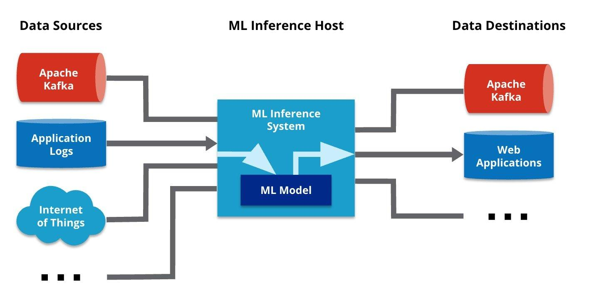

## Table of Contents

## What is a host in the context of machine learning?

In the context of machine learning, a host typically refers to the computer or server that runs the machine learning algorithms and processes the data. This could be a local machine, a cloud-based server, or even a distributed system where multiple machines work together to handle the computational load. The host is responsible for executing the training and inference tasks, managing the data flow, and ensuring that the machine learning models perform efficiently.

For example, when you train a neural network, the host machine will handle the calculations required to adjust the model's weights based on the input data and the desired outputs. This involves complex mathematical operations, and the host needs to have sufficient processing power and memory to manage these tasks effectively. In practical terms, choosing the right host can significantly impact the speed and efficiency of your machine learning projects.

## How does a host machine differ from a guest machine in machine learning environments?

In machine learning environments, a host machine is the main computer or server that runs the machine learning algorithms and processes the data. It's like the brain of the operation, doing all the heavy lifting such as training models, making predictions, and managing data. For example, if you're training a model to recognize images, the host machine will handle all the calculations needed to learn from the images and improve its accuracy over time.

A guest machine, on the other hand, is typically used in a virtualized environment where multiple operating systems run on the same physical hardware. In the context of machine learning, a guest machine might be used to run different experiments or to test models in isolated environments without affecting the main system. For instance, you might set up a guest machine to test a new version of a model without disrupting the work being done on the host machine. This separation helps in managing resources and ensuring that experiments can be conducted safely and efficiently.

## What are the basic hardware requirements for a host machine used in machine learning?

A host machine used for machine learning needs to have strong hardware to handle the big math problems that come with training models. The most important part is a good processor, or CPU, which does the calculations. For machine learning, a fast CPU with many cores helps a lot because it can work on different parts of the problem at the same time. Also, having a lot of memory, or RAM, is important. When you train a model, it needs to keep a lot of data in memory, so having at least 16GB of RAM, but often more like 32GB or 64GB, makes things run smoothly.

Another key part of a host machine for machine learning is a good graphics card, or GPU. GPUs are great for machine learning because they can do a lot of the same math operations at once, which makes training models much faster. A GPU with a lot of memory, like 8GB or more, is really helpful. Also, having a big hard drive or SSD is important because machine learning data sets can be huge. SSDs are faster than regular hard drives, so they can help speed up the whole process. Overall, the right hardware can make a big difference in how fast and well your machine learning models work.

## What operating systems are commonly used on host machines for machine learning?

The most common operating system for host machines in machine learning is Linux. Linux is popular because it's free, customizable, and has a lot of tools and libraries that are made just for machine learning. Many of the big machine learning frameworks, like TensorFlow and PyTorch, work really well on Linux. Also, many cloud services that you might use for machine learning, like Amazon Web Services or Google Cloud, run on Linux, so it's easy to move your work between your computer and the cloud.

Another operating system that people use for machine learning is macOS. macOS is good because it's based on Unix, which is similar to Linux, so many of the same tools and libraries work on it. Also, if you're using a Mac, you might find it easier to set up and use because it's user-friendly. However, macOS might not be as fast or have as many options as Linux when it comes to machine learning, but it's still a good choice for many people.

Windows is also used for machine learning, but it's not as common as Linux or macOS. Windows has gotten better for machine learning in recent years, especially with tools like Windows Subsystem for Linux (WSL), which lets you run a Linux environment on Windows. This makes it easier to use Linux tools on a Windows machine. Still, if you're just starting out, you might find it a bit harder to set up everything you need for machine learning on Windows compared to Linux or macOS.

## How do you set up a host machine for machine learning development?

Setting up a host machine for machine learning development starts with choosing the right operating system. Linux is the most popular choice because it's free and has a lot of tools made just for machine learning. You can download a version like Ubuntu, which is easy to use and has a lot of support. Once you have Linux installed, you'll need to install the basic software you'll need, like Python, which is the main language used for machine learning. You can install Python by opening a terminal and typing `sudo apt-get install python3`. After that, you'll want to set up a virtual environment to keep your projects organized. You can do this by running `python3 -m venv myenv` and then activating it with `source myenv/bin/activate`.

Next, you'll need to install the machine learning libraries. The most important ones are TensorFlow and PyTorch. You can install TensorFlow by running `pip install tensorflow` in your terminal. For PyTorch, you'll need to check the official website for the right command because it depends on your system's setup. After installing these libraries, you might want to set up a GPU if you have one. GPUs make training models much faster. You'll need to install the right drivers for your GPU and then install a version of TensorFlow or PyTorch that supports GPU computing. For example, to install TensorFlow with GPU support, you can use `pip install tensorflow-gpu`. Once everything is set up, you can start writing and running your machine learning code, using the power of your host machine to train and test your models.

## What are the key software tools needed on a host machine for machine learning?

The first key software tool you need on a host machine for machine learning is Python. Python is a programming language that's easy to learn and very popular for machine learning. You'll use Python to write the code that trains and tests your machine learning models. To get started with Python, you can download it from the official website and install it on your machine. Once Python is installed, you'll want to set up a virtual environment to keep your projects organized. You can do this by running ```python3 -m venv myenv``` and then activating it with ```source myenv/bin/activate```. This helps you manage different projects without mixing up their dependencies.

The next important tools are the machine learning libraries like TensorFlow and PyTorch. These libraries provide the functions and tools you need to build and train your models. To install TensorFlow, you can use ```pip install tensorflow``` in your terminal. For PyTorch, you'll need to check the official website for the right command because it depends on your system's setup. If you have a GPU, you'll want to install versions of these libraries that support GPU computing, like ```pip install tensorflow-gpu``` for TensorFlow. These libraries use complex math to train models, but you don't need to understand all the math to use them. For example, a simple linear regression model can be represented as $$y = mx + b$$, where $$m$$ is the slope and $$b$$ is the y-intercept, but the libraries handle the calculations for you.

Lastly, you'll need a development environment to write and run your code. Jupyter Notebook is a popular choice because it lets you write code and see the results in the same place. You can install Jupyter Notebook with ```pip install jupyter``` and start it by running ```jupyter notebook``` in your terminal. This tool makes it easy to experiment with different parts of your machine learning project and see how they work. With these software tools in place, your host machine will be ready for machine learning development, helping you to build and test models efficiently.

## How can virtualization be utilized on a host machine for machine learning purposes?

Virtualization on a host machine for machine learning can be a powerful tool. It lets you run different operating systems or environments on the same physical computer. This is useful because you can set up different virtual machines (VMs) for different projects. For example, you might have one VM for testing a new model and another for running your main project. This keeps things organized and prevents one project from messing up another. You can use software like VirtualBox or VMware to create these VMs. Once set up, you install the needed software, like Python and machine learning libraries such as TensorFlow or PyTorch, inside each VM. This way, you can experiment with different setups without affecting your main machine.

Another benefit of virtualization for machine learning is resource management. If you're working on a big project, you can allocate more of your host machine's resources, like CPU and RAM, to the VM that needs it most. For instance, if you're training a large neural network, you might give that VM more memory and processing power. This can make your machine learning tasks run faster and more efficiently. Also, virtualization makes it easier to share your work with others. You can create a VM with all your project's software and data, and then someone else can run it on their machine without having to set everything up from scratch. This can save a lot of time and reduce errors.

## What security measures should be implemented on a host machine running machine learning models?

When setting up a host machine for machine learning, it's important to think about security. One key thing to do is to keep your operating system and all software up to date. This means regularly checking for updates and installing them. Updates often fix security holes that hackers could use to get into your system. Also, using strong passwords and changing them often can help keep your machine safe. It's a good idea to use a password manager to create and remember strong passwords. Another important step is to use a firewall. A firewall can stop bad traffic from getting to your machine, which can protect your machine learning models and data.

Another important security measure is to use encryption. This means turning your data into a code that only people with the right key can read. You can encrypt your hard drive to protect the data stored on it. Also, when sending data over the internet, use secure connections like HTTPS. This keeps your data safe while it's moving from one place to another. Finally, be careful about what you download and run on your machine. Only download software from trusted sources, and be careful with emails or messages that ask you to click on links or open files. These could be tricks to get harmful software onto your machine, which could mess up your machine learning work.

## How do you optimize a host machine's performance for machine learning tasks?

To optimize a host machine's performance for machine learning tasks, start by making sure your hardware is up to the job. A fast CPU with many cores can handle the complex calculations needed for training models. Also, having a lot of RAM, like 32GB or more, helps because machine learning often needs to keep a lot of data in memory. A good graphics card, or GPU, is really important too. GPUs can do a lot of the same math operations at once, which makes training models much faster. Make sure your GPU has enough memory, like 8GB or more, to handle big models. Finally, use a fast SSD instead of a regular hard drive. SSDs can read and write data much quicker, which speeds up everything from loading data to saving your trained models.

Another way to optimize performance is by using the right software and settings. Install Python and set up virtual environments to keep your projects organized. Use libraries like TensorFlow or PyTorch, which are made for machine learning and can take advantage of your GPU to speed up training. You can install TensorFlow with ```pip install tensorflow``` and PyTorch with the right command from their website. Also, make sure your operating system and all software are up to date, as updates often include performance improvements. If you're using a Linux machine, you can update everything with ```sudo apt-get update && sudo apt-get upgrade```. Finally, consider using virtualization to run different experiments in isolated environments. This can help you manage resources better and make sure your main machine stays fast and efficient for your most important tasks.

## What are the challenges of scaling machine learning operations on a single host machine?

One big challenge of scaling machine learning operations on a single host machine is the limit on resources. A single machine has only so much CPU, memory, and GPU power. When you try to train bigger models or use larger datasets, you can run out of these resources. For example, if you're working with a huge dataset, your machine might not have enough memory to load it all at once. This can slow down your work or even make it impossible to finish. Also, if you're training a complex neural network, it might take a long time because your machine's GPU can only handle so many calculations at once.

Another challenge is managing multiple tasks on one machine. If you're running different machine learning experiments or projects, they can all need resources at the same time. This can lead to a situation where one project slows down another because they're competing for the same CPU or GPU. For example, if you're training a model and also trying to run some data analysis, the training might take longer because the CPU is being used for both tasks. To handle this, you might need to use virtualization or set up different environments, but that can add complexity and still might not solve the problem if your machine's resources are stretched too thin.

## How can containerization enhance the efficiency of machine learning on a host machine?

Containerization can make machine learning on a host machine a lot more efficient. By using containers, you can package your machine learning code, libraries, and settings into one neat bundle. This means you can run different projects on the same machine without them messing with each other. For example, you can have one container for training a model and another for testing it. This keeps things organized and makes sure each project has the resources it needs. Tools like Docker make it easy to create and manage these containers. You can set up a container with all the software you need, like Python and TensorFlow, by running ```docker run -it tensorflow/tensorflow:latest```. This way, you can quickly switch between different projects without having to set up everything from scratch each time.

Another way containerization helps is by making it easier to move your work between different machines. If you're using a host machine at home and then want to run your model on a cloud server, containers make it simple. You can take the same container you used at home and run it on the cloud without changing anything. This saves time and reduces errors because you know the environment will be the same. Also, containers can help you use your machine's resources better. You can set limits on how much CPU or memory each container uses, so one project doesn't slow down another. This can make your machine learning work faster and more efficient overall.

## What advanced configurations can be applied to a host machine to handle large-scale machine learning projects?

To handle large-scale machine learning projects, you can set up your host machine with advanced configurations that help manage big datasets and complex models. One way to do this is by using distributed computing. This means splitting your machine learning tasks across multiple machines or using a cluster of machines to work together. You can use tools like Apache Spark or Hadoop to manage this. For example, you might use Spark to process a huge dataset that's too big for one machine to handle alone. By setting up a cluster, you can spread the workload and make your training much faster. Another important configuration is using specialized hardware like multiple GPUs or even TPUs (Tensor Processing Units). These can handle the heavy math needed for training big models. You can install drivers for your GPUs and use libraries like TensorFlow or PyTorch that support GPU computing. For instance, you can install TensorFlow with GPU support using ```pip install tensorflow-gpu```.

Another advanced configuration is setting up a robust data pipeline. This means organizing how data flows into your machine learning models. You can use tools like Apache Kafka or AWS Kinesis to manage data streaming and ensure your models always have fresh data to learn from. Also, using containerization with tools like Docker or Kubernetes can help you manage different parts of your project efficiently. For example, you can set up different containers for data preprocessing, model training, and model serving. This keeps everything organized and makes it easier to scale your project. Finally, consider using advanced optimization techniques like hyperparameter tuning. This involves trying different settings for your model to find the best ones. You can use tools like Optuna or Hyperopt to automate this process. By applying these advanced configurations, you can make your host machine ready to handle large-scale machine learning projects effectively.