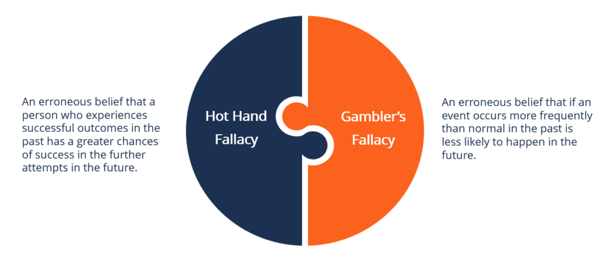

## Table of Contents

## What is the 'Hot Hand' phenomenon?

The 'Hot Hand' phenomenon is a belief that a person who has been successful at something recently will continue to be successful. People often think this happens a lot in sports, especially in basketball. For example, if a basketball player makes several shots in a row, people might say he has a 'hot hand' and expect him to keep making shots.

However, many studies have shown that the 'hot hand' might not be real. Researchers have looked at lots of data and found that a player's success in the past does not always predict future success. This means that just because a player made a few shots in a row, it doesn't mean they are more likely to make the next shot. Still, the idea of the 'hot hand' is very popular and can affect how people play and watch sports.

## How did the concept of the 'Hot Hand' originate?

The concept of the 'Hot Hand' started in basketball. People noticed that sometimes a player would make many shots in a row and everyone would think that player was on a 'hot streak.' They believed that once a player got into this groove, they were more likely to keep making shots. This idea became really popular and people started talking about it a lot, not just in basketball but in other sports and even in everyday life.

In 1985, some researchers decided to study if the 'Hot Hand' was real. They looked at a lot of basketball data and found that players did not actually shoot better after making a few shots in a row. Their research suggested that the 'hot hand' might just be a myth. Even though the study said it wasn't real, many people still believe in the 'hot hand' and it continues to be a big part of how we talk about and watch sports.

## What are some common examples of the 'Hot Hand' in sports?

In basketball, a common example of the 'Hot Hand' is when a player keeps making shots one after another. Fans and teammates might start cheering more, thinking that the player is on a hot streak and will keep making shots. For instance, if a player like Stephen Curry makes three or four three-pointers in a row, everyone might think he's got the 'hot hand' and expect him to keep shooting well.

In baseball, the 'Hot Hand' can be seen when a batter gets several hits in a row during a game. People might say the batter is 'on fire' and expect them to keep hitting well. For example, if a player like Mike Trout gets a few hits in a game, fans might think he's got the 'hot hand' and will continue to hit successfully in his next at-bats.

## What is the psychological explanation behind the 'Hot Hand' effect?

The 'Hot Hand' effect is often explained by something called the 'availability heuristic.' This is a fancy way of saying that people judge how likely something is to happen based on what they can easily remember. When someone sees a basketball player making a few shots in a row, it's easy to remember those successful shots. Because those memories are fresh in their mind, they think the player is more likely to keep making shots, even if there's no real evidence to support it.

Another part of the psychological explanation is about how we see patterns. Humans love to find patterns and meaning in things, even when there might not be any. So, when a player makes a few shots in a row, people start to see a pattern and think it will keep going. This can make them believe in the 'hot hand' even though studies show it's not a real thing. Our brains trick us into thinking there's a pattern where there might just be random chance.

## How does the 'Hot Hand' relate to the concept of streaks in performance?

The 'Hot Hand' is closely related to the idea of streaks in performance. A streak happens when someone does the same thing successfully many times in a row, like making a bunch of basketball shots or hitting several baseballs. When people see someone on a streak, they often think that person has a 'hot hand' and will keep doing well. This belief makes the 'hot hand' and streaks seem like the same thing.

But, the 'hot hand' is more about believing that past success makes future success more likely. Streaks are just a series of successes that happen one after the other. Even though they seem similar, the 'hot hand' is about the belief in continued success, while a streak is just the actual pattern of successes. People often mix up the two ideas, but they are a bit different.

## What are the statistical methods used to study the 'Hot Hand' phenomenon?

To study the 'Hot Hand' phenomenon, researchers use different statistical methods to look at data and see if there's any real pattern. One common method is to look at the sequence of successes and failures, like made and missed shots in basketball. They use something called a 'runs test' to see if the pattern of successes and failures is random or if there's a real streak happening. This helps them figure out if a player is actually more likely to make a shot after making a few shots in a row, or if it's just luck.

Another method is to use regression analysis. This is a way to see if past performance can predict future performance. Researchers look at a lot of data to see if making a few shots in a row really makes a player more likely to make the next shot. They also look at other things that might affect performance, like how tired the player is or how well they are playing overall. By using these methods, they can see if the 'hot hand' is real or just something people believe in because they see a few successes in a row.

## What evidence supports the existence of the 'Hot Hand'?

Some people believe in the 'Hot Hand' because they see players making shots or hitting balls one after another. When this happens, it's easy to think the player is on a hot streak and will keep doing well. For example, in basketball, if a player makes three shots in a row, everyone might start cheering and think the player has a 'hot hand.' This feeling is strong because our brains like to see patterns and think that past success means more success is coming.

However, there are also some studies that suggest the 'Hot Hand' might be real. Some newer research has looked at different ways to measure performance and found that in some cases, players do shoot better after making a few shots in a row. For example, one study looked at free throws in basketball and found that players were more likely to make the next free throw if they made the one before it. These studies make some people think that the 'Hot Hand' could be real, at least sometimes.

## What evidence challenges the 'Hot Hand' theory?

The main evidence that challenges the 'Hot Hand' theory comes from a famous study done in 1985. Researchers looked at a lot of basketball data and found that players did not actually shoot better after making a few shots in a row. They used a special test called a 'runs test' to see if the pattern of making and missing shots was random or not. They found that the pattern was random, which means that just because a player made a few shots, it didn't make them more likely to make the next shot. This study made a lot of people think that the 'Hot Hand' might just be something we believe in, but isn't really true.

More recent studies have also questioned the 'Hot Hand' theory. Some researchers have looked at different sports and found that players' success in the past does not always predict their future success. For example, in baseball, a batter getting a few hits in a row does not mean they are more likely to get another hit. These studies use a method called 'regression analysis' to see if past performance can really predict future performance. They found that other things, like how tired a player is or how well they are playing overall, can affect their performance more than any 'hot hand' they might have.

## How do different sports and games influence the 'Hot Hand' effect?

Different sports and games can make people think about the 'Hot Hand' effect in different ways. In basketball, the 'Hot Hand' is really popular because fans see players making shots one after another. When a player like Stephen Curry makes a few three-pointers in a row, everyone cheers and thinks he's got the 'hot hand.' This makes people believe in the 'Hot Hand' a lot in basketball. In baseball, the 'Hot Hand' can be seen when a batter gets several hits in a row. Fans might think the batter is 'on fire' and expect them to keep hitting well. Each sport has its own way of making people think about the 'Hot Hand.'

In other games like gambling, the 'Hot Hand' can also be seen. For example, in a casino, if someone wins a few times in a row at a slot machine, they might think they're on a 'hot streak' and keep playing. This belief can make people keep playing even if the chances of winning are still the same. Different games and sports can make the 'Hot Hand' seem more or less real, depending on how often people see streaks of success. But, it's important to remember that even if it feels real, studies show that the 'Hot Hand' might just be something we believe in because we see a few successes in a row.

## What role does cognitive bias play in perceptions of the 'Hot Hand'?

Cognitive bias plays a big role in how people see the 'Hot Hand.' One of these biases is called the 'availability heuristic.' This means people think something is more likely to happen if they can easily remember it happening before. When someone sees a basketball player making a few shots in a row, it's easy to remember those shots. Because those memories are fresh in their mind, they start thinking the player is more likely to keep making shots, even if there's no real evidence to support it. This makes people believe in the 'Hot Hand' even when it might not be real.

Another cognitive bias that affects perceptions of the 'Hot Hand' is our love for finding patterns. Humans naturally look for patterns in everything, even when there might not be any. When a player makes a few shots in a row, people see a pattern and think it will keep going. This makes them believe in the 'hot hand' because our brains trick us into thinking there's a pattern where there might just be random chance. These biases make the 'Hot Hand' seem real to a lot of people, even though many studies show it might not be.

## How has the understanding of the 'Hot Hand' evolved with new research?

At first, people thought the 'Hot Hand' was real because they saw players making shots one after another in basketball. They believed that if a player made a few shots in a row, they were more likely to keep making shots. But in 1985, some researchers looked at a lot of basketball data and found that players did not actually shoot better after making a few shots in a row. This study made a lot of people think that the 'Hot Hand' might just be something we believe in, but isn't really true.

Newer research has looked at the 'Hot Hand' in different ways and found some evidence that it might be real sometimes. For example, some studies looked at free throws in basketball and found that players were more likely to make the next free throw if they made the one before it. But other studies still show that in many cases, the 'Hot Hand' is not real. So, the understanding of the 'Hot Hand' has changed a bit with new research, but it's still not clear if it's real or just something we think we see because of how our brains work.

## What are the implications of the 'Hot Hand' for coaching and training strategies?

The 'Hot Hand' can affect how coaches and trainers plan their strategies. If they believe in the 'Hot Hand,' they might keep a player in the game longer if they think the player is on a hot streak. For example, in basketball, a coach might keep a player who made a few shots in a row on the court longer, hoping they will keep making shots. This can change how they manage the game and how they train their players to keep their performance high.

But, if coaches and trainers know that the 'Hot Hand' might not be real, they might use different strategies. They might focus more on other things that can help a player do well, like making sure they are not too tired or teaching them better skills. Instead of relying on a player's recent success, they might look at the whole game and make decisions based on what will help the team win, not just what happened in the last few minutes.

## What are the Algorithmic Strategies and how do they relate to Hot Hand Performance Streaks?

Algorithmic trading strategies often seek to capitalize on perceived patterns in data, including performance streaks akin to the "Hot Hand" phenomenon. These strategies attempt to harness sequences wherein a trader, stock, or algorithm has displayed a series of positive outcomes, under the assumption that these streaks might predict future success.

### Identifying Hot Hand Streaks

Traders utilize statistical models to identify and exploit performance streaks. These models rely on quantitative analysis techniques, such as moving averages, time-series analysis, and [machine learning](/wiki/machine-learning), to detect anomalies or streaks in the data. For instance, moving average convergence divergence (MACD) and relative strength index (RSI) are commonly used indicators that help assess [momentum](/wiki/momentum), potentially spotting a "Hot Hand."

A simple moving average (SMA) can be used to smooth out price data and highlight trends. Consider a time series of stock prices $P = \{ p_1, p_2, ..., p_n \}$. A moving average $MA_t$ over a window of $k$ days is calculated as:

$$
MA_t = \frac{1}{k} \sum_{i=t-k+1}^{t} p_i
$$

This formula helps traders identify the direction of the prevailing trend that could signify a performance streak.

### Leveraging Statistical Tools

Advanced [algorithmic trading](/wiki/algorithmic-trading) strategies incorporate machine learning models, such as support vector machines (SVMs) or neural networks, to improve identification and prediction of "Hot Hand" streaks. These models are trained on historical data to recognize patterns that have historically preceded significant price movements.

For instance, an SVM might be used to classify price movements as part of a streak, training on features such as recent returns, [volume](/wiki/volume-trading-strategy) changes, and economic indicators. Python's `scikit-learn` library provides robust tools for implementing such models:

```python
from sklearn import svm
import numpy as np

# Sample feature matrix X and target vector y
X = np.array([[price_trend, volume_change, indicator1], ...])
y = np.array([1 if hot_hand else 0 for each record in historical_data])

# Train the SVM
classifier = svm.SVC(kernel='linear')
classifier.fit(X, y)

# Predict on new data
predictions = classifier.predict(new_data)
```

### Effectiveness and Pitfalls

While identifying and leveraging a "Hot Hand" streak can be lucrative, several pitfalls exist. Market noise can create false signals, leading to erroneous predictions. Moreover, reliance on historical data assumes market conditions remain constant, which is rarely the case.

The efficient market hypothesis suggests that stock prices reflect all available information, implying that exploiting performance streaks offers no guaranteed edge. Additionally, overfitting models to past data can result in strategies that perform poorly in live markets due to the lack of generalizability.

Strategies must also account for transaction costs and [liquidity](/wiki/liquidity-risk-premium) constraints, as frequent trades to capture streaks may erode profits. Furthermore, as more algorithms incorporate similar strategies, potential gains might diminish as patterns become widely exploited.

In conclusion, while algorithms can potentially exploit the "Hot Hand" phenomenon, the effectiveness of such strategies is contingent on robust model design, risk management, and adaptation to ever-changing market dynamics.

## References & Further Reading

[1]: Gilovich, T., Vallone, R., & Tversky, A. (1985). ["The hot hand in basketball: On the misperception of random sequences."](https://www.sciencedirect.com/science/article/pii/0010028585900106) Cognitive Psychology, 17(3), 295-314.

[2]: Miller, J. B., & Sanjurjo, A. (2018). ["Surprised by the Gambler's and Hot Hand Fallacies? A Truth in the Law of Small Numbers."](https://papers.ssrn.com/sol3/papers.cfm?abstract_id=2627354) American Economic Review, 108(10), 3244-3261.

[3]: Yaari, G., & Eisenmann, S. (2011). ["The hot (invisible?) hand: Can time sequence patterns of success/failure in sports be modeled as repeated random independent trials?"](https://journals.plos.org/plosone/article?id=10.1371/journal.pone.0024532) Journal of Economic Behavior & Organization, 76(3), 475-488.

[4]: Arkes, J. (2010). ["Revisiting the hot hand theory with free throw data in a multivariate framework."](https://core.ac.uk/download/pdf/36735829.pdf) Journal of Applied Statistics, 37(2), 195-206.

[5]: Barberis, N., Shleifer, A., & Vishny, R. (1998). ["A model of investor sentiment."](https://www.sciencedirect.com/science/article/pii/S0304405X98000270)00027-0) Journal of Financial Economics, 49(3), 307-343.

[6]: Zuckerman, G. (2019). *The Man Who Solved the Market: How Jim Simons Launched the Quant Revolution*. Penguin Publishing Group. 

[7]: Bazerman, M. H., & Moore, D. A. (2013). *Judgment in Managerial Decision Making*. Wiley.

[8]: Malkiel, B. G. (2015). *A Random Walk Down Wall Street: The Time-tested Strategy for Successful Investing*. W.W. Norton & Company.