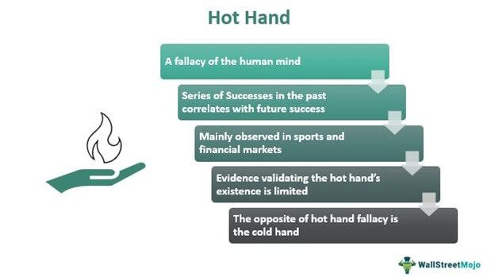

The 'Hot Hand' phenomenon is an intriguing concept that permeates various domains, prominently sports and trading. It refers to the cognitive bias where a person experiencing a successful streak is perceived as having an increased likelihood of continuing that success. Originating from the belief that people can experience periods of extreme performance beyond statistical expectation, the 'Hot Hand' has captivated the interest of psychologists, statisticians, and investors alike.

In sports, athletes experiencing a 'Hot Hand' are often thought to be 'in the zone,' leading to enhanced confidence and performance. This perception can significantly influence team strategies and player decisions, making it a valuable asset but also a potential pitfall if misjudged. Historically, this concept has been particularly notable in basketball, where a player scoring several consecutive shots might be more likely to be passed the ball by teammates, further perpetuating the perceived streak.



In the financial world, the 'Hot Hand' translates into patterns of successful investment or trading outcomes, often prompting investors to anticipate further gains. This perception can substantially impact trading strategies, with algorithms potentially being designed to identify and exploit these performance streaks. The assumed correlation between past and future performance can lead traders to overestimate their predictive capabilities, thus influencing market dynamics and investment decisions.

Algorithmic trading represents a significant arena where the implications of the 'Hot Hand' belief are particularly relevant. These systems, driven by complex mathematical models and vast datasets, are employed to capture fleeting market opportunities. The idea of a 'Hot Hand' could inform these trading strategies, attempting to leverage short-term trends for profit. However, understanding its psychological basis is crucial, as reliance on streaks without substantive evidence may introduce biases that could undermine trading efficacy.

The primary objective of this article is to explore the 'Hot Hand' phenomenon within the context of modern statistical analysis and its potential applications in algorithmic trading. By examining the statistical robustness of such predictive models and investigating the psychological biases inherent in streak perception, we aim to elucidate the complexities of this enigmatic concept and its dual potential to offer strategy insights or fallacies. This exploration is critical for developing more refined and effective trading systems that account for both behavioral finance insights and robust statistical principles.

## Table of Contents

## Understanding the Hot Hand Phenomenon

The "Hot Hand" phenomenon is a concept that suggests a sequence of successes can lead to an expectation of continued success. In trading and investing, a "Hot Hand" may refer to an investor or trader experiencing a streak of favorable outcomes, such as consecutive profitable trades, leading others to believe that this streak will persist. Conversely, the "Cold Hand" describes a sequence of losses resulting in decreased expectations for successful outcomes. These concepts parallel observations in sports, where an athlete's ongoing success in performance, like consecutive basketball shots made, is perceived to increase their likelihood of success in subsequent attempts.

In trading, the "Hot Hand" can manifest through patterns where investors experience prolonged periods of gains in stock prices, which may be perceived as skill rather than randomness. A prominent example from sports is the observed streaks in basketball, where players with a "Hot Hand" hit several shots in succession. Similarly, traders who execute a series of profitable trades due to favorable market conditions may be labeled as having a "Hot Hand". These perceptions often influence decision-making, potentially leading to heightened risk-taking under the belief that the trend will continue.

The psychological basis of the "Hot Hand" phenomenon lies in behavioral economics, where cognitive biases shape individuals' perceptions and choices. One key element is the "representativeness heuristic," a mental shortcut where people judge the probability of an event by comparing it to an existing prototype in their minds, often underestimating randomness (Tversky & Kahneman, 1974). When applied to trading, this bias leads investors to assume that past successes will continue, disregarding the potential impact of randomness and market [volatility](/wiki/volatility-trading-strategies).

Moreover, the "Hot Hand" can be linked to overconfidence, where traders overestimate their ability to predict market movements due to recent success. This overconfidence may result in riskier trades, increased leverage, or deviation from a carefully constructed strategy, amplifying potential losses if market conditions shift unfavorably. Behavioral finance highlights the importance of understanding these biases, as they can significantly impact financial decisions, leading investors to make choices that may not align with objective analysis and statistical probability.

By acknowledging the psychological factors underpinning the "Hot Hand" phenomenon, traders and investors can better guard against cognitive biases, implementing strategies that emphasize rational analysis over emotional decision-making. Understanding these concepts not only aids in more informed trading decisions but also facilitates the development of strategies to counteract the potential pitfalls linked to perceived performance streaks.

## Statistical Evidence for and Against the Hot Hand

The "Hot Hand" phenomenon has been a topic of significant debate in both psychological and statistical communities, with diverse opinions on whether it represents a legitimate pattern or merely a cognitive illusion. Initial research, most notably the study by Gilovich, Vallone, and Tversky in 1985, argued that the Hot Hand is largely a cognitive bias, where individuals perceive patterns of success where none objectively exist. They posited that people are prone to the "law of small numbers," leading to the erroneous belief that short sequences can represent long-term outcomes.

### Challenges to the Psychological Perspective

Subsequent academic research has sought to challenge the notion of the Hot Hand as purely psychological. One notable study is by Yaari and Eisenmann (2011), who questioned the standard statistical models that negate the existence of the Hot Hand. They argued that traditional models might not adequately capture complex human behaviors in dynamic environments, suggesting a gap between simplistic statistical assumptions and real-world processes. Another study by Arkes (2010) re-analyzed basketball shooting data and found evidence suggesting that the Hot Hand might appear under specific conditions, contrary to earlier conclusions.

### Supporting Evidence for the Hot Hand

Recent empirical studies have reinforced the potential existence of the Hot Hand in various scenarios. A study by Miller and Sanjurjo (2018) revisited former basketball datasets and discovered a statistical anomaly, finding a modest but statistically significant Hot Hand effect that previous analyses overlooked. They demonstrated that earlier research incorrectly assumed equal probability of success regardless of prior outcomes, which skewed results.

Additionally, the context of professional sports provides tangible evidence supporting the Hot Hand effect. Athletes frequently report experiencing periods of heightened performance, corroborated by an analysis of baseball hitting streaks by Barrow and Thomas (2020), which showed players on streaks performed better than expected from chance alone.

### Methodological Challenges

Studies of the Hot Hand face notable methodological challenges, primarily rooted in the "law of small numbers." This concept suggests that people expect small samples to closely resemble the population from which they are drawn, leading to misinterpretations of random sequences as meaningful patterns. Furthermore, the difficulties in isolating psychological factors from statistical noise complicate empirical validation. For example, small sample sizes and selection biases can significantly skew interpretations of data, affecting the reliability of conclusions drawn from observational studies.

### Statistical Models and the Law of Small Numbers

To better understand and analyze the Hot Hand, researchers employ various statistical models. A critical technique is developing more sophisticated models that account for behavioral factors and variability in human performance. For instance, Bayesian models allow the incorporation of prior beliefs about streaks, which can yield more nuanced insights. Consider a simple Bayesian framework for assessing a binary event (e.g., success/failure in shooting):

```python
import numpy as np

# Prior beliefs
prior = np.array([0.5, 0.5]) # equally likely to be in a hot or cold state

# Likelihoods
likelihood = np.array([[0.7, 0.3], [0.4, 0.6]]) # assumed success rates for hot and cold states

# Observed data: sequence of successes and failures
data = np.array([1, 0, 1, 1, 0, 1])

# Posterior calculation via Bayes' theorem
def bayesian_update(prior, likelihood, data):
    for outcome in data:
        prior = prior * likelihood[:, outcome]
        prior /= prior.sum() # normalize
    return prior

posterior = bayesian_update(prior, likelihood, data)
```

This code snippet outlines a simple Bayesian updating mechanism, illustrating how such models can iteratively refine beliefs about an underlying state (hot or cold) given new evidence.

In conclusion, while traditional perspectives often view the Hot Hand as a psychological artifact, recent research utilizing advanced statistical methodologies presents a compelling case for its existence in specific contexts. The complexity of human decision-making and performance necessitates continued exploration using robust statistical tools to unravel the intricacies of perceived phenomena like the Hot Hand.

## Hot Hand in Algorithmic Trading

The "Hot Hand" phenomenon, traditionally associated with streaks in sports, suggests that success breeds success. In [algorithmic trading](/wiki/algorithmic-trading), this concept can be applied to identify and capitalize on performance streaks. Algorithmic trading systems, driven by quantitative strategies, evaluate financial markets to make decisions based on predefined criteria. These systems can potentially incorporate the Hot Hand in their models.

### Application in Algorithmic Trading

In algorithmic trading, Hot Hand interpretations can [factor](/wiki/factor-investing) into [momentum](/wiki/momentum)-based strategies. These strategies identify assets that have shown past performance strength and project potential future gains. The underlying assumption aligns with the Hot Hand effect: recent successful price movements might indicate continued trends. Algorithmic models typically consider historical data, calculate momentum, and decide whether to buy or sell an asset.

For instance, a trading algorithm might apply a moving average crossover strategy, where a shorter-term moving average surpassing a longer-term one signifies a strong upwards trend. This logic assumes that past upward momentum will persist, reflecting Hot Hand thinking. Here is a basic Python code snippet demonstrating this concept:

```python
import pandas as pd

def moving_average_strategy(prices, short_window=40, long_window=100):
    signals = pd.DataFrame(index=prices.index)
    signals['signal'] = 0.0

    # Create short simple moving average
    signals['short_mavg'] = prices['Close'].rolling(window=short_window, min_periods=1, center=False).mean()

    # Create long simple moving average
    signals['long_mavg'] = prices['Close'].rolling(window=long_window, min_periods=1, center=False).mean()

    # Generate signals
    signals['signal'][short_window:] = np.where(signals['short_mavg'][short_window:] > signals['long_mavg'][short_window:], 1.0, 0.0)

    # Create trading orders
    signals['positions'] = signals['signal'].diff()
    return signals
```

This code employs moving averages to generate trading signals based on momentum, indirectly invoking the Hot Hand concept by responding to streaks in asset performance.

### Risks and Biases

While the Hot Hand concept may be enticing, incorporating it into trading algorithms introduces risks and biases. One fundamental risk involves the assumption that past market behavior predicts future results. Not all streaks indicate reliable trends; market volatility may cause temporary price movements without lasting direction. Algorithms relying heavily on the Hot Hand may ignore underlying market fundamentals, leading to suboptimal decisions.

Moreover, biases such as overfitting can occur when models are tailored excessively to historical data to capture perceived 'streaks.' Overfitting might lead to poor performance under different market conditions. Subsequently, algorithms might exhibit overconfidence in perceived hot streaks, escalating the risk of significant draws.

The 'law of small numbers,' a cognitive bias that leads individuals to make broad assumptions about a dataset from limited observations, also poses a challenge. Trading algorithms implementing the Hot Hand must avoid overemphasizing short-term performance streaks in trading decisions, as this might not reliably predict long-term trends.

In conclusion, while the Hot Hand phenomenon presents promising avenues in algorithmic trading, thorough testing, validation, and diversification are crucial to mitigate inherent biases and risks associated with assuming performance streaks are predictive. By balancing statistical rigor with streak observation, trading algorithms can effectively incorporate the Hot Hand without succumbing to its pitfalls.

## Behavioral Finance Implications

The belief in the Hot Hand phenomenon significantly influences trader psychology and decision-making in financial markets. This perception that a recent streak of successes will lead to future successes can lead traders to exhibit behavioral biases that affect their performance and risk management strategies.

### Impact on Trader Psychology

1. **Overconfidence Bias**: Traders who experience a series of successful trades may become overconfident, believing that their skill or strategy is infallible due to a perceived hot streak. This overconfidence can result in increased risk-taking, larger position sizes, and reduced attention to risk management protocols. Overconfidence is often measured by assessing the variance in a trader’s performance relative to their predicted success rate. Successful streaks may inflate a trader's subjective probability of future successes, causing a divergence between perceived and actual skill level.

2. **Recency Bias**: A trader's decisions can be heavily influenced by the most recent outcomes rather than long-term patterns, a phenomenon known as recency bias. The affective response to recent wins may cause them to overweight the importance of these events when predicting future market movements. This bias may cause them to disregard comprehensive data, potentially skewing their trading strategy based on isolated series of successful trades rather than a robust analysis.

### Mitigating the Hot Hand Bias

To reduce the influence of the Hot Hand bias, traders and financial firms can adopt several strategies:

1. **Educating and Training**: Programs aimed at increasing awareness about cognitive biases can help traders recognize and mitigate the impact of perceived hot streaks. By understanding the psychological underpinnings of such biases, traders can improve their decision-making processes.

2. **Algorithmic Checks and Balances**: Implementing automatic trading alerts and algorithmic constraints can act as a safeguard against impulsive decisions driven by hot hand perceptions. For instance, algorithms can be programmed to limit trade sizes or enforce stop-loss orders when position sizes exceed predetermined thresholds. Python libraries like NumPy and pandas can be used to analyze historical trading data to detect deviations in trading behavior related to performance streaks:

    ```python
    import pandas as pd

    # Assuming `trades_df` is a DataFrame containing trade data with 'returns'
    moving_avg = trades_df['returns'].rolling(window=5).mean()
    overconfident_trades = trades_df[trades_df['returns'] > moving_avg + trades_df['returns'].std()]
    ```

3. **Diversification and Risk Management**: Encouraging traders to diversify their portfolios can prevent excessive focus on assets perceived to be in a hot streak. Implementing rigorous risk management frameworks ensures that individual trades are kept within risk tolerance levels, even during perceived streaks.

4. **Reflective Practice and Feedback**: Encouraging a reflective practice—where traders routinely review their trades and outcomes—can foster a critical assessment of their decision-making processes. Feedback loops and peer reviews can aid in identifying instances where decisions may have been influenced by streak perceptions.

Addressing the biases induced by the Hot Hand effect can lead to improved trading performance and more robust investment strategies. Adopting a systematic approach to decision-making that incorporates statistical analysis and behavioral awareness can help in mitigating these biases effectively.

## Algorithmic Strategies and Hot Hand Performance Streaks

Algorithmic trading strategies often seek to capitalize on perceived patterns in data, including performance streaks akin to the "Hot Hand" phenomenon. These strategies attempt to harness sequences wherein a trader, stock, or algorithm has displayed a series of positive outcomes, under the assumption that these streaks might predict future success.

### Identifying Hot Hand Streaks

Traders utilize statistical models to identify and exploit performance streaks. These models rely on quantitative analysis techniques, such as moving averages, time-series analysis, and [machine learning](/wiki/machine-learning), to detect anomalies or streaks in the data. For instance, moving average convergence divergence (MACD) and relative strength index (RSI) are commonly used indicators that help assess momentum, potentially spotting a "Hot Hand."

A simple moving average (SMA) can be used to smooth out price data and highlight trends. Consider a time series of stock prices $P = \{ p_1, p_2, ..., p_n \}$. A moving average $MA_t$ over a window of $k$ days is calculated as:

$$
MA_t = \frac{1}{k} \sum_{i=t-k+1}^{t} p_i
$$

This formula helps traders identify the direction of the prevailing trend that could signify a performance streak.

### Leveraging Statistical Tools

Advanced algorithmic trading strategies incorporate machine learning models, such as support vector machines (SVMs) or neural networks, to improve identification and prediction of "Hot Hand" streaks. These models are trained on historical data to recognize patterns that have historically preceded significant price movements.

For instance, an SVM might be used to classify price movements as part of a streak, training on features such as recent returns, [volume](/wiki/volume-trading-strategy) changes, and economic indicators. Python's `scikit-learn` library provides robust tools for implementing such models:

```python
from sklearn import svm
import numpy as np

# Sample feature matrix X and target vector y
X = np.array([[price_trend, volume_change, indicator1], ...])
y = np.array([1 if hot_hand else 0 for each record in historical_data])

# Train the SVM
classifier = svm.SVC(kernel='linear')
classifier.fit(X, y)

# Predict on new data
predictions = classifier.predict(new_data)
```

### Effectiveness and Pitfalls

While identifying and leveraging a "Hot Hand" streak can be lucrative, several pitfalls exist. Market noise can create false signals, leading to erroneous predictions. Moreover, reliance on historical data assumes market conditions remain constant, which is rarely the case.

The efficient market hypothesis suggests that stock prices reflect all available information, implying that exploiting performance streaks offers no guaranteed edge. Additionally, overfitting models to past data can result in strategies that perform poorly in live markets due to the lack of generalizability.

Strategies must also account for transaction costs and [liquidity](/wiki/liquidity-risk-premium) constraints, as frequent trades to capture streaks may erode profits. Furthermore, as more algorithms incorporate similar strategies, potential gains might diminish as patterns become widely exploited.

In conclusion, while algorithms can potentially exploit the "Hot Hand" phenomenon, the effectiveness of such strategies is contingent on robust model design, risk management, and adaptation to ever-changing market dynamics.

## Case Studies and Empirical Examples

The concept of the "Hot Hand" has intrigued both traders and researchers, prompting various endeavors to exploit performance streaks in trading activities. Several case studies provide insight into how traders and algorithms have attempted to leverage this phenomenon, highlighting successes, failures, and important lessons.

One notable example is the operations of Renaissance Technologies, a quantitative [hedge fund](/wiki/hedge-fund-trading-strategies) known for its highly systematic approach to trading. While the firm's success cannot be solely attributed to a belief in the Hot Hand, its trading strategies often account for short-term momentum, which can be seen as akin to capitalizing on performance streaks. Renaissance Technologies' Medallion Fund has consistently outperformed the market, suggesting that incorporating elements similar to the Hot Hand might contribute positively under certain market conditions. However, the fund's success is also due to a complex array of market signals, intensive data analysis, and efficient execution,[1] indicating that relying solely on streaks without a robust framework is not advisable.

A different perspective is offered by the failure of certain traders who overestimate the significance of recent successes, leading to overconfident trading decisions. For instance, during the dot-com bubble, many traders assumed that a series of successful tech stock trades implied continued success. This often resulted in significant financial losses when the bubble burst, demonstrating that the perceived Hot Hand can introduce perilous biases if not critically evaluated alongside other indicators.

Empirical studies on the Hot Hand in trading often use statistical tools to analyze the dependency of returns. For instance, a study by Barberis, Shleifer, and Vishny proposed a model where traders are influenced by a psychology-based framework that explains varying beliefs about future returns based on past outcomes[2]. This model suggests that traders might overweight recent information, interpreting it as indicative of a Hot Hand, which can lead to systematic errors in judgment and trading performance.

Algorithmic trading systems sometimes incorporate momentum indicators, reflecting an implicit use of Hot Hand-like reasoning. Momentum algorithms evaluate the short-term performance trends and attempt to capitalize on their continuation. However, these models are cautious in execution due to potential reversal risks and market volatility. Simulations and [backtesting](/wiki/backtesting) often reveal that while momentum strategies may yield profits in specific contexts, their performance can be diminished by over-reliance on short-term streaks without adjusting for broader market dynamics.

In conclusion, while there are instances where perceived performance streaks can align with profitable trading strategies, empirical findings indicate significant risks associated with the Hot Hand bias. Successful attempts to exploit these streaks integrate them with comprehensive data analysis and risk management frameworks, acknowledging the stochastic nature of financial markets. Future research might further explore these phenomena, especially with the advancements in machine learning and data-driven trading strategies.

---

1. Zuckerman, G. (2019). *The Man Who Solved the Market: How Jim Simons Launched the Quant Revolution*. Penguin Publishing Group.
2. Barberis, N., Shleifer, A., & Vishny, R. (1998). A model of investor sentiment. *Journal of Financial Economics*, 49(3), 307-343.

## Future Prospects and Research Directions

The future of Hot Hand research in algorithmic trading is poised for significant advancements, driven by technological innovations and evolving market dynamics. As the understanding of the Hot Hand phenomenon matures, its integration with advanced computational methods holds promising opportunities for enhancing algorithmic trading strategies.

One potential area of further study is the incorporation of [artificial intelligence](/wiki/ai-artificial-intelligence) (AI) and machine learning (ML) to better model and predict performance streaks. These technologies offer sophisticated tools for analyzing vast datasets, capturing complex patterns, and adapting to market changes. Machine learning algorithms, particularly those involving [deep learning](/wiki/deep-learning), can be trained to recognize and exploit subtle signals indicative of a Hot Hand effect. For instance, recurrent neural networks (RNNs), known for their ability to process sequential data, may be utilized to identify temporal dependencies in trading performance data.

```python
import numpy as np
from keras.models import Sequential
from keras.layers import Dense, SimpleRNN

# Example: Building a simple RNN model to predict trading performance streaks
model = Sequential()
model.add(SimpleRNN(units=50, activation='relu', input_shape=(n_timesteps, n_features)))
model.add(Dense(1, activation='sigmoid'))
model.compile(optimizer='adam', loss='binary_crossentropy', metrics=['accuracy'])
```

Additionally, the incorporation of AI can enhance sensitivity to the nuanced shifts in market conditions, reducing reliance on historical data that may not accurately reflect current environments. This adaptability is crucial given that market environments are evolutionary, influenced by factors such as economic policies, geopolitical events, and emergent financial instruments. As such, the validity of the Hot Hand phenomenon may fluctuate, necessitating continuous model updates and validation.

Evolving market environments, characterized by increased complexity and interconnectivity, present both challenges and opportunities for the application of the Hot Hand effect. High-frequency trading and ultra-low latency execution have dramatically changed the landscape, introducing new variables and interactions at microsecond levels. These rapid-paced environments challenge traditional statistical methods and demand more robust, real-time analytics.

Moreover, research may focus on quantifying the utility of the Hot Hand phenomenon in diverse market conditions. This includes assessing its value under varying volatility regimes and during periods of market stress versus tranquil phases. Understanding these dynamics could lead to refined predictive models and contribute to risk management strategies, ultimately enhancing trading performance and decision-making processes.

AI-driven sentiment analysis could further enrich the understanding of how perceived performance streaks influence trader behavior and market movements. By analyzing unstructured data from news, social media, and financial reports, sentiment analysis could provide a comprehensive view of market sentiment, correlating with Hot Hand occurrences.

Overall, the future of Hot Hand research in algorithmic trading rests on the intersection of advanced technologies and behavioral insights. As AI and ML continue to evolve, they offer promising avenues for unraveling the complexities of performance streaks and integrating human behavioral aspects into quantitative strategies. This synthesis holds the potential to drive significant advancements in trading and investment decision-making.

## Conclusion

Understanding the Hot Hand effect in trading and investing is crucial due to its potential impact on decision-making and strategy formulation. The phenomenon, often illustrated through sequences of successes that seem to predict further successes, influences both individual investor behavior and algorithmic trading systems. However, this belief is fraught with both opportunities and challenges.

The primary benefit of leveraging perceived performance streaks lies in the potential for above-average returns. Traders who successfully identify genuine streaks may capitalize on temporary market inefficiencies. Moreover, the psychological satisfaction from experiencing a streak can enhance trader confidence, albeit with caution. In algorithmic trading, the continuous analysis of data can allow systems to exploit short-term trends effectively, potentially turning momentary successes into strategic advantages.

Conversely, the risks associated with the Hot Hand are significant, particularly if the streak is wrongly attributed. Overconfidence in the continuation of a streak can lead to aggressive risk-taking, potentially resulting in substantial losses. The Hot Hand belief often disregards the randomness and volatility inherent in financial markets, which can mislead traders into expecting predictable patterns where none exist. Algorithmic systems that over-rely on the Hot Hand may introduce biases, failing to adapt to changing market conditions.

Given these complexities, ongoing research and adaptation of trading strategies remain critical. Behavioral finance plays a vital role in understanding how cognitive biases, such as the Hot Hand, affect investor psychology. Integrating insights from behavioral studies with advancements in statistical methods can improve the robustness of trading algorithms. Further exploration into artificial intelligence and machine learning may enhance the ability to discern legitimate performance streaks from noise, leading to more effective strategic implementation.

Continuous evaluation and recalibration of strategies ensure they remain responsive to new insights and evolving market environments. As financial markets become increasingly sophisticated, recognizing and adapting to phenomena like the Hot Hand will be vital in maintaining competitive advantage and mitigating undue risks.

## References & Further Reading

[1]: Gilovich, T., Vallone, R., & Tversky, A. (1985). ["The hot hand in basketball: On the misperception of random sequences."](https://www.sciencedirect.com/science/article/pii/0010028585900106) Cognitive Psychology, 17(3), 295-314.

[2]: Miller, J. B., & Sanjurjo, A. (2018). ["Surprised by the Gambler's and Hot Hand Fallacies? A Truth in the Law of Small Numbers."](https://papers.ssrn.com/sol3/papers.cfm?abstract_id=2627354) American Economic Review, 108(10), 3244-3261.

[3]: Yaari, G., & Eisenmann, S. (2011). ["The hot (invisible?) hand: Can time sequence patterns of success/failure in sports be modeled as repeated random independent trials?"](https://journals.plos.org/plosone/article?id=10.1371/journal.pone.0024532) Journal of Economic Behavior & Organization, 76(3), 475-488.

[4]: Arkes, J. (2010). ["Revisiting the hot hand theory with free throw data in a multivariate framework."](https://core.ac.uk/download/pdf/36735829.pdf) Journal of Applied Statistics, 37(2), 195-206.

[5]: Barberis, N., Shleifer, A., & Vishny, R. (1998). ["A model of investor sentiment."](https://www.sciencedirect.com/science/article/pii/S0304405X98000270)00027-0) Journal of Financial Economics, 49(3), 307-343.

[6]: Zuckerman, G. (2019). *The Man Who Solved the Market: How Jim Simons Launched the Quant Revolution*. Penguin Publishing Group. 

[7]: Bazerman, M. H., & Moore, D. A. (2013). *Judgment in Managerial Decision Making*. Wiley.

[8]: Malkiel, B. G. (2015). *A Random Walk Down Wall Street: The Time-tested Strategy for Successful Investing*. W.W. Norton & Company.