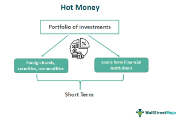

In today's highly interconnected financial world, 'hot money' has become a significant factor influencing economic stability and market dynamics. Hot money represents capital that moves rapidly across different markets in pursuit of the highest short-term returns. It is often characterized by its transient nature, swiftly moving from one country or asset class to another based on perceived investment opportunities. This kind of capital flow is driven by investors seeking immediate profit from changing conditions such as interest rates, geopolitical developments, or currency appreciations.

In this article, we explore the intricate relationship between hot money, capital flow, and their economic impacts, particularly through the lens of algorithmic trading. Algorithmic trading has revolutionized how financial markets operate by enabling trades to be executed at speeds and volumes previously impossible. The interplay between hot money and algorithmic trading is crucial to understanding modern market dynamics. As algorithms rapidly assess and react to new information, they align well with the swift and opportunistic nature of hot money. 



Readers will gain insights into how these elements affect global economies and trading strategies. The movement of hot money can inflate asset bubbles in recipient markets or trigger sharp corrections when withdrawn suddenly. This can have profound implications for economic stability, impacting everything from exchange rates to regulatory policies. Understanding these movements is vital for investors, policymakers, and financial professionals who aim to navigate the complexities of today’s financial markets effectively. An awareness of hot money flows enables more informed decision-making, spanning risk assessment to the formulation of economic strategies.

In summary, grasping the nuances of hot money is essential for anyone involved in financial markets seeking stability and growth. This understanding not only aids in crafting robust investment strategies but also plays a critical role in shaping policies that address the challenges and opportunities posed by these volatile capital flows.

## Table of Contents

## What is Hot Money?

Hot money is a term used to describe capital that moves swiftly between financial markets in search of short-term gains. This type of capital is characterized by its high liquidity, allowing investors to quickly buy and sell assets. The primary objective of hot money investors is to capitalize on short-term geopolitical or economic opportunities, making this investment style highly dynamic and reactive to market changes.

Investors engage in hot money flows by moving capital rapidly to exploit favorable conditions such as interest rate differentials or anticipated appreciations in currency value. For example, if a country's central bank raises interest rates, this might attract hot money investors looking to benefit from higher returns. Conversely, any geopolitical instability or unfavorable economic data can trigger a swift withdrawal of this capital.

Despite its speculative nature, hot money plays an essential role in the dynamics of global capital flows. Its movement can indicate investor confidence and economic health, providing valuable insights into financial market behaviors and trends. The rapid inflows and outflows of hot money can lead to increased [volatility](/wiki/volatility-trading-strategies), impacting exchange rates and asset prices. Such volatility underscores the importance of understanding hot money's characteristics for anyone analyzing financial markets.

Understanding these dynamics is crucial as they feed into broader economic trends and policies. While hot money can provide temporary boosts to economies by increasing [liquidity](/wiki/liquidity-risk-premium) and investment, it can also contribute to overheating or financial instability if not managed properly. Therefore, monitoring hot money flows is essential for investors and policymakers aiming to maintain or achieve economic stability.

## Economic Impact of Hot Money

Hot money, characterized by its fluidity and short-term investment focus, significantly impacts the economies where it is most active. One notable advantage is the enhanced liquidity it brings to recipient countries. Liquidity is vital for efficient financial markets, enabling transactions to occur smoothly and fostering an environment conducive to economic growth. An influx of hot money typically means a surge in foreign investment, boosting local financial markets and potentially leading to increased consumer spending, business investments, and overall economic development. 

However, the transient nature of hot money poses considerable risks. Its rapid and unpredictable movements can destabilize financial systems. Economies heavily dependent on such volatile capital are vulnerable to its sudden withdrawal, which can lead to financial crises. For example, during times of economic uncertainty or geopolitical tension, hot money tends to flee to safer havens, causing abrupt outflows that can result in plummeting asset prices and tightened financial conditions.

These fluctuations can lead to volatile exchange rates. When hot money pours into an economy, the demand for local currency typically increases, potentially appreciating its value. While a stronger currency can lower import costs, it may also harm export competitiveness, thereby affecting the trade balance negatively. Conversely, sudden capital flight can lead to currency depreciation, increasing the cost of imports and contributing to inflationary pressures.

Furthermore, the challenges posed by hot money necessitate careful consideration of national monetary policies and economic planning. Central banks may struggle to maintain stable currency values amidst erratic capital flows, often resorting to [interest rate](/wiki/interest-rate-trading-strategies) adjustments to manage the economic impact. However, this can create a vicious cycle; altering interest rates to counteract hot money movements can further attract or repel these volatile flows, complicating economic management.

Balancing these opportunities and threats is essential for maintaining economic stability. Policymakers need to implement strategies that capitalize on the liquidity benefits while mitigating the volatility and potential for abrupt market reversals. This may include diversifying the sources of capital inflows to reduce reliance on hot money or employing regulatory measures such as capital controls to dampen speculative investments.

## Algorithmic Trading and Hot Money

Algorithmic trading, commonly referred to as algo trading, utilizes advanced computer algorithms to execute trades with speed and precision based on live market data. This method leverages pre-set rules and conditions to make split-second trading decisions, maximizing opportunities in the fast-moving financial markets.

These systems are particularly adept at capitalizing on hot money flows, thanks to their ability to predict market movements caused by short-term capital shifts. Hot money, characterized by its rapid movement across markets in search of short-term gains, presents both opportunities and challenges for traders. By analyzing patterns of these capital flows, [algorithmic trading](/wiki/algorithmic-trading) systems can adjust their strategies efficiently to benefit from these transient movements.

High-frequency trading ([HFT](/wiki/high-frequency-trading-strategies)), a subset of algorithmic trading, is specifically designed to capitalize on such short-lived opportunities. It involves executing a large number of orders at extremely high speeds, allowing traders to benefit from brief, minute price discrepancies that occur as hot money traverses global markets. This process can occur within milliseconds, far beyond human trading capabilities.

While the opportunities for profit are significant, algorithmic traders must also manage substantial risks. The fluctuating nature of hot money can lead to sudden market volatility, presenting risk management challenges. Algorithmic trading systems must therefore incorporate sophisticated risk management protocols to mitigate potential losses associated with unexpected market swings. This includes real-time monitoring of market conditions and adjusted strategies to reflect the latest economic indicators and geopolitical developments, which often drive hot money flows.

To effectively manage these risks, traders might employ various statistical models or [machine learning](/wiki/machine-learning) algorithms to predict market trends. Here's a simple Python example using a basic moving average crossover strategy, often used in algo trading:

```python
import numpy as np
import pandas as pd

# Load historical market data
data = pd.read_csv('market_data.csv')
prices = data['Close']

# Calculate moving averages
short_window = 40
long_window = 100

signals = pd.DataFrame(index=data.index)
signals['signal'] = 0.0

# Generate signals
signals['short_mavg'] = prices.rolling(window=short_window, min_periods=1, center=False).mean()
signals['long_mavg'] = prices.rolling(window=long_window, min_periods=1, center=False).mean()
signals['signal'][short_window:] = np.where(signals['short_mavg'][short_window:] > signals['long_mavg'][short_window:], 1.0, 0.0)   

# Positions are the difference between current and previous signals
signals['positions'] = signals['signal'].diff()

# The strategy buys when the short moving average crosses above the long moving average
# and sells when it crosses below.
```

This example demonstrates a basic strategy where buy and sell signals are generated when a short-term moving average crosses above or below a long-term moving average. Though simplistic, such strategies form the foundation of more complex systems that incorporate multiple indicators and predictive models to navigate the complexities of hot money flows.

Understanding and harnessing hot money through algorithmic trading can significantly enhance profitability. Yet, precise management and adjustment of strategies are critical in navigating the associated risks and ensuring long-term trading success.

## Case Studies

The 1997 Asian Financial Crisis serves as a pivotal case study illustrating the vulnerabilities associated with massive inflows and outflows of hot money. Prior to the crisis, several Southeast Asian countries, including Thailand, Indonesia, and South Korea, experienced significant economic growth, fueled in part by substantial foreign capital inflows. These inflows were predominantly short-term investments seeking quick returns, which is characteristic of hot money.

The sudden reversal of these capital flows exposed structural weaknesses in these economies. As confidence waned, hot money rapidly exited, leading to drastic currency depreciations and severe liquidity shortages. For instance, Thailand's baht was heavily impacted, forcing the country to abandon its fixed exchange rate, which further exacerbated the economic turmoil. The exodus of hot money not only devalued currencies but also triggered widespread economic downturns, resulting in corporate bankruptcies and banking sector crises. 

Similarly, the 2008 Global Financial Crisis underscored how hot money movements can intensify financial instability and contribute to global contagion. In the prelude to the crisis, ample liquidity and low-interest rates encouraged hot money flows into high-risk mortgage-backed securities and other financial instruments. The collapse of Lehman Brothers and the subsequent financial panic led to a rapid withdrawal of such investments, severely constraining liquidity in global financial markets. This freeze exacerbated the crisis, spreading it beyond the U.S. borders to much of the developed and developing world.

Both crises demonstrate that while hot money can provide temporary liquidity and economic benefits, its volatile nature poses significant risks to financial stability. These episodes highlight the importance for emerging markets and global economies to recognize the perils associated with hot money and implement strategies to mitigate its potential adverse effects.

## How to Monitor and Manage Hot Money Risks

Monitoring and managing the risks associated with hot money involves a strategic approach that considers various economic indicators and regulatory measures. Key elements in this process include:

1. **Monitoring Economic Indicators**: Investors can track hot money flows by analyzing critical economic indicators such as interest rates, inflation rates, and geopolitical stability. For example, higher interest rates in a country can attract foreign capital seeking better returns, while political turbulence might trigger capital flight. Utilizing statistical models, investors can forecast potential hot money movements. In Python, libraries like `pandas` and `statsmodels` can be effective for time-series analysis of these economic indicators.

    ```python
    import pandas as pd
    import statsmodels.api as sm

    # Sample data for interest rates and geopolitical indices
    data = {'Interest Rate': [4.0, 4.5, 4.2, 3.9],
            'Geopolitical Stability Index': [70, 68, 65, 72]}
    df = pd.DataFrame(data)

    # Simple linear regression to predict interest rate impacts
    X = df['Geopolitical Stability Index']
    y = df['Interest Rate']
    X = sm.add_constant(X)
    model = sm.OLS(y, X).fit()
    predictions = model.predict(X)
    print(model.summary())
    ```

2. **Diversification**: To mitigate the risks associated with volatile capital movements, investors can diversify their portfolios across different asset classes and geographies. Diversification reduces exposure to any single market or economic factor, thereby stabilizing returns even when hot money flows fluctuate. An investment strategy that includes equities, bonds, and real estate across various regions can offer resilience against sudden market shifts.

3. **Regulatory Frameworks**: Establishing robust regulatory frameworks is crucial for countries to stabilize their financial systems. These frameworks may include capital controls, which regulate the flow of foreign capital in and out of the country, and macroprudential policies designed to limit systemic risks. For instance, Brazil has historically implemented taxes on certain foreign investments to buffer against disruptive capital inflows.

4. **Role of Central Banks**: Central banks play a pivotal role in managing the impact of hot money through monetary policy adjustments. By altering interest rates or engaging in open market operations, central banks can influence the attractiveness of domestic assets to foreign investors. Additionally, central banks might intervene in foreign exchange markets to stabilize currency values affected by volatile capital movements. Their policy decisions are crucial in either deterring or attracting short-term capital flows, thus shaping the trajectory of hot money and its economic implications.

By closely monitoring these elements, stakeholders can better navigate the challenges posed by hot money flows, aiming for a balanced approach that harnesses benefits while minimizing potential disruptions.

## Conclusion

Hot money remains a double-edged sword in the global financial ecosystem, offering both benefits and challenges. Its ability to enhance liquidity and stimulate economic growth in host countries underscores its potential advantages. However, its inherent volatility poses significant risks, such as sudden capital flight, which can lead to financial instability and economic downturns. For traders and policymakers, understanding and effectively managing the impacts of hot money is essential for maintaining economic stability. 

Algorithmic trading strategies, which rely on advanced computer algorithms to predict and respond to market movements, have transformed the way hot money flows are utilized in the financial markets. By analyzing historical data and patterns in capital movements, these strategies can identify unique profit opportunities presented by hot money. High-frequency trading, a subset of algorithmic trading, particularly benefits from the rapid capital movements characteristic of hot money, enabling the execution of trades at unprecedented speeds.

However, the benefits of hot money must be balanced with its risks to ensure long-term economic growth. This involves implementing regulatory frameworks, such as capital controls and macroprudential policies, to mitigate potential financial instability. Additionally, central banks play a crucial role in adjusting monetary policies to counteract the adverse effects of hot money flows, such as currency fluctuations and inflationary pressures.

Ultimately, while hot money can drive short-term gains and [momentum](/wiki/momentum) in financial markets, its sustainable integration into the global economy requires careful management and strategic foresight. By leveraging the insights from algorithmic trading and maintaining robust regulatory safeguards, countries and financial professionals can navigate the complexities of hot money, maximizing its benefits while minimizing the risks.

## References & Further Reading

[1]: ["Economics and Finance of Algorithmic Trading"](https://www.researchgate.net/publication/378548435_Algorithmic_Trading_and_AI_A_Review_of_Strategies_and_Market_Impact) by Satish Kumar

[2]: ["The Asian Financial Crisis: Causes, Cures, and Systemic Implications"](https://archive.org/details/asianfinancialcr00morr) by Morris Goldstein

[3]: ["Hot Money and the Politics of Debt"](https://www.amazon.com/Hot-Money-Politics-Debt-Third/dp/0773527435) by R. P. Brenner

[4]: Kaminsky, G. L., & Reinhart, C. M. (1999). ["The Twin Crises: The Causes of Banking and Balance-of-Payments Problems"](https://www.aeaweb.org/articles?id=10.1257/aer.89.3.473), The American Economic Review.

[5]: Burnside, C., Eichenbaum, M., & Rebelo, S. (2001). ["Hedging and Financial Fragility in Fixed Exchange Rate Regimes"](https://www.sciencedirect.com/science/article/abs/pii/S0014292101000903) National Bureau of Economic Research Working Paper Series.