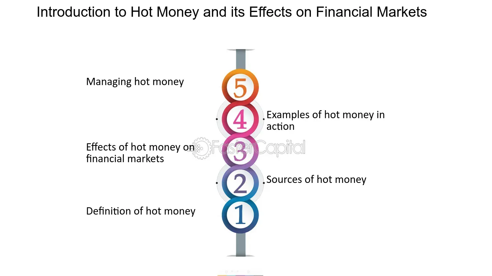

## Table of Contents

## What is hot money?

Hot money is a term used to describe money that moves quickly from one investment to another to take advantage of high short-term interest rates. It is often seen in the form of capital that flows between countries, seeking the highest possible returns in the shortest amount of time. This type of money is considered "hot" because it can leave an economy as quickly as it enters, often causing instability.

Countries with high interest rates can attract hot money, but this can be a double-edged sword. While it can boost the economy by increasing the money supply, it can also lead to inflation and make the local currency stronger. When the interest rates drop or a better opportunity arises elsewhere, hot money can quickly exit, causing the currency to weaken and potentially leading to economic turmoil.

## How does hot money move between countries?

Hot money moves between countries when investors look for the best places to make quick profits. They might move their money to a country where the interest rates are high. This is because they can earn more money from their investments in a short time. For example, if a country raises its interest rates, investors might send their money there to take advantage of the higher returns.

However, hot money can leave just as fast as it comes in. If another country starts offering even higher interest rates, or if the first country lowers its rates, investors will move their money again. This quick movement can cause problems for the countries involved. When hot money leaves, it can make the local currency weaker and cause economic instability.

## What are the main sources of hot money?

Hot money comes from investors and big funds that want to make quick profits. They look for places where they can earn a lot of money in a short time. Often, these investors are banks, hedge funds, or other financial groups. They move their money around the world to find the best deals. For example, if a country has high interest rates, these investors might send their money there to get more returns on their investments.

However, hot money can leave as fast as it comes. If a better opportunity shows up in another country, these investors will pull their money out quickly. This can cause problems for the country they leave. When hot money goes away, it can make the local currency weaker and cause economic trouble. So, even though hot money can help an economy grow for a while, it can also lead to big problems if it leaves suddenly.

## What are the characteristics of hot money?

Hot money is money that moves fast from one place to another to make quick profits. It is often used by big investors like banks and hedge funds. They look for countries with high interest rates where they can earn more money in a short time. This money is called "hot" because it can come and go very quickly.

When hot money comes into a country, it can help the economy grow for a while. It can make the local currency stronger and bring more money into the country. But, it can also cause problems. If the investors find a better opportunity somewhere else, they will take their money out fast. This can make the local currency weaker and cause economic trouble. So, hot money can be good and bad for a country's economy.

## How does hot money affect exchange rates?

When hot money comes into a country, it can make the local currency stronger. This happens because a lot of money is coming in, and people want to buy the local currency to invest in the country. This demand for the currency makes its value go up. For example, if investors think they can earn more money in a country with high interest rates, they will send their money there, making the local currency stronger.

But, hot money can also leave a country quickly if investors find a better opportunity somewhere else. When this happens, it can make the local currency weaker. People start selling the currency to take their money out, and this causes the value of the currency to go down. This quick change can cause big problems for the country's economy, like making things more expensive and causing uncertainty.

## What is the impact of hot money on a country's economy?

When hot money comes into a country, it can help the economy grow for a while. It brings in more money, which can make the local currency stronger. This can be good because it can help businesses and make things cheaper for people in the country. For example, if a country has high interest rates, investors might send their money there to earn more. This extra money can help the economy by making more jobs and boosting spending.

But, hot money can also cause problems. If the investors find a better opportunity in another country, they will take their money out fast. This can make the local currency weaker and cause economic trouble. When the currency gets weaker, things can become more expensive, and it can be hard for businesses to plan for the future. So, even though hot money can help an economy grow for a short time, it can also lead to big problems if it leaves suddenly.

## Can hot money lead to economic instability?

Yes, hot money can lead to economic instability. When investors move their money quickly from one country to another to make quick profits, it can cause big changes in the economy. If a lot of hot money comes into a country, it can make the local currency stronger. This might seem good at first because it can help businesses and make things cheaper. But, it can also make the economy grow too fast, which can lead to inflation.

The real problem comes when hot money leaves just as fast as it came in. If investors find a better opportunity somewhere else, they will take their money out quickly. This can make the local currency weaker and cause economic trouble. When the currency gets weaker, things can become more expensive, and it can be hard for businesses to plan for the future. So, even though hot money can help an economy grow for a short time, it can also lead to big problems if it leaves suddenly.

## How do governments and central banks respond to hot money flows?

Governments and central banks try to manage hot money flows to keep their economies stable. They might use rules and policies to control how much money comes in and goes out. For example, they might set limits on how much foreign money can be invested in the country or change the interest rates to make their country less attractive to hot money. By doing this, they hope to stop the economy from growing too fast or becoming too unstable when hot money leaves.

Sometimes, central banks will also use their money reserves to help keep the local currency stable. If a lot of hot money is leaving, they might buy their own currency to keep its value from dropping too much. This can help stop the economy from getting too shaky. But, it's not always easy, and sometimes these actions can only help for a short time. Governments and central banks have to be careful and always watch the money flows to keep their economies safe.

## What are the differences between hot money and foreign direct investment?

Hot money and foreign direct investment (FDI) are two different ways money comes into a country, but they work in very different ways. Hot money is money that moves quickly from one place to another to make quick profits. It often comes from big investors like banks and hedge funds who are looking for high short-term interest rates. This money can come and go very fast, which can cause problems for the country's economy. On the other hand, foreign direct investment is when a company or investor from another country puts money into a business or project in a different country. This money is meant to stay for a long time and help the business grow.

The main difference between hot money and FDI is how long the money stays in the country. Hot money is short-term and can leave as quickly as it comes, which can make the economy unstable. For example, if investors find a better opportunity somewhere else, they will take their money out fast, which can make the local currency weaker. In contrast, FDI is long-term and more stable. When a company invests in a project in another country, it usually plans to stay and grow the business over many years. This can help the economy grow in a more steady way.

## How can hot money be tracked and measured?

Hot money can be tracked and measured by looking at how much money is coming into and going out of a country quickly. Economists and financial experts watch the flow of money through banks and investment funds. They use data from the central bank and other financial institutions to see how much money is moving in and out. They also look at changes in the exchange rates and interest rates, which can show where hot money is going.

To measure hot money, experts often use something called the balance of payments. This is a record that shows all the money coming in and going out of a country. If there is a big change in the amount of money in the short-term capital account, it might mean hot money is moving around. By watching these changes closely, governments and central banks can try to understand and manage the effects of hot money on their economies.

## What are the long-term effects of hot money on global financial markets?

Hot money can have big effects on global financial markets over a long time. When hot money moves quickly from one country to another, it can make economies grow too fast or slow down suddenly. This can cause big changes in the value of currencies and make it hard for countries to plan their economies. If a lot of hot money comes into a country, it might make the economy grow too fast, which can lead to inflation. When the money leaves, it can make the economy slow down or even go into a recession. This can make it hard for businesses to know what will happen next, and it can make people feel unsure about the future.

Over time, these quick changes can make global financial markets less stable. Countries might try to make rules to control hot money, but it can be hard to stop it completely. If many countries are dealing with hot money at the same time, it can cause big problems around the world. For example, if a lot of hot money leaves one country and goes to another, it can make the first country's economy weaker and the second country's economy grow too fast. This can lead to a cycle of booms and busts that can be hard to break. So, while hot money can help economies grow in the short term, it can also cause big problems in the long run.

## What strategies can countries implement to mitigate the negative impacts of hot money?

Countries can use different strategies to make the bad effects of hot money less strong. One way is to use rules to control how much money comes in and goes out. They might set limits on how much foreign money can be invested in the country or change the interest rates to make their country less attractive to hot money. By doing this, they can try to stop the economy from growing too fast or becoming too unstable when hot money leaves.

Another way is for central banks to use their money reserves to help keep the local currency stable. If a lot of hot money is leaving, they might buy their own currency to keep its value from dropping too much. This can help stop the economy from getting too shaky. But, it's not always easy, and sometimes these actions can only help for a short time. Governments and central banks have to be careful and always watch the money flows to keep their economies safe.

In the long run, countries might also focus on making their economies stronger and less dependent on hot money. This can mean encouraging more foreign direct investment, which is more stable than hot money. By making it easier for companies to invest in long-term projects, countries can grow their economies in a more steady way. This can help them handle the ups and downs that come with hot money better.

## References & Further Reading

[1]: ["Economics and Finance of Algorithmic Trading"](https://www.researchgate.net/publication/378548435_Algorithmic_Trading_and_AI_A_Review_of_Strategies_and_Market_Impact) by Satish Kumar

[2]: ["The Asian Financial Crisis: Causes, Cures, and Systemic Implications"](https://archive.org/details/asianfinancialcr00morr) by Morris Goldstein

[3]: ["Hot Money and the Politics of Debt"](https://www.amazon.com/Hot-Money-Politics-Debt-Third/dp/0773527435) by R. P. Brenner

[4]: Kaminsky, G. L., & Reinhart, C. M. (1999). ["The Twin Crises: The Causes of Banking and Balance-of-Payments Problems"](https://www.aeaweb.org/articles?id=10.1257/aer.89.3.473), The American Economic Review.

[5]: Burnside, C., Eichenbaum, M., & Rebelo, S. (2001). ["Hedging and Financial Fragility in Fixed Exchange Rate Regimes"](https://www.sciencedirect.com/science/article/abs/pii/S0014292101000903) National Bureau of Economic Research Working Paper Series.