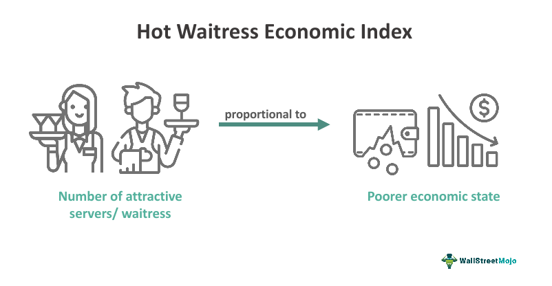

The evolving landscape of employment trends within the service industry is significantly shaped by various economic indices and technological advancements. As the sector remains a dominant player in global employment, understanding these influences becomes essential for devising effective business strategies and informed policy-making. Economic indices like Gross Domestic Product (GDP), the Unemployment Rate, and specific measures tailored for the service industry provide critical insights into market dynamics, offering a foundation for evaluating economic health and stability.

Simultaneously, technological advancements, particularly in algorithmic trading and automation, are redefining traditional roles and creating new opportunities and challenges within the service industry. Algorithmic trading employs sophisticated algorithms to optimize trading processes, enhancing efficiency and reducing the need for manual intervention in financial transactions. This technological shift has far-reaching implications for employment, as it transforms the financial sector and influences related industries. The integration of artificial intelligence (AI) technologies further drives the demand for skilled professionals adept at navigating these cutting-edge tools, underscoring the importance of adaptability and continuous learning in the workforce.



As the global economy continues to evolve, the interplay between economic indices and technological developments forms a complex framework that businesses and policymakers must navigate. By understanding how these elements interact, stakeholders can better position themselves to foster economic resilience and prosperity. This article aims to explore these intersections, offering insights into the trends shaping the service industry and highlighting the critical role of algorithmic innovations in driving future growth.

## Table of Contents

## Understanding Economic Indices

Economic indices serve as vital tools for gauging the health and performance of an economy. These indices are statistical measures that reflect the economic conditions and trends within a particular area, often on a national or global scale. They are essential for understanding market dynamics and making informed decisions that affect economic policy and investment strategies.

Among the most prominent economic indices is the Gross Domestic Product (GDP), which measures the total value of goods and services produced in a country over a specific period. GDP is a broad indicator of economic activity and growth. It is often expressed as:

$$
\text{GDP} = C + I + G + (X - M)
$$

where $C$ represents consumer spending, $I$ is investment by businesses, $G$ stands for government spending, and $(X - M)$ denotes net exports (exports minus imports).

Another critical index is the Unemployment Rate, which calculates the percentage of the labor force that is unemployed but actively seeking employment. The formula is:

$$
\text{Unemployment Rate} = \left( \frac{\text{Number of Unemployed People}}{\text{Total Labor Force}} \right) \times 100
$$

This index is instrumental in assessing labor market conditions and economic stability. It helps governments and policymakers identify trends in employment and adjust economic policies accordingly.

The Consumer Confidence Index (CCI) measures the degree of optimism that consumers feel about the overall state of the economy and their personal financial situation. A higher CCI reflects increased consumer spending, which can drive economic growth.

In the service industry, specific indices provide more targeted insights. The Employment Trends Index (ETI) by The Conference Board is one such example. It aggregates data from multiple labor market indicators to predict changes in employment trends, thereby assisting businesses in workforce planning and management strategies.

These indices collectively offer a comprehensive picture of economic conditions and trends. By analyzing this data, policymakers and investors can make informed decisions, aiming to stabilize and grow the economy effectively. Understanding and interpreting these indices is crucial in navigating the complexities of modern economic landscapes.

## Employment Trends in the Service Industry

The service industry remains a pivotal component of global employment, significantly influenced by economic cycles. It encompasses a wide range of sectors including hospitality, retail, healthcare, and finance, among others. As an employment driver, its performance often mirrors shifts in consumer demand and broader economic stability. For instance, during economic expansions, the service industry tends to experience increased job creation due to heightened consumer spending. Conversely, economic downturns can lead to job contractions as spending declines and businesses streamline operations.

According to data from The Conference Board's Employment Trends Index (ETI), the service industry is sensitive to fluctuations in economic conditions, affecting job availability and market stability. The ETI, which aggregates multiple labor market indicators, serves as a critical tool in predicting employment trends, particularly in the service sector. Metrics such as initial claims for unemployment insurance, the number of employees hired by the temporary-help industry, and the percentage of industries with increasing employment, among others, provide a comprehensive picture of employment health within the service industry.

In recent years, the influence of [artificial intelligence](/wiki/ai-artificial-intelligence) (AI) has increasingly been reshaping roles within the service industry. AI's integration into various service functions, such as customer service, data analysis, and operational management, has fostered greater efficiency but also necessitated a shift in workforce skills. Employees in the service sector are increasingly required to adapt to new technologies and automation processes, highlighting the importance of flexibility and continual learning. This technological adoption, while leading to the evolution of certain roles, underscores the need for adaptability in a dynamic employment landscape.

Overall, the service industry's employment trends not only reflect immediate economic conditions but also point to the necessity for strategic workforce planning and development in response to technological advances. As such, stakeholders must prioritize both economic and educational strategies to ensure the stability and growth of employment within this critical sector.

## Algorithmic Trading: Transforming Financial Services

Algorithmic trading, also known as automated trading, utilizes advanced mathematical models and algorithms to make trading decisions and execute trades at high speeds and high frequencies. This practice has revolutionized financial services by enhancing market efficiency and reducing transaction costs. By leveraging technology, [algorithmic trading](/wiki/algorithmic-trading) allows for the rapid analysis of market data and the execution of complex trading strategies, often without direct human intervention.

The integration of algorithmic trading has significantly altered employment dynamics within the financial sector. Traditional roles, such as floor traders, have been substantially reduced as firms increasingly rely on algorithmic solutions. This shift necessitates a workforce with expertise in computer science, data analysis, and financial engineering to develop and maintain these sophisticated systems.

The rise of [machine learning](/wiki/machine-learning) and artificial intelligence in trading has further transformed the industry. Machine learning algorithms can analyze vast datasets to identify patterns and trends, enabling more informed trading decisions. This advancement leads to a growing demand for professionals skilled in data science, programming, and quantitative analysis. The ability to create and refine these algorithms is now a critical skill set in the financial industry.

Understanding the impact of these technological changes is essential for financial services firms adapting to new trading technologies. Algorithmic trading requires robust infrastructure, including powerful computers and low-latency networks, to process transactions quickly and efficiently. Financial institutions need to invest in IT resources and talent development to remain competitive in this rapidly evolving landscape.

In conclusion, algorithmic trading represents a significant transformation in financial services, offering both opportunities and challenges. As technology continues to evolve, the demand for skilled professionals in technology and data analysis is likely to grow, reshaping the future of employment in the financial sector.

## The Interconnection: Economic Indices and Employment

Economic indices and employment trends exhibit a complex interrelationship, particularly pronounced within the service industry. These indices, which include key metrics such as GDP, the unemployment rate, and specific indices like The Conference Board's Employment Trends Index, provide crucial insights into the economic environment, thus influencing employment dynamics.

A robust employment index typically suggests an expanding economy. This perception of growth can lead investors to allocate more resources into various sectors, often triggering increased activity in algorithmic trading. Algorithmic trading, known for its efficiency in financial markets, thrives in environments with positive economic indices. When investment rises, it frequently correlates with job creation across sectors, including the service industry. This scenario highlights an essential feedback loop: healthy economic indicators foster economic confidence, which then further stimulates employment and investment.

Conversely, economic downturns, often illustrated by negative shifts in these indices, can have profound impacts on employment trends. During such times, individuals may gravitate towards the service sector, which is often viewed as a more stable employment option in uncertain economic climates. The service sector's resilience during economic troughs can be attributed to its fundamental role in providing essential services and its flexibility in labor management. This migration to the service industry underscores the sector's importance as a buffer against economic [volatility](/wiki/volatility-trading-strategies).

Businesses navigating these connections must be adept at handling human resource challenges during economic fluctuations. Effective human resource management becomes crucial, as companies need to balance cost controls with the need to maintain a skilled workforce. This necessitates a strategic approach, employing tools like workforce forecasting and flexible labor practices to weather economic cycles. Companies can utilize data-driven strategies to optimize workforce management. For instance, Python scripts can be developed to analyze time-series employment data and predict future trends based on changing economic indices.

```python
import pandas as pd
import numpy as np
from statsmodels.tsa.arima_model import ARIMA
import matplotlib.pyplot as plt

# Example of analyzing employment trend data
# Dummy data for employment and economic index
data = {'EmploymentIndex': [100, 102, 104, 103, 105], 'EconomicIndex': [150, 152, 153, 151, 155]}
df = pd.DataFrame(data)

# ARIMA model for EmploymentIndex
model = ARIMA(df['EmploymentIndex'], order=(1, 1, 1))
model_fit = model.fit(disp=0)

# Forecast Employment
forecast, stderr, conf_int = model_fit.forecast(steps=3)

print("Forecasted Employment Index:", forecast)
```

This understanding of the intricate ties between economic indices and employment trends is crucial for shaping policy and strategy, ensuring that both businesses and workers are well-prepared to adapt to future economic shifts. An ability to anticipate and react to these dynamics allows for a more resilient and responsive economy.

## Future Outlook and Policy Implications

The future trajectory of the service industry and algorithmic trading promises to be shaped significantly by technological advancements and the broader contours of economic stability. As artificial intelligence (AI) and automation technologies continue to advance, they become integral to the operational frameworks across various sectors, necessitating robust policy interventions to address potential job displacements. The integration of these technologies can potentially displace traditional roles, as tasks previously performed by humans become automated. Therefore, it is imperative for policymakers to institute measures that mitigate these disruptions, ensuring a balance between technological progress and employment preservation.

To sustain economic stability while embracing technological innovations, educational reforms and reskilling programs become crucial. The workforce must be equipped with new skills that are in demand in a technology-driven economy. These reforms should focus on bolstering STEM (Science, Technology, Engineering, and Mathematics) education, alongside fostering skills related to data analysis, machine learning, and digital literacy. By investing in lifelong learning and continuous professional development, workers can adapt to changing job requirements, thereby reducing the risk of unemployment.

Moreover, policymakers must prioritize sustainable transitions that enable the adoption of new technologies without exacerbating unemployment levels. This could involve the development of supportive policy frameworks that facilitate the transition of workers from traditional roles to new opportunities created by technological advancements. Encouraging public-private partnerships can also be beneficial in developing training programs that are aligned with industry needs. 

In conclusion, balancing technological growth with economic stability requires a multifaceted approach. By proactively managing the interplay between AI, automation, and the labor market, policymakers can foster an environment where technological innovation supports economic growth and workforce resilience.

## Conclusion

The integration of economic indices, employment trends, and algorithmic trading presents both challenges and opportunities for stakeholders involved in the service industry. These elements play crucial roles in modeling and navigating the economic environment. Economic indices such as GDP, the Unemployment Rate, and the Consumer Confidence Index provide vital insights into market conditions, facilitating informed decision-making for policymakers and investors. For instance, a robust employment index signals economic growth, which can stimulate investment and further integrate algorithmic trading in financial markets.

Navigating these complexities requires a deep understanding of how these factors interact. A fluctuating economy, reflected through economic indices, often compels businesses and industries to adjust strategies and resource allocations. Effective management of human resources amidst these shifts can mitigate risks and optimize growth. For example, as algorithmic trading transforms traditional roles in financial services, there emerges a heightened demand for skilled professionals specializing in technology and data analysis. Consequently, industries must adapt by reorganizing workforces and providing reskilling programs to meet the evolving demands.

Ongoing research and adaptation are paramount for leveraging the insights offered by the intersections of these elements. Continuous advancements in AI and automation necessitate a proactive approach to education and policy reform. Stakeholders and policymakers are tasked with creating sustainable transitions that incorporate technology without exacerbating unemployment. By fostering environments conducive to innovation and adaptability, industries can withstand future shifts and achieve economic prosperity. Overall, embracing the synergies between economic indices, employment trends, and algorithmic trading can drive robust economic frameworks, resilient to emerging challenges and optimally poised for opportunities.

## References & Further Reading

[1]: ["Algorithmic Trading and DMA: An Introduction to Direct Access Trading Strategies"](https://archive.org/details/algorithmictradi0000john) by Barry Johnson

[2]: Brynjolfsson, E., & McAfee, A. (2014). ["The Second Machine Age: Work, Progress, and Prosperity in a Time of Brilliant Technologies."](https://psycnet.apa.org/record/2014-07087-000) W.W. Norton & Company.

[3]: Acemoglu, D., & Restrepo, P. (2019). ["Artificial Intelligence, Automation, and Work."](https://www.nber.org/papers/w24196) National Bureau of Economic Research.

[4]: The Conference Board. (n.d.). ["Employment Trends Index."](https://www.conference-board.org/press/pressdetail.cfm?pressid=16343)

[5]: Lopez de Prado, M. (2018). ["Advances in Financial Machine Learning."](https://www.amazon.com/Advances-Financial-Machine-Learning-Marcos/dp/1119482089) Wiley.