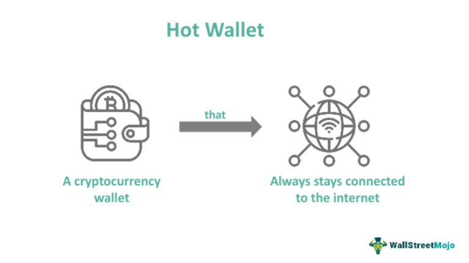

In the rapidly evolving world of cryptocurrency, security remains one of the most crucial concerns for traders and investors. The emergence and growth of digital assets have heightened the need for secure storage solutions, leading to the development and refinement of digital wallets. These wallets are essential tools for holding and managing cryptocurrencies, and they come in various forms, each designed to offer varying degrees of protection and accessibility. 

Digital wallets are not one-size-fits-all; instead, they offer unique features tailored to different security requirements and user preferences. Some are hardware-based, providing physical security, while others are software-based, prioritizing convenience and ease of access. Understanding the subtle differences between wallet types is key to ensuring the safe handling of digital currencies.



Beyond secure storage, managing cryptocurrency also involves strategic approaches to trading. One such approach is algorithmic trading, or algo trading, which employs automated systems to execute trades under pre-set rules and criteria. This method has gained popularity among traders for its ability to optimize trading strategies and minimize human error, capitalizing on market movements with speed and precision.

This article explores the complexities of cryptocurrency security, the significance of digital wallets with a focus on hot wallets, and the impact of algorithmic trading. By examining these components, readers can gain insights into effective digital asset management and the best practices for safeguarding their cryptocurrency investments.

## Table of Contents

## Understanding Cryptocurrency Security

In the rapidly expanding domain of digital currencies, ensuring security is critical owing to the susceptibility to hacking and theft. Cryptocurrencies, decentralized by nature, operate on blockchain technology, providing a foundation of inherent security through cryptographic principles. However, the means by which these assets are stored and transacted demand supplementary security measures to safeguard against unauthorized access.

At the forefront of these protective measures is encryption, which encodes information to prevent unauthorized parties from accessing it. Strong encryption algorithms are essential for securing private keys, which, if compromised, can lead to the loss of funds. Complementing encryption, two-factor authentication (2FA) serves as a potent deterrent to unauthorized account access. By requiring a second verification method beyond a password, often in the form of a one-time code sent to a mobile device, 2FA significantly bolsters the security of digital wallets and exchange accounts.

Regular software updates play a pivotal role in maintaining security, as they address vulnerabilities that hackers could exploit. Keeping wallet software and applications current ensures that the latest security patches and features are applied, thereby minimizing potential weaknesses in the system. Blockchain technology, while fundamentally secure, necessitates that users remain proactive about their security posture, particularly in the face of evolving threat landscapes.

Investors should exercise due diligence regarding the platforms they engage with. Selecting exchanges and wallet providers with strong security track records, user reviews, and transparent security practices is vital in reducing the risk of encountering fraudulent or insecure platforms. Furthermore, education about security practices, such as recognizing phishing attempts and employing secure connections when accessing accounts, can significantly buffer investors from common threats.

Ultimately, understanding the importance of cybersecurity empowers traders to better protect their investments. By adopting robust security measures, remaining vigilant of the platforms they use, and continuously updating their knowledge of potential threats, investors can enhance the safety of their digital assets in the burgeoning [cryptocurrency](/wiki/cryptocurrency) market.

## Overview of Digital Wallets

Digital wallets are essential tools for the secure storage and management of cryptocurrencies. They are designed to facilitate the transfer and receipt of digital assets while ensuring the user's keys remain protected. Digital wallets are categorized into hardware wallets, software wallets, and hybrid solutions, each offering distinct security features that cater to varying needs.

Hardware wallets are physical devices that store private keys offline, ensuring a high level of security by keeping sensitive data away from potentially compromised online environments. These devices are typically immune to viruses and require user verification for every transaction, making them a favored choice for long-term storage of significant holdings. Popular hardware wallets include products from Ledger [1] and Trezor [2], known for their robust security protocols.

Software wallets, on the other hand, offer greater accessibility and ease of use. These wallets can be downloaded as applications on computers or smartphones, enabling users to conduct transactions swiftly. While more convenient for frequent trading, software wallets are more susceptible to online threats, necessitating strong security measures such as encryption and two-[factor](/wiki/factor-investing) authentication. Examples of software wallets include Electrum and Mycelium, each providing features tailored to different user needs.

Hybrid solutions combine elements of both hardware and software wallets, offering users a balance between security and convenience. These solutions often involve hardware devices that can interface with software platforms for real-time transaction management and portfolio tracking.

When choosing a digital wallet, factors such as security, accessibility, and user-friendliness should be considered. Security features like multi-signature transactions, which require multiple parties to authorize a transaction, are crucial, especially for institutional investors managing large sums. Accessibility determines how easily users can perform transactions and interact with the cryptocurrency market. User-friendliness ensures that even those with minimal technical expertise can manage their digital assets effectively.

Digital wallets go beyond mere storage, playing a pivotal role in enabling seamless transactions and comprehensive portfolio management. They provide interfaces for users to engage with decentralized applications (dApps) and decentralized finance (DeFi) platforms, expanding the functionality of cryptocurrencies beyond traditional trading.

References:
1. Ledger. (n.d.). Wallets. Retrieved from https://www.ledger.com/
2. Trezor. (n.d.). Start. Retrieved from https://trezor.io/start/

## Hot Wallets: Advantages and Risks

Hot wallets are a fundamental component of cryptocurrency storage solutions, serving as digital wallets connected to the internet. Their primary advantage lies in their accessibility and ease of use, making them a preferred choice for frequent traders who require quick access to execute trades and manage transactions efficiently. This immediacy facilitates seamless interaction with the cryptocurrency market, allowing traders to capitalize on market opportunities without any delays.

However, the very advantage of connectivity poses significant risks. The connection to the internet inherently increases vulnerability to cyber attacks and theft. Unlike cold wallets, which remain offline, hot wallets are perpetually at risk of being targeted by hackers. Cybercriminals may exploit vulnerabilities in the software or network, potentially leading to unauthorized access and theft of assets. According to a 2020 study by the cybersecurity firm CipherTrace, the majority of cryptocurrency thefts and frauds involved breaches of hot wallets. This statistic underscores the need for stringent security measures when utilizing such wallets.

To mitigate these risks, selecting a reliable hot wallet equipped with robust security features is crucial. Essential security measures include encryption, two-factor authentication, and regular software updates to patch any emerging vulnerabilities. Furthermore, some hot wallets offer additional security layers, such as biometric authentication or multi-signature requirements, which enhance protection by requiring multiple approvals for transactions.

In addition to security measures, understanding both the benefits and risks of hot wallets is essential for informed decision-making regarding cryptocurrency storage. While hot wallets provide unmatched convenience and real-time access, the security trade-offs necessitate a careful evaluation of one's individual trading habits and risk tolerance. For traders requiring immediate market access and frequent transactions, hot wallets serve as an invaluable tool, provided they are coupled with a vigilant approach to security management.

In conclusion, managing cryptocurrencies with hot wallets involves balancing the convenience of readily available digital assets with the imperative of safeguarding those assets against increasingly sophisticated cyber threats. By conscientiously selecting and securing hot wallets, traders can optimize their cryptocurrency strategies while minimizing potential risks.

## Algorithmic Trading in Cryptocurrency

Algorithmic trading in cryptocurrency utilizes advanced computer programs and software to execute trades based on pre-defined criteria. This approach is highly effective for optimizing trading strategies as it reduces the potential for human error, enhances efficiency, and allows traders to take advantage of rapid market movements. By following algorithmic strategies, traders can systematically analyze real-time market data, execute trades at optimal times, and manage large trading volumes without manual intervention.

The rise of [algorithmic trading](/wiki/algorithmic-trading) has made sophisticated trading strategies accessible to a broader range of investors beyond institutional entities. In traditional finance, complex algorithms were primarily the domain of large institutions due to the expertise and resources required. However, the advent of cryptocurrency and advancements in trading technologies have democratized this access, enabling individual traders and smaller firms to employ algorithmic techniques.

Despite its benefits, algorithmic trading demands a comprehensive understanding of market conditions. Traders must ensure that algorithms are designed to function effectively under various scenarios, including high [volatility](/wiki/volatility-trading-strategies) and low [liquidity](/wiki/liquidity-risk-premium) environments, common in cryptocurrency markets. Technical expertise in programming languages, such as Python, alongside knowledge of technical indicators and market analytics, is crucial to developing and deploying successful trading algorithms.

To achieve optimal results in algorithmic trading, it is important to integrate secure digital wallets. This ensures that the cryptocurrency assets used in trading are protected against potential cyber threats and unauthorized access. By pairing a robust trading algorithm with a secure digital wallet, traders can enhance both their trading performance and the safety of their assets.

Python, known for its versatility and ease of use, is a popular language for developing algorithmic trading strategies. A simple framework for a basic moving average crossover strategy in Python might look like this:

```python
import pandas as pd
import numpy as np

def generate_signals(data, short_window=40, long_window=100):
    signals = pd.DataFrame(index=data.index)
    signals['signal'] = 0.0

    # Create short simple moving average
    signals['short_mavg'] = data['price'].rolling(window=short_window, min_periods=1, center=False).mean()

    # Create long simple moving average
    signals['long_mavg'] = data['price'].rolling(window=long_window, min_periods=1, center=False).mean()

    # Generate buy/sell signals
    signals['signal'][short_window:] = np.where(signals['short_mavg'][short_window:] > signals['long_mavg'][short_window:], 1.0, 0.0)

    # Create trading orders
    signals['positions'] = signals['signal'].diff()

    return signals
```

This code introduces a moving average crossover strategy, where buy and sell signals are generated based on short- and long-term moving averages. Such strategies can be further enhanced by integrating risk management protocols and [machine learning](/wiki/machine-learning) models to adapt to evolving market conditions. 

Leveraging algorithmic trading, when properly understood and implemented, provides a powerful avenue for traders in the digital currency market to enhance their trading outcomes while maintaining robust security measures through secure digital wallets.

## Best Practices for Maintaining Security

Maintaining robust security for cryptocurrencies involves adopting several best practices to safeguard digital assets. A fundamental practice is the regular updating of wallet software, ensuring any newly discovered vulnerabilities are addressed swiftly. Using complex and unique passwords for wallet access minimizes the risk of unauthorized access. Multi-signature wallets provide an additional security measure by requiring multiple approvals before any transaction is completed, reducing the risk of fraudulent withdrawals.

Diversification of holding methods is another key strategy. While hot wallets offer convenience for daily transactions, their internet connectivity poses higher security risks. Therefore, it is prudent to also utilize cold wallets, which are offline and provide a more secure option for long-term storage.

Staying informed about the latest security threats and trends is also crucial. This knowledge empowers investors to respond promptly to emerging risks, such as new forms of malware or phishing schemes targeting cryptocurrencies. Engaging with the latest research and security updates from credible sources helps keep one's defense strategies current.

Additionally, choosing reputable exchanges for trading cryptocurrencies is essential. Well-established exchanges often have more robust security measures in place, including insurance funds to cover potential losses from breaches. Finally, when accessing digital wallets, it is critical to use secure networks. Avoiding public Wi-Fi and opting for encrypted connections, like Virtual Private Networks (VPNs), reduces the likelihood of interception by malicious actors.

By integrating these practices, investors can significantly enhance the security of their cryptocurrency holdings, protecting them against a myriad of potential threats.

## Conclusion

The intersection of cryptocurrency security, digital wallets, and algorithmic trading presents a dynamic landscape for investors. Delving into the specifics of each component is crucial for making informed decisions in digital asset management. Cryptocurrency security is foundational, ensuring that investors' assets are protected from the constant threat of cyber attacks. It's critical for investors to prioritize security measures, such as encryption, two-factor authentication, and multi-signature wallets, which can significantly enhance the safety of digital assets.

Digital wallets, particularly hot wallets, provide the convenience necessary for active trading, but they also present risks that must be carefully managed. Understanding the balance between accessibility and security is essential for utilizing digital wallets effectively in a robust cryptocurrency strategy. 

Algorithmic trading, on the other hand, offers a sophisticated approach to trading by automating decision-making processes to optimize strategies while reducing human error. With the democratization of these techniques, even individual investors can now access tools and strategies that were once reserved for larger institutions. However, integrating these strategies requires a comprehensive understanding of market conditions and the technical knowledge to fine-tune algorithms.

As the cryptocurrency market evolves, continuous adaptation and learning are essential for maximizing opportunities. Being informed about technological advancements and emerging security threats enables investors to adapt promptly and remain competitive.

In summary, investors equipped with the right tools and knowledge are better positioned to thrive in the world of digital currencies. By understanding the intricacies of cryptocurrency security, leveraging the capabilities of digital wallets, and harnessing the power of algorithmic trading, investors can develop a more resilient and effective approach to managing their digital assets.

## References & Further Reading

[1]: Ledger. (n.d.). Wallets. Retrieved from https://www.ledger.com/

[2]: Trezor. (n.d.). Start. Retrieved from https://trezor.io/start/

[3]: Bergstra, J., Bardenet, R., Bengio, Y., & Kégl, B. (2011). ["Algorithms for Hyper-Parameter Optimization."](https://proceedings.neurips.cc/paper/2011/file/86e8f7ab32cfd12577bc2619bc635690-Paper.pdf) Advances in Neural Information Processing Systems 24.

[4]: ["Advances in Financial Machine Learning"](https://www.amazon.com/Advances-Financial-Machine-Learning-Marcos/dp/1119482089) by Marcos Lopez de Prado

[5]: ["Evidence-Based Technical Analysis: Applying the Scientific Method and Statistical Inference to Trading Signals"](https://www.amazon.com/Evidence-Based-Technical-Analysis-Scientific-Statistical/dp/0470008741) by David Aronson

[6]: ["Machine Learning for Algorithmic Trading"](https://github.com/stefan-jansen/machine-learning-for-trading) by Stefan Jansen

[7]: ["Quantitative Trading: How to Build Your Own Algorithmic Trading Business"](https://www.amazon.com/Quantitative-Trading-Build-Algorithmic-Business/dp/1119800064) by Ernest P. Chan