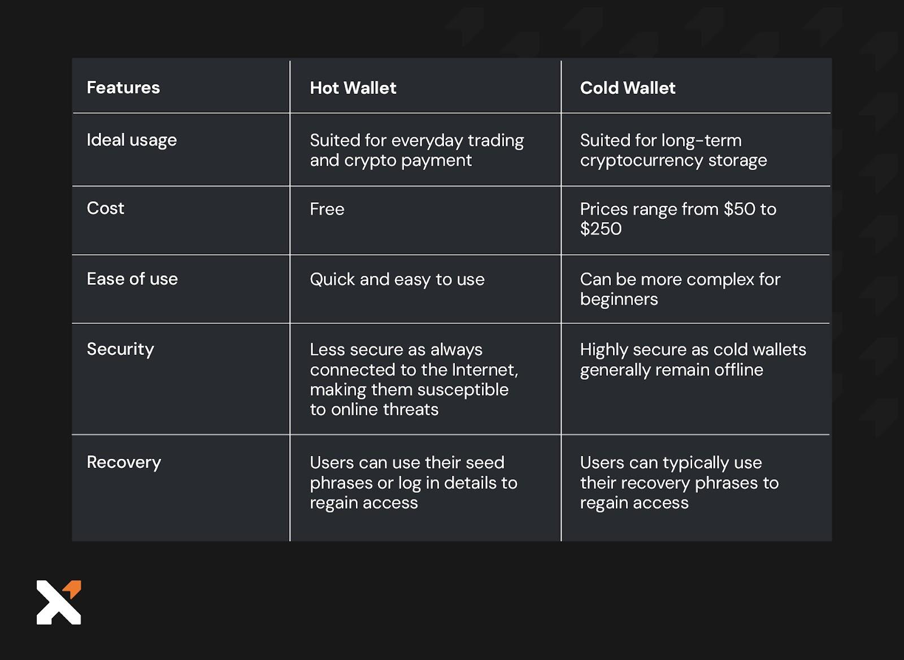

## Table of Contents

## What is a hot wallet?

A hot wallet is a type of digital wallet used to store cryptocurrencies that is connected to the internet. It is designed for easy and quick access to your digital money, making it convenient for everyday transactions and trading. You can think of it like a digital purse that you carry around and use whenever you need to buy something or move your money around.

However, because hot wallets are online, they can be more vulnerable to hacking and theft. It's like leaving your purse open in a crowded place; someone might try to take something from it. That's why it's important to use strong security measures, like two-factor authentication, and to only keep the amount of cryptocurrency in your hot wallet that you plan to use soon. For larger amounts, it's safer to use a cold wallet, which is not connected to the internet.

## How does a hot wallet differ from a cold wallet?

A hot wallet and a cold wallet are two different ways to store your cryptocurrencies. A hot wallet is connected to the internet, which makes it easy to use for buying things or trading. It's like having your money in a digital purse that you can quickly open and use whenever you need to. But because it's online, it can be more at risk of being stolen by hackers, so you need to be careful and use good security.

On the other hand, a cold wallet is not connected to the internet, which makes it much safer from hackers. It's like keeping your money in a safe at home. You can't use it as quickly as a hot wallet, but it's a good place to keep larger amounts of [cryptocurrency](/wiki/cryptocurrency) that you don't need to use right away. So, if you want to keep your money safe and don't mind waiting a bit to use it, a cold wallet is a good choice.

## What are the common types of hot wallets?

Hot wallets come in different forms, but some common ones are web wallets, mobile wallets, and desktop wallets. A web wallet is like a bank account you can access through a website. You can log in from any device with an internet connection, which makes it super easy to use. But because it's online all the time, it can be a bit riskier if the website gets hacked. A mobile wallet is an app on your phone. It's handy because you [carry](/wiki/carry-trading) your phone everywhere, so you can use your cryptocurrency anytime, anywhere. Just like a web wallet, it's online, so you need to be careful about security.

A desktop wallet is software you install on your computer. It's a bit safer than web and mobile wallets because it's not always connected to the internet, but you still need to be careful when you go online to use it. Each type of hot wallet has its own pros and cons, so it's important to pick the one that fits your needs and to always use strong security measures to keep your money safe.

## What are the primary uses of hot wallets?

Hot wallets are mainly used for everyday transactions and trading. They are easy to use because they are connected to the internet. This means you can quickly send and receive cryptocurrency whenever you need to. Whether you're buying something online, paying someone, or trading on a cryptocurrency exchange, a hot wallet makes it simple and fast. It's like using a digital wallet on your phone to pay for things at a store.

However, because hot wallets are online, they can be at risk of being hacked. So, people usually keep only the amount of cryptocurrency they need for daily use in their hot wallets. For example, if you're planning to buy some things over the next few days, you might keep just enough in your hot wallet for those purchases. This way, if something goes wrong, you won't lose a lot of money. It's all about balancing convenience with security.

## How do you set up a hot wallet?

Setting up a hot wallet is pretty easy and usually involves a few simple steps. First, you need to choose the type of hot wallet you want to use. There are web wallets, which you can access through a website, mobile wallets that you download as an app on your phone, and desktop wallets that you install on your computer. Once you've decided, go to the website or app store to download or sign up for the wallet. You'll usually need to create an account by entering your email address and choosing a strong password. Some wallets might also ask for additional information like your phone number for two-[factor](/wiki/factor-investing) authentication, which adds an extra layer of security.

After you've created your account, the next step is to set up your wallet. This usually involves generating a new wallet address where you can receive cryptocurrency. You'll be given a public address that you can share with others to receive payments, and a private key or seed phrase that you need to keep secret. This private key or seed phrase is super important because it's what lets you access and spend your cryptocurrency. Make sure to write it down and store it in a safe place. Once your wallet is set up, you can start sending and receiving cryptocurrency. Just remember to only keep the amount you need for daily use in your hot wallet to keep your money safe.

## What are the security risks associated with hot wallets?

Hot wallets are connected to the internet, which makes them easy to use but also more at risk of being hacked. Hackers might try to steal your cryptocurrency by breaking into the wallet's website or app. They can do this through methods like phishing, where they trick you into giving them your private key or seed phrase, or by finding weaknesses in the wallet's software. Because hot wallets are online all the time, they're like a target for these bad guys.

To keep your money safe, it's important to use strong security measures. Always use a strong and unique password for your hot wallet, and enable two-factor authentication if it's available. Be careful about where you click and what information you share online, because hackers can use tricks to get your private information. Also, only keep the amount of cryptocurrency in your hot wallet that you plan to use soon. For larger amounts, it's safer to use a cold wallet, which is not connected to the internet and much harder for hackers to reach.

## What are some best practices for securing a hot wallet?

To keep your hot wallet safe, start by using a strong, unique password. Make sure it's something hard to guess, with a mix of letters, numbers, and symbols. It's also really important to turn on two-factor authentication if your wallet offers it. This adds an extra step to log in, making it much harder for hackers to get into your wallet. Be careful about phishing scams too. These are tricks where hackers try to fool you into giving away your private key or seed phrase. Never share these with anyone, and always double-check the websites and emails you get to make sure they're from the real wallet service.

Another good practice is to keep only the amount of cryptocurrency in your hot wallet that you need for everyday use. If you have more, store it in a cold wallet, which is not connected to the internet and much safer. Regularly update your wallet software to protect against known security holes. Also, consider using a hardware security key for two-factor authentication, which is more secure than getting a code sent to your phone. By following these steps, you can enjoy the convenience of a hot wallet while keeping your money safe from hackers.

## How can you recover funds if a hot wallet is compromised?

If your hot wallet gets hacked, the first thing to do is to stop the hacker from taking more of your money. You can do this by moving any remaining cryptocurrency to a new, safe wallet. This means you need to act fast. If you have a backup of your private key or seed phrase stored safely, you can use it to access your funds and move them. It's like having a spare key to your house; if you lose the first one, you can still get in with the backup.

After you've moved your money to a new wallet, you should report the hack to the wallet service or the cryptocurrency exchange you use. They might be able to help you get some of your money back, especially if they have ways to track the stolen funds. It's also a good idea to change all your passwords and check your other accounts to make sure they're safe. Remember, the best way to avoid losing money is to use strong security from the start, but if something goes wrong, acting quickly can help you recover some of your funds.

## What are the transaction fees typically associated with hot wallets?

When you use a hot wallet to send or receive cryptocurrency, you usually have to pay a small fee. This fee is called a transaction fee, and it goes to the people who help process your transaction on the blockchain. The amount of the fee can change depending on how busy the network is and how fast you want your transaction to go through. If you want your transaction to be processed quickly, you might have to pay a higher fee. But if you're okay with waiting a bit longer, you can choose a lower fee.

Different hot wallets might also charge different fees for their services. Some wallets might have a fee for using their platform, while others might not charge anything at all. It's a good idea to check the fees before you start using a hot wallet so you know what to expect. Remember, even though the fees can seem small, they can add up if you're making a lot of transactions.

## How do different hot wallets compare in terms of features and security?

Different hot wallets have different features and levels of security. Web wallets, like those offered by cryptocurrency exchanges, are easy to use because you can access them from any device with an internet connection. They often have user-friendly interfaces and support a wide range of cryptocurrencies. However, they can be less secure because they're always online and might be targets for hackers. Mobile wallets, which you download as apps on your phone, are convenient because you can use them on the go. They usually have good security features like biometric authentication, but they're still connected to the internet, so you need to be careful. Desktop wallets, which you install on your computer, offer more control over your private keys and can be more secure than web and mobile wallets because they're not always online. But you still need to protect your computer from viruses and malware.

In terms of security, all hot wallets need strong passwords and two-factor authentication to keep your money safe. Some wallets, like hardware wallets that you can use with desktop software, offer even better security because they store your private keys offline. It's important to choose a wallet that fits your needs. If you want something easy to use for everyday transactions, a web or mobile wallet might be best. But if you're more concerned about security and don't mind a bit more work, a desktop wallet or a hardware wallet used with desktop software could be a better choice. Always keep only the amount of cryptocurrency you need for daily use in your hot wallet to minimize risk.

## What advanced security features do some hot wallets offer?

Some hot wallets come with advanced security features to keep your cryptocurrency safe. One common feature is multi-signature wallets, which need more than one private key to approve a transaction. This is like needing two or more people to sign off on a big decision, making it much harder for a hacker to steal your money. Another advanced feature is hardware security modules, which are special devices that store your private keys offline. This means your keys are not on the internet where hackers can find them, but you can still use your hot wallet to make transactions.

Some hot wallets also offer biometric authentication, like fingerprint or face recognition, to make sure only you can access your wallet. This adds an extra layer of security because it's much harder for someone else to use your wallet without your physical presence. Additionally, some wallets use encryption to protect your data while it's being sent over the internet, making it harder for hackers to intercept and steal your information. By using these advanced security features, you can enjoy the convenience of a hot wallet while keeping your cryptocurrency as safe as possible.

## How might future developments impact the use and security of hot wallets?

In the future, hot wallets could become even easier to use and more secure. New technology like better encryption and more advanced biometric authentication might make it harder for hackers to steal your money. Imagine being able to use your face or voice to unlock your wallet, making it almost impossible for someone else to get in. Also, new ways of confirming transactions, like using [artificial intelligence](/wiki/ai-artificial-intelligence) to spot unusual activity, could help stop fraud before it happens. These improvements would make hot wallets a safer choice for everyday use.

On the other hand, as technology grows, so do the tricks that hackers use. They might come up with new ways to break into hot wallets, even with all the new security measures. That's why it's important to keep learning about the latest security practices and always be careful with your private keys and seed phrases. Even with future developments, the basic rule will still be to only keep the money you need for daily use in your hot wallet and store the rest in a cold wallet for extra safety.

## References & Further Reading

[1]: Ledger. (n.d.). Wallets. Retrieved from https://www.ledger.com/

[2]: Trezor. (n.d.). Start. Retrieved from https://trezor.io/start/

[3]: Bergstra, J., Bardenet, R., Bengio, Y., & Kégl, B. (2011). ["Algorithms for Hyper-Parameter Optimization."](https://proceedings.neurips.cc/paper/2011/file/86e8f7ab32cfd12577bc2619bc635690-Paper.pdf) Advances in Neural Information Processing Systems 24.

[4]: ["Advances in Financial Machine Learning"](https://www.amazon.com/Advances-Financial-Machine-Learning-Marcos/dp/1119482089) by Marcos Lopez de Prado

[5]: ["Evidence-Based Technical Analysis: Applying the Scientific Method and Statistical Inference to Trading Signals"](https://www.amazon.com/Evidence-Based-Technical-Analysis-Scientific-Statistical/dp/0470008741) by David Aronson

[6]: ["Machine Learning for Algorithmic Trading"](https://github.com/stefan-jansen/machine-learning-for-trading) by Stefan Jansen

[7]: ["Quantitative Trading: How to Build Your Own Algorithmic Trading Business"](https://www.amazon.com/Quantitative-Trading-Build-Algorithmic-Business/dp/1119800064) by Ernest P. Chan