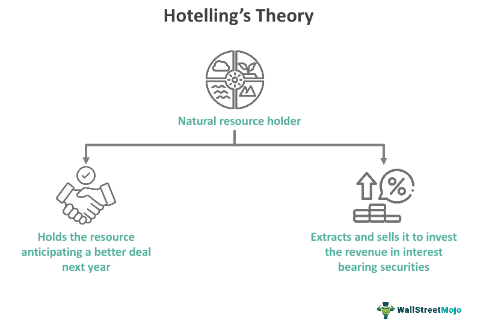

Hotelling's Theory is a foundational concept in economics that addresses the extraction and pricing of nonrenewable resources such as oil, minerals, and other finite commodities. Proposed by economist Harold Hotelling in 1931, this theory fundamentally explores how the scarcity and exhaustibility of these resources influence their market pricing over time. According to Hotelling's Rule, the net price of a nonrenewable resource (defined as the market price minus extraction costs) should rise at a rate equal to the interest rate. This principle reflects the opportunity cost associated with leaving a resource unextracted in the ground versus extracting and investing its proceeds at the prevailing interest rate.

The implications of Hotelling's Theory extend beyond economics. It also significantly impacts algorithmic trading, where understanding price dynamics and market efficiency is crucial. Traders utilize mathematical models that incorporate these economic principles to predict price movements and devise strategic trading decisions. Hotelling's Theory, therefore, provides a valuable framework for understanding the pricing trajectories of nonrenewable resources, which can inform pricing strategies and financial modeling in trading scenarios.



In this article, we will explore Hotelling's Theory's historical development and its relevance to today's economic and trading environments. We will examine its application in algorithmic trading and the potential insights it offers for predicting price movements, emphasizing its importance for traders and economists seeking to understand long-term market behavior and resource valuation. Understanding Hotelling's Theory offers critical insights that enhance strategic decision-making in trading and resource management.

## Table of Contents

## Understanding Hotelling's Theory

Hotelling's theory, introduced by economist Harold Hotelling in 1931, provides a fundamental framework for understanding the dynamics of extracting and pricing nonrenewable resources, such as oil, coal, and minerals. The core proposition of Hotelling's theory is that the price of a nonrenewable resource will rise over time at a rate equivalent to the interest rate. This reflects the opportunity cost of leaving resources in the ground rather than extracting and selling them today. The underlying premise is that resource owners aim to maximize the present value of their resource reserves.

Mathematically, Hotelling’s rule states that in an efficient market, the net price (market price minus extraction cost) of a resource should increase at the rate of interest. This can be expressed as:

$$
\frac{dP}{dt} = rP
$$

Where $P$ is the price of the resource, $t$ is time, and $r$ is the [interest rate](/wiki/interest-rate-trading-strategies).

This theory relies on the assumption of efficient markets, meaning that all available information is reflected in the current prices, allowing for accurate predictions of future price paths. In this framework, resource prices are expected to rise until the price at extraction equals the marginal cost of extraction plus the imputed interest on the capital value of the resource in situ. Owners must choose whether to extract and sell their resources now or in the future, considering anticipated price increases and prevailing interest rates. This decision-making process involves comparing the benefits of current extraction versus future opportunities.

The implications of Hotelling's theory are significant and extend beyond traditional economics. It informs strategic decisions regarding when and how much of a resource to extract, impacting both short-term operational planning and long-term resource management strategies. The theory suggests that if the interest rate is high, or if future price increments are expected to be large, resource extraction might be deferred to gain the benefits of higher future prices.

While the theory provides a robust conceptual model, it also simplifies real-world complexities by assuming factors like constant extraction costs, no technological change, and the absence of regulatory influences. These assumptions have led to various adaptations and extensions of the theory to better align it with observed market behaviors and fluctuations in resource prices. Nevertheless, Hotelling's theory remains a foundational concept in resource economics, offering insights that are crucial for understanding the valuation and strategic extraction of nonrenewable resources.

## Hotelling's Theory in Practice

Despite its theoretical elegance, empirical studies have highlighted significant discrepancies between Hotelling's predictions and actual market behavior. A 2014 study by the Federal Reserve Bank of Minneapolis emphasizes that practical challenges such as extraction costs, technological innovations, and regulatory constraints often impede the direct applicability of Hotelling's theory in real-world settings [1]. The theory, while foundational, assumes idealized conditions including perfect competition and no extraction costs, which seldom hold true in practice.

Real-world markets are influenced by a myriad of unaccounted factors leading to deviations from Hotelling's theoretical price paths. Technological advancements, for instance, can dramatically reduce extraction costs or introduce alternative resources, affecting resource prices in ways not predicted by the original model. Additionally, government policies and global economic conditions can lead to regulatory impacts that further disrupt expected pricing trajectories.

Moreover, market price dynamics are subject to speculative trading, geopolitical events, and sudden shifts in demand, which the original model does not account for. These complexities often cause actual price movements to diverge from the theoretically anticipated pathways. As a result, while Hotelling's model provides a useful framework for understanding the underlying principles of resource economics, it necessitates modifications and extensions to be fully applicable in contemporary markets.

Despite these discrepancies, Hotelling's theory remains a critical tool for economists and policymakers. It forms a theoretical backbone upon which more nuanced and complex models can be built. As markets continue to evolve, enriching the model with factors such as technological progress, substitution possibilities, and policy adjustments is crucial for improving its practical relevance and predictive power.

References:
[1] Federal Reserve Bank of Minneapolis. Economic Policy Papers, "Hotelling's Rule Revisited," 2014.

## Algorithmic Trading and Hotelling's Theory

Algorithmic trading has transformed the landscape of financial markets by employing mathematical models and sophisticated algorithms to execute trades with speed and precision. This form of trading harnesses predictive capabilities, including those found in Hotelling's Theory, to anticipate market trends and navigate the complexities of resource pricing, particularly concerning nonrenewable resources.

Hotelling's Theory, which posits that the price of nonrenewable resources will rise at a rate proportional to the interest rate, offers valuable insights for algorithmic traders. By integrating this theory into trading algorithms, traders can develop models that predict price movements of resource-related financial instruments. For instance, the expected future price $P(t)$ of a resource can be mathematically expressed as:

$$
P(t) = P_0 e^{rt}
$$

Where $P_0$ is the current price, $r$ is the interest rate, and $t$ is time. This relationship helps traders forecast future prices and assess whether current market prices reflect the underlying economic fundamentals. 

Algorithmic traders focusing on nonrenewable resource derivatives, such as oil futures or mineral extraction stocks, can utilize these insights to anticipate shifts and execute trades aligned with expected long-term price paths. By embedding Hotelling's principles into algorithms, traders can optimize investment strategies and hedge against potential market volatilities.

Moreover, the convergence of economic theory and algorithmic technology exemplifies a progressive approach to understanding and predicting financial market behavior. Algorithms equipped with Hotelling's insights can analyze vast data sets, enabling traders to spot [arbitrage](/wiki/arbitrage) opportunities, enhance portfolio diversification, and manage risks more effectively.

Overall, integrating Hotelling's Theory into [algorithmic trading](/wiki/algorithmic-trading) not only underscores a potent fusion of economic thought and technological advancement but also facilitates a deeper comprehension of market dynamics, leading to enhanced decision-making and strategic positioning in the financial markets.

## Extensions and Modern Adaptations

Economists have expanded Hotelling's Theory to better reflect the intricacies of modern markets, incorporating variables such as technological advancements, substitute products, and policy interventions. These extensions aim to address the limitations of the original model, which assumes static conditions and perfect foresight. For example, technological growth can influence the cost of extraction or develop alternatives to nonrenewable resources, affecting price paths in ways not initially considered by Hotelling.

Technological advancements are particularly influential. Innovations can reduce extraction costs or introduce alternative resources, thereby altering the supply dynamics of nonrenewable resources. As a result, prices may not strictly follow the trajectory predicted by the original theory, which assumed constant cost conditions. Incorporating these technological factors allows for a more nuanced prediction model, reflecting shifts in market behavior as technology evolves.

Policy influences are another critical [factor](/wiki/factor-investing) that modern adaptations integrate into Hotelling's Theory. Governmental policies, such as carbon taxes or subsidies for renewable energy, can also affect the market dynamics for nonrenewable resources. By altering costs or incentivizing alternative energy sources, such policies introduce additional layers of complexity that are essential for understanding actual market behaviors.

Modern models also account for market uncertainties and risk, which are critical in today’s volatile economic environment. By incorporating probabilistic approaches and risk assessments, these models can better predict the impacts of fluctuating economic conditions on resource pricing. Tools like stochastic modeling can thus refine predictions, allowing economists and traders to better anticipate potential deviations from expected price paths.

Python can be used to simulate such scenarios, employing libraries like NumPy and pandas to model the impacts of technological and policy changes on resource markets. For instance, one might use Monte Carlo simulations to assess the risk of various pricing scenarios under different technological and policy assumptions:

```python
import numpy as np

# Parameters for simulation
np.random.seed(42)
num_simulations = 1000
time_horizon = 30  # 30 years
initial_price = 100
annual_growth_rate = 0.03  # 3% annual growth
volatility = 0.2

# Simulation of price paths
price_paths = np.zeros((num_simulations, time_horizon))
price_paths[:, 0] = initial_price

for t in range(1, time_horizon):
    random_shock = np.random.normal(loc=annual_growth_rate, scale=volatility, size=num_simulations)
    price_paths[:, t] = price_paths[:, t - 1] * np.exp(random_shock)

average_price_path = price_paths.mean(axis=0)

# Output simulation result
average_price_path
```

Modern adaptations of Hotelling's Theory make it more robust and flexible, aligning theoretical models more closely with empirical observations. By considering uncertainties and adapting to technological and policy changes, these extensions provide a framework that is both practical and insightful for contemporary resource economics and trading strategies.

## Conclusion

Hotelling’s Theory continues to offer crucial insights into the pricing dynamics of nonrenewable resources. Its core premise—that resource prices increase at the rate of interest—serves as a foundational principle in understanding resource economics. This theory aids in strategic decision-making, particularly within algorithmic trading, where it helps forecast long-term price movements of commodities and informs trading strategies. Despite its simplifications, which include static interest rates and the absence of extraction costs, the theoretical framework remains invaluable in explaining why certain pricing trends occur under ideal conditions.

As economic models evolve, there is significant potential in integrating Hotelling's insights with advanced technology to enhance predictive accuracy and market efficiency. Modern computational tools, algorithmic trading platforms, and data analytics present opportunities to refine and expand upon the traditional Hotelling model. These advancements can incorporate dynamic variables such as technological innovation, policy changes, and varying market conditions, which Hotelling’s original formulation did not consider.

Ongoing research and empirical studies are essential in refining Hotelling's Theory for application in contemporary markets. These investigations may explore extending the theory to encompass uncertainty, risk models, and the impact of substitutes in resource availability. By addressing these aspects, researchers can adapt the theory to more accurately reflect current market dynamics and improve its predictive capacity.

Ultimately, balancing theoretical models with practical adaptations is key to leveraging Hotelling’s principles effectively in economic and trading contexts. This balance allows for a nuanced application that respects the theoretical underpinnings while accommodating real-world complexities. As both the economic landscape and technology continue to advance, the integration of Hotelling’s Theory into sophisticated trading and resource management systems will likely yield significant benefits in understanding and navigating the markets for nonrenewable resources.

## References & Further Reading

[1]: Hotelling, H. (1931). ["The Economics of Exhaustible Resources."](https://www.jstor.org/stable/1822328) Journal of Political Economy, 39(2), 137-175.

[2]: Slade, M. E., & Thille, H. (2009). ["Whither Hotelling: Tests of the Theory of Exhaustible Resources."](https://www.annualreviews.org/content/journals/10.1146/annurev.resource.050708.144223) International Handbook on the Economics of Energy, 109-133.

[3]: Cairns, R. D. (1994). ["Greenhouse Economics and the Theory of Exhaustible Resources."](https://www.sciencedirect.com/science/article/pii/S0301421513010707) Public Administration and Development, 14(4), 381-392.

[4]: Livernois, J. (2009). ["On the Empirical Significance of the Hotelling Rule."](https://www.researchgate.net/profile/John-Livernois/publication/31157211_On_the_Empirical_Significance_of_the_Hotelling_Rule/links/00463528f98391325e000000/On-the-Empirical-Significance-of-the-Hotelling-Rule.pdf) Review of Environmental Economics and Policy, 3(1), 22-41.

[5]: Farzin, Y. H. (1992). ["The Time Path of Scarcity Rent in the Theory of Exhaustible Resources."](https://www.semanticscholar.org/paper/THE-TIME-PATH-OF-SCARCITY-RENT-IN-THE-THEORY-OF-Farzin/d5b0b866c27a6c3b76cc877703d648d2ce9909a5) Energy Journal, 13(4), 165-183.