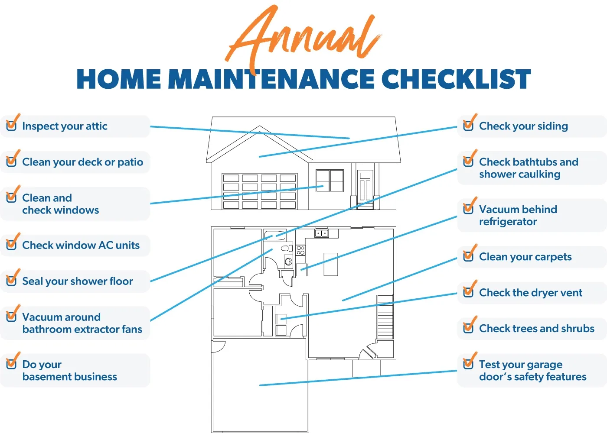

## Table of Contents

## What are the basic maintenance tasks every homeowner should know?

Every homeowner should know some basic maintenance tasks to keep their home in good shape. One important task is checking and changing the air filters in your heating and cooling system. Dirty filters can make your system work harder and use more energy. You should check them every month and change them every three months, or more often if you have pets or allergies. Another task is cleaning the gutters. Leaves and debris can clog them, causing water to back up and damage your roof or walls. Clean your gutters at least twice a year, in the spring and fall.

Another key maintenance task is checking for leaks. Look under sinks, around toilets, and near appliances like the washing machine and dishwasher. Small leaks can lead to big problems if not fixed quickly. Also, test your smoke and carbon monoxide detectors monthly to make sure they are working. Replace the batteries at least once a year. Finally, keep your home's exterior in good condition by checking the paint and caulking around windows and doors. Repaint and recaulk as needed to protect your home from the elements.

These simple tasks can help prevent costly repairs and keep your home safe and comfortable. By staying on top of basic maintenance, you can enjoy your home for many years to come.

## How often should routine maintenance be performed on a home?

Routine maintenance on a home should be done regularly to keep everything working well and to avoid big problems. Some tasks need to be done every month, like checking your air filters and testing your smoke and carbon monoxide detectors. You should change your air filters every three months, or more often if you have pets or if someone in your home has allergies. It's also a good idea to look for leaks under sinks and around appliances every month. Fixing small leaks quickly can save you a lot of money and trouble later.

Other tasks can be done less often but are still important. You should clean your gutters at least twice a year, in the spring and fall, to keep water flowing away from your home. Checking the paint and caulking around windows and doors should be done once a year. If you see any cracks or peeling, repaint or recaulk to protect your home from the weather. By doing these simple tasks on a regular schedule, you can keep your home in good shape and enjoy it for a long time.

## What tools are essential for basic home maintenance?

For basic home maintenance, you'll need a few simple tools. A good hammer is important for hanging pictures or fixing loose nails. A set of screwdrivers, both flathead and Phillips, will help you tighten screws and open things. A tape measure is useful for measuring spaces before you buy furniture or do any projects. Pliers are handy for gripping and twisting things, like when you're working on pipes or wires. A level helps you make sure things are straight when you hang them.

You'll also need some other tools for specific jobs. A wrench or adjustable wrench is good for tightening or loosening nuts and bolts, especially on plumbing. A utility knife can cut through different materials like cardboard or carpet. A ladder is important for reaching high places, like when you clean your gutters. A basic toolkit with these tools will help you take care of your home and fix small problems before they get big.

## How can you identify and fix common household leaks?

To find common household leaks, start by checking under sinks, around toilets, and near appliances like the washing machine and dishwasher. Look for wet spots, drips, or stains on the floor or walls. You can also listen for the sound of running water when everything should be off. Another way to find leaks is to check your water meter. Turn off all water in your home, then read the meter. Wait a few hours and read it again. If the numbers have changed, you have a leak somewhere. 

Once you find a leak, fixing it can be simple. For a dripping faucet, you might just need to replace a worn-out washer or O-ring. You can buy these at a hardware store and they're easy to install. For a leaking toilet, the problem might be a faulty flapper or fill valve. These parts are also easy to replace and can be found at most hardware stores. If you see a leak around a pipe, you can try tightening the connection with a wrench. If that doesn't work, you might need to replace a section of the pipe or call a plumber. By fixing leaks quickly, you can save water and prevent bigger problems.

## What are the signs that a home's HVAC system needs maintenance?

If your home's HVAC system needs maintenance, you might notice some signs. One sign is if your system is not keeping your home as warm or cool as it should. This could mean the system is working harder than it needs to, which can wear it out faster. Another sign is if your energy bills are higher than usual. This could mean your system is not working efficiently and is using more power. You might also hear strange noises coming from your HVAC system, like rattling or squeaking. These noises can mean something inside the system is loose or broken and needs to be fixed.

Another sign that your HVAC system needs maintenance is if it's blowing out dusty or dirty air. This can happen if the air filters are clogged and need to be changed. You might also notice that the system turns on and off more often than it used to. This is called short cycling and can be a sign that the system is not working right. If you see any of these signs, it's a good idea to call a professional to check your HVAC system. Regular maintenance can help keep your system running well and save you money in the long run.

## How do you maintain and clean different types of flooring?

To keep hardwood floors looking nice, you need to sweep or vacuum them often to get rid of dirt and dust. Use a soft broom or a vacuum with a hardwood floor setting so you don't scratch the wood. For cleaning, use a cleaner made for hardwood floors. Don't use too much water because it can damage the wood. Just dampen a mop or cloth with the cleaner and wipe the floor. If you have a spill, clean it up right away so it doesn't stain the wood. Every few years, you might need to refinish the floor to keep it looking new.

For carpet, vacuuming regularly is the best way to keep it clean. Do this at least once a week, or more if you have pets or a lot of people walking on it. For stains, use a carpet cleaner made for the type of stain you have. Blot the stain, don't rub it, to lift it out of the carpet. If you have a big stain or a lot of them, you might want to rent a carpet cleaner or hire a professional to clean the whole carpet. This can help keep your carpet looking good and lasting longer.

Tile and vinyl floors are easy to take care of. Sweep or vacuum them to get rid of dirt, then mop them with a cleaner made for the type of floor you have. For tile, you can use a grout cleaner to keep the lines between the tiles looking clean. Be careful not to use too much water on vinyl floors because it can get under the edges and cause problems. If you have a spill, clean it up quickly to avoid stains. Regular cleaning will keep your tile and vinyl floors looking good for a long time.

## What are the best practices for maintaining the exterior of a home?

To keep the outside of your home looking good, you need to take care of it regularly. Start by checking the paint on your house. If you see any peeling or cracking, it's time to repaint. Paint protects your home from the weather, so it's important to keep it in good shape. Also, look at the caulking around windows and doors. If it's cracked or missing, put in new caulking to keep water out. Clean your gutters at least twice a year, in the spring and fall, to make sure water can flow away from your home. If leaves and dirt build up in the gutters, it can cause water to back up and damage your roof or walls.

Another important thing to do is to check your roof. Look for any missing or damaged shingles and fix them right away. A good roof keeps your home dry and safe. Also, keep an eye on your yard. Trim trees and bushes so they don't touch your house, because they can cause damage over time. Make sure the ground slopes away from your home so water doesn't pool near the foundation. By doing these simple things regularly, you can keep the outside of your home in good shape and avoid big problems.

## How can you improve the energy efficiency of your home through maintenance?

To make your home use less energy, start by checking your air filters every month and changing them every three months. Dirty filters make your heating and cooling system work harder, which uses more energy. Also, look for any leaks around windows and doors. If you find any, use weatherstripping or caulk to seal them up. This keeps the warm or cool air inside your home and stops it from escaping. Make sure your home is well-insulated, too. Good insulation keeps your home at a comfortable temperature without using a lot of energy.

Another way to save energy is to take care of your appliances. Keep your refrigerator coils clean and make sure the door seals are tight. A clean refrigerator uses less power to keep your food cold. Also, set your water heater to a lower temperature, around 120 degrees Fahrenheit. This saves energy and still gives you hot water when you need it. By doing these simple maintenance tasks, you can make your home more energy-efficient and save money on your bills.

## What are the advanced techniques for maintaining home plumbing systems?

To keep your home's plumbing system in top shape, you can use some advanced techniques. One way is to use a drain snake or auger to clear clogs deep in your pipes. This tool can reach further than a plunger and can break up tough blockages. Another technique is to use a camera inspection to see inside your pipes. A plumber can put a small camera into your pipes to find problems like cracks, leaks, or tree roots. This helps you fix issues before they get worse. You can also use water jetting to clean your pipes. This method uses high-pressure water to blast away buildup and debris, making your pipes work better.

Another advanced technique is to install a water softener if you have hard water. Hard water can cause buildup in your pipes and appliances, which can lead to clogs and damage. A water softener removes minerals from the water, keeping your plumbing system in good condition. You can also use smart leak detectors that connect to your phone. These devices can alert you to leaks as soon as they happen, so you can fix them quickly and avoid big problems. By using these advanced techniques, you can keep your home's plumbing system working well and prevent costly repairs.

## How do you conduct a thorough inspection of your home's electrical system?

To check your home's electrical system, start by turning off the power at the main breaker. This keeps you safe while you look at the system. Then, open your electrical panel and look at the breakers and fuses. Make sure they are not loose or damaged. Check for any signs of burning or melting, which can mean there's a problem. Also, look at the wires inside the panel. They should be neat and not touching each other. If you see any wires that are frayed or loose, you should call an electrician to fix them.

Next, go around your home and check all the outlets and switches. Use a plug-in tester to see if the outlets are working right. If the tester shows any problems, like a reversed polarity or a ground fault, you need to fix it. Also, feel the outlets and switches to see if they are hot. If they are, it could mean there's too much electricity going through them. Check your light fixtures, too. Make sure they are not loose and that the bulbs are the right size. If you find any problems, it's best to call a professional electrician to make sure your home's electrical system is safe and working well.

## What are the professional standards for maintaining historical or heritage homes?

Maintaining historical or heritage homes requires special care to preserve their unique features and historical value. Professionals follow strict guidelines to ensure that any work done on these homes respects their original design and materials. This often means using traditional methods and materials that match what was used when the home was built. For example, if a home has old wooden windows, professionals might repair them instead of replacing them with modern ones. They also need to be careful not to damage any historic elements, like decorative moldings or original paint colors, during maintenance or repairs.

In addition to preserving the home's appearance, professionals also focus on keeping the home safe and functional. This can involve updating the electrical and plumbing systems to meet current safety standards, but doing so in a way that is hidden and does not alter the home's historical look. Regular inspections are important to catch any problems early and prevent damage. Professionals might use non-invasive techniques, like infrared scans, to check for issues without disturbing the home's structure. By following these standards, they can help ensure that historical and heritage homes remain both beautiful and livable for future generations.

## How can smart home technology be integrated to enhance home maintenance and functionality?

Smart home technology can make taking care of your home easier and more efficient. You can use smart devices to keep an eye on things like your heating and cooling system, lights, and even your security. For example, a smart thermostat can learn your schedule and adjust the temperature to save energy when you're not home. Smart lights can turn off automatically when you leave a room, and smart security cameras can let you see what's happening at home from your phone. These devices can send you alerts if something goes wrong, like a leak or a power outage, so you can fix it quickly.

Smart home technology also helps with everyday tasks. You can use a smart speaker to set reminders for things like changing your air filters or cleaning your gutters. Some smart devices can even do maintenance tasks for you. For example, a smart robot vacuum can clean your floors without you having to do anything. By using smart home technology, you can make your home more comfortable, save energy, and keep everything working well without a lot of effort.

## References & Further Reading

[1]: "Home Maintenance Tips: Major Tasks and The Seasonal Solutions," HouseLogic, https://www.houselogic.com/organize-maintain/home-maintenance-tips/why-home-maintenance-important/.

[2]: "Seasonal Home Maintenance Guide: Keep Your Home in Shape Year-Round," Zillow, https://www.zillow.com/home-maintenance-guide/.

[3]: "Algorithmic Trading," Investopedia, https://www.investopedia.com/terms/a/algorithmictrading.asp

[4]: Jansen, S. ("Machine Learning for Algorithmic Trading"), Packt Publishing, https://www.packtpub.com/product/machine-learning-for-algorithmic-trading-second-edition/9781839217715

[5]: Chan, E. P. ("Quantitative Trading: How to Build Your Own Algorithmic Trading Business"), Wiley, https://www.wiley.com/en-us/Quantitative+Trading%3A+How+to+Build+Your+Own+Algorithmic+Trading+Business-p-9781119800067

[6]: Aronson, D. ("Evidence-Based Technical Analysis: Applying the Scientific Method and Statistical Inference to Trading Signals"), Wiley, https://www.wiley.com/en-gb/Evidence+Based+Technical+Analysis:+Applying+the+Scientific+Method+and+Statistical+Inference+to+Trading+Signals-p-9780470008744