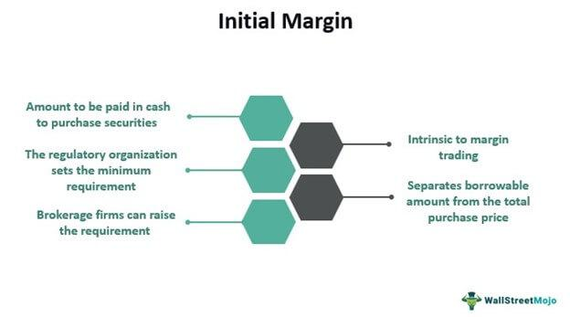

Maintaining your home and properties is essential to safeguard and enhance their value. This is not merely about the aesthetics or the immediate comfort it brings but is a critical component of ensuring the longevity and soundness of your investment. Home upkeep, house maintenance, and property care serve as the foundation for protecting what is often considered a person's most significant financial asset. 

Similar in nature yet apart in application, algorithmic trading (algo trading) offers intriguing parallels with home maintenance due to their focus on preventative strategies and proactive management. Algo trading involves using computer algorithms to manage and execute trades, rooted in meticulous planning and strategic foresight. This approach mirrors the planning involved in systematic property care, where regular assessments and timely interventions prevent small issues from becoming costly problems.



This article aims to explore the benefits that emerge from understanding and integrating principles of home maintenance with the systematic oversight found in algo trading practices. By drawing from these parallels, homeowners can not only protect their physical investments but may also find ways to optimize financial growth and stability. As we go through the essential components of property care, alongside the strategic foresight of algo trading, the goal is to recognize the interconnectedness and cross-disciplinary insights that can be applied to both realms successfully.

## Table of Contents

## The Importance of Home Upkeep and Property Care

Home maintenance plays a crucial role in not only ensuring the safety of a living environment but also in enhancing the functionality and extending the lifespan of the property. By engaging in regular upkeep, homeowners can circumvent the potential for costly repairs and preserve the aesthetic appeal of their residences. This preservation of appearance contributes significantly to the overall value of real estate, as homes that are well-maintained tend to attract higher valuations in the market [1].

One critical aspect of property care is the development and adherence to a planned schedule of maintenance activities. This schedule should take into account the seasonal variations that affect different components of a home, ensuring that each aspect is addressed at the optimal time. For instance, certain tasks such as checking the heating system or ensuring the integrity of insulation are better performed in the lead-up to winter, while tasks like air conditioning maintenance are more pertinent in the spring or early summer months.

Adopting a seasonal maintenance schedule has several benefits. Primarily, it enables homeowners to efficiently allocate resources to maintaining their properties, thus avoiding the pitfalls of reactive repairs. This pre-emptive approach is akin to a preventative strategy in risk management, designed to address potential issues before they manifest into significant problems. Additionally, such systematic property care can positively impact the value of real estate. Homes that are perceived as well-cared-for often fetch higher prices, and their marketability greatly improves [2].

By maintaining a routine inspection and maintenance schedule, property owners can ensure the longevity and resilience of their homes. This, in turn, safeguards the substantial financial investment that homeownership represents. Thus, understanding and implementing effective home maintenance strategies is fundamental to property value enhancement and preservation.

References:
1. "Home Maintenance Tips: Major Tasks and The Seasonal Solutions," HouseLogic, https://www.houselogic.com/organize-maintain/home-maintenance-tips/why-home-maintenance-important/.
2. "Seasonal Home Maintenance Guide: Keep Your Home in Shape Year-Round," Zillow, https://www.zillow.com/home-maintenance-guide/.

## House Maintenance Checklist: A Year-Round Guide

Every home requires maintenance tailored to its specific needs throughout the year. Regular and systematic care is essential to prevent minor issues from escalating, thereby protecting your investment and maintaining the optimal functionality of the property. Here is a comprehensive checklist to guide homeowners through the necessary tasks each season.

### Spring

**1. Gutter and Downspout Cleaning:** Clear debris from gutters and downspouts to prevent water damage and ensure proper drainage. This is crucial to avoid soil erosion and protect the foundation.

**2. Exterior Inspection:** Check the home's exterior for signs of damage. Look for cracks in the foundation, loose siding, and chipped paint. Repairing these early can prevent more extensive damage.

**3. HVAC System Check:** As the weather warms, it's crucial to have your HVAC system serviced. Replace filters and ensure the system is functioning efficiently before the summer months.

**4. Window and Door Repair:** Inspect and repair any caulking or weather-stripping to improve energy efficiency.

### Summer

**1. HVAC Maintenance:** Continue to monitor HVAC performance. Replace filters monthly to ensure even cooling and energy efficiency.

**2. Pest Control:** The summer heat can increase pest activity. Performing routine inspections for signs of infestations and addressing them promptly is essential.

**3. Deck and Patio Maintenance:** Wash, repair, and reseal decks to protect against summer sun exposure.

### Fall

**1. Gutter Cleaning:** Similar to spring, fall requires thorough gutter maintenance as leaves and other materials accumulate.

**2. Roof Inspection:** Examine the roof for damage or wear, replacing shingles as necessary to prepare for winter snow.

**3. Heating System Preparation:** Test heating systems and replace air filters to ensure they’re ready for increased use in colder months.

**4. Lawn Maintenance:** Rake leaves and aerate the lawn to prepare it for the dormant winter season.

### Winter

**1. Check for Drafts:** Inspect doors and windows for drafts, using solutions like draft guards or additional caulking if needed.

**2. Insulate Pipes:** Protect against freezing temperatures by insulating exposed pipes to prevent bursting.

**3. Fire Safety:** Check smoke detectors, carbon monoxide detectors, and GFCI/AFCI outlets. Replace batteries or devices as necessary.

**4. Snow Preparation:** Ensure tools and materials, such as shovels and salt, are ready for snow removal.

### Monthly Tasks

In addition to seasonal activities, certain tasks should be incorporated into a monthly maintenance routine to avoid future problems:

- **Inspect Water Leaks:** Check plumbing fixtures, including faucets and toilets, for leaks. Address them promptly to avoid mold or water damage.

- **Check HVAC Filters:** Regular monthly inspections and replacements can ensure your HVAC systems are running efficiently throughout the year.

- **Test GFCI/AFCI Outlets:** Ensure electrical safety by testing outlets and circuit breakers using the test buttons.

- **Examine Smoke and CO Detectors:** Regularly test and replace batteries as needed to ensure these life-saving devices are functional.

A systematic approach to home maintenance, akin to a well-managed investment portfolio, offers both immediate and long-term benefits. Implementing these checklists ensures the sustainability and value of one's property, allowing homeowners to focus on preventive measures rather than costly repairs.

## The Attraction of Algorithmic Trading in Home Finances

Algorithmic trading relies on sophisticated computer algorithms to execute trades, making investment decisions more efficient and precise. This approach follows set rules, analyzing market data in real-time and responding almost instantaneously to opportunities and risks. When we compare this to home finances, the parallels become evident in terms of strategic oversight and adaptability.

Much like a well-planned home maintenance schedule, [algorithmic trading](/wiki/algorithmic-trading) systems assess current conditions against predetermined criteria. This ensures both investments and properties remain in peak condition without succumbing to unexpected setbacks. For instance, a simple Python algorithm might be used to evaluate moving averages as a trading signal:

```python
def moving_average(data, n):
    return sum(data[-n:]) / n

def buy_or_sell(prices, short_term=5, long_term=20):
    short_avg = moving_average(prices, short_term)
    long_avg = moving_average(prices, long_term)

    if short_avg > long_avg:
        return "Buy"
    elif short_avg < long_avg:
        return "Sell"
    else:
        return "Hold"

# Example usage
prices = [30, 32, 31, 35, 36, 38, 40, 42, 43, 44, 45]
decision = buy_or_sell(prices)
print(f"Trade decision: {decision}")
```

Similarly, a homeowner might use a checklist to determine seasonal maintenance actions to perform, such as servicing HVAC systems or cleaning gutters before the onset of fall. This proactive approach, akin to rewriting algorithms to reflect market conditions, ensures that the property is not only well-maintained but also increases in value over time.

Strategic thinking is crucial in both domains. Whether configuring an algorithm with the right market indicators or planning home finances with the aid of budgeting tools and cost analysis, applying a systematic and informed perspective can optimize outcomes. By leveraging technology, such as using smart home devices to monitor energy usage or security systems, homeowners can manage their households with the same diligence and adaptability applied by algorithmic traders in the financial markets.

Ultimately, both algorithmic trading and home finances thrive under consistent strategic review and the ability to adjust to new information. Embracing these data-driven methodologies can not only streamline the operational aspects of managing finances but also cultivate a mindset that appreciates technological solutions and preemptive actions as key factors in safeguarding investments.

## Protecting Your Investment: House Maintenance vs. Algo Trading

Maintaining a home and utilizing algorithmic trading may appear distinct at first glance, but they converge on the common objectives of risk minimization and return maximization. Both activities require strategic oversight and a systematic approach to ensure that investments—whether in real estate or financial portfolios—are preserved and enhanced over time.

Home maintenance prioritizes the prevention of costly repairs by adhering to a regular schedule of inspections and repairs. Just as neglecting a leaky roof can result in extensive damage, ignoring minor issues in asset management can lead to significant financial losses. Algorithmic trading employs predefined criteria and mathematical models to execute trades automatically and respond to market changes. Similar to house maintenance checklists, these models operate on the principle that proactive and consistent management helps in anticipating and mitigating risks.

In both scenarios, the cost of inaction is high, making proactive management critical for stability. By routinely engaging in house maintenance, homeowners can prevent the gradual deterioration that could otherwise decrease property value and result in expensive repairs. For instance, regularly servicing HVAC systems and checking for leaks are essential practices that align with preventing more significant issues.

Algorithmic trading systems, too, are designed to minimize risk exposure through strategic data analysis and market predictions. By employing parameters that trigger automatic buy or sell actions based on market conditions, such systems can optimize the financial outcomes for investors. This mirrors how preventative home care ensures long-term asset integrity.

Ultimately, both house maintenance and algorithmic trading embody the essence of disciplined, preventative strategies aimed at securing stable and profitable returns. These practices, while operating in different domains, reinforce the principle that continuous oversight and systematic management are key to safeguarding and enhancing one's investment over time.

## Conclusion

By understanding and implementing effective home maintenance and drawing lessons from algorithmic trading, homeowners can significantly optimize their property's value. The process of regular home upkeep, much like the structured algorithms in trading, requires precision, foresight, and efficiency to prevent small problems from escalating into costly repairs. This preventive approach not only maintains but potentially enhances the real estate value over time.

The disciplined nature of month-by-month home checks offers a framework that can inspire more structured approaches in other areas of life, including financial management. Just as algorithmic trading relies on systematic data-driven decisions to mitigate risks and improve returns, a well-organized home maintenance schedule can ensure the longevity and functionality of a property.

Ultimately, the synergy of these disciplines provides a comprehensive strategy to safeguard your financial future while ensuring your home remains a haven. This integration of systematic analysis and proactive measures can lead to more informed decision-making, reduced stress, and enhanced stability in both property management and personal finances. Embracing such methods encourages a harmonious balance between maintaining physical assets and nurturing financial resilience.

## References & Further Reading

[1]: "Home Maintenance Tips: Major Tasks and The Seasonal Solutions," HouseLogic, https://www.houselogic.com/organize-maintain/home-maintenance-tips/why-home-maintenance-important/.

[2]: "Seasonal Home Maintenance Guide: Keep Your Home in Shape Year-Round," Zillow, https://www.zillow.com/home-maintenance-guide/.

[3]: "Algorithmic Trading," Investopedia, https://www.investopedia.com/terms/a/algorithmictrading.asp

[4]: Jansen, S. ("Machine Learning for Algorithmic Trading"), Packt Publishing, https://www.packtpub.com/product/machine-learning-for-algorithmic-trading-second-edition/9781839217715

[5]: Chan, E. P. ("Quantitative Trading: How to Build Your Own Algorithmic Trading Business"), Wiley, https://www.wiley.com/en-us/Quantitative+Trading%3A+How+to+Build+Your+Own+Algorithmic+Trading+Business-p-9781119800067

[6]: Aronson, D. ("Evidence-Based Technical Analysis: Applying the Scientific Method and Statistical Inference to Trading Signals"), Wiley, https://www.wiley.com/en-gb/Evidence+Based+Technical+Analysis:+Applying+the+Scientific+Method+and+Statistical+Inference+to+Trading+Signals-p-9780470008744