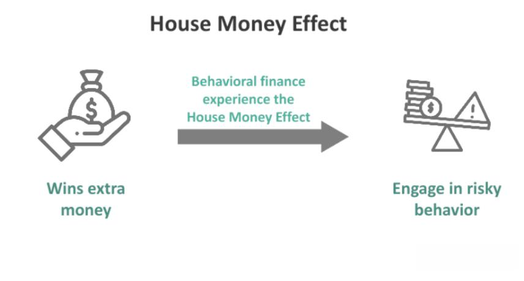

The world of investing transcends mere numbers and charts, deeply intertwining with human psychology. Behavioral finance, a field focusing on the psychological influences on investor decisions, offers valuable insights into why investors might deviate from logical and systematic decision-making. Within this context, one prominent concept is the House Money Effect, a psychological bias with significant implications for investing.

The House Money Effect elucidates the behavioral tendency among investors to adopt greater risks with profits than with their original capital. This effect, first introduced by Richard H. Thaler and Eric J. Johnson, draws parallels to behavior observed in casino gambling, where individuals show a propensity to gamble more freely with "house money" or previous winnings. Understanding this bias is crucial for investors as it impacts decision-making processes and risk management strategies.



The tendency to view profits as different from the principal capital is partly attributable to mental accounting, a concept in behavioral finance where individuals compartmentalize money into separate accounts based on subjective criteria. This can lead to distorted risk assessments, causing investors to make decisions that may deviate from their initial strategies. For example, winnings may be perceived as less of a loss if lost, leading to riskier behavior, a facet explained by the prospect theory.

In recent years, the intersection of behavioral psychology and technology has introduced algorithmic trading systems into financial markets. However, even these automated systems are not immune to the House Money Effect. During strategy development, designers may unconsciously adjust risk parameters following successful trades, reflecting the influence of this psychological bias.

By understanding the House Money Effect within the larger framework of behavioral finance, investors and trading professionals gain a comprehensive view of the underlying biases affecting decision-making. Recognizing and addressing these biases can enhance risk management practices, contributing to more rational and objective investment decisions that align with long-term financial goals. This article will explore the implications of the House Money Effect in these various contexts and consider strategies for mitigating its influence in the investment process.

## Table of Contents

## Understanding the House Money Effect

The House Money Effect is a prominent concept in behavioral finance that elucidates the propensity of investors to engage in riskier behavior with profits compared to their initial capital. This phenomenon was first explored by Richard H. Thaler and Eric J. Johnson, who drew analogies with behaviors observed in casino gambling, where individuals are more inclined to bet aggressively with money they have won, perceiving it as less valuable than their original stakes.

Psychologically, the House Money Effect can be attributed to a number of factors, including mental accounting—a term used to describe the cognitive process by which individuals categorize and treat money differently based on its origin or intended use. Mental accounting leads to segregating profits from the original investment, thereby fostering a sense of financial security or "cushion" which bolsters riskier choices. This perceived separation can distort risk assessment, as investors may underestimate potential losses from risking their profits, believing them to be separate and secondary to their initial investment.

Furthermore, the implications for investors are significant. The House Money Effect introduces bias in decision-making processes, leading to suboptimal trading strategies and potentially increased financial exposure. This tendency can result in broader market consequences, as such risk-taking behavior can contribute to heightened [volatility](/wiki/volatility-trading-strategies). Understanding the House Money Effect thus becomes crucial for both individual investors and financial institutions striving to enhance decision-making frameworks, manage risk more effectively, and construct sound investment strategies.

## Psychological Mechanisms Behind the House Money Effect

Prospect theory, developed by Daniel Kahneman and Amos Tversky, is instrumental in explaining the House Money Effect. This theory posits that individuals evaluate potential losses and gains differently, leading to decision-making that often contradicts traditional rational models. The House Money Effect emerges as people are more willing to take risks with their profits than with their original investment, due to several psychological mechanisms rooted in prospect theory and cognitive biases.

**Cognitive Biases and Differential Treatment of Profits and Capital**

The tendency to treat profits and the original investment differently is driven by a range of cognitive biases:

1. **Loss Aversion**: This is a key concept within prospect theory. Loss aversion suggests that losses loom larger than gains, compelling investors to avoid losses rather than acquiring equivalent gains. In the context of the House Money Effect, once an investor perceives profits as separate 'house money,' they may see potential losses from this money as being less impactful, encouraging riskier behavior. For example, if an investor initially invests $1,000 and makes a profit of $200, they might perceive losing the $200 as less painful than losing part of their initial capital, thus becoming more prone to risky investments with the $200.

2. **Mental Accounting**: This concept involves segregating money into different accounts mentally. Investors often compartmentalize their funds, treating profits as a separate category from their principal investment. Mental accounting fosters risk-seeking behavior with profits, as investors may justify riskier maneuvers from this mentally designated pool. This division is irrational from a financial perspective but profoundly influences decision-making.

3. **Overconfidence**: After achieving initial success, investors may develop overconfidence in their trading abilities, prompting them to take greater risks. This bias can amplify the House Money Effect as traders believe their past performance reduces future investment risks, leading to an escalation in their risk tolerance with perceived 'house money.'

The combination of these cognitive biases results in a skewed risk perception, wherein investors may disregard sound investment principles and become susceptible to making decisions that deviate from their original strategies. Understanding these biases is crucial for financial professionals aiming to design better strategies and for investors seeking to make more informed, rational decisions. Recognizing and addressing these psychological mechanisms can assist in mitigating the House Money Effect and its potential adverse impacts on investment outcomes.

## Implications of the House Money Effect in Algorithmic Trading

Algorithmic trading systems, widely utilized for their precision and speed, are affected by the House Money Effect, particularly during the development and tuning of trading strategies. Although these systems operate based on pre-set rules, the design and adjustment phases are often influenced by human biases. After a successful series of trades, designers may unconsciously become more inclined to adjust risk parameters, believing that accrued profits provide a buffer against losses. This belief aligns with the House Money Effect, where individuals become more risk-tolerant when dealing with gains rather than with their initial capital.

For instance, suppose an algorithm initially uses a risk [factor](/wiki/factor-investing) of 0.02, representing the portion of the portfolio exposed to a single trade. Following a profitable period, developers might instinctively increase this factor to 0.05, rationalizing that increased exposure could multiply gains further. However, this adjustment introduces additional risks that might not align with the original strategy, potentially leading to significant losses if market conditions change unfavorably.

To mitigate such biases, several strategies can be adopted. First, incorporating robust [backtesting](/wiki/backtesting) protocols can help ensure that strategy modifications remain within acceptable risk parameters. By simulating a wide range of market scenarios, developers can assess the performance of algorithmic adjustments without the influence of recent successes. Furthermore, parameter tuning can be automated based on data-driven criteria rather than subjective judgment.

Another effective measure is the implementation of automated monitoring systems, which can provide real-time feedback on the performance of trading algorithms. These systems can flag deviations from predefined risk benchmarks, prompting objective evaluations rather than emotionally driven decisions.

Python can be used to implement some of these safeguards. For instance, a simple script to monitor risk exposure might look like:

```python
def monitor_risk(portfolio, max_risk=0.03):
    """ Monitor portfolio risk to ensure it doesn't exceed max_risk parameter. """
    current_risk = calculate_portfolio_risk(portfolio)
    if current_risk > max_risk:
        alert("Risk threshold exceeded. Review trading algorithm settings.")

def calculate_portfolio_risk(portfolio):
    """ Placeholder for function to calculate portfolio risk exposure. """
    # Implementation depends on specific measures of risk used (e.g., Value at Risk, beta).
    pass

def alert(message):
    """ Send an alert to the developer or risk management team. """
    print(message)
```

Automation plays a crucial role in minimizing human-induced biases throughout the trading process. By relying on predefined algorithms and objective analysis, automation can help ensure that trading decisions are insulated from the emotional influences that can lead to irrational risk-taking. Developers must maintain a commitment to objective decision-making processes, leveraging technology and analytical tools to counteract the intuitive biases that underlie the House Money Effect.

## Behavioral Finance and Investment Strategies

Behavioral finance is a field that examines the impact of psychological influences and biases on the financial behaviors of investors and markets. It reveals how certain cognitive biases distort decision-making processes, leading individuals to deviate from rational investment strategies. One significant bias in this field is the House Money Effect, which explains why investors may alter their strategies based on perceived gains.

The House Money Effect suggests that investors treat profits differently from their original capital, often becoming more risk-seeking with gains. This can lead to deviations from initially sound investment strategies where investors, buoyed by a series of gains, might take undue risks, assuming they are playing with 'house money.' 

To manage this bias, disciplined risk management and adherence to pre-defined trading rules are crucial. Investors should implement stringent guidelines dictating when to take risks and when to stick to their original plans, regardless of short-term gains. Establishing stop-loss orders and using tools like trailing stops can prevent the undue escalation of risk-taking driven by the House Money Effect.

Examples abound in investing where individuals, feeling empowered by a series of wins, have shifted their strategies. An investor initially focused on conservative bonds might, after obtaining profits, switch to high-risk equities, only to realize later the extent of irresponsible risk exposure following a market downturn.

Implementing a diversified portfolio is another essential strategy to mitigate the effect over the long term. Diversification—spreading investments across various asset classes—ensures that the risk is distributed, and potential losses in one sector are offset by gains in another. For example, an investor can use Python to simulate the expected portfolio return and risk based on different scenarios, helping to plan and maintain a balanced portfolio. Here is a simple example using random data:

```python
import numpy as np
import pandas as pd

# Simulating portfolio returns
np.random.seed(42)
returns = np.random.randn(1000, 4)  # Simulate returns for four assets over 1000 periods
weights = np.array([0.25, 0.25, 0.25, 0.25])  # Assume equal distribution for simplicity

# Calculating the portfolio return and risk
portfolio_returns = np.dot(returns, weights)
portfolio_risk = np.std(portfolio_returns)

mean_return = np.mean(portfolio_returns)
print(f"Expected Portfolio Return: {mean_return:.2f}")
print(f"Portfolio Risk (Standard Deviation): {portfolio_risk:.2f}")
```

Embracing diversification helps resist the temptation to over-allocate funds to high-risk investments following successful trades. By maintaining a diverse mix of assets, investors can protect themselves from the biases highlighted by the House Money Effect, fostering more consistent and rational investment decision-making over time.

## Mitigating the House Money Effect in Investing

Awareness is essential in overcoming the influence of the House Money Effect on investment decision-making. This cognitive bias can cause investors to treat profits as "free money," leading to riskier financial behavior. Understanding and mitigating this effect is crucial for a disciplined approach to investing.

Education in behavioral finance principles can significantly aid investors in recognizing and challenging these biases. By studying various psychological factors, investors can become more aware of mental accounting, loss aversion, and overconfidence, all of which contribute to the House Money Effect. This knowledge enables investors to make informed decisions and reduce the emotional influences on their investment strategies.

Systematic trading approaches offer a robust method to minimize emotional biases in investing. By implementing predefined rules and criteria for buying and selling assets, investors can establish a disciplined strategy that counteracts impulsive changes driven by psychological biases. For example, a systematic approach might include setting strict criteria for profit-taking and stop-loss orders, which help maintain a consistent strategy regardless of perceived "house money."

Technology tools, such as robo-advisors, provide objective analysis and disciplined decision-making. These tools utilize algorithms to make investment decisions based on quantitative data rather than human emotion. Robo-advisors can help investors maintain a diversified portfolio and adhere to their long-term financial goals by removing the potential for emotional biases to skew investment choices.

Professional financial guidance is another effective measure to ensure adherence to strategy and mitigate the House Money Effect. Financial advisors can offer objective advice and help investors stick to their predefined strategies, even when profits are perceived as less risky. By collaborating with informed professionals, investors can manage risks more effectively and foster better long-term financial health.

In summary, mitigating the House Money Effect involves a multi-faceted approach that includes education, systematic trading methods, technology utilization, and professional guidance. By understanding and addressing these psychological biases, investors can make more rational decisions and optimize their investment strategies for long-term success.

## Conclusion

The House Money Effect is a significant psychological bias that fundamentally influences how investors approach risk and decision-making. Recognizing this effect is essential for developing strategies that promote rational investing behaviors. By acknowledging the tendency to treat profits differently from initial capital, investors can adjust their risk management approaches to ensure more consistent and prudent investment strategies. Engaging in disciplined approaches, such as adhering to predefined rules and maintaining consistent risk parameters, is crucial. Moreover, leveraging technology, such as [algorithmic trading](/wiki/algorithmic-trading) platforms and robo-advisors, can help minimize emotional biases and enhance objective decision-making. Additionally, seeking professional financial advice provides an external perspective that can be invaluable in making informed decisions. Ultimately, understanding and mitigating the House Money Effect allows investors to achieve long-term success by fostering rational, calculated, and disciplined financial decisions.

## References & Further Reading

[1]: Thaler, R.H., & Johnson, E.J. (1990). ["Gambling with the House Money and Trying to Break Even: The Effects of Prior Outcomes on Risky Choice."](https://papers.ssrn.com/sol3/papers.cfm?abstract_id=1424076) Management Science, 36(6), 643-660.

[2]: Kahneman, D., & Tversky, A. (1979). ["Prospect Theory: An Analysis of Decision Under Risk."](https://www.jstor.org/stable/1914185) Econometrica, 47(2), 263-292.

[3]: Tversky, A., & Kahneman, D. (1981). ["The Framing of Decisions and the Psychology of Choice."](https://psycnet.apa.org/record/1981-31998-001) Science, 211(4481), 453-458.

[4]: Barberis, N., & Thaler, R. (2003). ["A Survey of Behavioral Finance."](https://www.nber.org/papers/w9222) Handbook of the Economics of Finance.

[5]: Montier, J. (2007). ["Behavioural Investing: A Practitioner's Guide to Applying Behavioural Finance."](https://onlinelibrary.wiley.com/doi/book/10.1002/9781118673430) Wiley Finance.

[6]: Shefrin, H. (2000). ["Beyond Greed and Fear: Understanding Behavioral Finance and the Psychology of Investing."](https://academic.oup.com/book/27607) Harvard Business Review Press.