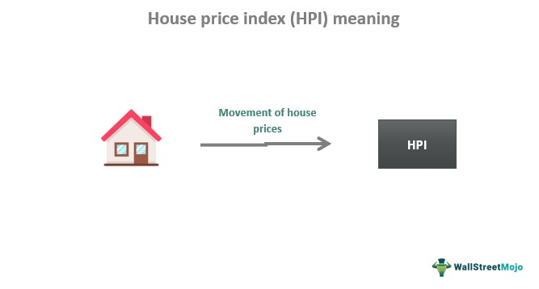

The House Price Index (HPI) is a valuable metric in the real estate market, offering insights into property value trends over time. It measures fluctuations in residential property prices, enabling stakeholders to understand market dynamics, assess investment opportunities, and evaluate economic conditions. By tracking these changes, investors and policymakers can make informed decisions that reflect the underlying economic environment and property market conditions.

Algorithmic trading in real estate represents a burgeoning area of interest, characterized by the use of computer algorithms to execute trading strategies. Traditionally focused on financial markets, algorithmic trading is now applied to real estate, reflecting the sector's growing emphasis on data-driven decision-making. The ability of algorithms to analyze vast datasets accurately and execute decisions swiftly offers significant advantages in market efficiency and responsiveness.



This article aims to explore the intersection between the House Price Index and algorithmic trading, providing insights into how HPI can enhance trading strategies. As the real estate market becomes increasingly data-centric, the integration of HPI into algorithmic models holds the potential to revolutionize investment strategies by improving predictive accuracy and aligning with market trends.

Data-driven decisions in real estate investments are becoming increasingly essential as market participants seek to leverage trends and capitalize on emerging opportunities. With vast amounts of data available, including property prices, economic indicators, and demographic trends, decision-makers can harness this information to develop strategies that optimize returns and manage risks.

The discussion that follows will focus on the development and implementation of HPI-driven algorithmic trading strategies. These strategies can transform the way investments are approached, offering enhanced tools for analyzing markets and predicting movements. By focusing on this integration, the article will provide valuable insights for investors and developers keen to stay ahead in a competitive and rapidly evolving real estate landscape.

## Table of Contents

## Understanding the House Price Index (HPI)

The House Price Index (HPI) is a critical measure in the real estate sector, reflecting changes in the price of residential properties over time. It serves as a barometer for the health and trajectory of the housing market. The core components of HPI include a base index value, reference period, and datasets comprising housing price transactions. Primarily, the index is designed to track price fluctuations in a specific housing market, which is usually expressed in percentage terms relative to a base year.

The methodology for calculating HPI typically involves several statistical techniques and relies substantially on high-quality data sources. Sources often include land registries, financial institutions, and government bodies that record property transactions. The general principle behind the calculation involves stratification and hedonic regression models. In stratification, data is divided into different homogeneous groups based on characteristics such as location, size, and property type, allowing for more precise tracking of prices. Hedonic regression models involve the decomposition of house prices into identifiable attributes, which helps in capturing the inherent value characteristics of the properties beyond mere transactional data.

The House Price Index plays a vital role in monitoring and predicting real estate market trends. By providing a historical track record of price movements, HPI allows for the analysis of long-term trends, cyclical fluctuations, and potential market bubbles or downturns. This index is a crucial tool for both investors and policymakers. For investors, HPI serves as a guide for strategic decisions, aiding in identifying promising investment opportunities and assessing risk. Policymakers use HPI to make informed decisions regarding monetary policy, housing regulations, and economic forecasting. The index helps in recognizing regional disparities and targeting policy interventions accordingly.

Regional variations in the HPI are significant, given that housing markets are heavily influenced by local factors such as economic conditions, population growth, and supply constraints. These variations can manifest as differences in housing appreciation rates across regions or cities within the same country. Regional disparities have critical implications; they can guide regional policy adjustments and affect national economic strategies. For investors, understanding these variations is essential for optimizing portfolio diversification and managing location-specific risks.

In conclusion, the House Price Index is an indispensable tool in the real estate domain, offering a comprehensive overview of market dynamics. It supports robust analytical insights, facilitates informed decision-making, and helps preempt future market shifts.

## Algorithmic Trading in the Real Estate Market

Algorithmic trading refers to the use of computer algorithms to automatically execute trades based on predefined criteria and market data. Originally popular in financial markets such as equities, futures, and [forex](/wiki/forex-system), this approach is gaining traction in real estate, transforming how properties are bought, sold, and valued.

Adapting algorithms for the real estate market involves accommodating the unique characteristics of real estate assets, which are less liquid and more heterogeneous than stocks or bonds. Algorithms in real estate trading analyze large datasets to identify patterns and predict price movements. This application is particularly relevant for real estate investment trusts (REITs) and other institutions that require swift, data-informed decision-making.

Many types of algorithms are utilized in real estate trading. Trend following algorithms identify historic price trends and attempt to predict future movements. This is captured in Python with a simple moving average (SMA) crossover strategy:

```python
def SMA_crossover(prices, short_window=20, long_window=50):
    short_SMA = prices.rolling(window=short_window).mean()
    long_SMA = prices.rolling(window=long_window).mean()
    signals = (short_SMA > long_SMA).astype(int)
    return signals
```

Machine learning models are also employed to analyze complex datasets, identifying market patterns that might not be visible through traditional methods. For example, regression models can be used to predict future price indices based on variables such as interest rates, economic conditions, and historical price data. 

Key benefits of [algorithmic trading](/wiki/algorithmic-trading) in real estate include speed and accuracy. Algorithms can process vast amounts of data in real-time, offering investment opportunities before human traders can react. This enhanced capability for rapid decision-making is crucial in a market that may experience sudden price shifts.

However, algorithmic trading in real estate faces challenges. Data quality is paramount; inaccurate or incomplete data can lead to incorrect trading decisions. Additionally, real estate markets are subject to [volatility](/wiki/volatility-trading-strategies) and are influenced by factors such as economic policy changes and geopolitical events, making it difficult to develop algorithms that consistently perform well under varying conditions.

In summary, while algorithmic trading offers significant advantages in terms of efficiency and precision, its implementation in real estate must carefully consider the nuances of the market and the quality of the data utilized. As technology advances, these algorithms are poised to play an increasingly vital role in shaping real estate investment strategies.

## Integrating HPI with Real Estate Algorithmic Trading

Integrating House Price Index (HPI) data into algorithmic trading models in real estate presents a promising method to enhance the accuracy and efficiency of market predictions. The HPI, serving as a crucial indicator of property market trends, can significantly augment algorithmic performance by providing historical and current data on price fluctuations across regions and time periods.

To implement HPI data effectively within trading algorithms, one must first ensure access to reliable datasets. These often include geographical breakdowns of house prices over time and are generally procured from real estate statistical bureaus or financial databases. The integration process begins by feeding this data into [machine learning](/wiki/machine-learning) models that thrive on historical patterns to predict future trends. Feature engineering is critical here—aspects such as seasonality, regional economic indicators, and [interest rate](/wiki/interest-rate-trading-strategies) changes might also be incorporated alongside the HPI to robustly model price dynamics.

### Enhancing Predictive Accuracy

HPI data can improve predictive accuracy by serving as an anchor point for algorithms to detect price trends. For instance, a common technique involves using regression models to forecast price movements. Algorithms might leverage the formula:

$$
\text{Price Forecast} = \alpha + \beta_1 \times \text{HPI} + \beta_2 \times \text{GDP Growth} + \beta_3 \times \text{Interest Rate} + \ldots + \epsilon
$$

where $\beta_1, \beta_2,$ and $\beta_3$ are coefficients determined through training that reflect the impact of each variable on house price predictions.

### Trading Strategies Leveraging HPI

An example of a strategy using HPI is mean reversion. This strategy assumes that prices will revert to their historical averages over time. By analyzing HPI data, algorithms can identify when the current market price deviates significantly from historical norms, triggering buy or sell decisions. For instance, if an HPI spike suggests an overheated market, the algorithm might predict a downturn, recommending short positions on real estate assets or related equities.

### Successful Case Studies

There are noteworthy examples where integrating HPI into trading algorithms has proven successful. Real estate investment trusts (REITs) and hedge funds have employed these methods to capitalize on market inefficiencies. A cited case involves a fund achieving substantial gains by using a [neural network](/wiki/neural-network) model, which integrated HPI data for regional property markets to accurately predict shifts in asset values and allocate resources dynamically.

### Risks and Pitfalls

Despite the advantages, potential risks include data incompleteness and quality issues, which can skew predictions. Market volatility presents another challenge; unexpected economic changes can render HPI-based predictions less reliable. Furthermore, overfitting is a concern, where algorithms become too tailored to historical data, limiting their performance on unseen data. To mitigate these, robust cross-validation methods and the incorporation of diverse datasets are recommended.

In summary, while integrating HPI into real estate algorithmic trading models offers the potential for more strategic and data-driven investment decisions, careful consideration of data quality and model robustness is essential to navigate inherent challenges effectively.

## Future Trends and Developments

Emerging technologies, particularly [artificial intelligence](/wiki/ai-artificial-intelligence) (AI) and big data, are playing a pivotal role in reshaping how House Price Index (HPI) and algorithmic trading strategies are developed and executed in the real estate market. AI, with its ability to analyze vast amounts of data quickly, offers unprecedented insights into HPI by enabling more precise predictions of market trends. Machine learning algorithms, a subset of AI, can process historical data, identify patterns, and make predictions with improved accuracy. Big data enhances these capabilities further by providing a comprehensive pool of information, including social media insights, economic indicators, and consumer behaviors, which can be integrated into algorithmic models to refine HPI metrics and trading decisions.

Economic and policy changes also have significant implications for HPI and algorithmic trading. Fluctuations in interest rates, for example, can impact housing demand and supply, altering HPI values. Policy decisions affecting real estate taxation, housing subsidies, or zoning laws may influence market behavior, providing new variables for algorithmic models to consider. Future developments in algorithmic trading are likely to focus on real-time data integration, allowing algorithms to adjust to economic and policy shifts dynamically.

As technology advances, real estate algo trading is expected to evolve with more sophisticated analytical models. Innovations such as quantum computing could further speed up data processing, enabling even more complex algorithms to be applied to HPI data. Investors and developers can leverage these trends by adopting data-driven strategies that improve risk management and capitalize on emergent opportunities in a rapidly changing market.

However, with these advancements come ethical and regulatory considerations. The use of personal data in building predictive models must respect privacy laws and ethical standards. Regulatory bodies may need to establish frameworks to govern how AI-driven trading is conducted to ensure transparency and fair market practices. Moreover, while algorithms can enhance decision-making, they can also exacerbate market volatility if not correctly managed. Thus, continual oversight will be necessary to balance innovation with market stability, ensuring that the integration of HPI with algorithmic trading contributes positively to the real estate sector.

## Conclusion

Understanding the House Price Index (HPI) is paramount in the analysis of the real estate market. HPI serves as a robust metric that encapsulates the price movements of residential properties over time, offering invaluable insights into market trends and economic health. It is an essential tool for investors and policymakers alike, guiding decisions and strategies by providing a clear picture of housing market dynamics.

Integrating HPI with algorithmic trading strategies offers significant advantages by enhancing predictive accuracy and enabling more informed investment decisions. Algorithmic trading, known for its speed and precision, stands to benefit greatly from the granular data provided by HPI. By incorporating HPI data into algorithms, traders can identify trends and potential market shifts more accurately, thereby optimizing their trading strategies and outcomes. This synthesis of index data with algorithmic systems paves the way for more effective and precise real estate investment approaches.

The potential for data-driven approaches, such as HPI-algorithm integration, to revolutionize real estate investments is immense. As the industry increasingly adopts cutting-edge technologies like artificial intelligence, machine learning, and big data analytics, the ability to process and analyze vast amounts of information will radically transform investment strategies. These advanced methodologies provide investors with deeper insights and more predictive power, reshaping traditional investment paradigms and unlocking new opportunities in real estate.

Therefore, staying informed about the integration of HPI and algorithmic trading strategies is crucial for investors seeking to capitalize on these technological advancements. By understanding and implementing these innovative approaches, investors can maintain a competitive edge and maximize their returns in a rapidly evolving market.

As the landscape of real estate markets and technology continues to evolve, it is imperative to remain adaptable and forward-thinking. The intersection of data analytics, algorithmic trading, and traditional real estate investing heralds a new era, one in which the strategic integration of information and technology will be the cornerstone of success. As these fields advance, the potential for significant gains and transformative shifts in real estate investment strategies will undoubtedly follow.

## References & Further Reading

[1]: Pettinger, T. (2019). ["House Price Index (HPI) Explained."](https://www.wallstreetmojo.com/house-price-index-hpi/) Economics Help.

[2]: Case, K. E., & Shiller, R. J. (1989). ["The Efficiency of the Market for Single-Family Homes."](https://www.jstor.org/stable/1804778) The American Economic Review.

[3]: ["Advances in Financial Machine Learning"](https://www.amazon.com/Advances-Financial-Machine-Learning-Marcos/dp/1119482089) by Marcos Lopez de Prado.

[4]: Burnside, C., Eichenbaum, M., & Rebelo, S. (2016). ["Understanding Booms and Busts in Housing Markets."](https://www.nber.org/papers/w16734) Economic Policy.

[5]: ["Machine Learning for Algorithmic Trading"](https://github.com/PacktPublishing/Machine-Learning-for-Algorithmic-Trading-Second-Edition) by Stefan Jansen.