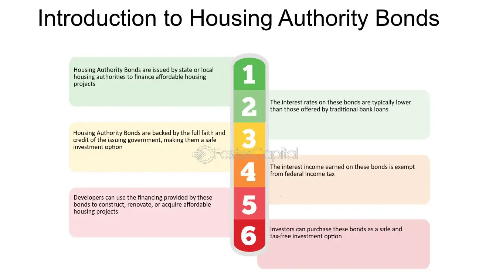

## Table of Contents

## What are Housing Authority Bonds?

Housing Authority Bonds are a type of bond issued by local or state housing authorities to raise money for building or improving affordable housing. These bonds help provide homes for people who might not be able to afford them otherwise. When someone buys a Housing Authority Bond, they are lending money to the housing authority. In return, the housing authority promises to pay back the money with interest over time.

These bonds are often seen as a safe investment because they are backed by the government. This means that the government helps make sure the bonds are paid back. Investors like these bonds because they can earn a steady income from the interest payments. At the same time, the money from the bonds helps build more homes for people who need them, making it a win-win situation for both investors and the community.

## Who issues Housing Authority Bonds?

Housing Authority Bonds are issued by local or state housing authorities. These are special government agencies that work to provide affordable homes for people. When a housing authority needs money to build or fix up homes, they can issue these bonds. People or organizations buy the bonds, and this gives the housing authority the money they need.

The housing authority then uses the money to build or improve housing for people who can't afford expensive homes. Over time, the housing authority pays back the money to the people who bought the bonds, plus some extra money called interest. This makes the bonds a good way for the housing authority to get money for housing projects, and it also gives people a safe way to invest their money.

## What is the purpose of Housing Authority Bonds?

Housing Authority Bonds are used to help build or fix up homes for people who can't afford to buy expensive houses. When a housing authority needs money for these projects, they issue bonds. People or organizations buy these bonds, and the money they pay goes to the housing authority to use on housing projects.

Once the housing authority gets the money from selling the bonds, they can start building or improving homes. Over time, they pay back the money to the people who bought the bonds, along with some extra money called interest. This way, the housing authority can help people find homes they can afford, and the people who bought the bonds get their money back with a little extra.

## How are Housing Authority Bonds funded?

Housing Authority Bonds are funded by people or organizations who buy them. When a housing authority wants to build or fix up homes for people who can't afford expensive houses, they issue these bonds. People or groups then buy the bonds with their money, and this gives the housing authority the funds they need for their projects.

Once the housing authority gets the money from selling the bonds, they use it to start building or improving homes. Over time, they pay back the money to the people who bought the bonds, plus some extra money called interest. This way, the housing authority can help people find homes they can afford, and the people who bought the bonds get their money back with a little extra.

## What are the different types of Housing Authority Bonds?

Housing Authority Bonds can be split into two main types: general obligation bonds and revenue bonds. General obligation bonds are backed by the full faith and credit of the issuing housing authority. This means the housing authority promises to use all its resources, like taxes or other money, to pay back the bondholders. These bonds are seen as safer because the government supports them, and they often have lower interest rates.

Revenue bonds, on the other hand, are paid back using money earned from the housing projects themselves. This could be from rent paid by people living in the homes or other income related to the project. Because these bonds depend on the success of the housing project, they can be riskier than general obligation bonds. But they might offer higher interest rates to attract investors. Both types help housing authorities get the money they need to build or fix up homes for people who need them.

## What are the benefits of investing in Housing Authority Bonds?

Investing in Housing Authority Bonds can be a good choice for people who want a safe way to earn money. These bonds are backed by the government, which means they are less risky than other types of investments. When you buy a Housing Authority Bond, you are lending money to a housing authority, and they promise to pay you back with interest. This steady income can be very helpful, especially for people who want to make sure they have money coming in regularly.

Another benefit is that by investing in these bonds, you are helping to build or fix up homes for people who can't afford expensive houses. This makes a big difference in the community because it helps more people find a place to live. So, not only can you earn money from the interest, but you also get to feel good knowing you are helping others. It's a win-win situation for both the investor and the community.

## What are the risks associated with Housing Authority Bonds?

Even though Housing Authority Bonds are seen as safe investments because they are backed by the government, there are still some risks to think about. One risk is that the housing authority might have trouble paying back the money they borrowed. This could happen if the housing projects don't bring in enough money or if the authority runs into financial problems. If this happens, it might take longer to get your money back, or you might not get all the interest you were promised.

Another risk is that interest rates might go up after you buy the bond. If this happens, newer bonds might offer higher interest rates, making your bond less valuable. This is called interest rate risk. You might have to sell your bond for less than you paid for it if you need your money back before the bond matures. So, even though Housing Authority Bonds are generally safe, it's important to know these risks before you decide to invest.

## How do Housing Authority Bonds impact the housing market?

Housing Authority Bonds help the housing market by giving housing authorities the money they need to build or fix up homes for people who can't afford expensive houses. When a housing authority sells these bonds, they get money from people or organizations who buy them. The housing authority then uses this money to start new housing projects or improve old ones. This means more homes become available for people who need them, which can help make housing more affordable in the area.

These bonds also help keep the housing market stable. Because the bonds are backed by the government, they are seen as safe investments. This can attract more investors to the housing market, which can lead to more money being put into housing projects. When more money is invested in housing, it can help build more homes and improve the overall quality of housing in the community. So, Housing Authority Bonds not only help people find homes they can afford but also make the housing market stronger and more stable.

## What is the tax treatment of Housing Authority Bonds?

The interest you earn from Housing Authority Bonds is usually not taxed by the federal government. This means you don't have to pay federal taxes on the money you make from these bonds. This can be a big plus for investors because it means you get to keep more of the interest you earn. However, you might still have to pay state or local taxes on the interest, depending on where you live and the rules in your area.

Some Housing Authority Bonds might be taxable, though. These are called "taxable bonds," and the interest you earn from them is taxed just like other income. It's important to check if the bond you're thinking about buying is tax-free or taxable. Knowing this can help you decide if the bond is a good investment for you, based on how much you'll have to pay in taxes.

## How can one invest in Housing Authority Bonds?

To invest in Housing Authority Bonds, you can start by contacting your local or state housing authority. They can tell you about the bonds they have available and how you can buy them. You might also be able to buy these bonds through a bank or a broker. They can help you with the process and give you advice on which bonds might be good for you. Another way to invest is through a bond fund that includes Housing Authority Bonds. These funds let you invest in a mix of different bonds, which can help spread out your risk.

Once you decide to invest, you'll need to think about how much money you want to put into the bonds and how long you want to keep your money invested. Housing Authority Bonds usually pay back the money you invest over a set period of time, like 10 or 20 years. You'll get interest payments along the way, which can be a steady source of income. It's a good idea to talk to a financial advisor before you invest, so they can help you understand all the details and make sure it's a good choice for you.

## What are the legal and regulatory considerations for Housing Authority Bonds?

Housing Authority Bonds are subject to many rules and laws that make sure they are used correctly and that people who buy them are protected. These bonds are often issued under rules set by the government, like the U.S. Department of Housing and Urban Development (HUD). The housing authority has to follow these rules when they issue the bonds, including how they can use the money and how they report what they do with it. There are also rules about who can buy the bonds and how they are sold, to make sure everything is fair and open.

Another important part of the legal and regulatory framework for Housing Authority Bonds is the tax rules. Most of these bonds are tax-exempt, which means you don't have to pay federal taxes on the interest you earn. But there are strict rules about what makes a bond tax-exempt, and the housing authority has to make sure they follow these rules. If they don't, the bonds might lose their tax-exempt status, which could be a problem for investors. It's also important for investors to know the rules in their own state or local area, because they might still have to pay state or local taxes on the interest.

## How do Housing Authority Bonds compare to other municipal bonds?

Housing Authority Bonds are a type of municipal bond, but they have some special features. Both Housing Authority Bonds and other municipal bonds are issued by government agencies, like cities or states, and they are often used to raise money for public projects. Housing Authority Bonds are used to build or fix up homes for people who can't afford expensive houses. Other municipal bonds might be used for things like building schools, roads, or hospitals. Both types of bonds can be tax-free, which means you don't have to pay federal taxes on the interest you earn, but you need to check the rules for each bond to be sure.

One big difference is that Housing Authority Bonds are backed by the housing authority, which means they are often seen as safe because they have government support. Other municipal bonds can also be safe, but their safety depends on the project they are funding and the financial health of the issuing agency. For example, general obligation bonds are backed by the full faith and credit of the issuing government, while revenue bonds depend on money made from the project itself, like tolls from a bridge. So, Housing Authority Bonds are a special kind of municipal bond that focus on helping people find affordable homes, while other municipal bonds can be used for a wider range of public projects.

## What are the risks and considerations?

Housing bonds and municipal finance authority bonds present various risks that investors and stakeholders must carefully evaluate. A fundamental understanding of these risks can aid in making informed investment decisions and developing effective risk mitigation strategies.

Interest rate risk is a primary concern for both housing bonds and municipal finance authority bonds. These bonds, typically having long maturities, are particularly sensitive to changes in interest rates. An increase in interest rates generally results in a decrease in the price of existing bonds, making them less attractive to investors seeking current market rates. This inverse relationship can be expressed mathematically as:

$$
\Delta P \approx -D \times \Delta y
$$

where $\Delta P$ is the change in bond price, $D$ is the duration of the bond, and $\Delta y$ is the change in yield. As duration represents the bond's sensitivity to interest rate changes, bonds with higher durations are more vulnerable to interest rate fluctuations.

Credit risk is another intrinsic [factor](/wiki/factor-investing) affecting housing bonds and municipal finance authority bonds. This risk pertains to the possibility that the bond issuer might default on interest or principal payments. Credit risk is typically assessed through credit ratings assigned by agencies such as Moody's or Standard & Poor's. These ratings provide insights into the creditworthiness of the bond issuer, with lower ratings indicating higher credit risk.

Algorithmic trading introduces unique risks, especially when applied to municipal bonds, including housing bonds. A critical challenge within algorithmic trading is the risk associated with high-frequency trading ([HFT](/wiki/high-frequency-trading-strategies)). While HFT can enhance market liquidity and price efficiency, it also poses risks such as market volatility and flash crashes, which stem from the rapid execution of large volumes of orders in short durations.

Moreover, algorithmic trading strategies may exacerbate systemic risks. Algorithms designed without adequate [backtesting](/wiki/backtesting) or stress testing could behave unpredictably under atypical market conditions, leading to significant market disruptions. Additionally, algorithmic trading may contribute to decreased market transparency, as high-speed transactions and complex algorithms make it difficult for market participants to track trading patterns and price movements.

Addressing these risks requires implementing robust risk management protocols and leveraging technological advancements to enhance trading algorithms' stability and transparency. Regulators and market participants must continuously adapt to evolving technologies and market conditions to minimize adverse impacts and maintain market integrity.

## References & Further Reading

[1]: Ang, A., Bhansali, V., & Xing, Y. (2014). ["Theories and Empirics of Municipal Bonds."](https://www.semanticscholar.org/paper/The-Muni-Bond-Spread%3A-Credit%2C-Liquidity%2C-and-Tax-Ang-Bhansali/ad30ddcc416e204542804a900dd70b18d9a87cc8) National Tax Journal, 67(2), 293-318.

[2]: Brandes, J. (2020). ["Municipal Bonds: The Basics"](https://www.kiplinger.com/article/investing/t052-c000-s001-municipal-bonds.html) The Bond Buyer.

[3]: ["The Handbook of Municipal Bonds"](https://www.amazon.com/Handbook-Municipal-Bonds-Sylvan-Feldstein/dp/0470108754) by Sylvan G. Feldstein and Frank J. Fabozzi

[4]: SIFMA. (2018). ["Algorithmic and High-Frequency Trading."](https://assets.cambridge.org/97811070/91146/frontmatter/9781107091146_frontmatter.pdf) Securities Industry and Financial Markets Association.

[5]: ["Algorithmic Trading and DMA: An Introduction to Direct Access Trading Strategies"](https://archive.org/details/algorithmictradi0000john) by Barry Johnson