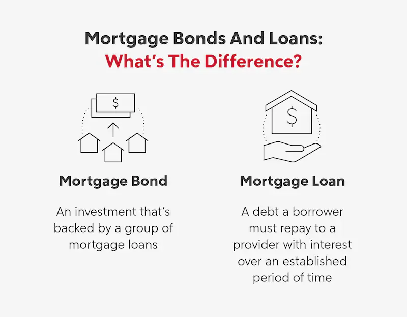

## Table of Contents

## What are housing bonds?

Housing bonds are a type of financial tool that governments or housing agencies use to raise money for building or fixing homes. When people buy these bonds, they are lending money to the issuer, who promises to pay back the money with interest over time. This money helps to create more affordable housing options for people who need it.

These bonds are often used to support projects that help low-income families, the elderly, or people with disabilities. By investing in housing bonds, people not only get a return on their investment but also help their community by making sure there are enough safe and affordable places for everyone to live. Governments might offer tax benefits to make these bonds more attractive to investors.

## How do housing bonds work?

Housing bonds work by letting governments or housing agencies borrow money from people who want to invest. When someone buys a housing bond, they give money to the issuer, like a city or a housing authority. In return, the issuer promises to pay back the money over time, plus some extra money called interest. This money helps pay for building new homes or fixing up old ones, especially for people who can't afford to pay a lot for housing.

The money from housing bonds is used to make sure there are enough safe and affordable places for people to live. This can include homes for low-income families, seniors, or people with disabilities. When people invest in housing bonds, they help their community while also [earning](/wiki/earning-announcement) some money back. Sometimes, the government gives tax breaks to make these bonds more appealing to investors, which encourages more people to help fund affordable housing projects.

## What is the purpose of issuing housing bonds?

The main purpose of issuing housing bonds is to raise money to build or fix homes for people who need them. Governments or housing agencies use the money they get from selling these bonds to help create more affordable housing options. This is important because it helps people who might not be able to afford a place to live on their own, like low-income families, seniors, or people with disabilities.

When people buy housing bonds, they are lending money to the issuer, who promises to pay it back with interest over time. This not only helps the community by providing more homes but also gives investors a chance to earn some money back. Sometimes, the government offers tax benefits to make these bonds more attractive, encouraging more people to invest and support affordable housing projects.

## Who can invest in housing bonds?

Anyone can invest in housing bonds if they want to help their community and earn some money back. You don't need to be rich or a big investor to buy them. People, families, and even organizations can buy housing bonds if they have some money to invest.

When you buy a housing bond, you are lending money to the government or a housing agency. They use your money to build or fix homes for people who need them, like low-income families or seniors. In return, they promise to pay you back with some extra money, called interest, over time.

## What are the risks associated with investing in housing bonds?

When you invest in housing bonds, there are some risks you should know about. One big risk is that the government or housing agency might not be able to pay you back. This can happen if they run out of money or if something goes wrong with their projects. If they can't pay you back, you might lose the money you invested.

Another risk is that interest rates might change. If interest rates go up after you buy the bond, the interest you get might not be as good as other investments. This means you could have made more money if you had waited or chosen a different investment. It's important to think about these risks before you decide to buy housing bonds.

## How are housing bonds different from other types of bonds?

Housing bonds are special because they are used to help build or fix homes for people who need them. When you buy a housing bond, you are lending money to a government or housing agency. They use your money to make sure there are enough safe and affordable places for people to live, like homes for low-income families or seniors. In return, they promise to pay you back with some extra money, called interest, over time. This is different from other bonds, like corporate bonds or municipal bonds, which might be used for different things, like building roads or helping businesses grow.

Another way housing bonds are different is that they often come with tax benefits. The government might give you a break on your taxes if you invest in housing bonds, which makes them more attractive to people who want to help their community and save on taxes. Other types of bonds might not have these tax benefits, so you need to think about what you want to achieve with your investment. While all bonds involve lending money and getting it back with interest, housing bonds focus on helping people find a place to live, which makes them unique.

## What are the tax implications of investing in housing bonds?

Investing in housing bonds can have some tax benefits. When you buy housing bonds, the government might give you a break on your taxes. This means you might not have to pay as much in taxes as you would with other investments. These tax breaks are meant to encourage more people to invest in housing bonds and help build more homes for people who need them.

However, the exact tax benefits can depend on where you live and the specific housing bond you buy. Some housing bonds might be completely tax-free, while others might only be partly tax-free. It's a good idea to talk to a tax advisor or look at the details of the bond to understand exactly how it will affect your taxes. This way, you can make a smart choice about whether housing bonds are a good investment for you.

## How have housing bonds performed historically?

Housing bonds have generally been a safe investment over time. They are backed by governments or housing agencies, which means they are less likely to fail than some other investments. People who invest in housing bonds usually get their money back with interest, which helps them earn a steady return. Over the years, housing bonds have helped build many homes for people who need them, making them a good choice for investors who want to help their community.

However, the performance of housing bonds can change depending on the economy and interest rates. If interest rates go up, the interest you get from housing bonds might not be as good as other investments. Also, if the government or housing agency runs into money problems, they might not be able to pay you back. But overall, housing bonds have been a reliable way to invest money and help build homes for people in need.

## What role do housing bonds play in affordable housing initiatives?

Housing bonds are a big help in making sure there are enough homes for people who can't afford to pay a lot. When people buy housing bonds, they give money to the government or a housing agency. This money is used to build new homes or fix up old ones, so more people can have a safe and affordable place to live. It's especially important for low-income families, seniors, and people with disabilities who might not be able to find a home without help.

By investing in housing bonds, people not only help their community but also get some money back. The government or housing agency promises to pay back the money with interest over time. Sometimes, the government even gives tax breaks to make housing bonds more attractive. This encourages more people to invest and helps make sure there are enough homes for everyone who needs them.

## How are housing bonds regulated?

Housing bonds are watched over by government rules to make sure they are used the right way. In the United States, the rules come from the federal government and state governments. They make sure that the money from housing bonds is used to help build or fix homes for people who need them. The rules also make sure that the people who buy the bonds are treated fairly and get their money back with interest.

Different states might have their own rules about housing bonds, but they all have to follow the big rules from the federal government. These rules say things like how the money can be spent, who can buy the bonds, and what kind of tax breaks people can get. By having these rules, the government makes sure that housing bonds help the community and are a safe way for people to invest their money.

## What are some notable examples of housing bond issuances?

One notable example of housing bond issuance happened in California. In 2018, the state issued $4 billion in housing bonds to help build more homes for people who couldn't afford them. This money was used to create new homes and fix up old ones, helping many families find a safe place to live. It was a big step to solve the problem of not having enough affordable housing in the state.

Another example is in New York City. In 2021, the city issued $1.2 billion in housing bonds to support affordable housing projects. The money helped build homes for low-income families, seniors, and people with disabilities. This bond issuance showed how the city was working hard to make sure everyone had a place to live, even if they didn't have a lot of money.

## What future trends might impact the market for housing bonds?

In the future, changes in the economy and interest rates could affect the market for housing bonds. If interest rates go up, people might not want to buy housing bonds as much because they can get better returns from other investments. But if the economy is doing well and more people need homes, governments might issue more housing bonds to help build them. This could make housing bonds more popular because people want to help their community and still get some money back.

Another trend that could impact housing bonds is how much people care about helping others. If more people want to invest in things that make a difference, like building homes for those in need, housing bonds could become more popular. Governments might also offer better tax breaks to encourage more people to buy them. This would make housing bonds a good choice for people who want to help their community and save on taxes at the same time.

## References & Further Reading

[1]: Fabozzi, F. J., & de Nahlik, C. (2012). ["Municipal Bonds: The Basics."](https://www.amazon.com/Handbook-Fixed-Income-Securities-Ninth/dp/1260473899) Bond Markets, Analysis, and Strategies. Wiley.

[2]: ["Advances in Financial Machine Learning"](https://www.amazon.com/Advances-Financial-Machine-Learning-Marcos/dp/1119482089) by Marcos Lopez de Prado

[3]: ["The Handbook of Municipal Bonds"](https://www.amazon.com/Handbook-Municipal-Bonds-Sylvan-Feldstein/dp/0470108754) by Sylvan G. Feldstein and Frank J. Fabozzi

[4]: ["Quantitative Trading: How to Build Your Own Algorithmic Trading Business"](https://www.amazon.com/Quantitative-Trading-Build-Algorithmic-Business/dp/1119800064) by Ernest P. Chan

[5]: Scopino, G. (2015). ["The Role of Technology in the Municipal Securities Market."](https://books.google.com/books/about/Algo_Bots_and_the_Law.html?id=3UUBEAAAQBAJ) Journal of Law and Policy.

[6]: ["Fixed Income Analysis Workbook"](https://www.wiley.com/en-us/Fixed+Income+Analysis+Workbook%2C+5th+Edition-p-9781119853015) by Barbara S. Petitt, Jerald E. Pinto, and Wendy L. Pirie

[7]: Thompson, J. R. (2020). ["Municipal Finance: What is it and Why is it Important?"](https://local2030.org/library/65/Guide-to-Municipal-Finance.pdf) Lincoln Institute of Land Policy.

[8]: ["Machine Learning for Algorithmic Trading"](https://github.com/stefan-jansen/machine-learning-for-trading) by Stefan Jansen