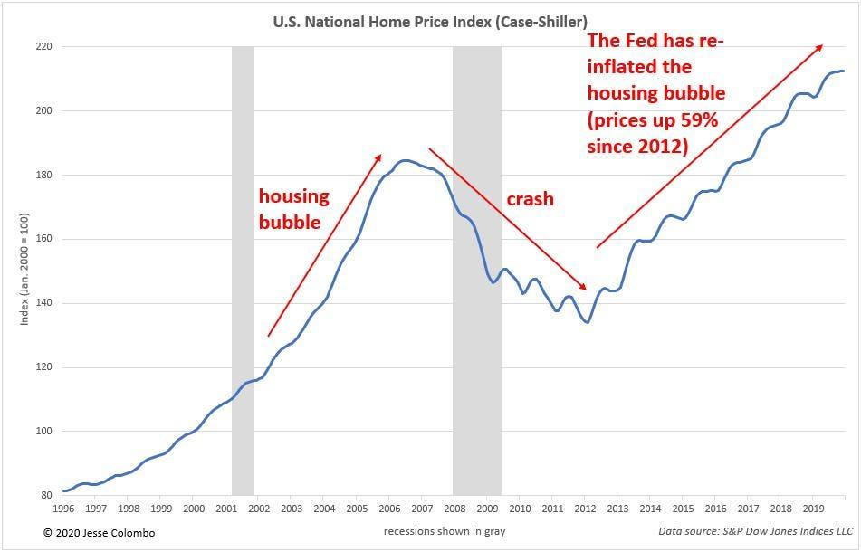

## Table of Contents

## What is a housing bubble?

A housing bubble is when the prices of homes go up really fast and become much higher than they should be. This happens because a lot of people want to buy houses, and they think the prices will keep going up. So, they buy homes even if they are very expensive, sometimes borrowing a lot of money to do it. This makes the prices go even higher, but it's not based on real value, just on what people think will happen.

Eventually, the bubble can burst. This means that people start to realize that homes are too expensive and stop buying them. When this happens, the prices start to fall quickly. People who bought homes at high prices might find that their homes are now worth less than what they paid. This can cause big problems for the people who own the homes and for the economy as a whole.

## How does a housing bubble form?

A housing bubble forms when a lot of people start buying homes and the prices go up really fast. This usually happens because people think that home prices will keep going up, so they want to buy now before prices get even higher. Sometimes, it's easy to borrow money to buy a home, so even more people can buy, which makes the prices go up even more. This can happen because of low interest rates, which make borrowing money cheaper, or because people feel good about the economy and want to invest in homes.

But the prices aren't based on what the homes are really worth; they're based on what people think they will be worth in the future. This can lead to a bubble because the prices are not connected to the real value of the homes. When people start to realize that homes are too expensive and stop buying, the bubble can burst. The prices then start to fall, and people who bought homes at high prices might find that their homes are now worth less than what they paid. This can cause big problems for homeowners and the economy.

## What are the signs of a housing bubble?

One sign of a housing bubble is when home prices go up a lot faster than people's incomes. If homes are getting more expensive, but people aren't making more money, it might mean that homes are becoming too expensive. Another sign is when it's really easy to borrow money to buy a home. If banks are giving out loans without checking if people can pay them back, it can lead to a bubble because more people can buy homes, even if they can't really afford them.

Another sign is when a lot of people are buying homes not to live in them, but to sell them later for a profit. This is called speculation, and it can make prices go up really fast. If many people are doing this, it might be a sign of a bubble. Finally, if homes in an area are much more expensive than homes in similar areas nearby, it could be a sign that the prices are too high and a bubble might be forming.

## What causes a housing bubble to burst?

A housing bubble bursts when people start to realize that homes are too expensive and stop buying them. When this happens, the demand for homes goes down, and the prices start to fall. People who bought homes at high prices might find that their homes are now worth less than what they paid. This can make them worried and they might try to sell their homes quickly, which makes the prices fall even more.

Sometimes, the bubble bursts because something else in the economy changes. For example, if interest rates go up, it can make borrowing money more expensive. This can make it harder for people to buy homes, so they stop buying, and the prices start to fall. Other times, if people lose their jobs or the economy starts to do badly, they might not be able to afford their homes anymore. This can lead to more homes being sold and prices going down, causing the bubble to burst.

## What are the economic impacts of a housing bubble?

When a housing bubble bursts, it can hurt the economy a lot. People who bought homes at high prices might find that their homes are now worth less than what they paid. This can make them feel poor because they owe more money on their home than it's worth. If a lot of people are in this situation, they might stop spending money on other things, like going out to eat or buying new clothes. This can slow down the whole economy because businesses make less money and might have to lay off workers.

The problems can also spread to banks and other financial places. If a lot of people can't pay back their home loans, the banks lose money. This can make banks worried about lending money to anyone, even for things like starting a business or buying a car. When banks stop lending money, it can make the economy slow down even more. In really bad cases, this can lead to a big economic crisis, like what happened in 2008 when the housing bubble in the United States burst.

Overall, a housing bubble bursting can cause a lot of trouble. It can make people feel poor, slow down businesses, and make banks scared to lend money. All of these things together can lead to a big economic problem that takes a long time to fix.

## How can individuals protect themselves from a housing bubble?

Individuals can protect themselves from a housing bubble by being careful about how much they spend on a home. They should make sure they can afford the home even if the prices go down. This means not borrowing too much money and keeping some savings in case things get tough. It's also a good idea to think about how long they plan to live in the home. If they might need to sell it soon, they should be extra careful because they could lose money if the bubble bursts.

Another way to protect themselves is to do research before buying a home. They should look at the prices of homes in the area and see if they are going up faster than people's incomes. If the prices seem too high, it might be a sign of a bubble. They can also talk to a financial advisor who can help them understand the risks and make a smart decision. By being careful and doing their homework, individuals can avoid getting caught in a housing bubble and protect their money.

## What historical examples of housing bubbles exist?

One famous example of a housing bubble is the one that happened in the United States in the early 2000s. During this time, home prices went up a lot because a lot of people wanted to buy homes. Banks were giving out loans easily, and some people bought homes they couldn't really afford. They thought they could sell the homes later for more money. But in 2007, people started to realize that homes were too expensive. They stopped buying, and the bubble burst. Home prices fell a lot, and many people lost their homes. This caused a big economic crisis in 2008 that affected the whole world.

Another example is the housing bubble in Japan during the late 1980s. At that time, the economy in Japan was doing really well, and people thought that home prices would keep going up. So, they bought a lot of homes, and the prices went up very fast. But in the early 1990s, people started to see that homes were too expensive. They stopped buying, and the bubble burst. Home prices fell, and it took Japan a long time to recover. This period is sometimes called the "Lost Decade" because the economy didn't grow much for many years after the bubble burst.

## How do housing bubbles affect different socioeconomic groups?

Housing bubbles can hurt different groups of people in different ways. For people who own homes and bought them at high prices during the bubble, it can be really tough when the bubble bursts. Their homes might be worth less than what they paid, and if they need to sell, they could lose money. This can make them feel poor and worried about money. For people who are trying to buy a home, a bubble can make it hard because the prices are too high. When the bubble bursts, it might be easier to buy a home, but they might also be scared to buy because they don't know if the prices will keep falling.

For people who rent homes, a housing bubble can also be a problem. When home prices go up, it can make rents go up too because landlords want to make more money. This can make it hard for renters to afford a place to live. When the bubble bursts, it might not help renters right away because landlords might still keep the rents high. But over time, if home prices go down a lot, it might make rents go down too. Overall, housing bubbles can make life harder for a lot of different people, depending on whether they own a home, want to buy one, or are renting.

## What role do government policies play in housing bubbles?

Government policies can help create housing bubbles or make them worse. For example, if the government makes it easy to borrow money by keeping interest rates low, more people can buy homes. This can make home prices go up fast, which can start a bubble. Also, if the government gives tax breaks or other benefits for buying homes, it can make more people want to buy, even if the prices are too high. These policies can make the bubble bigger because they encourage people to buy homes they might not be able to afford.

On the other hand, government policies can also help stop housing bubbles from getting too big or help fix things after a bubble bursts. If the government sees that home prices are going up too fast, they can raise interest rates to make borrowing money harder. This can slow down the bubble. After a bubble bursts, the government can help by giving money to people who lost their homes or by helping banks that are in trouble. This can make the problems from the bubble less bad and help the economy get better faster.

## How can policymakers mitigate the effects of a housing bubble?

Policymakers can help stop housing bubbles from getting too big by watching home prices and making it harder to borrow money if prices are going up too fast. They can do this by raising interest rates, which makes loans more expensive. This can slow down the bubble because fewer people can afford to buy homes. Policymakers can also make rules that stop banks from giving out loans to people who can't afford them. This can help keep home prices from going up too fast and make the bubble smaller.

After a housing bubble bursts, policymakers can help fix things by giving money to people who lost their homes. They can also help banks that are in trouble because a lot of people can't pay back their loans. This can stop the problems from the bubble from spreading and hurting the whole economy. By doing these things, policymakers can make the effects of a housing bubble less bad and help the economy get better faster.

## What are the long-term effects of a housing bubble on the real estate market?

When a housing bubble bursts, it can change the real estate market for a long time. Home prices might stay low for years after the bubble bursts because people are scared to buy homes. They might think the prices will keep going down, so they wait to buy. This means fewer people are buying and selling homes, which can make the real estate market slow down. It can take a long time for people to feel good about buying homes again, and during that time, home prices might not go up much.

Also, after a housing bubble, banks might be more careful about giving out loans. They might check more carefully to make sure people can pay back their loans. This can make it harder for people to borrow money to buy homes, which can keep home prices from going up too fast. But it can also make it harder for people who really need a home to buy one. Overall, a housing bubble can make the real estate market slow and careful for a long time after the bubble bursts.

## How do global economic factors influence the formation and bursting of housing bubbles?

Global economic factors can play a big role in starting and ending housing bubbles. When the world economy is doing well, people might feel more confident about buying homes. They might think that home prices will keep going up, so they buy homes even if they are expensive. Also, if interest rates are low in many countries, it can be easier for people to borrow money to buy homes. This can make home prices go up fast in different places around the world, which can start a housing bubble. If a lot of countries are doing this at the same time, it can make the bubble even bigger.

But when the global economy starts to do badly, it can make housing bubbles burst. If people lose their jobs or the economy slows down in many countries, they might not be able to afford their homes anymore. This can make them sell their homes, which can make home prices go down. Also, if interest rates go up in many countries, it can make borrowing money more expensive. This can make fewer people want to buy homes, which can cause the bubble to burst. When this happens in many places at the same time, it can make the problems from the bubble even worse and affect the whole world.

## References & Further Reading

[1]: Shiller, R. J. (2005). ["Irrational Exuberance"](https://press.princeton.edu/books/paperback/9780691173122/irrational-exuberance). Princeton University Press.

[2]: Reinhart, C. M., & Rogoff, K. S. (2009). ["This Time is Different: Eight Centuries of Financial Folly"](https://www.nber.org/system/files/working_papers/w13882/w13882.pdf). Princeton University Press.

[3]: Gjerstad, S., & Smith, V. L. (2014). ["Rethinking Housing Bubbles: The Role of Household and Bank Balance Sheets in Modeling Economic Cycles"](https://digitalcommons.chapman.edu/esi_pubs/75/). Cambridge University Press.

[4]: Baker, M., & Wurgler, J. (2006). ["Investor Sentiment and the Cross-Section of Stock Returns."](https://onlinelibrary.wiley.com/doi/10.1111/j.1540-6261.2006.00885.x) The Quarterly Journal of Economics, 121(4), 1291-1328.

[5]: Aldridge, I. (2013). ["High-Frequency Trading: A Practical Guide to Algorithmic Strategies and Trading Systems"](https://www.amazon.com/High-Frequency-Trading-Practical-Algorithmic-Strategies/dp/1118343506). Wiley.