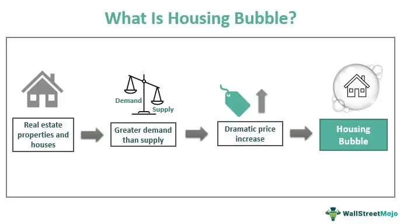

The interconnected topics of the real estate housing market, economic bubbles, and algorithmic trading are critical components of today's financial landscape, each influencing and being influenced by a myriad of economic factors. The real estate market serves as a cornerstone of both individual wealth and broader economic health. It affects investment portfolios, government policy, and social stability. However, the dynamics of this market are volatile, often prone to expansion and contraction cycles that, in extreme cases, result in economic bubbles. These bubbles can have far-reaching consequences, including destabilizing entire economies when they burst.

Algorithmic trading, a domain that has revolutionized financial markets, introduces complexity and speed to the equation. Algorithms can swiftly execute trades based on pre-set conditions, affecting market liquidity and volatility. Within real estate markets, algorithmic trading can impact the pricing and perceived value of real estate-related securities, such as Real Estate Investment Trusts (REITs). As these technologies evolve, they offer opportunities and challenges to investors by influencing price discovery and transaction efficiency, but also by introducing potential systemic risks.



Understanding the nuanced interactions between these elements is essential for investors seeking to navigate the complex and ever-evolving financial landscape. Economic models that consider the interplay between human behavior, policy changes, and technological advancements can provide insights into future market movements. Through this article, we will explore the foundational dynamics of these domains and investigate how their interconnectedness affects investment strategies, market stability, and opportunities for growth.

## Table of Contents

## Understanding Real Estate Market Dynamics

Real estate markets are complex systems influenced by a myriad of factors including supply and demand dynamics, governmental policies, and societal trends. At the core of these markets is the basic economic principle that price is influenced by the balance between supply, the availability of properties for sale or development, and demand, the willingness and ability of consumers to purchase property. 

**Supply and Demand**: The supply side of the equation is influenced by the rate of new construction, availability of land, and zoning laws. Additionally, economic conditions such as inflation and interest rates impact the cost of building, thereby affecting the supply. Conversely, demand is driven by factors like population growth, income levels, and consumer preferences. 

**Government Policies**: Legislative actions play a significant role in shaping real estate markets. Tax incentives, interest rate regulations, and policies promoting urban development can spur activity. Conversely, restrictions such as property taxes, strict zoning, and rent control can constrict market fluidity and impact price levels.

**Historical Real Estate Bubbles**: Economic bubbles in real estate are characterized by unsustainable increases in property prices, driven often by speculative investments, where the expectation of continued price rises fuel further buying. A notable example of real estate bubbles is the U.S. housing bubble in the mid-2000s, where easy credit and speculative buying led to a sharp increase in home prices followed by a catastrophic bust, leading to the 2008 financial crisis. This bubble was fueled by subprime lending practices, low interest rates, and the proliferation of financial derivatives linked to real estate.

**Speculation and Investor Behavior**: Market speculation can lead to inflated prices as investors purchase properties not for use but for anticipated appreciation. This behavior can create market volatility, as seen in various periods throughout history when investors rapidly bought and sold properties to capitalize on short-term gains, destabilizing long-term market equilibrium.

**Recent Trends**: In recent years, the real estate sector has experienced notable trends such as the rise of urbanization, leading to increased property values in metropolitan areas, and the emergence of remote work, which has shifted demand towards suburban and rural regions. Additionally, technological advancements have made real estate transactions more efficient and transparent, altering the way markets operate and interact. 

These dynamics are critical for investors as they influence not only current property values but also future market opportunities and risks. Understanding these elements aids in developing robust investment strategies that capitalize on favorable trends while mitigating adverse outcomes.

## Causes and Effects of Economic Bubbles

An economic bubble occurs when the price of an asset, such as real estate, significantly exceeds its intrinsic value, often driven by exuberant market behavior. In real estate, bubbles form when property prices escalate rapidly, supported by unsustainable demand and speculative buying. This inflated demand can be fueled by several factors, primarily over-speculation, low interest rates, and loose credit standards.

### Key Drivers of Economic Bubbles

1. **Over-Speculation:** Speculation refers to the anticipation of price increases, prompting investors to buy assets to sell them later at a profit. In real estate, speculation can lead to artificially high prices, as seen in spikes in condominium investments during boom periods. Investors may buy properties not with the intent to utilize them, but to resell them at higher prices, often driven by the belief that trends will continue indefinitely.

2. **Low Interest Rates:** Central banks often maintain low-interest rates to stimulate economic growth by making borrowing cheaper. However, this can lead to excessive borrowing, as credit becomes more accessible, leading buyers to purchase homes beyond their means. The influx of cheap money can drive up real estate demand, pushing prices to unsustainable levels.

3. **Loose Credit Standards:** When financial institutions relax their credit policies, more individuals can qualify for loans, including those who may not be creditworthy. This practice increases the number of buyers in the market, boosting demand and, consequently, prices. The availability of subprime mortgages in the early 2000s is a classic example, where high-risk loans were widely issued, paving the way for a subsequent financial crisis.

### Impacts of Bubble Bursting

When an economic bubble bursts, the correction process can have profound economic and societal consequences:

- **Foreclosures:** As prices fall, homeowners who purchased at inflated values may find themselves underwater, owing more on their mortgages than the property is worth. This scenario can lead to widespread foreclosures, as seen in the aftermath of the 2008 housing crisis, where millions of Americans lost their homes.

- **Market Corrections:** Prices re-adjust to reflect real value, often resulting in sharp declines. This correction can lead to a loss of wealth for investors and homeowners, reduced consumer spending, and a ripple effect across the broader economy. The 2008 crisis resulted in a significant slowing of global economic growth and a loss of trillions in asset values.

### Historical Example: The 2008 Housing Crash

The 2008 financial crisis is a prime example of a real estate bubble bursting. In the years leading up to the crisis, the U.S. experienced a housing boom characterized by rapid price increases and record homeownership rates, largely driven by speculative investments, low-interest rates, and the widespread availability of subprime mortgages. When the bubble burst, housing prices plummeted, leading to massive defaults, a spike in foreclosures, and a global financial meltdown. The consequences were severe, resulting in the collapse of financial institutions, government bailouts, and a protracted economic recession.

Understanding these dynamics allows policymakers, investors, and the general public to recognize and mitigate the risks associated with economic bubbles. While it is challenging to prevent bubbles entirely, awareness and prudence can help cushion the effects of their inevitable bursts.

## Algorithmic Trading in Real Estate

Algorithmic trading, a prominent force in modern financial markets, leverages complex algorithms to execute trades with high speed and precision. It has gained significant traction in trading a variety of assets, including those related to real estate. Algorithms use advanced computational techniques to analyze vast datasets and make instantaneous trading decisions, often outperforming human traders in speed and accuracy.

In the context of real estate, [algorithmic trading](/wiki/algorithmic-trading) can be employed to trade real estate investment trusts (REITs), mortgage-backed securities (MBS), and other real estate-related financial instruments. These algorithms analyze factors such as interest rates, property values, economic indicators, and market sentiment to determine optimal trading strategies. For instance, when predicting movements in REIT prices, algorithms may assess historical data alongside real-time market inputs to identify profitable opportunities.

The advantages of algorithmic trading are numerous. It enhances market efficiency by improving [liquidity](/wiki/liquidity-risk-premium) and reducing transaction costs. Moreover, it minimizes the impact of human emotions on trading decisions, thereby reducing the risk of costly errors. Algorithmic trading also allows for the continuous monitoring of market conditions, enabling rapid responses to changing dynamics.

However, algorithmic trading introduces complexity and potential risks. The reliance on automated decision-making can lead to unintended consequences, such as flash crashes triggered by algorithmic errors. The interconnectedness of markets means that a malfunction in algorithmic trading systems can have widespread repercussions. Furthermore, high-frequency trading can lead to increased [volatility](/wiki/volatility-trading-strategies), as large volumes of trades are executed in milliseconds.

Several case studies illustrate the impact of algorithmic trading on real estate markets. One notable example is the use of algorithms by investment firms to trade REITs. Firms employ strategies like statistical [arbitrage](/wiki/arbitrage), using algorithms to exploit pricing inefficiencies between related securities. In some instances, these algorithms have improved the overall liquidity of REITs, making them more attractive to investors.

Another case is the trading of mortgage-backed securities, where algorithms analyze macroeconomic trends, credit ratings, and housing market data to optimize trading strategies. During the 2008 financial crisis, the failure of certain algorithmic models to accurately predict the housing market downturn highlighted the risks involved. However, advancements in technology and data analytics have since refined these algorithms, improving their robustness.

In conclusion, while algorithmic trading offers substantial benefits in terms of efficiency and accuracy, it requires careful oversight to mitigate potential risks. As technology continues to evolve, the role of algorithmic trading in real estate markets is likely to expand, influencing investment strategies and market dynamics significantly.

## Interplay Between Real Estate and Algorithmic Trading

Algorithmic trading, a cornerstone of modern financial markets, significantly impacts real estate values by employing a variety of financial instruments such as derivatives and Real Estate Investment Trusts (REITs). This intersection leverages advanced algorithms to analyze vast datasets and execute trades at speeds and efficiencies unattainable by human traders. 

### Influence Through Derivatives and REITs

Derivatives, financial securities whose value is derived from underlying assets, are instrumental in algorithmic trading strategies involving real estate. These instruments include futures, options, and swaps, which allow traders to speculate on or hedge against fluctuations in real estate prices. For instance, real estate futures enable traders to bet on the future price movements of real estate indices. Algorithmic traders use quantitative models to assess market conditions and execute trades that balance the risk and reward propositions of these derivatives. 

Real Estate Investment Trusts (REITs) represent another avenue through which algorithms influence real estate markets. REITs pool investor capital to purchase and manage income-generating real estate properties. Automated trading systems can analyze millions of data points related to REIT performance, such as occupancy rates, rent growth, and [interest rate](/wiki/interest-rate-trading-strategies) movements, to optimize portfolio investments in these trusts.

### Feedback Loop and Market Value Fluctuations

The integration of algorithmic trading in real estate markets creates a dynamic feedback loop that can amplify market value fluctuations. Automated systems react to price changes and anticipated market conditions, often based on predictive analytics, which then influences trading behavior. This can lead to rapid price movements and increased volatility, sometimes disconnecting market prices from fundamental values. If a significant number of algorithms respond similarly to market signals, this collective action can exacerbate price swings, potentially creating self-reinforcing cycles.

### Role of Data Analytics and Artificial Intelligence

Data analytics and [artificial intelligence](/wiki/ai-artificial-intelligence) (AI) play crucial roles in developing sophisticated trading strategies for real estate investments. Algorithms utilize [machine learning](/wiki/machine-learning) models to identify patterns, trends, and signals in large datasets, including economic indicators, historical prices, and social media sentiment. For example, neural networks can predict real estate market trends using features like geographical data and macroeconomic conditions.

Python, a popular programming language in data sciences, enables the implementation of these complex models. For instance, a regression model to predict REIT price movements based on historical data could be constructed as follows:

```python
import pandas as pd
from sklearn.linear_model import LinearRegression

# Load dataset with historical REIT prices and relevant economic indicators
data = pd.read_csv('reit_data.csv')

# Features and target variable
X = data[['interest_rates', 'occupancy_rates', 'gdp_growth']]
y = data['reit_prices']

# Create regression model
model = LinearRegression()
model.fit(X, y)

# Predict future prices
predictions = model.predict(X)
```

In conclusion, algorithmic trading profoundly influences real estate markets through sophisticated mechanisms like derivatives and REITs. The feedback loop created by automated trading can intensify market value fluctuations, while data analytics and AI provide the tools necessary for crafting predictive and reactive trading strategies. Understanding these interactions is critical for investors aiming to navigate the complexities of modern financial and real estate environments.

## Future Outlook and Investment Strategies

The real estate markets are anticipated to undergo significant evolution as technological advancement continues to reshape the economic landscape. Emerging technologies such as artificial intelligence (AI), blockchain, and big data analytics are transforming how real estate transactions are conducted, analyzed, and managed. AI algorithms now assist in predicting property valuations and market trends by analyzing vast sets of data from various sources, thus enabling more accurate forecasts and strategic planning.

Blockchain technology introduces increased transparency and security in property transactions through smart contracts, which could streamline processes and reduce fraud. Additionally, big data analytics empower investors and companies to assess properties and markets with unprecedented detail, allowing for better risk management and opportunity identification.

To mitigate risks associated with economic bubbles, investors should focus on diversification strategies. Diversifying investments across different asset classes, geographical locations, and property types can reduce exposure to market volatility. By spreading risk, investors are better positioned to withstand fluctuations in specific sectors or regions, as diverse portfolios are generally less susceptible to crashes caused by localized economic instabilities.

Informed decision-making is crucial in the real estate sector, where market dynamics can be complex and unpredictable. Investors should leverage data analytics and technological tools to inform their decisions, ensuring they have a comprehensive understanding of market conditions and potential risks. Tools such as predictive analytics can provide insights into market cycles, helping investors make timely decisions.

Continuing education on market trends and technological impacts is paramount for staying competitive. Investors and industry professionals should stay updated on technological advancements and their implications for the real estate sector. Participating in seminars, workshops, and online courses can provide valuable knowledge and insights, enabling stakeholders to adapt to technological changes and capitalize on new opportunities.

In summary, as the real estate markets evolve with technological advancements, investors need to adopt diversified strategies, make informed decisions using advanced analytics, and continuously educate themselves on emerging trends and technologies. These approaches will be vital for navigating the complexities of future markets and ensuring sustainable investment outcomes.

## Conclusion

Understanding the complex dynamics of real estate markets and economic bubbles is crucial for both investors and policymakers. The real estate market is influenced by numerous factors, including supply and demand, economic indicators, and government policies. These influences can lead to significant shifts in market prices and occasionally result in economic bubbles. When these bubbles burst, they often cause widespread financial distress, affecting both individual investors and the broader economy. 

Algorithmic trading has become a pivotal force in shaping the financial landscape, including real estate investments. By automating transactions and employing complex algorithms to trade real estate-related securities, it can enhance market efficiency but also introduce new layers of complexity and unpredictability. The fast-paced nature of algorithmic trading requires investors to remain informed and adaptable to changes in market dynamics.

To successfully navigate future market conditions, strategic investment approaches are necessary. Investors need to employ risk mitigation strategies, such as diversification and data-driven decision-making, to buffer against the volatility incited by economic bubbles and rapid technological advancements. This strategic thinking should be underpinned by a keen awareness of evolving trends and best practices in real estate and financial technology.

Ultimately, vigilance and adaptability are paramount in this rapidly evolving economic environment. As technology continues to transform markets, those who are proactive in understanding and leveraging these developments will be best positioned to thrive. It is essential for investors to commit to ongoing education and remain agile, adjusting their strategies to meet new challenges and opportunities.

## References & Further Reading

[1]: Shiller, R. J. (2005). ["Irrational Exuberance"](https://press.princeton.edu/books/paperback/9780691173122/irrational-exuberance). Princeton University Press.

[2]: Reinhart, C. M., & Rogoff, K. S. (2009). ["This Time is Different: Eight Centuries of Financial Folly"](https://www.nber.org/system/files/working_papers/w13882/w13882.pdf). Princeton University Press.

[3]: Gjerstad, S., & Smith, V. L. (2014). ["Rethinking Housing Bubbles: The Role of Household and Bank Balance Sheets in Modeling Economic Cycles"](https://digitalcommons.chapman.edu/esi_pubs/75/). Cambridge University Press.

[4]: Baker, M., & Wurgler, J. (2006). ["Investor Sentiment and the Cross-Section of Stock Returns."](https://onlinelibrary.wiley.com/doi/10.1111/j.1540-6261.2006.00885.x) The Quarterly Journal of Economics, 121(4), 1291-1328.

[5]: Aldridge, I. (2013). ["High-Frequency Trading: A Practical Guide to Algorithmic Strategies and Trading Systems"](https://www.amazon.com/High-Frequency-Trading-Practical-Algorithmic-Strategies/dp/1118343506). Wiley.