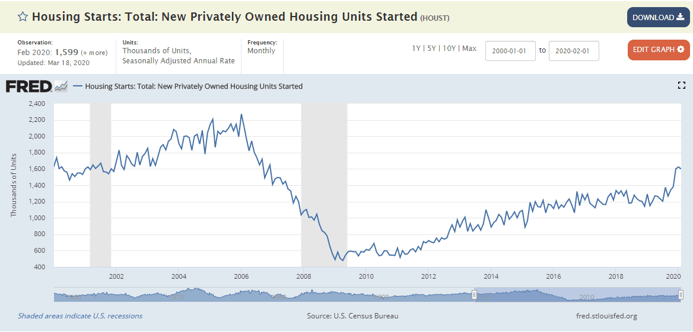

Real estate investment has traditionally served as a reliable pathway for wealth building, primarily due to its nature as a tangible asset that offers potential for both value appreciation and income generation. Investors have long turned to real estate to diversify their portfolios, hedge against inflation, and achieve substantial returns. However, navigating the complexities of this sector requires a solid understanding of key investment metrics, which are integral in assessing property value, profitability, and risk.

Key metrics in real estate investment include the likes of Net Operating Income (NOI), Capitalization Rate (Cap Rate), and Internal Rate of Return (IRR). These metrics facilitate a thorough analysis of a property's financial performance. For instance, NOI measures a property's operational profitability by subtracting operating expenses from gross income. The Cap Rate, a ratio of NOI to property asset value, represents the expected rate of return, indicating how quickly an investment might pay back. Meanwhile, IRR is a metric used to estimate the profitability of potential investments over time, factoring in cash flows and investment duration.



Acquiring a firm grasp of these metrics equips investors to make informed decisions. However, the real estate market's dynamism necessitates the consideration of broader economic indicators such as housing starts. Housing starts, the count of new residential construction projects begun in a given period, serve as a vital economic indicator, reflecting industry health and projecting market trends. By examining housing starts, investors gain insights into supply-demand dynamics, construction industry shifts, and overall economic growth.

In recent years, there has been an increasing integration of algorithmic trading in real estate investment practices. Algorithmic trading involves using complex algorithms to analyze vast datasets, enhancing the precision and speed of investment strategies. The infusion of data-driven technologies aids in automating the decision-making process, thereby minimizing human error and optimizing investment outcomes.

This article aims to provide a detailed examination of these elements: understanding real estate investment metrics, the impact of housing starts, and the role of algorithmic trading. By evaluating how these aspects intersect, we aim to offer insights that will support investors in maximizing their returns and efficiently managing risks. Whether you're a seasoned investor or a novice, the discussion will highlight the latest trends and opportunities within the field of real estate investment, equipping you with the knowledge to navigate this evolving landscape effectively.

## Table of Contents

## Understanding Real Estate Investment Metrics

Investment metrics are essential tools in real estate portfolio analysis, enabling investors to effectively evaluate financial outcomes and risks associated with real estate assets. Core metrics such as Net Operating Income (NOI), Cap Rate, Cash on Cash Return, and Internal Rate of Return (IRR) are crucial for assessing both the profitability and sustainability of investments within this sector.

Net Operating Income (NOI) serves as a fundamental indicator of a property's operational efficiency. It is calculated as the difference between total revenue generated by the property and its total operating expenses, excluding taxes and interest. Mathematically, NOI is expressed as:

$$
\text{NOI} = \text{Gross Operating Income} - \text{Operating Expenses}
$$

This metric helps investors gauge the potential revenue after operational costs, informing decisions on property management and improvement strategies.

The Capitalization Rate, or Cap Rate, is a metric used to estimate the expected rate of return on a real estate investment. It reflects the relationship between the property's NOI and its current market value or purchase price. The formula for Cap Rate is:

$$
\text{Cap Rate} = \frac{\text{NOI}}{\text{Current Market Value}}
$$

The Cap Rate provides a snapshot of potential returns, helping investors compare different investment opportunities and determine whether a property is priced appropriately.

Cash on Cash Return evaluates the cash income generated relative to the cash invested, focusing on immediate cash flow rather than long-term appreciation. It is calculated as:

$$
\text{Cash on Cash Return} = \frac{\text{Annual Pre-Tax Cash Flow}}{\text{Total Cash Invested}}
$$

This measure is particularly relevant for investors relying on leverage or financing, as it provides insights into immediate returns from their outlay.

Finally, the Internal Rate of Return (IRR) assesses an investment's long-term profitability by calculating the [interest rate](/wiki/interest-rate-trading-strategies) at which the net present value (NPV) of all cash flows (both inflows and outflows) equals zero. The IRR equation is typically solved using iterative numerical methods due to its complexity. In Python, it can be calculated using libraries like NumPy:

```python
import numpy as np

cash_flows = [-100000, 20000, 25000, 30000, 35000, 40000]
irr = np.irr(cash_flows)
```

The IRR is instrumental in evaluating and comparing investments with differing cash flow patterns, guiding strategic decisions aligned with investors' financial objectives.

By leveraging these investment metrics, investors can make informed, strategic decisions to optimize their real estate portfolio, balancing potential returns with associated risks and aligning their efforts with long-term financial goals.

## The Role of Housing Starts in Real Estate Investment

Housing starts, representing the initiation of new residential construction projects, serve as a critical economic and investment gauge. As a vital segment of the economy, the housing market's performance is intricately linked to economic stability and expansion, impacting strategic decisions across banking, construction, and real estate sectors.

Tracking housing starts trends offers valuable insights into prospective supply levels, builders’ confidence, and consumer demand. These factors are essential for making well-informed investment choices. For instance, a consistent increase in housing starts signals enhanced builder confidence and a robust economic environment conducive to investment growth. Conversely, a decline might suggest cautious builder sentiment and potential economic slowdowns, necessitating revised investment strategies.

Monthly housing starts data, when adjusted for seasonal fluctuations, provide a reliable indicator of prevailing economic conditions and investment trajectories. Seasonally adjusted figures help investors discern genuine trends, eliminating distortions caused by predictable seasonal patterns, such as weather-related construction delays.

The Bureau of the Census and the Department of Housing and Urban Development (HUD) in the United States regularly publish housing start [statistics](/wiki/bayesian-statistics). These reports deliver essential data that can guide investors in predicting market trends and making strategic decisions. For instance, if housing starts increase, it may indicate a growing economy and increased demand for mortgages, prompting adjustments in investment portfolios to capitalize on anticipated growth.

Moreover, as housing starts often precede GDP growth, they are a leading indicator of economic health. Investors can harness this data to forecast economic performance, adjust their portfolios accordingly, and optimize returns. Therefore, understanding and utilizing housing starts metrics are indispensable for successful real estate investment and broader economic analysis.

## The Integration of Algorithmic Trading in Real Estate

Algorithmic trading exploits sophisticated algorithms to automate and optimize investment strategies by analyzing extensive datasets through predictive analytics. This integration into the real estate sector revolutionizes decision-making processes, significantly reducing errors and processing time typically associated with manual evaluations. By combining [machine learning](/wiki/machine-learning) and big data, such algorithms offer enhanced predictive capabilities, allowing for a more precise estimation of market trends and property valuations, thus providing investors with a competitive advantage.

The automation of data analysis through algorithmic models facilitates the identification of undervalued real estate opportunities. For instance, machine learning algorithms can process historical property values, economic indicators, and local market trends to forecast future price movements. This data-driven approach enables investors to recognize potential investment opportunities before they become apparent through traditional analysis methods.

Algorithms can also streamline portfolio management by continuously monitoring market conditions and adjusting investment strategies accordingly. A typical algorithmic strategy may involve the use of regression models to predict property prices, clustering techniques to identify similar properties for comparative analysis, or even neural networks to evaluate complex patterns in housing data. For example, a basic linear regression model in Python could help predict property prices based on numerous independent variables, such as location, size, and the number of bedrooms:

```python
from sklearn.linear_model import LinearRegression
import numpy as np

# Sample data: features (location, size, number of bedrooms) and labels (property price)
X = np.array([[1, 1500, 3], [2, 2000, 4], [3, 1700, 3], [4, 2500, 5]])
y = np.array([300000, 500000, 350000, 600000])

# Create and train the model
model = LinearRegression()
model.fit(X, y)

# Predict the price of a new property
new_property = np.array([[2, 1800, 3]])
predicted_price = model.predict(new_property)
```

This predictive ability helps mitigate risks by allowing for agile adjustments in investment strategies, ensuring the portfolio remains aligned with current market dynamics. Moreover, the incorporation of [algorithmic trading](/wiki/algorithmic-trading) reduces the emotional bias in investment decisions, a common issue in manually driven processes.

In summary, leveraging algorithmic trading in real estate enhances analytical precision, operational efficiency, and strategic foresight. The adoption of advanced technological tools positions investors to better manage their portfolios and capitalize on emerging opportunities, ensuring long-term profitability and market competitiveness.

## Integrating Real Estate Metrics with Algo Trading

Combining established real estate metrics with algorithmic trading offers a powerful toolkit for comprehensive property analysis. By automating the calculation and evaluation of critical metrics such as Cap Rate and Internal Rate of Return (IRR), investors can rapidly assess multiple investment opportunities, thereby improving the decision-making process. 

**Automation of Metrics Calculation**

In real estate, Cap Rate is calculated as:

$$
\text{Cap Rate} = \frac{\text{Net Operating Income (NOI)}}{\text{Current Market Value}}
$$

This metric is crucial for determining the potential return on an investment property. By automating Cap Rate calculations using algorithms, investors can quickly screen various properties to identify those with the most favorable returns. Similarly, the IRR, which considers the time value of money, can be computed through automation:

```python
import numpy as np

def calculate_irr(cash_flows):
    return np.irr(cash_flows)

# Example: calculating IRR for a series of cash flows
cash_flows = [-500000, 100000, 150000, 200000, 250000]
irr = calculate_irr(cash_flows)
print(f"The IRR is: {irr:.2%}")
```

This provides a rapid assessment of an investment’s long-term profitability without manual intervention.

**Enhancement Using Machine Learning**

Machine learning algorithms enhance the evaluation of these metrics by incorporating dynamic market data and historical trends. For instance, regression models can predict property values and rental income streams, offering predictive insights that refine investment strategies. Tools such as Python’s Scikit-learn library can create models that forecast trends based on past data:

```python
from sklearn.ensemble import RandomForestRegressor
from sklearn.model_selection import train_test_split

# Example: predicting property value
X = [[1200, 2, 1], [850, 1, 1], [1500, 3, 2]]  # Features: [size, bedrooms, bathrooms]
y = [300000, 180000, 400000]  # Target: property values

X_train, X_test, y_train, y_test = train_test_split(X, y, test_size=0.2)

model = RandomForestRegressor()
model.fit(X_train, y_train)
predictions = model.predict(X_test)
```

This integration allows for data-driven insights into potential property purchase and sale decisions.

**Agility in Portfolio Adjustments**

The integrated approach not only improves the accuracy of these evaluations but also enables agile portfolio adjustments in response to market shifts. By continuously updating data inputs and model parameters, investors can swiftly adapt to changes, mitigating potential risks while capitalizing on emerging opportunities. Algorithmic trading systems can execute real-time adjustments, ensuring optimal portfolio performance even in volatile market conditions.

Overall, the synthesis of real estate metrics with algorithmic trading empowers investors to make informed, strategic decisions, achieving optimal investment outcomes in a competitive market landscape.

## Case Studies: Success Stories in Real Estate Investment

While the integration of metrics and algorithmic trading into real estate investment remains a relatively new frontier, several successful case studies illustrate the transformative power of these methodologies in optimizing investment outcomes. One such example is the case of a mid-sized real estate investment firm that sought to enhance its investment strategy using advanced data analytics and algorithmic models.

The firm employed algorithmic trading techniques traditionally used in financial markets, integrating them with real estate investment metrics such as Net Operating Income (NOI) and Internal Rate of Return (IRR). By leveraging machine learning algorithms, the firm was able to automate the analysis of vast datasets, including historical property values, market trends, and economic indicators. This automated process led to a more efficient evaluation of investment opportunities, enabling the firm to identify undervalued properties with significant appreciation potential.

For instance, the firm used predictive analytics to estimate future property values and rental income, which fed into their algorithm to calculate expected returns. The formula used for calculating the expected return was:

$$
\text{Expected Return} = \frac{\sum (\text{Predicted Cash Flows}) - \text{Initial Investment}}{\text{Initial Investment}} \times 100\%
$$

This data-driven approach resulted in a 20% increase in their portfolio's average return over a three-year period. Furthermore, the algorithmic trading model reduced acquisition costs by identifying off-market deals and optimizing bidding strategies, which contributed to a 15% cost reduction.

Another compelling success story comes from a real estate investment trust (REIT) that implemented algorithmic trading to enhance its portfolio management. By integrating real-time market data and economic forecasts into their investment analysis, the REIT optimized asset allocation decisions across different real estate sectors. This dynamic approach allowed the REIT to adjust its portfolio swiftly in response to market changes, mitigating risks and capturing high-growth opportunities that traditional analysis might have overlooked.

These examples showcase the significant gains achievable through the integration of real estate metrics and algorithmic trading. They highlight the capabilities of advanced technological tools in transforming investment strategies, maximizing returns, and streamlining operations. As the real estate investment landscape continues to evolve, early adopters of these methods are poised to gain a competitive advantage, setting new benchmarks for success in the industry.

## Conclusion

Real estate investment is undergoing a significant transformation with the integration of key metrics and algorithmic trading strategies. This confluence provides investors with enhanced tools for data-driven decision-making, enabling them to navigate market complexities with greater precision. The traditional approach to real estate investing, which relies heavily on manual calculations and subjective judgments, is increasingly being replaced by automated systems that optimize investment strategies using real-time data and predictive analytics.

Algorithmic trading allows for the rapid assessment of property values, market trends, and investor sentiment, reducing the time and errors associated with manual evaluations. For instance, algorithms can process enormous datasets to identify patterns and predict future market conditions more accurately than traditional methods. This capability allows investors to adjust their portfolios dynamically in response to market shifts, minimizing risk and maximizing potential returns.

As the investment landscape evolves, those who adapt to these innovative methods are positioned to unlock new opportunities and achieve sustained success. The integration of algorithmic trading with established real estate metrics, such as Cap Rate and IRR, creates a synergistic effect that enhances the accuracy and reliability of investment analysis. By automating these calculations, investors can quickly evaluate a vast array of potential investments, making informed decisions with confidence.

Investors are encouraged to embrace these advancements to maintain a competitive edge and capture long-term value in their real estate portfolios. By leveraging the power of technology and data analytics, they can not only improve the efficiency of their investment processes but also uncover undervalued properties and capitalize on emerging market trends. As these tools become more accessible and sophisticated, embracing them will become crucial for success in the ever-evolving real estate market.

## References & Further Reading

[1]: ["Advances in Financial Machine Learning"](https://www.amazon.com/Advances-Financial-Machine-Learning-Marcos/dp/1119482089) by Marcos Lopez de Prado

[2]: ["Machine Learning for Algorithmic Trading"](https://github.com/stefan-jansen/machine-learning-for-trading) by Stefan Jansen

[3]: ["Quantitative Trading: How to Build Your Own Algorithmic Trading Business"](https://www.amazon.com/Quantitative-Trading-Build-Algorithmic-Business/dp/1119800064) by Ernest P. Chan

[4]: ["Evidence-Based Technical Analysis: Applying the Scientific Method and Statistical Inference to Trading Signals"](https://www.amazon.com/Evidence-Based-Technical-Analysis-Scientific-Statistical/dp/0470008741) by David Aronson

[5]: "The Impact of Housing Market Outlook: Predictive Analysis Using Housing Starts Data." Economic Research Report, U.S. Department of Housing and Urban Development.