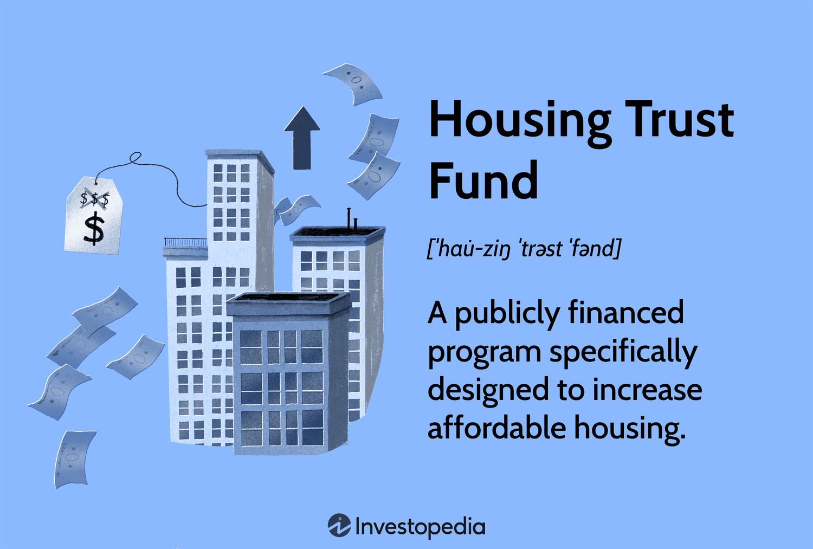

## Table of Contents

## What is a Housing Trust Fund?

A Housing Trust Fund is a special fund set up by the government to help build and keep affordable homes. It uses money from different places, like taxes or fees, to pay for housing projects. This fund helps people who don't have a lot of money to find a place to live that they can afford.

The money in the Housing Trust Fund can be used in many ways. It can help build new homes, fix up old ones, or even help people pay their rent. By doing this, the fund makes sure that more people have a safe and affordable place to live. This is important because everyone needs a good home to live a happy and healthy life.

## How does a Housing Trust Fund work?

A Housing Trust Fund works by collecting money from different sources, like taxes or fees, and using it to help with housing. Governments set up these funds to make sure there's enough money to build and keep homes affordable for people who don't earn a lot. The money can come from things like a small fee added to recording a property deed, or it might come from the government's budget. Once the money is in the fund, it's used to support different housing projects.

The fund can be used in many ways to help with housing. It can pay for building new homes, fixing up old ones, or even helping people pay their rent. The goal is to make sure that more people can find a place to live that they can afford. By doing this, the Housing Trust Fund helps to make sure everyone has a safe and stable home, which is really important for living a good life.

## What are the primary goals of a Housing Trust Fund?

The main goal of a Housing Trust Fund is to make sure there are enough affordable homes for people who don't earn a lot of money. It does this by collecting money from different places, like taxes or fees, and using that money to help with housing projects. This means the fund can help build new homes or fix up old ones, making sure they are safe and good to live in.

Another big goal is to help people who are struggling to pay for a place to live. The money from the fund can be used to help with rent or other housing costs, so people don't have to worry about losing their homes. By doing this, the Housing Trust Fund helps to make sure everyone has a stable place to live, which is important for their health and happiness.

## Who typically administers a Housing Trust Fund?

A Housing Trust Fund is usually run by the government. This can be at the city, county, or state level. The government sets up the fund and decides how the money will be used to help with housing. They make sure the money goes to the right projects, like building new homes or fixing up old ones, so that people who need affordable places to live can get help.

Sometimes, the government works with other groups to manage the fund. These groups can be non-profits or housing agencies that know a lot about helping people find homes. They help make sure the money is used in the best way possible to meet the needs of the community. Together, they work to make sure the Housing Trust Fund helps as many people as possible find a safe and affordable place to live.

## What types of housing projects can be funded by a Housing Trust Fund?

A Housing Trust Fund can help pay for many different kinds of housing projects. It can be used to build new homes that are affordable for people who don't earn a lot of money. This means the fund can help create new places for people to live that they can actually afford. It can also be used to fix up old homes that need repairs, making them safe and good to live in again. This is important because it helps keep the cost of housing down for people who already live in these homes.

The fund can also help with other types of housing projects. For example, it can be used to help people pay their rent if they are having a hard time making ends meet. This can stop people from losing their homes and becoming homeless. The money can also go towards building homes for special groups, like seniors or people with disabilities, who might need different kinds of housing to meet their needs. By doing all these things, the Housing Trust Fund helps make sure everyone has a safe and affordable place to live.

## How is a Housing Trust Fund typically financed?

A Housing Trust Fund gets its money from different places. One common way is through taxes or fees that people pay. For example, when someone buys a house, they might have to pay a small fee, and that money goes into the fund. The government can also decide to put money from its budget into the fund. This helps make sure there is always enough money to help with housing projects.

The money in the Housing Trust Fund can also come from other sources. Sometimes, the government works with other groups, like non-profits or businesses, who might give money to the fund. This can happen through donations or special programs that help with housing. By getting money from different places, the fund can keep helping people find affordable places to live.

## What are the eligibility criteria for receiving funds from a Housing Trust Fund?

The rules for getting money from a Housing Trust Fund can be different depending on where you live. Usually, the money is for people who don't earn a lot and need help with housing. This can mean families, single people, or even seniors who can't afford to pay for a place to live on their own. The government or the group running the fund decides who can get help based on things like how much money they make, how many people are in their family, and what kind of housing they need.

Sometimes, the money can also go to groups that help build or fix up homes. These groups need to show that their projects will make more affordable homes for people who need them. The fund wants to make sure the money is used in the best way to help as many people as possible. By having clear rules, the Housing Trust Fund can make sure the money goes to the right people and projects, helping more people find a safe and affordable place to live.

## Can you provide examples of successful Housing Trust Fund programs?

One successful Housing Trust Fund program is in Denver, Colorado. They started the Denver Housing Trust Fund in 2016. It uses money from a small fee on property sales to help build and fix up homes. Since it started, the fund has helped make thousands of homes more affordable for people who don't earn a lot. It has also helped stop people from losing their homes by helping them pay their rent when they can't afford it. This program shows how a Housing Trust Fund can make a big difference in a city.

Another example is the Washington State Housing Trust Fund. It has been around since 1987 and gets money from the state budget. The fund has helped build and fix up homes all over the state, making sure that people who need affordable places to live can find them. It has also helped special groups like seniors and people with disabilities by making sure there are homes that meet their needs. The Washington State Housing Trust Fund shows how a fund can help a whole state by working with different groups to make sure everyone has a safe place to live.

## What are the common challenges faced in managing a Housing Trust Fund?

One big challenge in managing a Housing Trust Fund is making sure there is enough money to help everyone who needs it. Sometimes, the money coming into the fund isn't enough to cover all the housing projects that need help. This can happen if the taxes or fees that fund the trust don't bring in as much money as expected. People in charge have to decide how to use the money in the best way, which can be hard when there are so many people and projects that need help.

Another challenge is making sure the money goes to the right people and projects. There are rules about who can get help from the fund, and it can be tricky to make sure everyone follows these rules. Sometimes, people might try to get money from the fund even if they don't really need it. The people running the fund have to check carefully to make sure the money is used the way it's supposed to be, which takes a lot of time and effort.

## How do Housing Trust Funds impact local economies?

Housing Trust Funds help local economies by making sure more people can afford a place to live. When people don't have to spend all their money on rent or a mortgage, they have more money to spend on other things. This means they can buy things from local stores, eat at restaurants, and use other services in their community. When people spend more money locally, it helps businesses grow and creates more jobs. This makes the whole economy stronger and helps everyone in the community.

Another way Housing Trust Funds help is by supporting the building and fixing up of homes. When money from the fund is used to build new homes or fix old ones, it creates jobs for construction workers and other people who work in the housing industry. This means more people have jobs and can earn money to spend in the local economy. Also, when homes are built or fixed up, it can make neighborhoods nicer and more attractive to live in. This can bring more people to the area, which can help local businesses even more.

## What role do Housing Trust Funds play in addressing affordable housing crises?

Housing Trust Funds are really important for fixing the problem of not having enough affordable homes. They collect money from different places like taxes or fees and use it to help build new homes or fix up old ones. This means more people who don't earn a lot of money can find a place to live that they can afford. Without these funds, it would be much harder to make sure everyone has a safe and stable home, which is something everyone needs.

By helping with housing, these funds also make the whole community better. When people have a good place to live, they can spend their money on other things, like shopping at local stores or eating at restaurants. This helps the local economy grow and creates more jobs. Housing Trust Funds are a big part of making sure everyone has a home and that the community stays strong and healthy.

## How can the effectiveness of a Housing Trust Fund be measured and evaluated?

The effectiveness of a Housing Trust Fund can be measured by looking at how many new homes it helps to build or how many old homes it helps to fix up. If the fund is helping a lot of people find affordable places to live, then it's working well. Another way to measure it is by seeing if fewer people are becoming homeless because they can get help from the fund to pay their rent or other housing costs. By keeping track of these numbers, people can see if the fund is really making a difference in the community.

Another important way to evaluate a Housing Trust Fund is by looking at how well it uses its money. If the fund is spending its money on the right projects and helping the people who need it the most, then it's being effective. This means checking if the fund is following its rules and making sure the money goes to the right places. By doing this, people can see if the fund is being managed well and if it's helping to solve the problem of not having enough affordable homes.

## References & Further Reading

[1]: Weiner, T. (2008). ["Federal Housing Trust Fund: A Lifeline for Affordable Housing."](https://crsreports.congress.gov/product/pdf/R/R40781) National Low Income Housing Coalition.

[2]: Van den Heuvel, S. J. (2021). ["Algorithmic Trading and Its Impacts on Market Quality."](https://link.springer.com/article/10.1007/s10690-021-09353-5) International Monetary Fund Working Papers.

[3]: U.S. Department of Housing and Urban Development. (2008). ["National Housing Trust Fund: A New Tool to Increase Affordable Housing Supply."](https://www.samhsa.gov/homelessness-programs-resources)

[4]: Carr, J. H., & Kutty, N. K. (Eds.). (2008). ["Segregation: The Rising Costs for America."](https://www.taylorfrancis.com/books/edit/10.4324/9780203895023/segregation-james-carr-nandinee-kutty) Routledge.

[5]: Johnson, B. (2010). ["Algorithmic Trading and Information."](https://archive.org/details/algorithmictradi0000john) CFA Institute Journal of Investment Management.