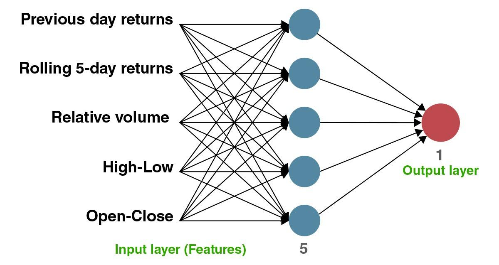

## Table of Contents

## What is a neural network?

A neural network is a type of computer system designed to work and learn like the human brain. It is made up of many connected units called neurons, which work together to process information. Just like how our brain learns from experience, a neural network can learn from the data it is given. It does this by adjusting the connections between its neurons, which helps it to make better predictions or decisions over time.

Neural networks are used in many areas, like recognizing speech, understanding images, and even playing games. For example, when you use a voice assistant on your phone, it uses a neural network to understand what you're saying. The network has been trained on lots of examples of human speech, so it can figure out what words you're using. As it gets more examples, it gets better at understanding different voices and accents. This makes neural networks very powerful tools for solving complex problems.

## What is quantitative trading?

Quantitative trading is a way of buying and selling things like stocks or currencies using math and computers. Instead of guessing or following feelings, people who do quantitative trading use numbers and special formulas to decide when to buy or sell. They look at lots of data, like how prices have changed in the past, and use this information to make their decisions. This method tries to take the emotion out of trading and make it more like a science.

These traders often use computers to do their work quickly and accurately. They write programs that can watch the markets all the time and make trades automatically when certain conditions are met. This can happen very fast, sometimes in just a few seconds. By using computers and math, quantitative traders hope to find patterns that other people might miss and make money from them. It's a bit like trying to solve a puzzle, but the puzzle is always changing and getting more complicated.

## How do neural networks learn to make predictions?

Neural networks learn to make predictions by looking at lots of examples. Imagine you're trying to guess what kind of animal is in a picture. At first, the [neural network](/wiki/neural-network) might not know if it's a cat or a dog. But if you show it many pictures of cats and dogs and tell it which is which, it starts to see patterns. It notices that cats often have pointy ears and dogs usually have floppy ones. The more examples it sees, the better it gets at telling them apart.

The way a neural network learns is by changing the connections between its neurons. Think of these connections like paths in a forest. At first, the paths might lead to the wrong place. But as the neural network sees more examples, it adjusts these paths to lead to the right place more often. This process is called training. Over time, the neural network gets better at making the right predictions because it has fine-tuned its paths based on all the examples it has seen.

## What types of data are used in quantitative trading?

In [quantitative trading](/wiki/quantitative-trading), people use all sorts of numbers and information to make their decisions. They look at things like how much a stock's price has gone up or down over time, how many shares of a stock are being bought and sold, and even news stories that might affect the market. This information helps them spot patterns and make guesses about what might happen next.

Another type of data they use is called "fundamental data." This includes things like how much money a company is making, how much it owes, and what it owns. Traders use this information to figure out if a company is doing well or not. By mixing all these different kinds of data together, quantitative traders try to make smart choices about when to buy and sell.

Sometimes, they also use data from other places, like the weather or economic reports. For example, if a big storm is coming, it might affect the price of oil or other things. By looking at all this information, traders can try to predict what the market will do and make trades based on those predictions.

## How can neural networks be applied to predict stock prices?

Neural networks can be used to predict stock prices by learning from past data. Imagine you have a big book with lots of numbers showing how stock prices went up and down over time. You feed this book to a neural network, and it starts to see patterns. It might notice that when certain things happen, like a company announcing good news, the stock price usually goes up. The more data the neural network sees, the better it gets at guessing what might happen next.

Once the neural network has learned from the data, it can make predictions about future stock prices. It does this by looking at the latest information and using what it has learned to guess where the price might go. Of [course](/wiki/best-algorithmic-trading-courses), predicting stock prices is really hard because lots of things can affect them, like news, world events, and even people's feelings. But by using a neural network, traders can get a little help in making their decisions, hoping to buy low and sell high.

## What are the common architectures of neural networks used in trading?

In trading, people often use a type of neural network called a feedforward neural network. This is like a simple chain where information goes in one direction, from the input to the output. Traders give it numbers about stock prices and other things, and it tries to guess what will happen next. The network has layers of neurons, and each layer helps it learn more about the patterns in the data. It's like building a tower where each floor adds more understanding.

Another common type is a recurrent neural network (RNN). This one is special because it can remember things from the past. It's like having a memory that helps it understand how stock prices have changed over time. RNNs are good for trading because they can look at the history of prices and use that to make better guesses about the future. They're a bit more complicated than feedforward networks, but they can be very powerful tools for traders.

Sometimes, traders use a special kind of RNN called a Long Short-Term Memory (LSTM) network. LSTMs are even better at remembering things over long periods. They can look at what happened months ago and still use that information to predict what might happen tomorrow. This makes them really useful for understanding the ups and downs of the stock market over time.

## How do neural networks help in risk management in trading?

Neural networks help in risk management in trading by looking at lots of numbers and finding patterns that humans might miss. They can predict how risky a trade might be by learning from past data. For example, they might see that when a certain stock goes up, another stock often goes down. By understanding these patterns, traders can make smarter choices about which trades to make and how much money to risk on each one.

Another way neural networks help is by keeping an eye on the market all the time. They can spot when things start to get risky, like if a stock price is moving too fast or if there's a big change in the market. When they see these signs, they can warn traders to be careful or even make trades automatically to reduce risk. This helps traders avoid big losses and keep their money safe.

## What are the challenges of using neural networks in real-time trading?

Using neural networks in real-time trading can be tricky because they need a lot of computer power. These networks have to look at lots of numbers very quickly to make good guesses about what will happen next. If the computer isn't fast enough, the network might not be able to keep up with the fast-changing market. This can lead to slow decisions, which can be a big problem in trading where every second counts.

Another challenge is that the market can be really unpredictable. Neural networks learn from past data, but the future might not be like the past. If something new happens, like a big world event, the network might not know how to react because it hasn't seen it before. This means traders have to be careful and not rely only on the network's guesses. They need to keep an eye on things and be ready to step in if the network makes a wrong prediction.

## How can overfitting be managed in neural network models for trading?

Overfitting happens when a neural network gets too good at understanding the data it has been trained on, but then it doesn't work well with new data. In trading, this means the network might make great guesses about past stock prices, but it can't predict future prices well. To stop this from happening, traders can use something called "regularization." This makes the network simpler by adding a little penalty for making the model too complicated. It's like telling the network to not try too hard to fit every little detail of the past data, so it can be better at guessing what will happen next.

Another way to manage overfitting is by using "cross-validation." This means splitting the data into different parts and using some parts to train the network and other parts to test it. By doing this, traders can see how well the network works on data it hasn't seen before. If it does well on the test data, it's less likely to be overfitting. Traders can also use more data for training. The more examples the network sees, the better it can learn the general patterns without focusing too much on the small details. This helps the network make better guesses about future stock prices.

## What role do neural networks play in algorithmic trading strategies?

Neural networks help in [algorithmic trading](/wiki/algorithmic-trading) by learning from past data to make smart guesses about what will happen next. Traders give the network lots of numbers about stock prices, how much people are buying and selling, and other things. The network looks for patterns in this data, like how certain events can make stock prices go up or down. By understanding these patterns, the network can help traders decide when to buy or sell stocks. This can make trading more like a science, where decisions are based on numbers and not just feelings.

One big advantage of using neural networks in trading is that they can work very quickly. They can watch the market all the time and make trades in just a few seconds. This is important because the market can change fast, and being quick can help traders make money. But there are also challenges. Sometimes, the network might get too good at understanding the past data and not be good at guessing the future. Traders have to be careful and use tricks like regularization and cross-validation to make sure the network doesn't overfit. By doing this, they can use neural networks to make better trading strategies.

## How do neural networks integrate with other AI techniques in quantitative trading?

Neural networks often work together with other AI techniques in quantitative trading to make better guesses about the market. One common way they do this is by teaming up with something called genetic algorithms. These algorithms are like nature's way of finding the best solution by trying lots of different ones and keeping the best. They can help set up the neural network in the best way possible, like choosing the right number of layers or neurons. By working together, the neural network can learn from the data more effectively, and the genetic algorithm can make sure the network is set up to do its best job.

Another way neural networks integrate with other AI techniques is by using [reinforcement learning](/wiki/reinforcement-learning). This is like learning by doing, where the network tries different actions and gets rewards or penalties based on how well it does. In trading, the network might try different ways of buying and selling stocks and learn which ones make the most money. By combining this with the pattern-finding power of neural networks, traders can create strategies that adapt to the market over time. This makes the trading system smarter and better at making money.

## What advanced techniques can enhance the performance of neural networks in high-frequency trading?

In high-frequency trading, where trades happen very quickly, neural networks can be made better by using something called "ensemble methods." This means using more than one neural network at the same time. Each network might look at the data a little differently, and by combining their guesses, traders can get a better overall prediction. It's like asking a group of friends for advice instead of just one person. If one network makes a mistake, the others can help correct it, making the whole system more reliable and accurate.

Another way to boost the performance of neural networks in high-frequency trading is by using "transfer learning." This is when a network that has already learned from one kind of data is used to help with another kind of data. For example, a network trained on stock prices from one market can be tweaked to work on another market. This saves time because the network doesn't have to start learning from scratch. It can use what it already knows to make better guesses faster, which is really important in high-frequency trading where every second counts.

## References & Further Reading

[1]: Bergstra, J., Bardenet, R., Bengio, Y., & Kégl, B. (2011). ["Algorithms for Hyper-Parameter Optimization."](https://papers.nips.cc/paper_files/paper/2011/hash/86e8f7ab32cfd12577bc2619bc635690-Abstract.html) Advances in Neural Information Processing Systems 24.

[2]: ["Advances in Financial Machine Learning"](https://www.amazon.com/Advances-Financial-Machine-Learning-Marcos/dp/1119482089) by Marcos Lopez de Prado

[3]: ["Evidence-Based Technical Analysis: Applying the Scientific Method and Statistical Inference to Trading Signals"](https://www.wiley.com/en-gb/Evidence+Based+Technical+Analysis:+Applying+the+Scientific+Method+and+Statistical+Inference+to+Trading+Signals-p-9780470008744) by David Aronson

[4]: ["Machine Learning for Algorithmic Trading"](https://www.amazon.com/Machine-Learning-Algorithmic-Trading-intelligence/dp/9918608013) by Stefan Jansen

[5]: ["Quantitative Trading: How to Build Your Own Algorithmic Trading Business"](https://www.amazon.com/Quantitative-Trading-Build-Algorithmic-Business/dp/0470284889) by Ernest P. Chan