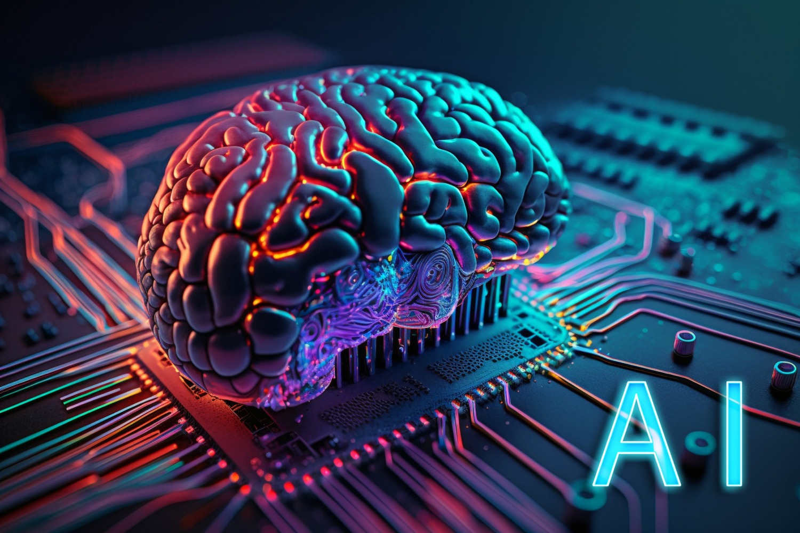

## Table of Contents

## What is macro trading and why is it important?

Macro trading is a type of investment strategy where traders look at big picture things like the economy, politics, and world events to make their trading decisions. Instead of focusing on single companies or stocks, macro traders try to predict how these big factors will affect whole markets or countries. They might trade currencies, commodities, or even bonds based on their guesses about what will happen next in the world.

This type of trading is important because it helps investors understand and react to changes in the global economy. By looking at the bigger picture, macro traders can spot trends and opportunities that others might miss. This can lead to big profits if they get their predictions right. Also, macro trading can help balance out risks in an investment portfolio, making it a useful tool for anyone looking to protect their money from sudden changes in the market.

## How does AI differ from traditional analysis in macro trading?

AI in macro trading uses computers to look at huge amounts of data really quickly. It can find patterns and connections that people might miss. Instead of just looking at numbers and charts like in traditional analysis, AI can also use things like news articles, social media posts, and even satellite images to make predictions. This means AI can see the big picture faster and more accurately than a person could, helping traders make better decisions.

Traditional analysis in [macro trading](/wiki/macro-trading) relies a lot on people's experience and gut feelings. Analysts look at economic reports, government data, and historical trends to guess what might happen next. They spend a lot of time reading and thinking about the information they have. While this method can be good, it's slower and can be affected by human errors or biases. AI, on the other hand, doesn't get tired or let emotions cloud its judgment, which can make it more reliable and efficient.

In summary, AI and traditional analysis both aim to predict market movements, but they do it in different ways. AI uses technology to process a lot of different types of data quickly and without bias, while traditional analysis depends on human expertise and can be slower and more subjective. Combining both methods can give traders a more complete view of the market and help them make smarter trading choices.

## What types of data does AI use for macro trading strategies?

AI uses many different types of data for macro trading strategies. It looks at numbers like economic reports, stock prices, and interest rates. These are the usual things that traders have always used, but AI can go through them much faster and find patterns that might be hard for people to see. For example, AI can look at how unemployment rates in different countries might affect currency values or how changes in oil prices might influence stock markets.

But AI doesn't stop there. It also uses other kinds of information that traditional traders might not think about. This can include news articles, social media posts, and even satellite images. By reading news and social media, AI can pick up on public feelings and big events that might move markets. And with satellite images, AI can see things like crop health or shipping traffic, which can tell it about future supply and demand for commodities. All this extra data helps AI make better guesses about what will happen in the markets.

## How can AI help in predicting economic indicators?

AI can help predict economic indicators by looking at a lot of different information really quickly. It can go through numbers like unemployment rates, inflation, and GDP growth from many countries. By finding patterns in this data, AI can guess what might happen next with these indicators. For example, if AI sees that unemployment is going down in a lot of places, it might predict that the economy will grow.

But AI doesn't just look at numbers. It also uses other things like news stories, social media posts, and even pictures from satellites. By reading news and social media, AI can understand what people are feeling and thinking about the economy. And with satellite images, AI can see things like how much food is being grown or how busy shipping ports are. All this extra information helps AI make better predictions about economic indicators.

## What role does AI play in analyzing global market trends?

AI helps a lot in figuring out what's happening with global market trends. It looks at tons of information from all over the world, like stock prices, economic reports, and even news stories. By going through all this data quickly, AI can spot patterns that might be hard for people to see. For example, if AI notices that a lot of countries are doing well economically, it might predict that global markets will keep growing.

AI also uses other kinds of information that might not seem important at first. It can read social media posts to see what people are feeling about the economy, or look at satellite images to check how much food is being grown or how busy shipping ports are. By putting all this together, AI can give a full picture of what's happening in the world's markets. This helps traders and investors make better decisions about where to put their money.

## How can AI assist in risk management for macro trading?

AI helps with risk management in macro trading by looking at a lot of information very quickly. It can see patterns and trends that might be hard for people to notice. For example, AI can watch how different markets are moving and guess what might happen next. This helps traders know when it might be risky to trade in certain markets. By understanding these risks better, traders can make smarter choices about where to put their money and how much to invest.

AI also uses special math models to figure out how risky different trades might be. These models can look at things like how much a market might go up or down, or how likely it is that something unexpected will happen. By using these models, AI can suggest ways to spread out investments so that if one market does badly, the whole portfolio doesn't get hurt too much. This way, AI helps traders keep their money safer and manage risks better.

## What are some common AI algorithms used in macro trading?

In macro trading, AI uses different kinds of math tricks to help traders make better choices. One common trick is called [machine learning](/wiki/machine-learning). This is where computers learn from past data to make guesses about what might happen next. For example, they might look at old stock prices and economic reports to predict how markets will move in the future. Another popular trick is neural networks, which are a bit like the human brain. They can find hidden patterns in data that are hard for people to see. These patterns can help traders understand big things like how the economy or politics might affect markets.

Another important algorithm used in macro trading is called natural language processing (NLP). This helps computers read and understand things like news articles and social media posts. By knowing what people are saying and feeling about the economy, AI can make better guesses about market trends. Lastly, there's something called [reinforcement learning](/wiki/reinforcement-learning), where AI learns by trying different things and seeing what works best. This can help traders figure out the best ways to trade and manage risks. All these algorithms help AI give traders a clearer picture of the big things that move markets.

## How does AI enhance the speed and efficiency of macro trading decisions?

AI makes macro trading faster and easier by looking at a lot of information really quickly. Instead of traders having to read through tons of reports and news articles, AI can do it in seconds. It uses special math tricks to find patterns and trends that might be hard for people to see. This means traders can make decisions much faster because AI gives them the information they need right away. For example, if there's a big news event that might affect the markets, AI can quickly tell traders how it might change things, helping them decide what to do next.

AI also helps traders make better choices by looking at different kinds of information at the same time. It can read news, check social media, and even look at satellite pictures to get a full picture of what's happening in the world. By putting all this together, AI can see the big picture faster and more clearly than a person could. This helps traders react quickly to changes in the market and make smart decisions about where to put their money. In the end, AI makes macro trading not just faster, but also more efficient and reliable.

## Can AI help in identifying and exploiting market inefficiencies?

AI can help traders find and use market inefficiencies by looking at a lot of data really quickly. Market inefficiencies happen when prices don't match what they should be based on all the information out there. AI can spot these differences by going through numbers, news, and even social media posts. It can find patterns that show when a market might be undervalued or overvalued. This helps traders buy or sell at the right time to make a profit.

For example, if AI sees that a lot of people are talking about a certain country's economy getting better, but the stock market there hasn't gone up yet, it might suggest buying stocks in that country. AI can also look at how different markets are connected and find times when one market might be moving in a way that doesn't make sense with others. By using this information, traders can make smart moves to take advantage of these inefficiencies before everyone else catches on.

## What are the challenges and limitations of using AI in macro trading?

Using AI in macro trading can be tricky because it needs a lot of good data to work well. If the data is wrong or missing important pieces, AI might make bad guesses about the market. Also, AI can be fooled by sudden big events that nobody saw coming, like a natural disaster or a big political change. These things can shake up markets in ways that AI might not be ready for. Another problem is that AI can sometimes see patterns that aren't really there, a bit like seeing shapes in the clouds. This can lead traders to make choices based on things that won't actually happen.

Another challenge is that AI can be really hard to understand. It's like a black box where you put in data and get out a guess, but it's tough to know how it got there. This can make it hard for traders to trust AI completely, especially when they need to explain their decisions to others. Plus, using AI takes a lot of computer power and can be expensive. Not everyone can afford to use the best AI tools, which means some traders might be at a disadvantage. Even with these challenges, AI can still help a lot in macro trading, but it's important to know its limits and use it carefully.

## How can AI be integrated into existing macro trading systems?

AI can be added to the systems traders already use by linking it with the software they have. This means AI can look at the same data traders are using, but it can do it faster and find patterns that might be hard for people to see. Traders can set up AI to watch for certain signs in the market, like changes in stock prices or big news events, and then give them advice on what to do next. This way, AI can help traders make better decisions without needing to change their whole way of working.

But adding AI isn't just about plugging it in. Traders need to make sure the AI fits well with their current tools and that everyone knows how to use it. They might need to train their team on how AI works and how to trust its advice. Also, they should keep checking the AI to make sure it's giving good information and not making mistakes. By doing this, traders can use AI to make their macro trading systems smarter and more efficient.

## What future developments can we expect in AI-driven macro trading strategies?

In the future, AI-driven macro trading strategies will get even better at looking at data. AI will be able to handle even more types of information, like videos and voice recordings, to understand what's happening in the world. This means AI will be able to make even smarter guesses about how the economy and markets will move. Also, AI will get better at working with other AI systems, so different parts of a trading company can share information and make better decisions together.

Another thing we might see is AI becoming more able to explain its decisions in a way that people can understand. Right now, AI can be a bit like a black box, but in the future, it will be more open about how it thinks. This will help traders trust AI more and use its advice better. As AI keeps getting better, it will also become easier for smaller traders to use, so more people can benefit from these smart tools.

## How can AI be implemented in Global Macro Strategy?

Implementing AI in Global Macro Strategy involves a strategic approach to selecting, testing, and maintaining the necessary tools for data analytics, risk assessment, and predictive modeling. The integration of AI starts with identifying the right tools that align with the organization's specific needs in handling large datasets and making accurate predictions.

### Selecting the Right Tools

The first step in AI implementation is choosing tools that cater to the specific requirements of [global macro](/wiki/global-macro-strategy) strategies. Tools like Python libraries (TensorFlow, PyTorch) are ideal for building custom models, while platforms like DataRobot offer automated machine learning tailored to business use cases. Key factors to consider when selecting tools include:

- **Data Analytics**: The ability to process and analyze large datasets efficiently.
- **Risk Assessment**: Tools should offer capabilities to model and predict potential risks, improving the decision-making process.
- **Predictive Modeling**: Robust algorithms that can forecast based on historical data and current trends.

By leveraging these tools, financial analysts can convert complex datasets into actionable insights, underpinning more informed strategic decisions.

### Pilot Testing

Pilot testing in a controlled environment is crucial to determine the efficacy of AI tools before wide-scale deployment. This phase helps in identifying any shortcomings and allows for fine-tuning the tools to better suit the organization's needs. A successful pilot test involves:

1. **Setting Clear Objectives**: Define what you aim to achieve with AI in the context of global macro strategy, such as improving forecasting accuracy or enhancing risk management.
   
2. **Data Collection and Preparation**: Gather relevant datasets and preprocess them to ensure quality inputs for the AI algorithms.

3. **Evaluation Metrics**: Establish metrics for evaluating the performance of the AI models. For instance, Mean Absolute Error (MAE) or Root Mean Square Error (RMSE) could be used to assess predictive models:

$$
\text{MAE} = \frac{1}{n} \sum_{i=1}^{n} |y_i - \hat{y}_i|
$$

$$
\text{RMSE} = \sqrt{\frac{1}{n} \sum_{i=1}^{n} (y_i - \hat{y}_i)^2}
$$

4. **Iterative Improvement**: Use the feedback from pilot tests to iteratively improve the tool's algorithms and functionality.

### Ongoing Maintenance and Updates

Once the tools are operational, ongoing maintenance and regular updates are vital to keep the AI systems effective and competitive. This includes:

- **Model Retraining**: Regularly retraining models with new data to ensure that predictions and risk assessments remain relevant and accurate.
- **Software Updates**: Keeping the software and tools up-to-date with the latest technological advancements and security patches.
- **Performance Monitoring**: Continuously monitor the performance of AI models to identify areas for improvement and optimization.

By maintaining this cycle of evaluation and improvement, organizations can ensure that their AI-supported global macro strategies are not only effective but also resilient to market changes and technological advancements.

## References & Further Reading

[1]: Bergstra, J., Bardenet, R., Bengio, Y., & Kégl, B. (2011). ["Algorithms for Hyper-Parameter Optimization."](https://papers.nips.cc/paper_files/paper/2011/hash/86e8f7ab32cfd12577bc2619bc635690-Abstract.html) Advances in Neural Information Processing Systems 24.

[2]: ["Advances in Financial Machine Learning"](https://www.amazon.com/Advances-Financial-Machine-Learning-Marcos/dp/1119482089) by Marcos Lopez de Prado

[3]: ["Evidence-Based Technical Analysis: Applying the Scientific Method and Statistical Inference to Trading Signals"](https://www.wiley.com/en-gb/Evidence+Based+Technical+Analysis:+Applying+the+Scientific+Method+and+Statistical+Inference+to+Trading+Signals-p-9780470008744) by David Aronson

[4]: ["Machine Learning for Algorithmic Trading"](https://www.amazon.com/Machine-Learning-Algorithmic-Trading-intelligence/dp/9918608013) by Stefan Jansen

[5]: ["Quantitative Trading: How to Build Your Own Algorithmic Trading Business"](https://www.amazon.com/Quantitative-Trading-Build-Algorithmic-Business/dp/0470284889) by Ernest P. Chan