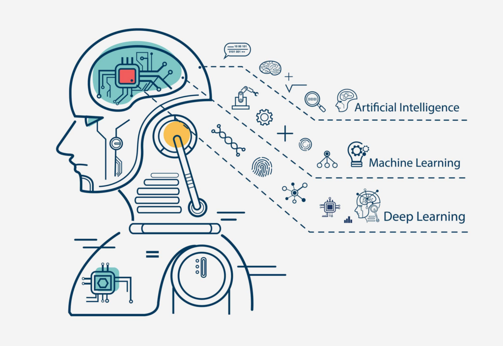

Artificial Intelligence (AI) is revolutionizing the financial markets, making trading strategies more efficient and effective. As technology advances, AI continues to attract attention for its potential to significantly impact trading performance. By analyzing vast amounts of data at incredible speeds, AI can uncover patterns and insights that human traders might miss, enhancing decision-making and profitability.

AI enables traders to use algorithms that can process complex datasets to detect trends and predict potential market movements, something that can greatly mitigate risks and improve returns. For instance, machine learning models can be trained on historical price data to forecast future prices or volatility. By leveraging predictive analytics, traders can capitalize on profitable opportunities more consistently.



In recent years, the accessibility of AI tools has expanded, making it an exciting area for beginners looking to enhance their trading strategies. This article aims to provide a roadmap for those new to AI in trading, guiding them through the initial steps of implementation. We will explore the basics of AI, discuss its benefits, address potential challenges, and offer practical advice on how to effectively integrate AI into trading practices. By the end, even beginners will be equipped with the knowledge to start utilizing AI in their trading endeavors, paving the way for more informed and strategic financial decisions.


## Table of Contents


## Understanding the Basics of AI

Artificial Intelligence (AI) has revolutionized various industries, with trading being one of its significant beneficiaries. In the trading context, AI refers to systems capable of analyzing vast amounts of financial data, recognizing patterns, and making autonomous decisions to execute trades. Initially, AI's presence was minimal, limited to [algorithmic trading](/wiki/algorithmic-trading) and basic automation. However, advancements in machine l[earning](/wiki/earning-announcement) and computing power have drastically reshaped this landscape, enabling more sophisticated applications.

The concept of AI in trading predominantly hinges on [machine learning](/wiki/machine-learning) and predictive analytics. Machine learning, a subset of AI, involves training algorithms using historical data to make predictions or decisions without explicit programming. This is crucial in trading, where past market data can help forecast future price movements. Predictive analytics, a statistical technique that leverages machine learning algorithms, is employed to identify potential investment opportunities by estimating the likelihood of future outcomes based on historical patterns.

Data plays a pivotal role in the AI-driven trading ecosystem. High-quality, comprehensive datasets are essential for training effective AI models. The accuracy and reliability of an AI trading strategy heavily depend on the depth and breadth of data available. Large datasets improve the model's ability to learn from historical trends and anomalies, enhancing its predictive performance. For instance, stock prices, trading [volume](/wiki/volume-trading-strategy)s, and economic indicators are some of the key data points used to train these models.

Artificial Intelligence in trading has evolved significantly, moving from basic automation to complex, predictive analytics that leverage machine learning algorithms. Understanding these basics, including the critical role of data, is foundational for anyone looking to explore AI-driven trading strategies.


## The Benefits of AI in Trading Strategies

Artificial Intelligence (AI) is transforming the landscape of trading, offering capabilities that enhance decision-making, risk management, and operational efficiency. For traders, especially beginners, understanding how AI can be leveraged to improve their strategies is crucial for staying competitive.

**Improving Decision-Making through Data Analysis**

AI algorithms process vast amounts of data at speeds unreachable by human traders. By employing machine learning techniques, AI systems identify patterns and trends in historical and real-time data, which can support predictive analytics. For instance, AI can analyze market sentiment through natural language processing (NLP) by examining news articles, social media posts, and other textual data to forecast market movements.

Moreover, AI can automatically adjust trading strategies based on incoming data, optimizing buy or sell decisions. The precision of AI in data analysis minimizes guesswork, allowing traders to make informed decisions that reduce potential losses and increase profitability.

**The Role of AI in Risk Management and Fraud Detection**

AI plays a vital role in risk management by providing real-time insights and foresight into potential market shifts. With machine learning models, AI can predict market [volatility](/wiki/volatility-trading-strategies) and advise on risk exposure adjustments. This predictive capability enables traders to protect portfolios from unexpected market events.

In fraud detection, AI systems are continuously learning and monitoring trading activities. By establishing behavioral baselines, AI can identify suspicious activities that deviate from the norm, such as unusual transaction sizes or atypical trading patterns. These systems can flag potential fraud attempts for further investigation, thus safeguarding traders against malicious activities.

**Enhancing Trading Speed and Accuracy with AI Algorithms**

Algorithmic trading, powered by AI, enhances both speed and accuracy. AI algorithms can execute trades in milliseconds, exploiting [arbitrage](/wiki/arbitrage) opportunities unavailable to human traders due to delays in decision-making and execution. Python-based frameworks such as `pandas` and libraries like `scikit-learn` are often used to build and backtest these algorithms, optimizing their performance before their deployment in live markets.

Additionally, precise AI algorithms reduce the error margins in trading execution, ensuring that trades are executed at optimal prices. This is especially advantageous in high-frequency trading environments, where even slight delays can result in significant losses.

In summary, the integration of AI into trading strategies yields substantial benefits by enhancing decision-making capabilities, supporting robust risk management, and improving trade execution speed and accuracy. While AI offers these potential advantages, it requires careful implementation and continuous monitoring to maximize its effectiveness.


## Challenges Faced by Beginners

Implementing Artificial Intelligence (AI) in trading poses several challenges for beginners, especially when misconceptions and technical hurdles are considered. The allure of AI's potential in generating profitable trading strategies often overshadows the compl[exit](/wiki/exit-strategy)ies beneath the surface, leading to several common misconceptions.

One of the primary misconceptions is that AI can guarantee success with little to no human intervention. Many newcomers assume that once a model is set, it can autonomously handle all trading activities. While AI excels at processing large datasets and can provide valuable insights, it still requires human oversight and adjustments. Trading environments are dynamic, and AI models need frequent updates to adapt to changing market conditions.

Another fear is the perceived complexity of AI technologies. Terms like machine learning, [neural network](/wiki/neural-network)s, and predictive analytics can intimidate beginners. Overcoming this challenge involves demystifying these concepts and understanding that many trading platforms offer user-friendly tools tailored for beginners. These platforms often provide pre-built models and data handling facilities, allowing individuals to focus on strategy rather than underlying technical intricacies.

From a technical standpoint, implementing AI also presents significant challenges. Beginners might struggle with selecting appropriate algorithms that align with their trading goals. Each algorithm—be it linear regression, decision trees, or [deep learning](/wiki/deep-learning)—has specific strengths and weaknesses. Understanding when and how to employ them effectively requires a learning curve.

Additionally, there's the challenge of acquiring the necessary programming skills. Though some platforms offer graphical interfaces, having a foundational understanding of coding languages like Python can be crucial. Python, in particular, is favored for its extensive libraries such as NumPy for numerical computation, pandas for data manipulation, and Scikit-learn for machine learning.

```python
import numpy as np
import pandas as pd
from sklearn.model_selection import train_test_split
from sklearn.linear_model import LinearRegression

# Sample code to illustrate a basic linear regression model
# Assume 'data' is a DataFrame with 'features' and 'target' columns
X = data[['features']]
y = data['target']

# Splitting the dataset into training and testing sets
X_train, X_test, y_train, y_test = train_test_split(X, y, test_size=0.2, random_state=42)

# Implementing linear regression
model = LinearRegression()
model.fit(X_train, y_train)

# Making predictions
predictions = model.predict(X_test)
```

Moreover, data quality and availability are significant issues. AI models rely heavily on vast amounts of quality data to provide accurate predictions. Beginners may find it challenging to source reliable data, clean it effectively, and ensure it's suitable for training purposes. Poor-quality data can lead to erroneous predictions, reinforcing the importance of comprehensive data validation.

Access to real-time market data is equally crucial, and this may be cost-prohibitive for beginners. Free datasets are worth exploring, though they often lack the depth and breadth necessary for robust models.

Overcoming these challenges requires education, practice, and leveraging available resources wisely. Engaging with online communities and forums can provide beginners with guidance and support, accelerating their journey into successful AI-driven trading.


## Essential Tools and Resources for Getting Started

To successfully integrate AI into trading, beginners need to utilize the right tools and resources. There are numerous beginner-friendly AI tools and platforms available that cater specifically to trading applications. Here’s a look at some of the most valuable options:

### Beginner-Friendly AI Tools and Platforms

1. **QuantConnect**: This platform offers a cloud-based algorithmic trading environment. Users can design, simulate, and deploy strategies in multiple programming languages. QuantConnect is beginner-friendly due to its extensive library of pre-built algorithms and data.

2. **Quantopian (Now Part of Robinhood)**: Although Quantopian itself has been discontinued, many of its educational resources and community-driven datasets continue to be invaluable for beginners. Robinhood has integrated some of these resources, making basic algorithmic trading more accessible.

3. **MetaTrader 5**: Known primarily for forex and stock trading, MetaTrader 5 incorporates algorithmic trading. It provides features like automated trading robots and signals, which can be a stepping stone for beginners interested in using AI-based strategies.

4. **Alpaca**: This commission-free trading platform supports algorithmic stock trading. Alpaca’s API-first approach allows beginners to build and deploy trading bots easily using languages like Python.

5. **Interactive Brokers**: With their Trader Workstation (TWS), Interactive Brokers offers a robust platform for developing trading algorithms. Beginners can leverage tools like the Algo trading interface for creating AI-driven solutions.

### Free and Paid Resources for Learning AI Applications in Trading

- **Coursera and edX**: These platforms host numerous courses on AI and machine learning, often taught by professors from top universities. Courses focus on practical applications, making them suitable for understanding trading applications.

- **Kaggle**: Known for its data science community, Kaggle offers datasets and machine learning challenges that can help novices gain practical experience. Their "Kernels" feature allows beginners to write and share code with the community.

- **Books**:
  - *"Advances in Financial Machine Learning" by Marcos López de Prado*: This book presents methods covering asset management and provides a good understanding of financial applications of machine learning.
  - *"Machine Learning for Asset Managers" by Marcos López de Prado*: For those focused on asset management, this book provides strategies and insights on integrating machine learning in trading.

- **YouTube Channels**: Channels such as Sentdex provide tutorials on Python programming and AI, often progressing into financial applications.

### Community and Online Forums

- **Reddit (r/algotrading, r/quantfinance)**: These subreddits offer a place for enthusiasts and professionals to discuss algorithmic trading and quantitative finance, share experiences, and provide feedback on trading strategies.

- **QuantConnect Community Forum**: Actively participating in this forum can help beginners find mentorship and advice from experienced traders and developers.

- **Stack Exchange (Quantitative Finance & Data Science)**: Offering Q&A-style interaction, these forums are excellent for troubleshooting issues and learning from community expertise.

In summary, beginners seeking to apply AI in trading have access to a wealth of tools and resources. Starting with beginner-friendly platforms and engaging with online educational content and communities will create a solid foundation for developing and enhancing AI-driven trading strategies.


## Step-by-Step Guide to Implementing AI in Trading

Implementing AI in trading requires a systematic approach, beginning with clearly identifying your trading goals. Your goals might include maximizing returns, minimizing risks, automating trading actions, or enhancing prediction accuracy. Once you establish these goals, AI can play a vital role by providing data-driven insights, automating decision-making processes, and offering predictive analytics to anticipate market trends.

### Selecting the Right AI Tools and Platforms

**1. Research and Choose Suitable AI Tools:**
Begin by researching AI tools tailored for trading. Platforms such as MetaTrader, TradeStation, and QuantConnect offer integrated environments for algorithmic trading. These platforms provide the necessary infrastructure to develop, test, and deploy AI-driven strategies. Consider [factor](/wiki/factor-investing)s like ease of use, community support, and integration capabilities with your existing trading platforms.

**2. Focus on Machine Learning Frameworks:**
Python libraries like TensorFlow, Keras, and Scikit-learn are popular choices for developing machine learning models. These libraries provide robust frameworks for building and training models to analyze historical data, recognize patterns, and make predictions. Start with beginner-friendly libraries and advance as you gain more insights.

```python
import pandas as pd
from sklearn.model_selection import train_test_split
from sklearn.ensemble import RandomForestClassifier

# Sample snippet to split data and implement a basic model
data = pd.read_csv('market_data.csv')
features = data[['feature1', 'feature2', 'feature3']]
target = data['target']

X_train, X_test, y_train, y_test = train_test_split(features, target, test_size=0.2)

model = RandomForestClassifier()
model.fit(X_train, y_train)
```

### Developing, Testing, and Refining Your AI-driven Trading Strategy

**1. Initial Development:**
Start by creating a basic trading strategy using historical data to train your AI models. For instance, a strategy could be based on predicting stock price movements using machine learning classifiers. Define clear metrics for success, such as a percentage of profitable trades or a specific return on investment.

**2. Testing and Backtesting:**
Before deploying your strategy in live markets, backtest it using historical data. Backtesting allows you to evaluate how your strategy would have performed in the past, helping to identify potential flaws and areas for improvement. Utilize your chosen platform's simulation tools to conduct these tests robustly.

**3. Refinement and Optimization:**
Use insights from testing to refine your algorithm. Adjust parameters, incorporate new data sources, or switch to more advanced machine learning models if needed. This stage is iterative, often involving trial and error to maximize the strategy's effectiveness.

**4. Live Deployment and Monitoring:**
Once satisfied with the [backtesting](/wiki/backtesting) results, deploy your strategy in live markets with a cautious approach, such as starting with a small investment. Monitor your AI model's performance regularly, staying vigilant to market changes and model drifts that could impact efficacy.

By systematically identifying goals, selecting suitable tools, and diligently developing your strategy, you enhance the potential success of AI in trading. Regular monitoring and adaptation will ensure that your trading strategy remains robust and adaptable to market dynamics.


## Best Practices for Successful AI Trading Strategy

To develop a successful AI trading strategy, practitioners must focus on several best practices to ensure optimal performance and ethical standards. Here are key practices to consider:

### Regularly Monitoring and Updating AI Models

AI models in trading require constant vigilance to maintain their effectiveness as markets evolve. Regular updates and monitoring are crucial. This involves checking model predictions against actual market movements and adjusting parameters as necessary. Automation can aid this process through continuous performance evaluation, using metrics such as Mean Absolute Error (MAE) or Root Mean Square Error (RMSE) to quantify prediction accuracy:

$$
\text{RMSE} = \sqrt{\frac{1}{n}\sum_{i=1}^{n}(y_i - \hat{y}_i)^2}
$$

Automating updates ensures your strategy remains aligned with market dynamics, potentially utilizing Version Control tools and Continuous Integration/Continuous Deployment (CI/CD) pipelines to seamlessly implement changes.

### Integrating Human Insights and AI for Optimal Results

While AI can process vast amounts of data and identify patterns, human intuition and market understanding provide context crucial to decision-making. Traders should combine quantitative AI model outputs with qualitative analysis for robust strategies.

An approach to integrate these insights effectively is through feedback loops. After AI-driven decisions, analyze outcomes and refine strategies with human oversight. This can also involve using ensemble methods, combining various AI models and human expertise to mitigate risk and enhance predictive power. For instance, adjusting weightage in the ensemble output based on recent performance evaluation can refine predictions.

### Ethical Considerations and Maintaining Transparency

As AI-driven trading increases, ethical considerations become fundamental. This includes ensuring that AI models do not exploit market inefficiencies to the detriment of fairness. Transparency in how models make decisions is crucial — stakeholders should understand the rationale behind trades, modeled using techniques like Explainable AI (XAI). For example, SHAP (SHapley Additive exPlanations) values provide insights into feature impact on predictions:

```python
import shap

explainer = shap.Explainer(model)
shap_values = explainer(data)
shap.summary_plot(shap_values, features=data)
```

By maintaining transparent AI processes, traders comply with regulatory requirements and build trust with clients. This also means considering the potential societal impacts of trading strategies and ensuring adherence to legal and ethical standards. 

In conclusion, successful AI trading strategies require a balanced approach combining regular model maintenance, human insight, and ethical transparency. By adhering to these practices, traders can harness AI's power while mitigating risks and upholding ethical standards.


## Conclusion

Integrating AI into trading offers numerous benefits for beginners, significantly enhancing their ability to navigate and succeed in the financial markets. AI can analyze vast quantities of data at speeds unattainable for human traders, providing insights that drive more informed decisions. For beginners, this means the potential to harness sophisticated data analysis without needing advanced technical expertise initially. AI-driven algorithms can also aid in risk management and fraud detection by identifying patterns and anomalies that might elude manual analysis.

Embracing AI in trading is not a one-time endeavor but a dynamic journey requiring continuous learning and adaptation. The trading landscape and AI technology are ever-evolving, necessitating ongoing education to stay abreast of the latest tools, techniques, and market trends. Beginners should be proactive in accessing resources such as online [course](/wiki/best-algorithmic-trading-courses)s, forums, and communities to refine their skills and strategies continuously.

As AI technology advances, its integration into trading is poised to deepen, offering increasingly sophisticated solutions that enhance both speed and accuracy. However, success in AI trading also relies on ethical considerations and transparency, as traders balance algorithmic efficiency with human judgment.

In conclusion, while AI provides powerful tools for enhancing trading strategies, its effectiveness lies in the user's commitment to continuous improvement and ethical practice. The future of AI in trading promises further innovations that will transform how traders understand and react to market dynamics, making it an exciting field for new entrants.