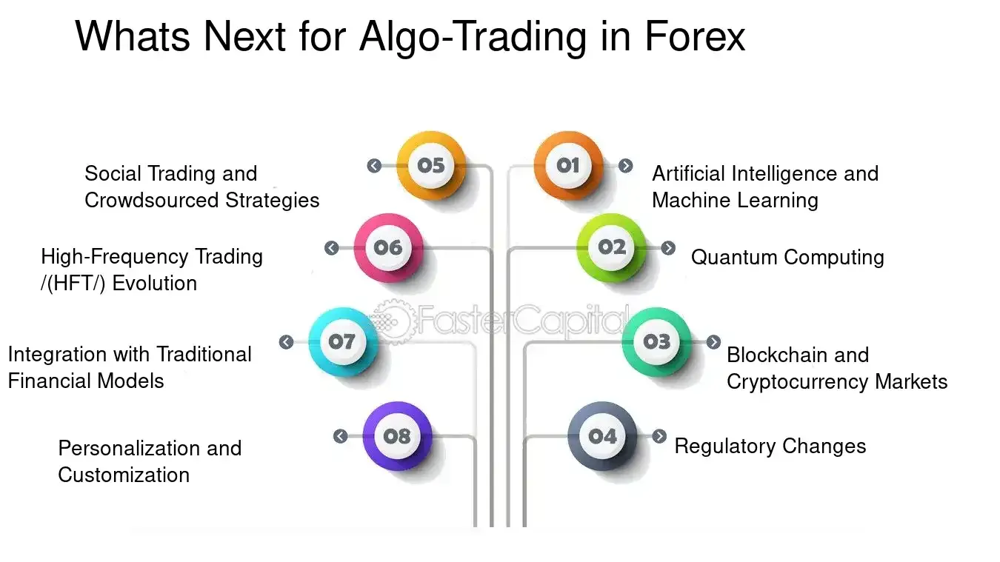

## Table of Contents

## What is algorithmic trading and how does it work?

Algorithmic trading, often called algo-trading, is when computers use math formulas to buy and sell stocks, currencies, or other financial things automatically. Instead of humans making the decisions, a computer program follows a set of rules to decide when to trade. These rules are based on things like price changes, time, or other market data. The main goal is to make trading faster and more efficient, and sometimes to make more money than if a person was doing the trading.

To make an algo-trading system work, first, someone creates a trading strategy using math and data analysis. This strategy is then turned into a computer program that can watch the market and make trades without any human help. The program can check prices and other market information very quickly, often in milliseconds, and can make trades based on what it sees. This can be useful for taking advantage of small price changes that happen very fast, which a human might not be able to spot or act on in time.

## What are currency strategies and why are they important in trading?

Currency strategies are plans that traders use to buy and sell different currencies to make money. These strategies can be based on things like how one country's economy is doing compared to another, or how the prices of currencies are moving over time. Traders might use these strategies to decide when to buy a currency that they think will go up in value, or sell one that they think will go down. It's a bit like trying to predict the weather; you look at the signs and make your best guess on what will happen next.

These strategies are important in trading because they help traders make smarter choices and manage their risks. Without a good strategy, trading currencies can be like gambling - you might win some money, but you could also lose a lot. A good currency strategy can help a trader understand the market better, and make decisions that are more likely to lead to profits. Plus, it can help protect against big losses by setting rules on when to stop trading if things aren't going well.

## How can beginners start integrating currency strategies into their algorithmic trading?

For beginners looking to integrate currency strategies into [algorithmic trading](/wiki/algorithmic-trading), the first step is to learn the basics of both currency trading and algorithmic trading. Start by understanding how different currencies move in relation to each other and what factors, like economic reports or interest rates, can affect these movements. Then, dive into the world of algorithmic trading by learning how to code simple trading algorithms. There are many online resources and courses that can help you get started with programming languages like Python, which is popular in the trading community.

Once you have a good grasp of these basics, you can begin to develop your own currency strategies. Start small by creating a simple strategy, like buying a currency when it goes above a certain price and selling it when it drops below another price. You can test this strategy using historical data to see how it would have performed in the past. This is called [backtesting](/wiki/backtesting), and it's a safe way to see if your strategy might work without risking real money. As you get more comfortable, you can make your strategies more complex, maybe by adding more rules or using more data. Remember, the key is to keep learning and testing, as the markets are always changing.

## What are the common currency pairs used in algorithmic trading?

In algorithmic trading, some currency pairs are more popular than others. The most common ones are called the "majors," and they include pairs like EUR/USD (Euro/US Dollar), USD/JPY (US Dollar/Japanese Yen), and GBP/USD (British Pound/US Dollar). These pairs are popular because they are very liquid, which means there are a lot of people buying and selling them, so it's easier to trade them quickly.

Besides the majors, there are also "crosses" and "exotics." Crosses are pairs that don't include the US Dollar, like EUR/GBP (Euro/British Pound) or AUD/NZD (Australian Dollar/New Zealand Dollar). Exotics are pairs that include one major currency and one from a smaller or emerging market, like USD/TRY (US Dollar/Turkish Lira) or EUR/ZAR (Euro/South African Rand). These pairs can be less liquid and more volatile, but they can also offer more opportunities for traders who are willing to take on more risk.

## What are the basic technical indicators used in currency strategy algorithms?

In currency strategy algorithms, some basic technical indicators help traders understand what the market might do next. One popular indicator is the Moving Average, which smooths out price data to show trends over time. Traders use it to see if a currency is going up or down. Another common indicator is the Relative Strength Index (RSI), which shows if a currency is being bought or sold too much. If the RSI is high, it might mean the currency is overbought and could go down soon. If it's low, the currency might be oversold and could go up.

Another useful indicator is the Bollinger Bands, which are lines drawn above and below the price to show how much the price is moving around. When the price gets close to the top band, it might be time to sell, and when it's near the bottom band, it might be time to buy. The MACD (Moving Average Convergence Divergence) is also popular. It helps traders see if the short-term trend is different from the long-term trend, which can signal when to buy or sell. These indicators help traders make decisions based on what the market is doing, not just guessing.

## How can risk management be incorporated into currency trading algorithms?

Risk management is super important in currency trading algorithms because it helps traders not lose too much money. One way to do this is by setting stop-loss orders. A stop-loss order is like a safety net that tells the computer to sell a currency if its price drops to a certain level. This way, if the market moves against what the trader expected, they won't lose more than they can handle. Another way is by using position sizing, which means deciding how much money to put into each trade. By not putting all their money into one trade, traders can spread out their risk and protect themselves if one trade goes bad.

Another important part of risk management is setting take-profit levels. This is when the trader tells the computer to sell a currency if it reaches a certain high price, so they can lock in their profits. It's also smart to use diversification, which means trading different currency pairs at the same time. If one pair doesn't do well, the others might make up for it. Lastly, traders can use something called drawdown limits, which stop trading if losses get too big. All these things together help make sure that the trading algorithm doesn't take too many risks and keeps the trader's money safe.

## What are some advanced currency trading strategies that can be automated?

One advanced currency trading strategy that can be automated is called mean reversion. This strategy is based on the idea that currency prices tend to go back to their average value over time. A computer program can watch the prices and see when they move too far away from the average. When this happens, the program can buy the currency if it's too low or sell it if it's too high, expecting the price to come back to the middle. This strategy needs a lot of data and math to work well, but it can be very useful for making money if the program is set up right.

Another strategy is called [trend following](/wiki/trend-following). This one is about finding and following the direction that a currency's price is moving. The computer program looks for patterns in the price data to see if the currency is going up or down over time. If it sees a strong trend, the program can buy the currency if it's going up or sell it if it's going down, hoping to ride the trend and make a profit. This strategy can be tricky because trends can change, so the program needs to be smart about when to get in and out of trades.

A third strategy is called [arbitrage](/wiki/arbitrage), which is about taking advantage of small differences in currency prices between different markets. The computer program can watch prices in different places and buy a currency where it's cheaper and sell it where it's more expensive, all at the same time. This can make a small profit on each trade, but because the program can do it very quickly and often, these small profits can add up. Arbitrage needs the program to be very fast and accurate, but it can be a good way to make money without taking big risks.

## How do macroeconomic factors influence currency strategy algorithms?

Macroeconomic factors are big things that affect a whole country's economy, like interest rates, inflation, and how well the country is doing overall. These factors can change how much people want to buy or sell a country's currency. For example, if a country raises its interest rates, it might make its currency more attractive because people can earn more money by holding onto it. Currency strategy algorithms need to pay attention to these factors because they can help predict how currency prices might move. If the algorithm knows that a country's economy is doing well, it might decide to buy that country's currency, expecting it to go up in value.

Another way macroeconomic factors influence currency strategy algorithms is through economic reports and news. When important economic data comes out, like unemployment numbers or GDP growth, it can make currency prices jump around a lot. An algorithm can be set up to watch for these reports and react quickly. For instance, if a report shows that a country's economy is growing faster than expected, the algorithm might buy that country's currency right away, hoping to make money from the price going up. By keeping an eye on these big economic factors, currency strategy algorithms can make smarter trading decisions and try to stay ahead of the market.

## What are the best practices for backtesting currency strategy algorithms?

Backtesting currency strategy algorithms is like practicing a sport before the big game. You want to make sure your strategy works well before you use real money. To do this, you need to use old data to see how your strategy would have done in the past. It's important to use a lot of data from different times and situations so you can see how your strategy might work in the future. Also, make sure your data is clean and correct, because if it's not, your backtest results won't be trustworthy. And don't forget to think about things like trading costs and how easy it is to buy and sell currencies, because these can affect how much money you make or lose.

Another good practice is to test your strategy in different ways. Don't just look at how much money you could have made; also look at how much you could have lost. This helps you understand the risks. It's also a good idea to test your strategy on different currency pairs and during different market conditions. This way, you can see if your strategy works well no matter what's happening in the market. Lastly, always keep learning and improving your strategy. The markets change, so what worked in the past might not work in the future. By backtesting often and making changes when needed, you can keep your strategy strong and ready for real trading.

## How can machine learning enhance currency trading algorithms?

Machine learning can make currency trading algorithms smarter by helping them learn from past data. Instead of just following set rules, these algorithms can look at lots of old trading information and find patterns that humans might miss. For example, they can see how currency prices move with things like news events or economic reports. By learning these patterns, the algorithm can make better guesses about what might happen next and decide when to buy or sell currencies. This can lead to making more money because the algorithm gets better at predicting the market over time.

Another way [machine learning](/wiki/machine-learning) helps is by making the algorithms more flexible. Markets change all the time, and what worked yesterday might not work today. Machine learning lets the algorithm change its strategy as it sees new data coming in. This means it can adapt to new situations without needing a human to change the rules. By using machine learning, traders can have an algorithm that keeps getting better and can handle different market conditions, making it a powerful tool for currency trading.

## What are the regulatory considerations when deploying currency strategy algorithms?

When you use currency strategy algorithms, you need to think about the rules set by different countries. Each country has its own laws about trading, and some might have special rules for using computers to trade. For example, in the United States, the Commodity Futures Trading Commission (CFTC) and the National Futures Association (NFA) have rules about how you can use algorithms. They want to make sure that trading is fair and that no one is cheating. So, before you start using your algorithm, you need to make sure it follows all the rules in the places where you want to trade.

Another important thing to think about is how you handle data. Many countries have strict rules about keeping personal information safe and using it the right way. If your algorithm uses any personal data, you need to make sure you're following these rules, like the General Data Protection Regulation (GDPR) in Europe. Also, some places might need you to get special permission or a license to use algorithms for trading. It's a good idea to talk to a lawyer who knows about trading laws to make sure you're doing everything right and staying out of trouble.

## How can expert traders optimize and refine their currency strategy algorithms for better performance?

Expert traders can optimize and refine their currency strategy algorithms by constantly testing and tweaking them. They use a process called backtesting, where they run their algorithms on old market data to see how they would have performed in the past. By doing this, they can find out what works well and what doesn't. They might change the rules of their algorithm, like when to buy or sell, or they might add new data to make their predictions better. It's like fine-tuning a car to make it run faster and smoother. The key is to keep trying different things and see what makes the algorithm perform better.

Another way expert traders improve their algorithms is by using real-time data and machine learning. They can set up their algorithms to learn from what's happening in the market right now, not just from the past. This helps the algorithm adapt to new situations and make better decisions. For example, if there's a big news event that affects currency prices, the algorithm can learn from it and adjust its strategy. By combining backtesting with real-time learning, expert traders can keep their algorithms sharp and ready to take advantage of the market's ups and downs.

## References & Further Reading

[1]: Bergstra, J., Bardenet, R., Bengio, Y., & Kégl, B. (2011). ["Algorithms for Hyper-Parameter Optimization."](https://papers.nips.cc/paper_files/paper/2011/hash/86e8f7ab32cfd12577bc2619bc635690-Abstract.html) Advances in Neural Information Processing Systems 24.

[2]: ["Advances in Financial Machine Learning"](https://www.amazon.com/Advances-Financial-Machine-Learning-Marcos/dp/1119482089) by Marcos Lopez de Prado

[3]: ["Evidence-Based Technical Analysis: Applying the Scientific Method and Statistical Inference to Trading Signals"](https://www.wiley.com/en-gb/Evidence+Based+Technical+Analysis:+Applying+the+Scientific+Method+and+Statistical+Inference+to+Trading+Signals-p-9780470008744) by David Aronson

[4]: ["Machine Learning for Algorithmic Trading"](https://www.amazon.com/Machine-Learning-Algorithmic-Trading-intelligence/dp/9918608013) by Stefan Jansen

[5]: ["Quantitative Trading: How to Build Your Own Algorithmic Trading Business"](https://www.amazon.com/Quantitative-Trading-Build-Algorithmic-Business/dp/0470284889) by Ernest P. Chan