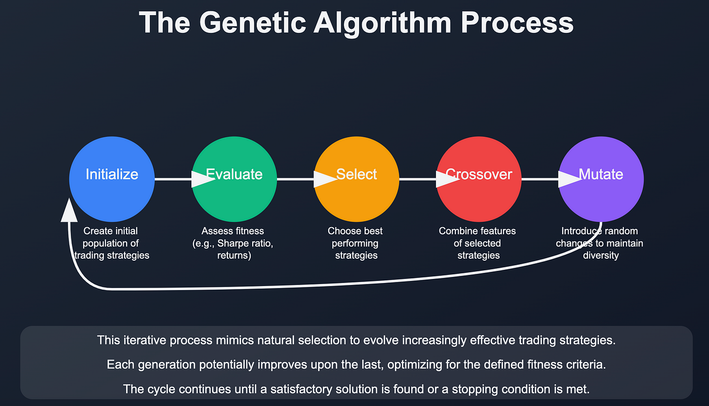

Trading in financial markets is inherently complex, demanding a synthesis of analytical skills, strategic foresight, and disciplined execution. The advent of algorithmic trading has significantly altered the landscape, offering sophisticated tools that reduce human error and improve trading efficiency. Among the cutting-edge techniques employed within algorithmic trading are Genetic Algorithms (GAs), which bring the principles of natural selection and evolution to the optimization of trading strategies. These GAs offer a nuanced approach to refining technical indicators and improving strategy performance, making them a compelling choice for traders seeking an edge in the market.



One of the core elements of technical analysis, the Relative Strength Index (RSI), serves as an exemplary focus for employing GAs. RSI is a momentum oscillator that quantifies price movement strengths, thereby predicting market behaviors such as overbought or oversold conditions. Integrating GAs with RSI provides a robust mechanism to optimize the indicator's parameters, thereby enhancing decision-making processes in trading strategies.

This article examines the application of genetic algorithms to refine trading strategies centered on the RSI, leveraging Python's extensive libraries and computational capabilities. By harnessing the adaptive nature of GAs, traders can refine their strategies to better accommodate shifting market dynamics, improving both profitability and stability. Through practical implementations in Python, the article aims to provide insights into how traders can exploit these evolutionary algorithms to maintain a competitive advantage, balancing innovation with the inherent risks of the financial markets.


## Table of Contents


## Understanding the Relative Strength Index (RSI)

The Relative Strength Index (RSI) is a widely used [momentum](/wiki/momentum) oscillator in technical analysis, primarily designed to quantify the speed and change of price movements. It plays a critical role in identifying whether a security is overbought or oversold, aiding traders in making informed decisions about potential market entry or [exit](/wiki/exit-strategy) points.

RSI values oscillate between 0 and 100. Typically, an RSI value above 70 suggests that a security might be overbought, which could indicate a potential for a price pullback or reversal. Conversely, an RSI value below 30 suggests that a security might be oversold, potentially signaling an impending price increase. These thresholds, though commonly used, can be adjusted according to different trading strategies or market conditions. 

The RSI is calculated using the following formula:

$$
\text{RSI} = 100 - \frac{100}{1 + \text{RS}}
$$

Where RS (Relative Strength) is the average of \text{n} up days' gains divided by the average of \text{n} down days' losses, typically using a 14-day period. This ratio offers insights into the extent of recent price changes, directing traders towards likely buy or sell opportunities.

In practice, traders incorporate RSI into their strategies to discern trends and predict future price movements. For instance, when RSI signals an overbought condition, a trader might consider selling the asset, while an oversold reading might encourage buying. However, RSI should not be used in isolation; it is most effective when combined with other indicators and analyses to mitigate risks and enhance decision-making accuracy.


## Genetic Algorithms: An Introduction

Genetic Algorithms (GAs) are optimization techniques inspired by the natural selection process, a key concept in evolutionary biology. These algorithms mimic the mechanisms of biological evolution, such as selection, crossover, and mutation, to search for optimal solutions to complex problems efficiently. The basic idea is to evolve a population of candidate solutions to improve over successive generations.

Initially, a population of possible solutions is generated, each representing a potential solution to the optimization problem. These solutions are often encoded as strings similar to genetic structures, commonly referred to as chromosomes. Here's a simplified Python example of what a chromosome might look like:

```python
# A simple representation of a chromosome
chromosome = {
    'rsi_period': 14,
    'overbought_threshold': 70,
    'oversold_threshold': 30
}
```

Each chromosome within the population is evaluated using a fitness function. This function measures how good a particular solution is concerning the problem domain. In trading, for instance, the fitness function might evaluate the profitability of a trading strategy represented by a chromosome.

The selection process then identifies the fittest individuals in the population as candidates for producing the next generation. This is akin to natural selection, where only the best-adapted individuals survive and reproduce. Those selected undergo crossover, a genetic operation that combines parts of two parent solutions to produce offspring with characteristics of both parents. This mechanism aids in exploring new areas of the solution space.

Mutation introduces randomness into the population by altering some solution components, helping to maintain genetic diversity and enabling the algorithm to avoid local optima. In Python, a simple mutation might look like:

```python
import random

def mutate(chromosome):
    if random.random() < 0.1:  # Mutation probability
        chromosome['rsi_period'] = random.randint(5, 20)
    return chromosome
```

These processes — selection, crossover, and mutation — continue iteratively across generations until a termination condition is met, such as a predefined number of generations or a satis[factor](/wiki/factor-investing)y fitness level. The aim is to cultivate increasingly better solutions with each iteration.

In the context of trading, GAs can optimize strategy parameters to maximize returns, such as identifying optimal periods for indicators like the RSI or setting precise entry and exit thresholds. By continuously adapting strategy parameters in response to market changes, GAs help traders develop robust strategies that can potentially enhance trading performance and profitability.

Therefore, Genetic Algorithms provide a powerful framework for addressing optimization challenges, allowing for the evolution of high-performance strategies in dynamically changing environments.


## Implementing Genetic Algorithms for Trading in Python

Developing a Genetic Algorithm (GA) for trading in Python starts by defining an initial population consisting of potential trading strategies. Each strategy within this population is represented by chromosomes, which encode the adjustable parameters of the strategy, such as the RSI thresholds for buying and selling.

The first step in this process is to create this initial population. Randomly generate a set of strategy parameters, ensuring diversity among the potential solutions. This diversity helps in exploring a wide range of possibilities and increases the likelihood of finding an optimal strategy.

Once the initial population is established, define a fitness function to evaluate the performance of each strategy. The fitness function typically calculates metrics such as the Sharpe ratio, return on investment, or any other performance indicator that aligns with the trader's goals. In pseudocode, this might look like:

```python
def fitness_function(strategy_parameters):
    returns = simulate_trading(strategy_parameters)
    sharpe_ratio = calculate_sharpe_ratio(returns)
    return sharpe_ratio
```
Where `simulate_trading` applies the strategy parameters to historical data and `calculate_sharpe_ratio` computes the risk-adjusted return.

After calculating the fitness of each strategy, the next step is selection. Select the top-performing strategies based on their fitness scores. Techniques like roulette wheel selection or tournament selection can be employed here.

With a selection of superior strategies, apply genetic operators such as crossover and mutation to create a new generation of strategies. Crossover combines parts of two strategies to produce offspring, while mutation introduces random alterations to a strategy to maintain genetic diversity within the population. Example code for these genetic operations can be as follows:

```python
def crossover(parent1, parent2):
    point = random.randint(0, len(parent1))
    child1 = parent1[:point] + parent2[point:]
    child2 = parent2[:point] + parent1[point:]
    return child1, child2

def mutate(strategy):
    mutation_point = random.randint(0, len(strategy) - 1)
    strategy[mutation_point] = random.uniform(min_value, max_value)
    return strategy
```

The GA then iterates over several generations, each time evaluating, selecting, and modifying strategies until an optimal or satisfactory strategy emerges. Throughout this iterative process, Python's extensive libraries and tools, such as NumPy for numerical operations and Pandas for data manipulation, provide robust support for implementing these algorithms efficiently. Visualization tools like Matplotlib can also be used to track the progress of the GA over generations, offering insights into convergence patterns.

Through Python's powerful computational capabilities and versatility, the implementation of GAs for trading strategy optimization becomes accessible, sophisticated, and highly customizable, facilitating the development of robust, data-driven trading models.


## Results

Applying Genetic Algorithms (GAs) significantly enhances the performance of trading strategies, potentially boosting profitability and ensuring more stable returns. By mimicking the process of natural selection, GAs identify optimal parameters and refine trading strategies to adapt swiftly to market fluctuations. This adaptability can lead to more responsive strategies that capitalize on market trends more effectively than static models.

The effectiveness of GA-optimized strategies is highly dependent on market conditions, necessitating rigorous [backtesting](/wiki/backtesting) across diverse scenarios. Backtesting ensures these strategies are not only theoretically sound but also practically viable. By evaluating how a GA-optimized strategy performs against historical data, traders can fine-tune their approach to better withstand market [volatility](/wiki/volatility-trading-strategies) and capture potential profit opportunities.

Below is a Python snippet demonstrating a basic structure for backtesting a GA-optimized trading strategy:

```python
import numpy as np
import pandas as pd

def backtest_strategy(strategy_func, data):
    portfolio = []
    capital = 10000
    for price in data['prices']:
        action = strategy_func(price)
        if action == 'buy' and capital > price:
            portfolio.append(price)
            capital -= price
        elif action == 'sell' and portfolio:
            capital += portfolio.pop()
    return capital + len(portfolio) * data['prices'].iloc[-1]

data = pd.DataFrame({
    'prices': np.random.normal(loc=100, scale=10, size=100)
})

# Example usage
final_capital = backtest_strategy(my_ga_optimized_strategy, data)
print("Final Capital:", final_capital)
```

Nevertheless, the computational demands of GAs can be considerable. This is due to their iterative nature, which can require significant processing power, especially as the complexity of the trading strategy increases. Efficient coding practices, such as using optimized libraries and parallel computing, combined with robust hardware, are crucial to achieving timely results and avoiding bottlenecks.

In conclusion, while GAs offer compelling advantages in optimizing trading strategies, their success is not universal. Strategies must be customized and continuously validated against market data, while computational resources should be leveraged effectively to handle the inherent demands of these algorithms.


## Conclusion

Genetic Algorithms (GAs) have emerged as a powerful tool for optimizing RSI-based trading strategies, bringing a natural selection-inspired methodology to [algorithmic trading](/wiki/algorithmic-trading). By iteratively refining strategy parameters, GAs enhance the adaptability of trading models to ever-changing market dynamics, providing traders with a robust framework for boosting strategy performance. 

Python stands out as a preferred language for implementing GAs in finance, largely due to its extensive libraries and ease of use, which facilitate the development of complex algorithms. Libraries such as DEAP and PyGAD provide pre-built functionalities for creating and evaluating genetic algorithms, making Python an accessible and effective choice for financial algorithm development. Yet, the versatility of Python necessitates thorough testing and validation to ensure that these algorithms function as expected under various market conditions.

While the adaptive nature of GAs offers substantial benefits, such as potential profitability improvements and enhanced strategy robustness, traders must remain mindful of market risks. Optimal results demand rigorous backtesting and validation across diverse scenarios to avoid overfitting or unwarranted reliance on optimized strategies. Noteworthy is the computational demand of genetic algorithms, which requires efficient coding practices and consideration of hardware capabilities to manage processing loads effectively.

In sum, genetic algorithms provide a dynamic and innovative approach to optimizing RSI-based trading strategies. They enable traders to tap into sophisticated algorithmic solutions, though success hinges on prudent testing and an awareness of the inherent risks in financial markets.


## References & Further Reading

[1]: Goldberg, D. E. (1989). ["Genetic Algorithms in Search, Optimization, and Machine Learning."](https://www.amazon.com/Genetic-Algorithms-Search-Optimization-Machine/dp/0201157675) Addison-Wesley.

[2]: Mitchell, M. (1998). ["An Introduction to Genetic Algorithms."](https://www.amazon.com/Introduction-Genetic-Algorithms-Complexity/dp/0262631857) MIT Press.

[3]: Lopez de Prado, M. (2018). ["Advances in Financial Machine Learning."](https://www.amazon.com/Advances-Financial-Machine-Learning-Marcos/dp/1119482089) Wiley.

[4]: Aronson, D. R. (2006). ["Evidence-Based Technical Analysis: Applying the Scientific Method and Statistical Inference to Trading Signals."](https://www.wiley.com/en-gb/Evidence+Based+Technical+Analysis:+Applying+the+Scientific+Method+and+Statistical+Inference+to+Trading+Signals-p-9780470008744) Wiley.

[5]: Jansen, S. (2020). ["Machine Learning for Algorithmic Trading."](https://www.amazon.com/Machine-Learning-Algorithmic-Trading-intelligence/dp/9918608013) Packt Publishing.

[6]: Chan, E. P. (2009). ["Quantitative Trading: How to Build Your Own Algorithmic Trading Business."](https://www.amazon.com/Quantitative-Trading-Build-Algorithmic-Business/dp/0470284889) Wiley.

[7]: Holland, J. H. (1975). ["Adaptation in Natural and Artificial Systems."](https://mitpress.mit.edu/9780262581110/adaptation-in-natural-and-artificial-systems/) University of Michigan Press.