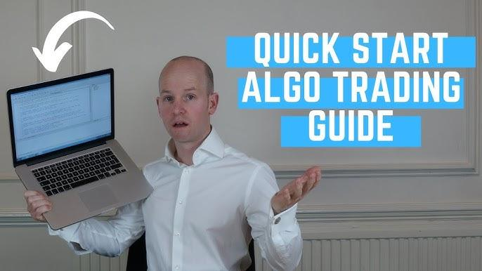

## Table of Contents

## What is algorithmic trading and why is it important?

Algorithmic trading is when computers use math formulas to buy and sell things like stocks or currencies automatically. Instead of people making decisions, the computer follows the rules set in the algorithm to trade. This can happen very quickly, often in fractions of a second, which is much faster than humans can trade.

This kind of trading is important because it can make trading more efficient and less emotional. Since computers don't get scared or excited like people do, they can stick to the plan better. Also, because computers can handle a lot of information very quickly, they can find good trading opportunities that people might miss. This can help make the markets work better and can be a big advantage for those using algorithmic trading.

## What are the basic requirements to start algo trading?

To start algo trading, you need a computer that can run the trading software. This computer should be fast and reliable because trading happens quickly. You also need a good internet connection so you can connect to the markets without delays. Another important thing is a trading account with a broker that allows algo trading. This broker should have the right tools and support for your trading algorithms.

You also need to learn how to code or find someone who can code for you. The code is what tells the computer how to trade. There are special programming languages like Python that many people use for algo trading because they are good at handling numbers and data. Lastly, you need to understand the markets and have a trading strategy. This means knowing what you want to trade and having rules for when to buy and sell. Without a good strategy, even the best computer and code won't help you make money.

## How can I learn the necessary programming languages for algo trading?

To learn programming languages for algo trading, you can start by picking a language like Python, which is popular and easy to learn. You can find many free resources online, like tutorials and videos on websites like YouTube or Codecademy. These resources will teach you the basics of the language, like how to write code and solve simple problems. It's a good idea to practice a lot by doing small projects or exercises. This will help you get better and understand how to use the language for trading.

Once you feel comfortable with the basics, you can move on to more advanced topics. Look for courses or books that focus on using the language for financial applications and trading. Websites like Coursera or Udemy often have courses that teach you how to use Python for algo trading. Joining online communities or forums can also be helpful. You can ask questions, share your code, and learn from others who are also learning or already trading. With time and practice, you'll be able to write the code needed for your trading algorithms.

## What are the key mathematical and statistical concepts I need to understand?

To do algo trading well, you need to understand some key math and stats ideas. One important thing is probability. This helps you figure out how likely it is that a trade will make money. You also need to know about statistics, like mean, median, and standard deviation. These help you understand and describe the data you're looking at. For example, standard deviation can tell you how much the price of a stock might move around.

Another useful concept is regression analysis. This helps you see how different things, like stock prices and economic indicators, might be related. You can use this to predict future price movements. Also, understanding time series analysis is important because stock prices change over time, and you need to know how to work with this kind of data. Learning these math and stats ideas will help you make better trading algorithms and understand the markets better.

## How do I choose the right trading platform for algo trading?

Choosing the right trading platform for algo trading starts with knowing what you need. You should look for a platform that lets you connect your trading algorithms easily. It should also be reliable and fast because trading happens quickly. Make sure the platform supports the programming language you use, like Python. Also, check if it has good customer support and if it's easy to use. Some platforms are better for beginners, while others are more advanced.

Another important thing to consider is the cost. Some platforms charge a lot, while others are cheaper or even free. You should also see if the platform offers the things you need, like real-time data, backtesting tools, and the ability to trade different kinds of assets. Reading reviews and asking other traders can help you find a platform that works well for you. Taking the time to choose the right platform can make a big difference in your algo trading success.

## What are the common strategies used in algorithmic trading?

One common strategy in algorithmic trading is trend following. This strategy looks at the direction the market is moving and tries to make money by following that trend. The algorithm uses math and data to find out if the price is going up or down. If it sees the price going up, it will buy, hoping to sell later at a higher price. If it sees the price going down, it might sell or short sell, hoping to buy back later at a lower price. Trend following can be simple but effective if the market keeps moving in one direction.

Another strategy is mean reversion. This strategy believes that prices will eventually go back to their average or normal level. The algorithm looks for times when the price has moved too far away from its average and bets that it will come back. For example, if a stock price is much higher than its usual level, the algorithm might sell, expecting the price to drop back down. If the price is much lower than usual, the algorithm might buy, expecting it to go back up. Mean reversion can work well in markets that tend to stay stable over time.

A third strategy is arbitrage. This involves taking advantage of price differences in different markets or between different forms of the same asset. For example, if the same stock is trading at a different price on two exchanges, an algorithm can buy it on the cheaper exchange and sell it on the more expensive one, making a profit from the difference. Arbitrage needs fast and accurate data because these price differences can disappear quickly. It's a way to make small, safe profits if you can spot and act on these opportunities fast enough.

## How can I backtest my trading algorithms effectively?

Backtesting your trading algorithms means testing them on past data to see how they would have worked. You need good, clean data that goes back far enough to cover different market conditions. This data should be as accurate as possible, so your test results are reliable. You also need a good backtesting platform or software that can run your algorithm against this data quickly and accurately. It's important to make sure your backtest is set up right, with all the rules and conditions your algorithm uses in real trading.

When you run the backtest, you should look at how well your algorithm did over time. Did it make money? How much risk did it take? Did it work better in some market conditions than others? You should also check if the results make sense. Sometimes, an algorithm might look good in backtesting but won't work in real life because of things like trading costs or market changes. It's a good idea to test your algorithm many times with different sets of data to see if it's really good or if it just got lucky once. By doing a careful backtest, you can improve your algorithm and feel more confident when you start using it for real trading.

## What are the risks involved in algo trading and how can I manage them?

Algo trading comes with several risks that you should know about. One big risk is that the market might not behave the way your algorithm expects. Markets can be unpredictable, and what worked in the past might not work in the future. Another risk is technical problems, like your computer or internet connection failing at a bad time. This can cause your trades to go wrong or not happen at all. There's also the risk of over-optimizing your algorithm to past data, which can make it work great in backtesting but fail in real trading. Lastly, there's the risk of losing a lot of money quickly if your algorithm makes a big mistake.

To manage these risks, start by using good risk management rules in your algorithm. This can mean setting limits on how much you can lose on each trade or how much you can trade overall. It's also a good idea to keep testing and updating your algorithm to make sure it's still working well with the current market. Having backup plans for technical problems, like a second computer or internet connection, can help too. And don't put all your money into algo trading at once. Start small and slowly increase your trading as you gain more confidence in your algorithm. By being careful and prepared, you can lower the risks and trade more safely.

## How do I stay updated with market data and integrate it into my algorithms?

Staying updated with market data is important for algo trading. You need to find good sources of data that give you the information you need quickly and accurately. Many trading platforms and brokers offer real-time data feeds that you can use. You can also buy data from special companies that collect and sell market information. It's a good idea to check if the data is reliable and up-to-date before you use it in your trading.

To integrate this data into your algorithms, you need to connect your data source to your trading software. This usually means writing code that can read the data and use it in your trading decisions. You might need to clean the data first to make sure it's in the right format and doesn't have any mistakes. Once your algorithm can use the data, you can test it to see if it makes better trading choices. Keeping your data fresh and your algorithms updated will help you stay on top of the markets.

## What are the regulatory and ethical considerations in algo trading?

When you do algo trading, you need to follow the rules set by the government and financial watchdogs. These rules can be different in each country, but they usually want to make sure that trading is fair and safe. For example, some rules might say you need to be careful about how much you trade so you don't mess up the market. There are also rules about being honest and not using secret information that others don't have. It's important to know these rules and follow them so you don't get into trouble.

There are also ethical things to think about in algo trading. It's good to trade in a way that is fair and doesn't hurt other people. For example, you shouldn't use your algorithms to trick the market or make it hard for others to trade. It's also important to be clear about what your algorithms are doing, especially if you're managing money for other people. By being ethical, you can help keep the markets a good place for everyone to trade.

## How can I optimize and scale my trading algorithms?

To optimize your trading algorithms, you need to keep testing and improving them. Start by looking at how your algorithm did in the past and see if there are any patterns or mistakes you can fix. You might need to change some of the rules or numbers in your algorithm to make it work better. It's also a good idea to use more data and test your algorithm in different market conditions. This can help you find out if your algorithm is really good or if it just got lucky. By making small changes and testing them a lot, you can make your algorithm better over time.

To scale your trading algorithms, you need to make sure they can handle more trades and bigger amounts of money. This means your computer and internet connection need to be strong enough to do more work without slowing down. You might also need to use more than one computer or a special service that can handle a lot of trades at once. It's important to grow slowly and keep an eye on how your algorithm is doing as you trade more. By being careful and making sure your system can handle the extra work, you can trade more without running into problems.

## What advanced techniques can I employ to gain a competitive edge in algo trading?

One advanced technique you can use in algo trading is machine learning. This means using computers to learn from data and find patterns that might be hard for people to see. For example, you can use machine learning to predict how stock prices might move based on lots of different information, like news or economic reports. By training your algorithm with past data, it can get better at making good trading choices. But remember, machine learning needs a lot of good data and powerful computers to work well.

Another technique is high-frequency trading (HFT). This is when you trade very quickly, often in fractions of a second, to take advantage of small price changes. HFT needs super fast computers and internet connections because every millisecond counts. This kind of trading can make small profits on each trade, but you need to do a lot of trades to make it worth it. It's important to have good risk management because HFT can be risky if things go wrong. By using these advanced techniques, you can try to do better than other traders and make more money.

## How can one go about building a track record?

To establish a solid foundation in algorithmic trading, one of the first steps is engaging in paper trading. Paper trading allows aspiring algo traders to test and refine their trading strategies in a simulated environment without risking real money. This phase is crucial as it offers a risk-free platform to understand the market dynamics, identify potential pitfalls, and iterate on trading models until they achieve desired outcomes.

After gaining confidence and honing strategies through paper trading, the next logical step is transitioning to trading with real capital. It's advisable to start with a small amount of money to manage risks effectively. This conservative approach helps in acclimatizing to the emotional and psychological aspects of trading, which can significantly differ from simulated trading. As skills and strategies prove successful, one can gradually scale up the investment, ensuring that the risk management strategies remain robust and adequately aligned with increased exposure.

Monitoring and evaluating performance is critical for the continuous improvement of trading models. Key metrics to track include the Sharpe Ratio and maximum drawdown. The Sharpe Ratio, given by the formula:

$$
\text{Sharpe Ratio} = \frac{R_p - R_f}{\sigma_p}
$$

where $R_p$ is the return of the portfolio, $R_f$ is the risk-free rate, and $\sigma_p$ is the standard deviation of the portfolio return, is a measure of risk-adjusted returns. A higher Sharpe Ratio indicates better risk-adjusted performance, making it a crucial metric for evaluating strategies.

Another important metric, maximum drawdown, measures the largest single drop from peak to trough in the account balance, helping traders understand the risk of loss in worst-case scenarios. Keeping drawdowns minimal while seeking higher Sharpe Ratios contributes to long-term success and sustainability in algorithmic trading.

Incorporating these practices not only builds credibility but also equips you with the necessary insights to optimize trading strategies effectively. Maintaining a detailed log of trades and their outcomes can further aid in pinpointing areas for improvement, ensuring that one's journey in algorithmic trading is structured and data-driven.

## References & Further Reading

[1]: ["Algorithmic Trading: Winning Strategies and Their Rationale"](https://www.amazon.com/Algorithmic-Trading-Winning-Strategies-Rationale/dp/1118460146) by Ernest P. Chan

[2]: Jansen, S. (2020). ["Machine Learning for Algorithmic Trading: Predictive models to extract signals from market and alternative data for systematic trading strategies with Python."](https://www.amazon.com/Machine-Learning-Algorithmic-Trading-predictive/dp/1839217715)

[3]: Narang, R. K. (2013). ["Inside the Black Box: A Simple Guide to Quantitative and High Frequency Trading."](https://www.amazon.fr/Inside-Black-Box-Quantitative-Frequency/dp/1118362411)

[4]: López de Prado, M. (2018). ["Advances in Financial Machine Learning."](https://www.amazon.com/Advances-Financial-Machine-Learning-Marcos/dp/1119482089)

[5]: Aronson, D. R. (2006). ["Evidence-Based Technical Analysis: Applying the Scientific Method and Statistical Inference to Trading Signals."](https://www.amazon.com/Evidence-Based-Technical-Analysis-Scientific-Inference/dp/0470008741)

[6]: Hull, J. C. (2012). ["Options, Futures, and Other Derivatives."](https://www.amazon.com/Options-Futures-Other-Derivatives-9th/dp/0133456315)

[7]: Tetlock, P. C. (2007). ["Giving Content to Investor Sentiment: The Role of Media in the Stock Market."](https://onlinelibrary.wiley.com/doi/10.1111/j.1540-6261.2007.01232.x) Journal of Finance.

[8]: De Goeij, P., & Marquering, W. (2006). ["Macroeconomic news and stock market volatility."](https://www.sciencedirect.com/science/article/abs/pii/S0304405X97000470) European Journal of Operational Research.