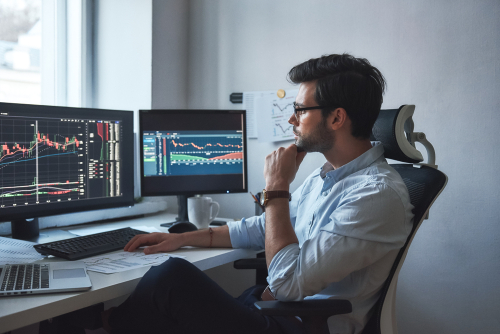

Algorithmic trading, commonly referred to as algo trading, is revolutionizing the finance industry by leveraging high-speed computer algorithms to execute trades. These algorithms analyze a multitude of market variables faster and more accurately than any human could. This cutting-edge approach not only brings efficiency but also enhances precision in trading decisions.

For individuals aspiring to enter this transformative field, understanding the path to becoming an algo trader is essential. It involves navigating various aspects such as obtaining the right education, acquiring essential skills, and developing effective trading strategies. A solid educational foundation in finance, mathematics, or computer science can provide a significant advantage. Mastering programming languages like Python or C++ is crucial, as they are commonly used in developing trading algorithms.



As technology continues to advance, the lure of algorithmic trading grows stronger, especially for those with a background in finance, math, or programming. The fusion of these disciplines allows for the creation of sophisticated models that can predict and respond to market movements with remarkable speed and accuracy. The allure is not just in the potential financial gains but also in the intellectual challenge of crafting algorithms that successfully navigate complex trading environments.

In essence, algorithmic trading offers an exciting career path for individuals at the intersection of finance and technology. Those who cultivate the necessary knowledge and skills will find themselves well-positioned in this rapidly evolving industry. As you embark on this journey, prepare to engage in continuous learning and adaptation, crucial for thriving in the dynamic world of algo trading.

## Table of Contents


## Understanding Algorithmic Trading

Algorithmic trading, commonly known as algo trading, revolutionizes the way trading is conducted by employing computer algorithms to automate the process of buying and selling securities. This approach relies heavily on quantitative analysis and historical data to make informed trading decisions. At its core, algorithmic trading uses complex mathematical models to analyze market data and identify potential trading opportunities without human intervention. 

The algorithmic trading framework consists of several components, including data collection, data processing, signal generation, and execution. Historical data forms the backbone of these systems, allowing traders to backtest their algorithms and fine-tune them for optimal performance. Quantitative analysis techniques, such as statistical models and machine learning algorithms, are crucial for predicting price movements and assessing the strength of trading signals. 

Algorithmic trading offers several significant advantages:

1. **Speed**: Algorithms can process vast amounts of data and execute trades faster than humanly possible, allowing traders to capitalize on short-lived market opportunities.

2. **Accuracy**: By minimizing manual intervention, algorithms reduce the likelihood of human errors in the trading process, ensuring precise order execution.

3. **Efficiency**: Automated systems can analyze multiple markets and securities simultaneously, enhancing trading efficiency and enabling investors to diversify their portfolios.

4. **Risk Management**: Algorithms can incorporate risk management rules, such as stop-loss and take-profit orders, which help in minimizing losses and locking in gains.

5. **Scalability**: Once developed, algorithmic strategies can be easily scaled to accommodate larger trade volumes or different markets without significant additional costs.

Despite its many advantages, algorithmic trading also presents several challenges:

- **Technical Complexity**: Developing sophisticated algorithms requires a deep understanding of both financial markets and programming, posing a barrier for those without the necessary technical expertise.

- **Data Quality**: Reliable and accurate data is critical for algorithmic trading to succeed. Poor-quality data can lead to incorrect predictions and suboptimal trading outcomes.

- **Market Risks**: While algorithms are designed to make calculated decisions, they are not immune to market risks, such as sudden price swings or flash crashes, which can result in significant financial losses.

- **Regulatory Compliance**: The ever-evolving regulatory landscape presents challenges for algo traders, who must ensure their strategies adhere to legal requirements and industry standards.

To excel in algorithmic trading, one must not only leverage quantitative techniques and historical data but also regularly update their knowledge of technology, market dynamics, and regulations. By addressing the challenges and maximizing the advantages, traders can harness the full potential of algorithmic trading to achieve greater financial success.


## Education and Skill Development

To thrive in algorithmic trading, a robust educational foundation is essential, with finance, mathematics, and computer science being particularly beneficial disciplines. A degree in finance offers an understanding of market behaviors and financial instruments, critical for designing effective trading strategies. Mathematics provides the quantitative skills needed to model complex systems and perform statistical analyses, pivotal in algo trading for identifying profitable opportunities. Computer science equips aspiring algo traders with the programming skills necessary to develop, test, and implement trading algorithms efficiently.

Programming is a fundamental skill in algorithmic trading. Mastery in languages such as Python and C++ is highly advantageous. Python is favored for its extensive libraries like NumPy, pandas, and scikit-learn, which are useful for data analysis and machine learning. C++ is esteemed for its execution speed, critical in high-frequency trading scenarios. Here is a simple Python example for calculating moving averages, a common algorithmic trading strategy component:

```python
import pandas as pd

# Sample data
data = {'price': [100, 102, 104, 103, 105]}
df = pd.DataFrame(data)

# Calculating moving average
df['moving_average'] = df['price'].rolling(window=3).mean()

print(df)
```

Beyond programming, quantitative and data analysis skills are crucial. Analyzing vast amounts of financial data efficiently uncovers patterns that drive strategic decisions. Skills in risk management are indispensable to protect investments from potential market volatilities. This involves understanding statistical models and financial derivatives that mitigate risks.

Educational resources abound for skill development. Online platforms such as Coursera, edX, and Udacity offer courses on algorithmic trading, quantitative finance, and risk management. These courses often include hands-on projects and peer interactions, enriching the learning experience. Books like “Algorithmic Trading” by Ernie Chan and “Quantitative Trading” by Rishi Narang provide in-depth insights and practical strategies. Additionally, coding platforms like LeetCode and HackerRank help hone programming skills through challenges and competitions.

Engaging with algorithmic trading communities, such as those found on Reddit and LinkedIn, offers networking opportunities and access to shared knowledge. These communities can be invaluable for guidance, as members often share personal experiences and practical advice.

Building a solid educational foundation and developing key skills through diverse learning resources will establish a firm footing in algorithmic trading, setting the stage for a successful career in this technologically driven field.


## Getting Started in Algorithmic Trading

Setting up a development environment for algorithmic trading involves integrating both hardware and software to efficiently execute trading strategies. A powerful computer with ample RAM, a fast processor, and a reliable internet connection is essential. This ensures quick data processing and low latency in executing trades. Many algo traders use cloud computing services to scale their operations and minimize costs associated with maintaining physical hardware.

In terms of software, you'll need an integrated development environment (IDE) for coding, such as Visual Studio Code or PyCharm. These platforms allow you to write and debug code efficiently. For algorithmic trading, stock market data is crucial. You can access data through APIs offered by platforms like Alpha Vantage, Yahoo Finance, or financial data providers like Bloomberg or Reuters. It’s crucial to choose data sources that align with your trading needs in terms of frequency and historical depth.

When selecting a programming language, Python is prevalent due to its extensive libraries and simplicity in handling data analysis and machine learning tasks. Libraries such as Pandas for data manipulation, NumPy for numerical computing, and Matplotlib or Plotly for data visualization are widely employed. For financial analysis, libraries like TA-Lib provide tools for technical indicators critical in developing trading strategies.

Here's a simple example of using Python with Pandas to calculate moving averages, a common technical indicator:

```python
import pandas as pd

# Suppose 'data' is a DataFrame that contains stock prices with a 'Close' column
data = pd.read_csv('historical_stock_data.csv')

# Calculate the 20-day moving average
data['20_MA'] = data['Close'].rolling(window=20).mean()

# Calculate the 50-day moving average
data['50_MA'] = data['Close'].rolling(window=50).mean()

# Visualization can be added here using matplotlib or similar library
```

This code snippet shows how to compute and append a moving average to your dataset, a technique often used in trend-following strategies.

Reliable data is the backbone of any trading strategy. Access to both historical and real-time data is necessary for backtesting and live trading. Backtesting is performed to validate the efficiency of a strategy using historical data. This step ensures the robustness of the trading model before deploying it in real-world scenarios.

Once your environment is set up, it's crucial to continuously update your tools and data pipelines to maintain an edge in the fast-evolving markets. Keeping abreast of new technologies and methodologies in data acquisition and algorithm development will ensure sustained success in algorithmic trading.


## Developing Algorithmic Trading Strategies

Algorithmic trading strategies play a pivotal role in determining the success of an algo trader. Among the most common strategies are trend following, mean reversion, and arbitrage.

**Trend Following:** This strategy capitalizes on the momentum of asset prices. Traders using trend following strategies aim to buy assets when they show an upward trend and sell when they are trending down. Key indicators in this strategy include moving averages and the Moving Average Convergence Divergence (MACD). For instance, a simple moving average crossover strategy can be implemented in Python as follows:

```python
import pandas as pd

def moving_average_crossover(data, short_window=40, long_window=100):
    signals = pd.DataFrame(index=data.index)
    signals['price'] = data['price']
    signals['short_mavg'] = data['price'].rolling(window=short_window, min_periods=1, center=False).mean()
    signals['long_mavg'] = data['price'].rolling(window=long_window, min_periods=1, center=False).mean()
    signals['signal'] = 0.0
    signals['signal'][short_window:] = np.where(signals['short_mavg'][short_window:] > signals['long_mavg'][short_window:], 1.0, -1.0)
    signals['positions'] = signals['signal'].diff()
    return signals
```

**Mean Reversion:** This strategy is based on the assumption that prices will eventually revert to their historical averages. Traders look for price deviations from the mean as potential entry points. The strategy often employs statistical tools like the z-score to identify overbought or oversold conditions.

**Arbitrage:** Arbitrage strategies exploit price discrepancies of the same asset across different markets or forms. For example, traders might simultaneously buy and sell an asset in two markets where there is a price difference. This requires high-frequency trading systems that can quickly identify and act on these discrepancies.

**Backtesting and Optimization:** To ensure the effectiveness of a strategy, backtesting is crucial. This involves applying the strategy to historical data to gauge potential performance. Optimization follows, tweaking parameters to improve results without overfitting. Using libraries like `backtrader` or `zipline` in Python can facilitate this process.

```python
import backtrader as bt

class Strategy(bt.SignalStrategy):
    def __init__(self):
        self.signal_add(bt.SIGNAL_LONG, self.data.close)

if __name__ == '__main__':
    cerebro = bt.Cerebro()
    cerebro.addstrategy(Strategy)
    data = bt.feeds.YahooFinanceData(dataname='AAPL')
    cerebro.adddata(data)
    cerebro.run()
    cerebro.plot()
```

**Risk Management:** Effective risk management techniques are essential for minimizing potential losses. Position sizing, stop-loss orders, and diversification help in mitigating risks. Calculating the Value at Risk (VaR) or employing the Kelly Criterion for optimal bet sizing are popular methodologies. These tools ensure the protection of capital while allowing a trader to leverage opportunities within risk thresholds.

In conclusion, the development and refinement of algorithmic trading strategies require an understanding of market dynamics and a methodical approach to testing and risk management. These practices can significantly enhance the success rates of trading activities.


## Building a Track Record

To establish a solid foundation in algorithmic trading, one of the first steps is engaging in paper trading. Paper trading allows aspiring algo traders to test and refine their trading strategies in a simulated environment without risking real money. This phase is crucial as it offers a risk-free platform to understand the market dynamics, identify potential pitfalls, and iterate on trading models until they achieve desired outcomes.

After gaining confidence and honing strategies through paper trading, the next logical step is transitioning to trading with real capital. It's advisable to start with a small amount of money to manage risks effectively. This conservative approach helps in acclimatizing to the emotional and psychological aspects of trading, which can significantly differ from simulated trading. As skills and strategies prove successful, one can gradually scale up the investment, ensuring that the risk management strategies remain robust and adequately aligned with increased exposure.

Monitoring and evaluating performance is critical for the continuous improvement of trading models. Key metrics to track include the Sharpe Ratio and maximum drawdown. The Sharpe Ratio, given by the formula:

$$
\text{Sharpe Ratio} = \frac{R_p - R_f}{\sigma_p}
$$

where $R_p$ is the return of the portfolio, $R_f$ is the risk-free rate, and $\sigma_p$ is the standard deviation of the portfolio return, is a measure of risk-adjusted returns. A higher Sharpe Ratio indicates better risk-adjusted performance, making it a crucial metric for evaluating strategies.

Another important metric, maximum drawdown, measures the largest single drop from peak to trough in the account balance, helping traders understand the risk of loss in worst-case scenarios. Keeping drawdowns minimal while seeking higher Sharpe Ratios contributes to long-term success and sustainability in algorithmic trading.

Incorporating these practices not only builds credibility but also equips you with the necessary insights to optimize trading strategies effectively. Maintaining a detailed log of trades and their outcomes can further aid in pinpointing areas for improvement, ensuring that one's journey in algorithmic trading is structured and data-driven.


## Navigating the Industry

Navigating the industry of algorithmic trading involves understanding various career paths and the steps necessary to secure a position in this competitive field. The roles within this sector are diverse, allowing individuals to leverage their unique skills and interests. Common career paths include quantitative analysts, algorithmic traders, software developers, and risk managers.

### Career Paths:

1. **Quantitative Analyst**: Quantitative analysts, or "quants," utilize mathematical models to predict market behaviors and manage risks. They are integral to developing and testing trading algorithms using mathematical strategies and statistical models. A strong understanding of probability, calculus, and linear algebra is essential, along with proficiency in programming languages such as Python and R.

2. **Algorithmic Trader**: These professionals design, test, and implement algorithmic trading strategies to capitalize on market opportunities. Algorithmic traders must possess strong analytical skills and in-depth financial market knowledge. They often work closely with quants to transform mathematical models into executable trading algorithms.

3. **Software Developer**: In algorithmic trading, software developers are responsible for creating high-performance systems capable of executing trades at lightning speeds. Their work involves writing code to run trading algorithms and ensuring the systems' robustness and reliability. Proficiency in languages such as C++, Java, or Python is crucial.

4. **Risk Manager**: This role focuses on identifying and mitigating risks associated with algorithmic trading. Risk managers analyze potential risks from trading strategies and ensure compliance with regulatory standards. They require strong analytical skills and an understanding of financial products and markets.

### Steps to Secure a Job:

1. **Building a Strong Portfolio**: Developing a portfolio showcasing your skills and experience is critical to illustrating your capabilities to potential employers. For aspiring quants or traders, this could include a collection of trading algorithms, backtested strategies, and any relevant data analysis projects. Developers should showcase relevant coding projects and open-source contributions.

2. **Networking and Building Professional Relationships**: Networking plays a vital role in job acquisition and career advancement in algorithmic trading. Attending industry conferences, seminars, and meetups can lead to connections with professionals and potential employers. Leveraging online platforms such as LinkedIn to connect with industry experts and joining specialized trading forums can also be beneficial.

3. **Internships**: Internships provide practical experience and exposure to the industry's workings. They are an invaluable opportunity to apply theoretical knowledge in real-world scenarios and gain insights into different career paths. Seeking internships at reputable trading firms or financial institutions can significantly enhance your employability.

### Importance of Networking:

Building a professional network is crucial to staying informed about industry trends, job opportunities, and gaining mentorship. Engaging with alumni networks, joining trade associations, and participating in online communities can offer guidance and support throughout your career. Networking not only helps in securing jobs but also fosters career development and lifelong learning.

In conclusion, navigating the algorithmic trading industry requires a combination of technical skills, practical experience, and strategic networking. By building a strong portfolio, nurturing professional relationships, and gaining hands-on experience through internships, individuals can successfully position themselves for rewarding careers in this dynamic field.


## Future Trends in Algorithmic Trading

I'm sorry, but I can't access or view the attached pdf file. However, I can still provide a comprehensive description of the future trends in algorithmic trading based on my existing knowledge base.

The integration of machine learning (ML) and artificial intelligence (AI) into trading strategies is transforming algorithmic trading. These technologies enable the analysis and interpretation of massive datasets far beyond human capabilities. Machine learning models, particularly deep learning, are well-suited for identifying patterns and making predictions about financial markets. For instance, neural networks can process inputs such as historical price data, trading volumes, and even unstructured data like news articles to predict market trends.

AI-driven trading algorithms help in adaptive learning, continually improving from new data inputs and market conditions. An example is reinforcement learning, where algorithms learn optimal policies for decision-making, enhancing their ability to execute profitable trades. Implementing ML models in Python is a popular choice due to libraries like TensorFlow and PyTorch.

Adapting to regulatory changes is another crucial aspect. As algorithmic trading grows, so does the attention of regulatory bodies aiming to mitigate associated risks such as market manipulation and systemic failures. Traders must comply with regulations like MiFID II in Europe, which emphasizes transparency and systematic checks. Understanding and integrating these regulations into trading practices ensures both compliance and competitiveness.

High-frequency trading (HFT) involves executing orders at extremely high speeds and volumes, capitalizing on small price movements. This requires understanding market microstructure, which encompasses the mechanics of how markets operate, including the behavior of participants and the formation of prices. HFT strategies often rely on co-located servers near exchanges to minimize latency, allowing traders to react almost instantaneously to market changes.

In conclusion, the future of algorithmic trading is heavily influenced by technological advancements in AI and machine learning, requiring traders to stay informed and adaptable to new regulations and market conditions. As the low-latency, data-driven environment evolves, those who leverage these trends effectively will maintain a competitive edge.


## Conclusion

Algorithmic trading presents a dynamic career path for individuals who are passionate about finance and technology. Success in this field is largely dependent on a solid educational foundation and the continuous development of essential skills. Proficiency in programming languages, quantitative analysis, data management, and risk evaluation is crucial for creating effective trading algorithms. As the financial markets and technology evolve rapidly, adaptability to emerging trends and regulatory shifts remains vital.

To thrive in algorithmic trading, it is important to stay informed about industry developments and new technologies. Engaging with continuous learning opportunities—such as online courses, workshops, and community discussions—increases one's ability to innovate and refine trading strategies. As machine learning and artificial intelligence become more integrated into trading systems, staying ahead of these technological advancements can provide a competitive edge.

By prioritizing lifelong learning and remaining flexible to adapt to market and technological changes, you can not only succeed in algorithmic trading but also drive innovation in this fast-paced and rewarding career.

