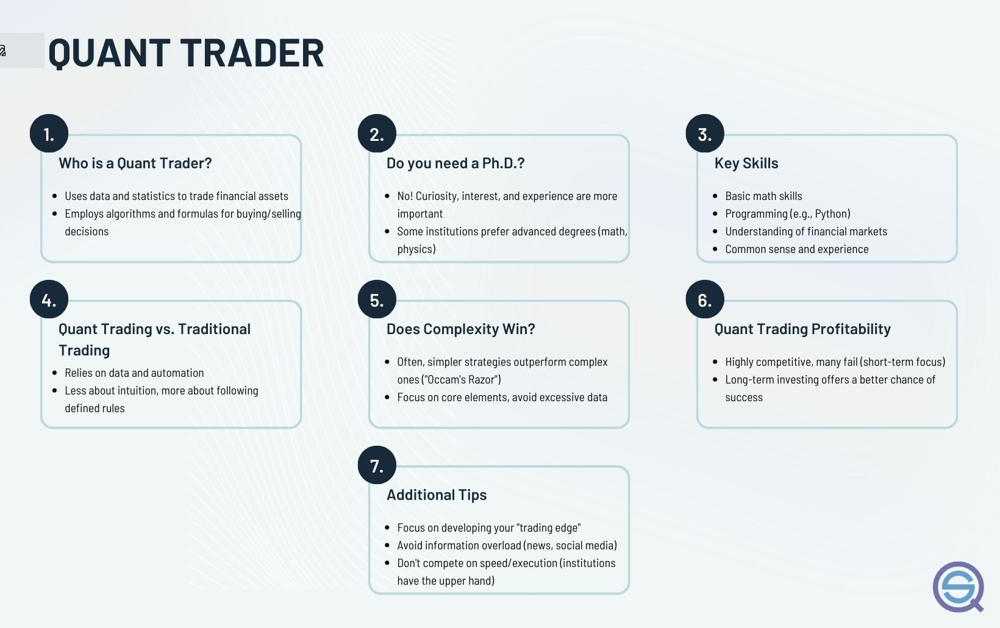

## Table of Contents

## What is quantitative trading?

Quantitative trading is a method of trading where decisions are made based on numbers and data instead of feelings or guesses. Traders use computers and math formulas to find patterns and make trades. This way, they can handle a lot of information quickly and make choices without letting emotions get in the way.

In quantitative trading, people use things like historical price data, statistics, and other financial information to create models. These models help predict what might happen in the market next. Once the models are set up, they can run automatically, making trades without needing a person to watch all the time. This can be really helpful because it can find small chances to make money that a person might miss.

## What are the basic skills required to start in quant trading?

To start in quant trading, you need to be good at math and programming. Math helps you understand and create the models that predict market movements. You'll use things like statistics, calculus, and linear algebra. Programming is important because you'll need to write code to make your models work and to automate trading. Languages like Python, R, and C++ are often used in this field.

You also need to know about finance and the markets. This means understanding how stocks, bonds, and other financial products work. You should learn about different trading strategies and how to analyze market data. It's also helpful to have some knowledge of economics because it can affect how markets behave.

Lastly, being good at problem-solving and having a curious mind can really help. Quant trading involves a lot of trial and error, so you need to be able to figure out what's not working and fix it. Staying up-to-date with new tools and techniques is also important because the field is always changing.

## How can I learn programming languages like Python or R for quant trading?

To learn programming languages like Python or R for quant trading, start with online courses and tutorials. Websites like Coursera, edX, and Codecademy offer beginner-friendly courses on Python and R. These platforms often have lessons designed for people interested in finance and data analysis, which can be very helpful for quant trading. As you learn, practice writing code regularly. Start with simple programs and gradually work on more complex projects that involve financial data analysis.

Another good way to learn is by using [books](/wiki/algo-trading-books) and joining communities. There are many books written specifically for beginners in Python and R, such as "Python for Data Analysis" by Wes McKinney or "R for Data Science" by Hadley Wickham and Garrett Grolemund. These books can guide you through the basics and show you how to apply these languages to real-world problems in quant trading. Joining online forums like Stack Overflow or Reddit's r/learnpython and r/rprogramming can also be useful. These communities can provide support, answer your questions, and help you stay motivated as you learn.

Lastly, consider working on practical projects and using real financial data. Platforms like Kaggle offer datasets and competitions where you can practice your skills. You can also use libraries like pandas in Python or quantmod in R, which are designed for financial data analysis. By working on these projects, you'll get hands-on experience and see how programming can be applied to quant trading. Keep practicing, and over time, you'll become more comfortable and skilled with these languages.

## What mathematical concepts are essential for quant trading?

In quant trading, you need to know some basic math to make good trading models. Statistics is really important because it helps you understand data and make predictions. You'll use things like mean, median, standard deviation, and probability to figure out what might happen in the market. Calculus is also key because it helps you understand how things change over time, which is useful for predicting price movements. Linear algebra comes in handy when you're working with lots of data at once, helping you solve complex problems more easily.

Another important part of math for quant trading is understanding time series analysis. This helps you look at how prices change over time and find patterns that can guide your trading decisions. You'll also need to know about optimization, which is about finding the best way to do something, like figuring out the best time to buy or sell. These math concepts might sound hard at first, but with practice, they become tools that help you make smarter trading choices.

## What are the key financial instruments used in quant trading?

In quant trading, people use different types of financial instruments to make money. The main ones are stocks, which are pieces of ownership in a company, and bonds, which are like loans you give to a company or government. Stocks can go up or down in price quickly, so they're good for short-term trading. Bonds are usually more stable and can be used to make money over a longer time. Traders also use options, which give them the right to buy or sell something at a certain price in the future, and futures, which are agreements to buy or sell something at a set price on a specific date.

Another important instrument in quant trading is currencies, or [forex](/wiki/forex-system), where traders buy and sell different kinds of money. This can be very fast-paced and involves trading between different countries' currencies. Some traders also use ETFs, or exchange-traded funds, which are like baskets of different stocks or bonds that you can trade like a single stock. All these instruments help quant traders make money by using math and computers to find the best times to buy and sell.

## How can I develop and test trading strategies?

To develop and test trading strategies, start by coming up with an idea based on what you know about the market. You might think that certain patterns in stock prices or economic news can help predict future movements. Once you have an idea, you can use math and computer programs to turn it into a strategy. This means writing code that tells the computer what to do when it sees certain things happen in the market. You'll use data from the past to see if your strategy would have worked well before.

After you have your strategy, you need to test it to see if it really works. This is called [backtesting](/wiki/backtesting), where you use old data to pretend you're trading in the past. You run your strategy on this data to see how much money you would have made or lost. It's important to test your strategy on different time periods and market conditions to make sure it's strong. Once you're happy with how it did in the past, you can try it out in the real market with a small amount of money first. This is called paper trading or demo trading, and it lets you see how your strategy works without risking a lot of money. If it does well, you can start using it for real trading.

## What are the common data sources for quant traders?

Quant traders use a lot of different places to get their data. They often use financial data providers like Bloomberg and Reuters, which give them up-to-date information on stock prices, bond yields, and other important numbers. These services are really helpful because they collect data from all over the world and make it easy to use. Quant traders also use government websites to get economic reports and [statistics](/wiki/bayesian-statistics), which can help them understand what's happening in the economy and how it might affect the markets.

Another common source of data for quant traders is stock exchanges themselves. Exchanges like the New York Stock Exchange or NASDAQ provide detailed data on trades, including the prices at which stocks were bought and sold, and how many shares were traded. This kind of data is crucial for building and testing trading strategies. Additionally, some traders use [alternative data](/wiki/best-alternative-data) sources, like social media sentiment or satellite imagery, to get a different view of what's happening in the market. These sources can give them an edge by providing information that others might not be using.

## What regulatory considerations should I be aware of in quant trading?

When you start quant trading, you need to know about the rules that govern trading. Different countries have their own rules, but they all want to make sure trading is fair and safe. In the United States, for example, the Securities and Exchange Commission (SEC) and the Commodity Futures Trading Commission (CFTC) set rules for trading stocks, bonds, and other financial products. These rules can affect how you trade, what data you can use, and how much risk you can take. It's important to understand these rules so you don't accidentally break them and get into trouble.

Another thing to think about is how you handle data. Many countries have laws about data privacy and protection, like the General Data Protection Regulation (GDPR) in Europe. These laws can affect how you collect, store, and use data for your trading strategies. Also, if you're using automated trading systems, you might need to follow specific rules about how these systems work and how they're monitored. Keeping up with these regulations can be a lot of work, but it's crucial for staying out of legal trouble and keeping your trading business running smoothly.

## How can I gain practical experience in quant trading?

To gain practical experience in quant trading, start by setting up a paper trading account. This lets you trade with fake money, so you can try out your strategies without risking real cash. Use this account to test your trading models and see how they perform in real market conditions. You can find paper trading platforms from many online brokers, which often have tools and data you need to practice quant trading. As you trade, keep track of what works and what doesn't, and make changes to your strategies based on what you learn.

Another way to get hands-on experience is to join a trading competition or take part in a hackathon focused on finance and trading. These events give you a chance to work with other people who are interested in quant trading, and you can learn a lot from them. You'll also get to use real data and see how your strategies stack up against others. If you can, try to get an internship or a job at a firm that does quant trading. Working with experienced traders will help you learn even more and see how professionals handle the markets.

## What advanced statistical techniques should I master for quant trading?

To get better at quant trading, you should learn about advanced statistical techniques like time series analysis. This helps you understand how prices change over time and spot patterns that can guide your trading. You'll use things like ARIMA models, which predict future values based on past data, and GARCH models, which help you understand how much prices might move around. These techniques let you make more accurate predictions and manage risk better.

Another important technique is [machine learning](/wiki/machine-learning). This involves using computers to find patterns in data that might be hard for humans to see. You can use methods like regression analysis to predict stock prices, or classification algorithms to decide when to buy or sell. Machine learning can also help you with things like clustering, where you group similar stocks together, or dimensionality reduction, which helps you focus on the most important data. Learning these techniques will make your trading strategies smarter and more effective.

## How do I manage risk in quant trading?

Managing risk in quant trading is all about making sure you don't lose too much money. One way to do this is by setting stop-loss orders, which automatically sell your stocks if they drop to a certain price. This helps you limit how much you can lose on a single trade. Another way is to diversify your investments, which means not putting all your money into one stock or one type of investment. By spreading your money around, you reduce the chance that one bad trade will wipe out all your gains.

You also need to keep an eye on how much you're risking overall. This is called position sizing, where you decide how much money to put into each trade based on how risky it is. Using math and statistics, you can figure out the best amount to risk so that you don't lose too much if things go wrong. It's also smart to regularly check and update your trading strategies to make sure they're still working well and not taking on too much risk. By doing these things, you can keep your trading safe and steady.

## What are the latest trends and technologies impacting quant trading?

One of the biggest trends in quant trading right now is the use of [artificial intelligence](/wiki/ai-artificial-intelligence) (AI) and machine learning. These technologies help traders find patterns in huge amounts of data that they might not see otherwise. For example, AI can look at social media posts, news articles, and other information to predict how the market might move. Machine learning can also help improve trading strategies by learning from past trades and making them better over time. This means traders can make smarter decisions and react faster to changes in the market.

Another trend is the use of cloud computing. This lets traders use powerful computers over the internet instead of having to buy expensive hardware themselves. Cloud computing makes it easier to handle and analyze large amounts of data quickly. It also helps traders work together from different places and share information in real time. This can make trading strategies more effective and help traders stay ahead of the competition.

## References & Further Reading

[1]: Bergstra, J., Bardenet, R., Bengio, Y., & Kégl, B. (2011). ["Algorithms for Hyper-Parameter Optimization."](https://papers.nips.cc/paper_files/paper/2011/hash/86e8f7ab32cfd12577bc2619bc635690-Abstract.html) Advances in Neural Information Processing Systems 24.

[2]: ["Advances in Financial Machine Learning"](https://www.amazon.com/Advances-Financial-Machine-Learning-Marcos/dp/1119482089) by Marcos Lopez de Prado

[3]: ["Evidence-Based Technical Analysis: Applying the Scientific Method and Statistical Inference to Trading Signals"](https://www.wiley.com/en-gb/Evidence+Based+Technical+Analysis:+Applying+the+Scientific+Method+and+Statistical+Inference+to+Trading+Signals-p-9780470008744) by David Aronson

[4]: ["Machine Learning for Algorithmic Trading"](https://www.amazon.com/Machine-Learning-Algorithmic-Trading-intelligence/dp/9918608013) by Stefan Jansen

[5]: ["Quantitative Trading: How to Build Your Own Algorithmic Trading Business"](https://www.amazon.com/Quantitative-Trading-Build-Algorithmic-Business/dp/0470284889) by Ernest P. Chan