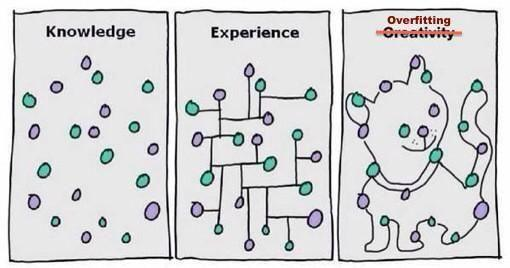

## Table of Contents

## What is overfitting in the context of algorithmic trading?

Overfitting in algorithmic trading happens when a trading model works too well on past data but fails to predict future market movements accurately. Imagine you're trying to hit a target with a dart. If you practice on a dartboard with a specific pattern, you might get really good at hitting that pattern. But if the pattern changes, your skills won't help you anymore. Similarly, an overfitted trading model learns the quirks of historical data so well that it can't adapt to new, different market conditions.

This problem is common because traders often have lots of historical data and want their models to perform perfectly on it. They might keep tweaking their model to fit every little detail of the past data, thinking it will make their predictions better. However, this usually leads to a model that is too complex and specialized. When new data comes in, which doesn't match the old patterns exactly, the model can't make good predictions. This can lead to big losses if the model is used for real trading.

## Why is overfitting a problem in algorithmic trading?

Overfitting is a big problem in algorithmic trading because it makes a trading model too focused on the past. When a model is overfitted, it learns all the little details and patterns from old data. This might make it look like the model is doing a great job when you test it with that old data. But the real world of trading is always changing, and new data won't have the same patterns. So, an overfitted model won't be able to predict what will happen next in the market, which can lead to bad trading decisions and losses.

This problem can be really sneaky because it's hard to spot until it's too late. Traders might feel confident because their model performs well on historical data, but when they start using it for real trading, the model fails. This can result in big financial losses because the model can't adapt to new market conditions. To avoid overfitting, traders need to make sure their models are simple enough to work with new data and not just the old stuff they've seen before.

## What are the common signs of overfitting in trading models?

One common sign of overfitting in trading models is when the model performs extremely well on historical data but fails to make accurate predictions when used in real-time trading. If your model seems perfect when you look back at old data but starts making bad trades when new data comes in, it might be overfitted. This happens because the model has learned too much from the past and can't handle new situations well.

Another sign is when the model is very complex and has too many parameters or rules. If you keep tweaking your model to fit every little detail of the past data, you're likely to end up with an overfitted model. A good trading model should be simple and flexible enough to adapt to new market conditions, not just the old ones it was trained on.

Lastly, if you see that your model's performance drops significantly when you test it with new, unseen data, this is a clear sign of overfitting. Traders often use a technique called cross-validation to check for this, where they split their data into training and testing sets. If the model works great on the training set but poorly on the testing set, it's a red flag that overfitting might be happening.

## How can you differentiate between a model that is overfitting and one that is genuinely predictive?

To tell if a trading model is overfitting or genuinely predictive, you need to look at how it performs on different sets of data. A genuinely predictive model will do well not just on the data it was trained on, but also on new, unseen data. This means it can make good guesses about what will happen in the future, not just what happened in the past. If you test your model with a set of data it hasn't seen before and it still makes accurate predictions, that's a good sign it's genuinely predictive.

On the other hand, an overfitted model will seem perfect when you look at the old data it was trained on, but it will fail when you try to use it with new data. This happens because the model learned too much about the past and can't handle new situations well. If you see that your model's performance drops a lot when you switch to new data, it's likely overfitting. To avoid this, traders often use a technique called cross-validation, where they split their data into training and testing sets. If the model works great on the training set but poorly on the testing set, it's a sign of overfitting.

## What is cross-validation and how can it help prevent overfitting?

Cross-validation is a way to test how well a trading model works. It's like checking if your model is good at guessing what will happen next, not just what happened before. You do this by splitting your data into two parts: one part to train the model and another part to test it. You train your model on the first part, then see how well it predicts the second part. If your model does well on both parts, it's a sign that it's not just memorizing old data but can actually predict new situations.

Using cross-validation helps prevent overfitting because it shows if your model is too focused on the past. If your model works great on the training data but fails on the testing data, it's a red flag that it might be overfitted. By regularly testing your model with new, unseen data, you can make sure it's flexible and can handle changes in the market. This way, you can build a model that's better at making real predictions and less likely to lead to big losses when you start trading with it.

## How can using a larger dataset help in reducing overfitting?

Using a larger dataset helps in reducing overfitting because it gives your trading model more information to learn from. When you train your model on a bigger set of data, it can see more different situations and patterns. This means the model won't just learn the quirks of a small amount of data; instead, it will get a better understanding of how the market works in general. By seeing more examples, the model can learn what's really important and ignore the little details that might not matter in the long run.

Having a larger dataset also lets you split your data into more parts for cross-validation. You can train your model on one big part and test it on another big part. If your model does well on both parts, it's a good sign that it's not just memorizing the training data but can actually predict new situations. This way, you can be more confident that your model will work well when you start using it for real trading, because it's been tested on a lot of different data.

## What role does feature selection play in preventing overfitting?

Feature selection helps prevent overfitting by making sure your trading model only uses the most important pieces of information. Imagine you're trying to guess what will happen in the stock market. If you use too many details, like every single news article or every tiny price change, your model might get confused and focus on things that don't really matter. By choosing only the key features, like major economic indicators or big price movements, your model can focus on what's truly important and make better predictions.

When you use fewer, but more relevant features, your model becomes simpler and less likely to overfit. A simpler model is easier to understand and more likely to work well with new data. It's like trying to solve a puzzle: if you have too many pieces that don't fit, it's harder to see the big picture. By selecting the right pieces, you can build a model that's good at guessing what will happen next, not just what happened before.

## How can regularization techniques like L1 and L2 be applied to trading algorithms?

Regularization techniques like L1 and L2 can help make trading algorithms better by stopping them from overfitting. L1 regularization, also called Lasso, works by adding a penalty to the model for using too many features. Imagine you're trying to guess what will happen in the stock market. If you use too many details, your model might get confused. L1 helps by making some of those details less important, so your model focuses on the big things that really matter. This way, your trading algorithm becomes simpler and more likely to work well with new data.

L2 regularization, known as Ridge, does something similar but in a different way. Instead of making some features less important, L2 adds a penalty that makes the model use all features a little bit less. It's like telling your model to take a step back and not get too caught up in any one thing. This helps keep the model from overfitting because it encourages the algorithm to look at the overall picture, not just the tiny details. By using L2, your trading algorithm can be more balanced and better at making predictions about what will happen next in the market.

## What are ensemble methods and how do they help in avoiding overfitting?

Ensemble methods are like having a team of experts instead of just one person making predictions. In trading, an ensemble method combines the predictions of several different models to make a final guess about what will happen in the market. By using multiple models, you can get a more balanced view because each model might see the market a little differently. This teamwork can help avoid overfitting because if one model gets too focused on the past, the others can help keep things on track.

When you use ensemble methods, you're less likely to overfit because the different models balance each other out. Imagine if one model is really good at predicting based on economic news, but another model is better at looking at price trends. By combining their predictions, you get a more complete picture of what's going on. This way, if any single model starts overfitting by focusing too much on old data, the other models can correct it, making your overall prediction more reliable and less likely to lead to big losses when you start trading.

## How can walk-forward optimization be used to mitigate overfitting in trading strategies?

Walk-forward optimization is a way to test and improve trading strategies without overfitting. It works by splitting your data into smaller chunks and testing your strategy step by step. You start by training your strategy on an early chunk of data, then you test it on the next chunk to see how well it predicts. If it does well, you move to the next chunk and do the same thing. This way, your strategy keeps learning and adapting as it goes along, instead of just focusing on old data.

This method helps prevent overfitting because it forces your strategy to keep working with new data. If your strategy only does well on the old data it was trained on but fails on new data, you know it's overfitting. By constantly testing with new chunks of data, walk-forward optimization makes sure your strategy stays flexible and can handle changes in the market. This means your trading strategy is more likely to make good predictions when you start using it for real trading.

## What advanced statistical methods can be employed to detect and prevent overfitting in complex trading models?

One advanced statistical method to detect and prevent overfitting in complex trading models is using a technique called "bootstrap aggregating" or "bagging." This method works by creating many different versions of your data set through random sampling with replacement. You then train your model on each of these versions and combine their predictions. By doing this, you can see if your model is too focused on certain parts of the data. If the predictions from different versions of the data are very different, it's a sign that your model might be overfitting. Bagging helps by smoothing out these differences and making your model more stable and less likely to overfit.

Another method is using "Bayesian methods," which help you understand how likely your model's predictions are to be correct. Bayesian methods let you update your model as new data comes in, which keeps it from getting stuck on old patterns. By constantly updating with new information, your model can adapt to changes in the market. This method also helps you see if your model is too complex by showing you how much each piece of data affects your predictions. If small changes in the data lead to big changes in your predictions, it might mean your model is overfitting.

Lastly, "information criteria" like Akaike Information Criterion (AIC) and Bayesian Information Criterion (BIC) can help you choose the right complexity for your model. These criteria balance how well your model fits the data with how simple it is. A model that fits the data perfectly but is very complex might be overfitting. By using AIC or BIC, you can find a model that's just complex enough to make good predictions without being too focused on the past data. This helps you build a trading model that's more likely to work well in the future.

## How can real-time monitoring and adjustment of trading models help in managing overfitting?

Real-time monitoring and adjustment of trading models can help manage overfitting by keeping an eye on how the model is doing as new data comes in. If the model starts making bad predictions, you can see it right away and make changes. This way, you can stop the model from getting too stuck on old patterns that don't work anymore. By watching the model's performance closely, you can make sure it stays flexible and can adapt to new situations in the market.

Adjusting the model in real-time also means you can try out different settings or rules to see what works best with the latest data. If you notice the model is overfitting, you can simplify it or change the features it uses. This helps the model focus on what's really important and ignore the little details that might not matter. By keeping your model updated and responsive to new data, you can build a trading strategy that's better at making predictions and less likely to lead to big losses.

## What are Regularization Techniques?

Regularization is a powerful technique used to combat overfitting in the development of trading algorithms. Overfitting occurs when a model learns the noise and idiosyncrasies of the training data rather than the underlying patterns, which can lead to poor predictive performance on unseen data. Regularization addresses this by introducing a penalty for larger model weights, which discourages complexity and encourages simplicity, leading to more generalizable models.

There are several types of regularization methods commonly applied, especially Lasso (Least Absolute Shrinkage and Selection Operator) and Ridge regression. Both aim to prevent overfitting but differ in their approach:

1. **Ridge Regression**: Ridge regression, also known as L2 regularization, adds a penalty equal to the square of the magnitude of coefficients. It is expressed as:

$$
\text{Cost Function} = \text{Least Squares} + \lambda \sum_{j=1}^{n} \theta_j^2
$$

where $\lambda$ is the regularization parameter determining the penalty level. Ridge regression effectively shrinks coefficients, particularly when there is high multicollinearity, thereby stabilizing the solution. In trading models, Ridge can help ensure that the trading strategy doesn't rely on noise from highly correlated indicators or features.

2. **Lasso Regression**: Lasso regression, or L1 regularization, adds a penalty equivalent to the absolute value of the coefficients:

$$
\text{Cost Function} = \text{Least Squares} + \lambda \sum_{j=1}^{n} |\theta_j|
$$

Unlike Ridge, Lasso can set some coefficients to zero, which inherently performs feature selection. This can be particularly useful in trading when trying to identify the most significant predictors from a large set of indicators, potentially leading to simpler and more interpretable trading models.

In trading scenarios, regularization has been effectively applied to improve algorithmic stability and performance. For instance, quantitative analysts may use these techniques to refine prediction models for asset prices, reducing the model's sensitivity to fluctuations that don’t represent true opportunity. By using Ridge or Lasso, traders can create strategies that are less prone to drastic changes based on random market noise.

Additionally, these regularization techniques can be integrated with [machine learning](/wiki/machine-learning) algorithms beyond linear regression, like decision trees or [neural network](/wiki/neural-network)s, thus broadening their applicability in creating reliable trading systems. In practice, choosing between Ridge and Lasso depends on the specific trading problem and data characteristics. In some cases, a combination called Elastic Net, which incorporates both L1 and L2 penalties, might be the most effective approach.

The regularization parameter $\lambda$ is typically determined through techniques like cross-validation, ensuring that the model performs optimally on unseen data while preventing overfitting to the training set. By carefully tuning $\lambda$, traders can strike a balance between bias and variance, crafting models that sustain performance even as market conditions change.

## References & Further Reading

[1]: Bergstra, J., Bardenet, R., Bengio, Y., & Kégl, B. (2011). ["Algorithms for Hyper-Parameter Optimization."](https://papers.nips.cc/paper_files/paper/2011/hash/86e8f7ab32cfd12577bc2619bc635690-Abstract.html) Advances in Neural Information Processing Systems 24.

[2]: ["Advances in Financial Machine Learning"](https://www.amazon.com/Advances-Financial-Machine-Learning-Marcos/dp/1119482089) by Marcos Lopez de Prado

[3]: ["Evidence-Based Technical Analysis: Applying the Scientific Method and Statistical Inference to Trading Signals"](https://www.wiley.com/en-gb/Evidence+Based+Technical+Analysis:+Applying+the+Scientific+Method+and+Statistical+Inference+to+Trading+Signals-p-9780470008744) by David Aronson

[4]: ["Machine Learning for Algorithmic Trading"](https://www.amazon.com/Machine-Learning-Algorithmic-Trading-intelligence/dp/9918608013) by Stefan Jansen

[5]: ["Quantitative Trading: How to Build Your Own Algorithmic Trading Business"](https://www.amazon.com/Quantitative-Trading-Build-Algorithmic-Business/dp/0470284889) by Ernest P. Chan