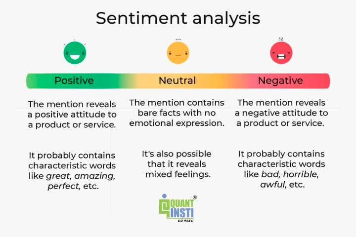

## Table of Contents

## What is sentiment analysis and how does it work?

Sentiment analysis is a way to figure out if people's opinions are positive, negative, or neutral. It's like trying to understand how someone feels about a topic by looking at what they say or write. This is often done by using computers and special programs that can read text and decide if the words and phrases used show happy, sad, or other feelings.

To do sentiment analysis, computers use different methods. One common way is to look for certain words that are known to show positive or negative feelings. For example, words like "good" or "happy" might show a positive sentiment, while words like "bad" or "sad" might show a negative one. Another way is to use machine learning, where the computer learns from lots of examples of text with known sentiments. Over time, it gets better at guessing the sentiment of new text it sees. This helps businesses understand what customers think about their products or services, or helps people see what others think about a topic on social media.

## What is algorithmic trading (algo trading)?

Algorithmic trading, or algo trading, is when computers use math formulas and rules to buy and sell things like stocks or currencies automatically. Instead of people making the decisions, the computer follows the steps in the algorithm to make trades quickly and without emotions getting in the way. This can help traders make decisions faster and sometimes more accurately than if they were doing it by hand.

Algo trading works by using special software that looks at lots of data, like prices and news, to find the best times to buy or sell. The computer can check this data much faster than a person can, which means it can spot opportunities or risks that might be missed otherwise. Many big banks and investment firms use algo trading because it can handle a lot of trades at once and can work around the clock without getting tired.

## How can sentiment analysis be integrated into algorithmic trading systems?

Sentiment analysis can be added to algorithmic trading systems to help make better trading choices. By looking at what people are saying on social media, news, or other places, sentiment analysis can tell if people feel good or bad about a company or market. This information can be used by the trading algorithm to decide when to buy or sell. For example, if lots of people are saying good things about a company, the algorithm might decide to buy its stock because the positive feelings could mean the stock price will go up.

Adding sentiment analysis to algo trading can make it smarter and faster. The computer can look at tons of information from the internet in real-time, which is much quicker than a person could do. This means the trading system can react to changes in how people feel about a stock or market almost instantly. However, it's important to remember that sentiment analysis isn't perfect and can sometimes be wrong, so it should be used along with other data and methods to make the best trading decisions.

## What are the common sources of sentiment data used in algo trading?

In algo trading, sentiment data often comes from social media platforms like Twitter, Facebook, and Reddit. These sites have lots of people sharing their thoughts and feelings about companies, products, and markets. By looking at what people are saying on these platforms, a trading algorithm can get a sense of whether the general feeling is positive, negative, or neutral. For example, if many people are tweeting good things about a company, it might mean that the company's stock could go up.

Another common source of sentiment data is financial news websites and blogs. These places often have articles and reports about companies and markets, which can show what experts and journalists think. Algorithms can read these texts to see if the news is good or bad for a company. For instance, if a news article says a company is doing well, the sentiment might be positive, which could affect trading decisions.

Some traders also use data from company reviews and consumer feedback sites. Websites like Yelp or Amazon have reviews where people share their experiences with products or services. By analyzing these reviews, an algorithm can gauge public sentiment towards a company. If a lot of reviews are positive, it might suggest that the company's stock could perform well in the market.

## How do traders use sentiment analysis to make trading decisions?

Traders use sentiment analysis to understand how people feel about a company or the market. They look at what people are saying on social media, news websites, and review sites to see if the general feeling is positive, negative, or neutral. If lots of people are saying good things about a company, traders might think the company's stock price will go up. On the other hand, if people are saying bad things, traders might think the stock price will go down. By knowing this, traders can decide when to buy or sell stocks based on what people are feeling.

For example, if a big company like Apple gets a lot of positive tweets and news articles about a new product, traders might use sentiment analysis to see this and decide to buy Apple's stock. They think that the positive feelings will make more people want to buy the stock, pushing the price up. But sentiment analysis isn't perfect. Sometimes it can be wrong, so traders often use it along with other information like financial reports and market trends to make the best trading decisions.

## What are the key metrics and indicators derived from sentiment analysis for trading?

Traders use sentiment analysis to look at things like the overall positivity or negativity of what people are saying about a company or market. One key metric is the Sentiment Score, which is a number that shows if the sentiment is mostly positive, negative, or neutral. A high positive score might mean people feel good about a company, which could make traders want to buy its stock. On the other hand, a high negative score might make traders want to sell, thinking the stock price will go down.

Another important indicator is the Volume of Sentiment, which tells traders how many people are talking about a company or market. If a lot of people are discussing a company, it might mean something important is happening, and traders should pay attention. The Change in Sentiment is also useful, showing how people's feelings are changing over time. If sentiment is getting more positive, traders might see it as a good time to buy, while a shift to more negative sentiment might signal a time to sell.

These metrics help traders make decisions by giving them a quick way to understand public feelings. But traders don't just use sentiment analysis alone. They also look at other things like financial reports and market trends to make sure they're making the best choices. By combining sentiment data with other information, traders can get a fuller picture of what might happen next in the market.

## How can sentiment analysis improve the accuracy of trading algorithms?

Sentiment analysis can help make trading algorithms more accurate by giving them a better understanding of how people feel about a company or the market. When lots of people are saying good things about a company, it might mean that the company's stock price will go up. By looking at this information, the trading algorithm can make smarter choices about when to buy or sell. This is because sentiment analysis adds another layer of information that the algorithm can use, helping it to see things that it might miss if it only looked at numbers and charts.

However, sentiment analysis isn't perfect and can sometimes be wrong. That's why it's important to use it along with other data, like financial reports and market trends. By combining sentiment data with these other sources, the trading algorithm can get a fuller picture of what's happening. This can lead to more accurate trading decisions because the algorithm is using all the information it can to make the best choices.

## What are the challenges and limitations of using sentiment analysis in algo trading?

Using sentiment analysis in algo trading can be tricky because it's not always accurate. Sometimes, people say things in ways that are hard for computers to understand. For example, sarcasm or slang can make it tough for a computer to know if someone is being positive or negative. Also, sentiment analysis often looks at a lot of data from social media and news, but not all of this data is important or relevant. It can be hard to sort out what really matters from what doesn't, which might lead to wrong trading decisions.

Another challenge is that sentiment can change quickly. What people feel about a company one day can be totally different the next. If a trading algorithm relies too much on sentiment, it might make trades based on feelings that change before the trade even happens. This means the algorithm needs to be smart about how it uses sentiment data, and it should use other information too, like financial reports and market trends, to make the best decisions. By combining different kinds of data, the algorithm can work better and make more accurate trades.

## Can sentiment analysis be used to predict market trends and how?

Sentiment analysis can help predict market trends by looking at what people are saying about companies and markets on social media, news websites, and review sites. If lots of people are saying good things about a company, it might mean that more people will want to buy its stock, which could make the stock price go up. On the other hand, if many people are saying bad things, it might mean the stock price will go down. By understanding these feelings, traders can guess what might happen next in the market.

However, using sentiment analysis to predict market trends isn't always easy. People's feelings can change quickly, and what they say might not always be what they mean. For example, sarcasm or slang can be hard for computers to understand. Also, not all the information on social media or news sites is important or true. So, traders need to use sentiment analysis along with other information, like financial reports and market data, to make the best guesses about future market trends. By combining different kinds of information, traders can get a better picture of what might happen next.

## How does real-time sentiment analysis affect trading strategies?

Real-time sentiment analysis can change how traders make decisions by giving them up-to-date information about how people feel about a company or the market. If lots of people are saying good things about a company on social media or in the news right now, traders might think the company's stock price will go up soon. This can make them want to buy the stock quickly to take advantage of the positive feelings. On the other hand, if people are saying bad things, traders might sell the stock to avoid losing money as the price goes down.

However, using real-time sentiment analysis can be tricky because feelings can change fast. What people think about a company one minute can be different the next. Traders need to be careful and not rely only on sentiment analysis. They should also look at other information, like financial reports and market trends, to make the best trading choices. By combining real-time sentiment data with other data, traders can make smarter and more accurate decisions about when to buy or sell stocks.

## What advanced techniques can be applied to enhance sentiment analysis in algo trading?

To make sentiment analysis better for algo trading, traders can use something called natural language processing (NLP). NLP helps computers understand human language better, including things like sarcasm and slang. By using NLP, the computer can look at the context of what people are saying and figure out if they really mean something good or bad. Another advanced technique is using [machine learning](/wiki/machine-learning). With machine learning, the computer can learn from lots of examples of text and get better at guessing how people feel over time. This means the trading algorithm can keep improving and making more accurate predictions about what the market might do next.

Another way to enhance sentiment analysis is by using [deep learning](/wiki/deep-learning), which is a type of machine learning that's really good at understanding complex patterns in data. Deep learning can help the computer see connections between different pieces of information, like how news articles and social media posts might affect each other. This can give the trading algorithm a fuller picture of what's happening in the market. Also, traders can use something called sentiment aggregation, where they combine sentiment data from different sources to get a more complete view. By looking at what people are saying on social media, news sites, and review platforms all together, the algorithm can make smarter decisions about when to buy or sell stocks.

## How can one evaluate the performance of sentiment analysis models in the context of algo trading?

To check how well a sentiment analysis model works for algo trading, you can look at how accurately it predicts if people's feelings about a company or market are good, bad, or neutral. One way to do this is by comparing the model's predictions to what actually happens in the market. If the model says people feel good about a company and the stock price goes up, that's a good sign. You can also use something called backtesting, where you use old data to see how the model would have done in the past. If the model's predictions match what happened back then, it might be good at guessing what will happen in the future.

Another way to evaluate the model is by looking at how much money it makes or loses when used in trading. If the model helps make more money than it loses, it's probably working well. But it's important to remember that sentiment analysis isn't perfect and can sometimes be wrong. That's why it's a good idea to use other information, like financial reports and market trends, along with sentiment analysis to make the best trading decisions. By combining different kinds of data, you can get a better picture of what might happen next in the market.

## What are the Mechanics of Algorithmic Trading?

Algorithmic trading, often referred to as algo trading, has become a cornerstone of modern financial markets. Its history dates back to the 1970s, with roots in the development of the New York Stock Exchange's electronic trading platforms. The evolution accelerated in the 1980s and 1990s as markets began embracing computerized trading systems, drastically reducing trading costs and improving execution speed. Today, more than 60% of trades on major exchanges are performed by algorithms.

Algo trading systems are built on several key components that operate synergistically. At the core, data inputs drive decision-making processes. These inputs include historical market data, real-time price information, order flows, and even [alternative data](/wiki/best-alternative-data) sources like news sentiment and social media analytics. The crux of these systems is their ability to digest large quantities of diverse data quickly to identify trading opportunities.

Automated decision-making, another crucial component, encompasses model-driven strategies that exploit these opportunities. Trading algorithms use quantitative models—based on mathematical and statistical techniques—to execute trades. For example, moving averages, mean reversion, and [momentum](/wiki/momentum) trading strategies are frequently employed. To illustrate, a simple moving average crossover strategy could be expressed as:

$$
\text{Buy Signal: if } SMA_{short} > SMA_{long}
$$

Here, $SMA_{short}$ and $SMA_{long}$ represent short-term and long-term moving averages, respectively. The algorithm triggers a buy order when the short-term average crosses above the long-term average.

The benefits of [algorithmic trading](/wiki/algorithmic-trading) are considerable. Algorithms execute orders at optimal prices and accurate timing, which minimizes transaction costs and human errors. Additionally, they have the ability to analyze multiple markets and assets simultaneously, which is invaluable for [hedge fund](/wiki/hedge-fund-trading-strategies)s and large trading firms aiming for diversification.

However, algorithmic trading is not without risks. A notable risk is the potential for systemic failures during high-frequency trading, which can exacerbate market [volatility](/wiki/volatility-trading-strategies) and lead to events like the Flash Crash of 2010. There's also the challenge of overfitting, where algorithms are too finely tuned to historical data and may not perform well in different market conditions. Ensuring robustness through rigorous [backtesting](/wiki/backtesting) and developing fail-safe mechanisms is essential for mitigating these risks.

In summary, algorithmic trading is a sophisticated, data-driven approach that significantly enhances trading efficiency and effectiveness. As technology advances, the integration of new data types and improved computational capabilities will continue to shape its evolution.

## References & Further Reading

[1]: Arel, I., Rose, D. C., & Karnowski, T. P. (2010). ["Deep Machine Learning - A New Frontier in Artificial Intelligence Research"](https://ieeexplore.ieee.org/document/5605630). IEEE Computational Intelligence Magazine, 5(4), 13-18.

[2]: Bollen, J., Mao, H., & Zeng, X. (2011). ["Twitter mood predicts the stock market"](https://www.sciencedirect.com/science/article/abs/pii/S187775031100007X). PloS one, 6(12), e26752.

[3]: Zhang, X., Fuehres, H., & Gloor, P. A. (2011). ["Predicting stock market indicators through Twitter “I hope it is not as bad as I fear""](https://www.sciencedirect.com/science/article/pii/S1877042811023895). Procedia-Social and Behavioral Sciences, 26, 55-62.

[4]: Nielsen, F. Å. (2011). ["A new ANEW: Evaluation of a word list for sentiment analysis in microblogs"](https://arxiv.org/abs/1103.2903). arXiv preprint arXiv:1103.2903.

[5]: ["The Handbook of News Analytics in Finance"](https://onlinelibrary.wiley.com/doi/book/10.1002/9781118467411) by Gautam Mitra and Leela Mitra

[6]: ["Sentiment Analysis for Financial Markets"](https://www.eti.uni-siegen.de/ws/publikationen/repository/sentiment_analysis_in_financial_markets_-_a_framework_to_utilize_the_human_ability_of_word_association_for_analyzing_stock_market_news_reports.pdf) by Hao Li

[7]: ["Advances in Financial Machine Learning"](https://www.amazon.com/Advances-Financial-Machine-Learning-Marcos/dp/1119482089) by Marcos Lopez de Prado