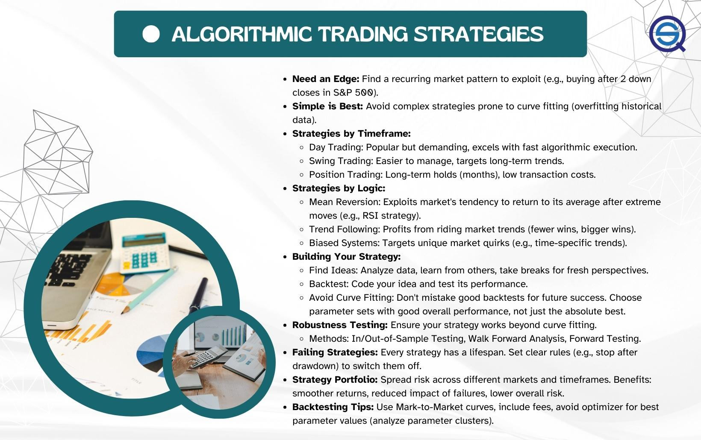

## Table of Contents

## What is algorithmic trading and why is it important?

Algorithmic trading is when computers use math formulas to buy and sell things like stocks automatically. Instead of people making the decisions, the computer follows the steps in the formula to decide when to trade. This can happen very quickly, often in just a few seconds or even less.

It's important because it can make trading faster and sometimes more accurate than if people did it by hand. It can also handle a lot of trades at the same time, which can be hard for people to do. This can help big companies and investors make more money and manage their investments better.

## What are the basic skills required to start in algorithmic trading?

To start in algorithmic trading, you need to know how to code. This means learning a programming language like Python, which is popular in this field. You'll use this language to write the formulas that tell the computer when to buy or sell. It's also important to understand basic math and statistics, as these are used to create the trading strategies.

Another key skill is understanding the financial markets. You need to know how stocks, bonds, and other things you can trade work. This includes learning about different market conditions and how they can affect your trades. It's also helpful to be good at analyzing data, as you'll need to look at a lot of information to make your trading decisions.

Lastly, patience and continuous learning are crucial. Algorithmic trading is a field that keeps changing, so you need to keep up with new tools and techniques. It's also important to test your strategies carefully before using them with real money. This means running simulations and [backtesting](/wiki/backtesting) to see how your formulas would have worked in the past.

## How can someone with no programming experience begin learning to code for trading?

If you want to start coding for trading but don't know how to code yet, the first step is to learn a programming language. Python is a good choice because it's easy to learn and many people use it for trading. You can find lots of free resources online, like tutorials and courses on websites like Codecademy or Coursera. Start with the basics of Python, like variables, loops, and functions. As you get more comfortable, you can move on to more advanced topics.

Once you have a good grasp of Python, you can start learning about libraries that are useful for trading, like Pandas for data analysis and NumPy for math operations. There are also specific libraries for trading, like Backtrader or Zipline, which can help you test your trading strategies. It's important to practice a lot. Try writing small programs to solve simple problems, and gradually work your way up to more complex trading algorithms. Joining online communities or forums can also be helpful, as you can learn from others and get advice on your code.

Remember, learning to code takes time and patience. Don't get discouraged if things seem hard at first. Keep practicing, and over time, you'll get better. Once you feel confident with your coding skills, you can start applying them to create and test trading strategies. This journey will be challenging, but with persistence, you can become proficient in [algorithmic trading](/wiki/algorithmic-trading).

## What programming languages are most commonly used in algorithmic trading?

The most common programming language used in algorithmic trading is Python. It's popular because it's easy to learn and has many libraries that help with trading. Libraries like Pandas and NumPy help with data analysis and math, while Backtrader and Zipline are used for testing trading strategies. Many traders start with Python because it's user-friendly and has a big community that shares tips and code.

Another language often used is C++. It's faster than Python and good for handling lots of trades quickly. C++ is more complex to learn, but it's used by big trading firms that need to process trades in milliseconds. Some traders also use R for its strong statistical tools, though it's less common than Python or C++.

Java is another option, especially for building trading platforms. It's good for creating software that can handle many users at once. While not as popular as Python for individual traders, Java is used in big financial systems. Each language has its strengths, so the choice depends on what you need for your trading strategy.

## What are the essential mathematical concepts one needs to understand for algorithmic trading?

To do well in algorithmic trading, you need to understand some basic math ideas. One important concept is [statistics](/wiki/bayesian-statistics). This helps you look at past data to see patterns and make guesses about what might happen next. You'll use things like averages, standard deviation, and correlation to understand how prices move and how different things in the market are related. Another key idea is probability. This helps you figure out how likely it is that a certain trade will make money. You'll use probability to decide if a trade is worth the risk.

Another important math concept is calculus. This can help you understand how things change over time, which is useful for figuring out trends in the market. You might use calculus to make models that predict how prices will move. Linear algebra is also helpful because it lets you work with lots of data at once. This is useful when you're trying to understand how many different things in the market affect each other. Understanding these math ideas will help you build better trading strategies and make smarter decisions.

## How can someone set up a basic trading algorithm?

To set up a basic trading algorithm, you first need to choose a programming language. Python is a good choice because it's easy to learn and has many tools for trading. Once you have Python, you'll need to install some libraries. Libraries like Pandas and NumPy help you work with data, while Backtrader or Zipline can help you test your trading ideas. After setting up your tools, you can start writing your algorithm. A simple algorithm might look at a stock's price and decide to buy if it goes below a certain price and sell if it goes above another price.

Next, you need to test your algorithm. This means running it on old data to see how it would have done in the past. This is called backtesting. If your algorithm makes money in the backtest, it might work well in real trading. But remember, past results don't always mean future success. After backtesting, you can try your algorithm with a small amount of real money to see how it does. This is called paper trading or demo trading. If it works well, you can start using it with more money. Always keep learning and improving your algorithm as the market changes.

## What are the common pitfalls beginners face in algorithmic trading and how to avoid them?

One common pitfall beginners face in algorithmic trading is over-optimizing their strategies based on past data. This happens when they tweak their algorithm so much that it works perfectly on historical data but fails in real-time trading. This is called overfitting. To avoid this, beginners should not only focus on past results but also test their strategies in different market conditions and use a variety of data sets. It's also helpful to keep the strategy simple and not make too many changes based on short-term results.

Another issue is not understanding the risks involved. Beginners might think that because their algorithm worked well in a backtest, it will always make money. But the market can be unpredictable, and what worked before might not work again. To avoid this, it's important to always use risk management tools like stop-loss orders, which automatically sell a stock if it drops too much. Also, never invest more money than you can afford to lose. It's better to start small and increase your investment as you gain more experience and confidence in your strategy.

Lastly, many beginners don't spend enough time learning the basics of both programming and the financial markets. They might jump into trading without understanding how stocks or other assets work, or without knowing enough about coding to fix problems in their algorithms. To avoid this, take the time to learn the fundamentals. Start with simple trading strategies and gradually build up to more complex ones. Joining online communities or finding a mentor can also help you learn from others' experiences and avoid common mistakes.

## How does one backtest and validate trading strategies?

Backtesting a trading strategy means testing it on old data to see how it would have done in the past. You use a computer program to run your trading rules on historical prices and see if they would have made money. It's like playing a game with old scores to see if your strategy would win. This helps you find out if your idea is good or if it needs changes. You can use tools like Backtrader or Zipline in Python to do this easily. Remember, though, just because a strategy worked in the past doesn't mean it will work in the future. Markets change, so you need to be careful.

After backtesting, you should validate your strategy by trying it in real-time but with fake money. This is called paper trading or demo trading. You use a platform that lets you trade without risking real money, so you can see how your strategy does in today's market. This step is important because it shows you how your strategy works with current market conditions. If it does well in paper trading, you can feel more confident about using real money. Always keep learning and adjusting your strategy as you go, because the market is always changing.

## What are advanced techniques in algorithmic trading and how can one learn them?

Advanced techniques in algorithmic trading include [machine learning](/wiki/machine-learning) and [artificial intelligence](/wiki/ai-artificial-intelligence). These methods use computers to learn from data and make better trading decisions. For example, machine learning can help find patterns in stock prices that are hard for people to see. Another advanced technique is high-frequency trading, where computers buy and sell stocks very quickly, often in milliseconds. This can make money from small price changes that happen in a short time. Also, some traders use complex math models to predict how the market will move. These models can be very hard to understand but can help make better trading choices.

To learn these advanced techniques, you need to start with the basics of programming and math. Once you're good at those, you can move on to learning about machine learning and AI. There are many online courses and [books](/wiki/algo-trading-books) that can teach you these things. For example, you can take classes on platforms like Coursera or edX to learn about machine learning. It's also helpful to practice a lot. You can use tools like TensorFlow or scikit-learn to build and test your own machine learning models. Joining online communities or finding a mentor can also help you learn faster. Remember, learning advanced techniques takes time and patience, but with practice, you can get better at using them in your trading.

## How important is understanding market microstructure for algorithmic trading?

Understanding market microstructure is very important for algorithmic trading. Market microstructure is all about how trades happen in the market, like how orders are placed and how prices are set. If you know about market microstructure, you can make better trading algorithms. For example, you can understand how your trades might affect the price of a stock or how to get the best price when you buy or sell. This can help you make more money and avoid losing money because of bad timing or other market tricks.

Learning about market microstructure can also help you spot opportunities that others might miss. You can see patterns in how people trade and use that information to your advantage. For instance, knowing when big orders are likely to come in can help you decide when to trade. It's like having a secret map that shows you the best paths to take in the market. So, if you want to be good at algorithmic trading, spending time to understand market microstructure is a smart move.

## What regulatory considerations should someone entering the field of algorithmic trading be aware of?

When you start in algorithmic trading, you need to know about the rules that govern trading. Different countries have different rules, but they all want to make sure trading is fair and safe. For example, in the United States, the Securities and Exchange Commission (SEC) and the Commodity Futures Trading Commission (CFTC) set rules for trading. These rules can include things like how fast you can trade, how you report your trades, and how you handle other people's money. It's important to follow these rules to avoid getting in trouble or losing your right to trade.

Another thing to think about is the risk of breaking rules without meaning to. Algorithms can trade very quickly, and sometimes they might do things that are against the rules by accident. To avoid this, you should test your algorithms carefully and keep an eye on them when they're running. Also, staying up to date with changes in the rules is important. The world of trading is always changing, and new rules can come up that you need to follow. By understanding and following the rules, you can trade safely and avoid problems.

## How can someone transition from a beginner to a professional algorithmic trader?

To move from a beginner to a professional algorithmic trader, you need to start by building a strong foundation in both programming and understanding the financial markets. Begin with learning a programming language like Python, which is widely used in trading. Practice writing simple trading algorithms and gradually work on more complex ones. At the same time, study the basics of how stocks, bonds, and other financial instruments work. Understand market trends and how different factors can affect prices. Joining online communities or finding a mentor can help you learn faster and avoid common mistakes. As you get better, start backtesting your strategies on historical data to see how they would have performed in the past.

Once you feel confident with your skills and strategies, the next step is to validate them in real-time trading. Start with paper trading or demo trading, where you use fake money to see how your algorithms perform in current market conditions. This helps you refine your strategies without risking real money. As you gain more experience and see consistent results, you can slowly start trading with real money, but always begin with small amounts. Keep learning and adapting your strategies because the market is always changing. Also, make sure to understand and follow the regulatory rules in your country to avoid any legal issues. With patience and continuous improvement, you can transition into a professional algorithmic trader.

## References & Further Reading

[1]: Bergstra, J., Bardenet, R., Bengio, Y., & Kégl, B. (2011). ["Algorithms for Hyper-Parameter Optimization."](https://papers.nips.cc/paper_files/paper/2011/hash/86e8f7ab32cfd12577bc2619bc635690-Abstract.html) Advances in Neural Information Processing Systems 24.

[2]: ["Advances in Financial Machine Learning"](https://www.amazon.com/Advances-Financial-Machine-Learning-Marcos/dp/1119482089) by Marcos Lopez de Prado

[3]: ["Evidence-Based Technical Analysis: Applying the Scientific Method and Statistical Inference to Trading Signals"](https://www.wiley.com/en-gb/Evidence+Based+Technical+Analysis:+Applying+the+Scientific+Method+and+Statistical+Inference+to+Trading+Signals-p-9780470008744) by David Aronson

[4]: ["Machine Learning for Algorithmic Trading"](https://www.amazon.com/Machine-Learning-Algorithmic-Trading-intelligence/dp/9918608013) by Stefan Jansen

[5]: ["Quantitative Trading: How to Build Your Own Algorithmic Trading Business"](https://www.amazon.com/Quantitative-Trading-Build-Algorithmic-Business/dp/0470284889) by Ernest P. Chan