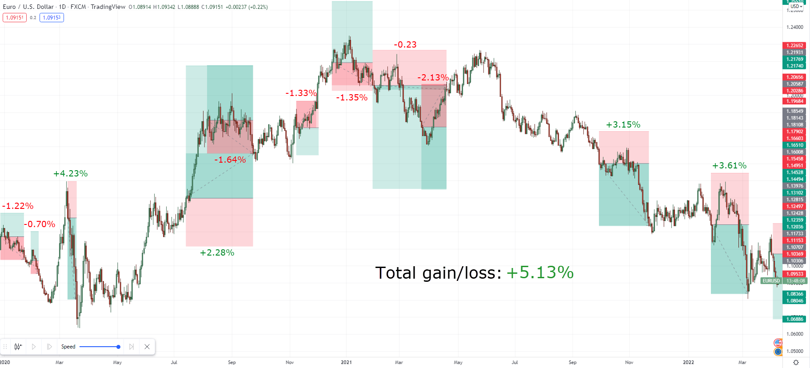

The rise of information technology has given rise to a new form of trading: algorithmic trading driven by artificial intelligence (AI). As with any trading strategy, it is essential to test and validate algorithms before deploying them on the markets in real-time. Here's a guide to the process.

## Table of Contents

## Understanding backtesting

**Backtesting** is the simulation of a trading strategy on historical data. It allows you to evaluate the past performance of an algorithm without risking real capital. To do this, you'll need :

- A **historical data set**: Make sure it's clean, accurate, and covers a long enough period to be meaningful.
- A **backtesting software or platform**: Some are specialized in AI-driven trading, such as QuantConnect or Backtrader.

## Backtesting

Follow these steps for effective backtesting:

1. **Define your strategy**: This includes parameters such as entry and exit criteria, stop-loss, take-profit, etc.
2. **Program your algorithm**: Use an appropriate language such as Python, R or Java. Integrate AI functions if necessary (e.g. neural networks or support vector machines).
3. **Run simulation**: Be sure to include transaction fees, slippage and other costs associated with trading.

## Analyze results

After backtesting, analyze your algorithm's performance. Consider metrics such as:

- **Total and annual return**.
- **Maximum drawdown**: the algorithm's biggest drop in value.
- **Sharpe ratio**: measures risk-adjusted performance.
- **Frequency and duration of loss periods**.

## Out-of-sample validation

It's common for algorithms to "overlearn" on historical data, meaning that they may perform admirably on backtesting data but poorly in real-time. To combat this, divide your data into two sets: a training set for backtesting and a test set (or out-of-sample validation) for validation.

## Perform a prospective test

Once you've validated your algorithm with out-of-sample data, it's time to test it in a real-time environment, but still in simulation mode. This is known as paper trading. This will allow you to see how the algorithm reacts to current market conditions without risking real capital.

## Revision and optimization

It's likely that your algorithm will need some fine-tuning after testing. Make sure you don't "over-optimize", i.e. avoid making it too specific to the test data set.

## Conclusion

Backtesting and validation are crucial steps in the development of AI-driven trading algorithms. By adhering to a strict methodology and avoiding the pitfalls of over-optimization, traders can increase their chances of deploying profitable strategies on the financial markets.
