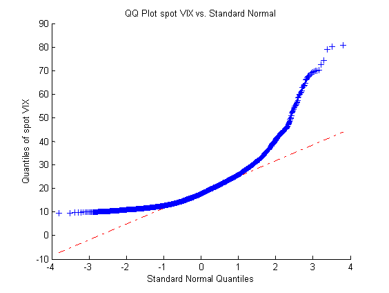

Volatility arbitrage is a sophisticated strategy employed in quantitative trading that seeks to capitalize on discrepancies between the market's forecasted volatility of an asset and the actual realized volatility. At its core, it involves using financial instruments, mainly derivatives such as options, to take advantage of these differences. The strategy often involves constructing positions that can benefit from changes in volatility irrespective of the market's direction. This is particularly intriguing in quantitative trading, where mathematical models and algorithms are pivotal in identifying and exploiting market inefficiencies.



Understanding volatility is crucial in financial markets as it is a measure of the degree of variation in trading prices over time. It reflects the uncertainty or risk related to changes in the value of an asset. There are two primary types of volatility: historical volatility, which is based on past price movements, and implied volatility, which is derived from the market price of an option and indicates the market's forecast of future volatility. Quantitative traders use these measures to assess the potential risk and opportunity within the market. High volatility can signal potential investment opportunities but also signifies higher risk.

The purpose of this article is to elucidate how volatility arbitrage can be effectively exploited within quantitative trading. By examining the role of volatility in market dynamics, highlighting the tools and techniques used in volatility arbitrage, and discussing the strategies and challenges associated with this approach, traders can gain insights into how they might incorporate volatility arbitrage into their own trading portfolios. The article will also explore real-world examples and future trends, providing a comprehensive understanding of how volatility arbitrage operates within the broader field of quantitative trading.


## Table of Contents

## Understanding Volatility in Financial Markets

Volatility in financial markets refers to the degree of variation in the price of a financial asset over time. It is a statistical measure that indicates the risk or uncertainty associated with the size of changes in an asset's value. Two primary types of volatility are used in financial analysis: historical volatility and implied volatility.

**Historical Volatility (HV):** This measurement is derived from the past market prices of an asset. It calculates the standard deviation of price changes over a specific period, offering a backward-looking view of price fluctuations. For instance, the formula for historical volatility over $n$ time periods is given by:

$$
\sigma = \sqrt{\frac{\sum_{i=1}^{n} (R_i - \bar{R})^2}{n-1}} 
$$

where $R_i$ is the return in each period, $\bar{R}$ is the average return, and $n$ is the number of observations.

**Implied Volatility (IV):** Unlike historical volatility, implied volatility is forward-looking and is embedded in the prices of options. It reflects the market's expectations of future volatility. Calculations for implied volatility often rely on models such as the Black-Scholes, which can solve for volatility as an unknown variable, assuming current market prices are accurate.

**Factors Contributing to Market Volatility:**
1. **Economic Indicators:** Factors such as inflation rates, employment statistics, and Gross Domestic Product (GDP) forecasts play a significant role in shaping market sentiment and therefore volatility.
2. **Geopolitical Events:** Wars, trade conflicts, political instability, and pandemics can cause abrupt shifts in investor behavior, increasing market volatility.
3. **Corporate Performance:** Earnings reports, management changes, and other corporate announcements can cause significant price movements in stocks.
4. **Market Sentiment:** Psychological factors and herd behavior can lead to market overreactions or underreactions, further driving price volatility.

**Impact of Volatility on Asset Prices and Investor Behavior:**
Volatility significantly influences asset pricing models and risk management practices. High volatility is often associated with greater risk, which can lead to increased risk premiums demanded by investors. During volatile periods, asset prices can experience large swings, affecting portfolio valuations and triggering margin calls or stop-loss orders.

From the perspective of investor behavior, higher volatility typically results in higher uncertainty, which may cause panic-selling or overly cautious investing strategies. Investors might require greater expected returns to compensate for the increased risk, affecting their risk tolerance and investment horizons.

Understanding volatility is crucial for investors and traders to manage risk and make informed decisions. Tools and models that measure and predict volatility are integral to strategies aimed at capitalizing on or hedging against fluctuating market conditions.


## What is Volatility Arbitrage?

Volatility arbitrage is a trading strategy that seeks to profit from the difference between the market's expectation of volatility (implied volatility) and the actual volatility of an asset (realized volatility). This strategy is grounded in the belief that the market's forecast of future volatility is often inaccurate, providing an opportunity for traders to capitalize on this mispricing.

Volatility arbitrage is primarily executed using options, as options are financial derivatives whose value is highly sensitive to the volatility of the underlying asset. By constructing a portfolio that has a net position in options, traders can theoretically profit from changes in volatility, regardless of the direction in which the underlying asset's price moves. For example, a trader might buy options when they perceive implied volatility is lower than expected future realized volatility, anticipating that the market will eventually correct itself, leading to profitability.

Compared to other forms of arbitrage, such as statistical and risk arbitrage, volatility arbitrage focuses specifically on volatility mispricings rather than price discrepancies of the assets themselves or events that might change the value of those assets. Statistical arbitrage involves strategies that utilize historical data and statistical models to predict price movements, often resulting in market-neutral positions across a diverse portfolio of assets. Risk arbitrage, also known as merger arbitrage, involves betting on the successful completion of mergers and acquisitions, taking positions in stocks of the companies involved in such corporate actions.

The objective of volatility arbitrage is centered around exploiting discrepancies between expected and realized volatility. To measure these discrepancies, traders often rely on complex mathematical models and computational techniques. Implied volatility is calculated from options pricing models like Black-Scholes, while realized volatility is usually derived from historical price data. The difference between these two measures becomes the foundation for potential arbitrage opportunities.

In essence, volatility arbitrage exploits inefficiencies in the market's volatility forecasting. It requires a deep understanding of option pricing, access to robust analytical tools, and a strong risk management framework to mitigate the inherent risks in trading volatility, such as model inaccuracies and unexpected market movements. As the market continuously evolves, traders need to adapt their strategies and incorporate technological advancements to maintain a competitive edge in volatility arbitrage.


## Tools and Techniques for Volatility Arbitrage

Volatility arbitrage relies heavily on a set of financial instruments and quantitative methodologies to exploit market inefficiencies. At its core, volatility arbitrage uses derivatives like options, futures, and swaps to gain exposure to volatility differentials.

**Derivatives as Tools for Volatility Arbitrage**

Options, as contingent claims, provide traders with the right but not the obligation to buy (calls) or sell (puts) an underlying asset at a predetermined price before a specific date. This embedded flexibility makes them ideal for volatility-based strategies, as they can be structured to profit from implied volatility differences versus actual market volatility. For instance, when the implied volatility of an option is higher than the anticipated realized volatility, a trader might sell options to capture the premium.

Futures and swaps are also instrumental in executing volatility strategies. Futures contracts, which obligate the buying or selling of an asset at a future date and price, can be used to gain leveraged exposure to expected changes in volatility. Volatility swaps, on the other hand, allow traders to speculate directly on the future realized volatility of an asset without direct exposure to the asset itself. These instruments are particularly useful for those looking to manage or speculate on volatility without crossing into directional bets.

**Quantitative Methods and Models Used**

Quantitative models are vital for analyzing and predicting volatility. The Black-Scholes model, a cornerstone in options pricing, is commonly employed to determine theoretical values for options by incorporating factors such as the underlying asset price, strike price, time until expiration, risk-free rate, and volatility. Although its assumptions, such as constant volatility and log-normal distribution of returns, are sometimes challenged, it remains widely used due to its simplicity and foundational insight into options pricing.

Greeks, derivatives of the Black-Scholes model, offer deeper insights into an option's risk profile. Delta measures the sensitivity of an option's price to changes in the underlying asset, while gamma assesses the rate of change in delta. Vega indicates the sensitivity to volatility changes, making it particularly pertinent for volatility arbitrageurs. Understanding and managing these sensitivities helps traders construct positions that are appropriately hedged against unforeseen market moves.

For more advanced modeling, GARCH (Generalized Autoregressive Conditional Heteroskedasticity) models are frequently applied to forecast financial market volatility. These models account for volatility clustering, a phenomenon where large price swings tend to be followed by larger swings and small by smaller ones. GARCH models adapt to changing market conditions, proving essential for generating reliable forecasts and enabling traders to capture variance inefficiencies.

**Importance of Technological Infrastructure**

Effective execution in volatility arbitrage requires robust technological infrastructure. High-frequency trading systems and algorithmic platforms enable the rapid assessment and execution of trades, which is crucial given the fast-paced nature of volatility changes. Real-time data feeds and advanced analytical tools empower traders to make informed decisions promptly, ensuring competitive advantage.

Moreover, innovations in machine learning and big data analytics are enhancing the ability to detect and act on subtle volatility patterns. These technologies allow the processing of vast datasets, improving the precision of volatility forecasts and enabling more nuanced strategy development. As financial markets continue to evolve, the integration of sophisticated technology into volatility arbitrage strategies will likely become even more critical.


## Strategies for Exploiting Volatility Arbitrage

In volatility arbitrage, sophisticated strategies are deployed to exploit differences between predicted and realized volatility. Understanding and implementing these strategies effectively can lead to profitable outcomes in quantitative trading.

**Common Volatility Arbitrage Strategies**

1. **Long Volatility Positions**: Traders take long positions on options or derivatives that will benefit from an increase in market volatility. This involves buying options that will increase in value as volatility rises, like straddles or strangles. These strategies are suitable when a significant market movement is anticipated, regardless of the direction. The gains from the increase in volatility must outweigh the time decay of the options' premium.

2. **Volatility Skew Trading**: This strategy targets discrepancies in implied volatility across different options. Implied volatility often varies for options with different strike prices, thus creating a skew. By purchasing underpriced volatility and selling overpriced volatility, traders can exploit these differences. Understanding the volatility smile—a graphical representation of implied volatility against strike prices—helps in identifying such opportunities.

3. **Dispersion Trading**: This involves trading the volatility of an index against the volatilities of its components. Typically, indices are less volatile than their constituent stocks. Traders buy volatility (via options or variance swaps) on individual stocks and sell volatility on the index, betting that the realized volatility will be higher for the stocks compared to the index.

**Identifying Opportunities with Quantitative Tools**

Quantitative traders utilize various tools to identify volatility arbitrage opportunities:

- **Signal Generation**: Advanced algorithms are used to process market data and detect volatility patterns, applying statistical techniques to predict changes. Signals are generated when certain predefined criteria are met, alerting traders to potential arbitrage.

- **Machine Learning**: Machine learning models can analyze vast quantities of data to uncover subtle patterns that may not be apparent through traditional statistical methods. These models are trained on historical data to predict volatility trends, enabling dynamic strategy adjustments.

- **Backtesting**: Traders rigorously backtest their strategies against historical data to assess their effectiveness and refine their models. This involves simulating trades over past data to evaluate the strategy's performance under various market conditions.

**Risk Management in Volatility Arbitrage**

Managing risk is paramount in volatility arbitrage due to the complexities and market dynamics involved:

- **Hedging**: Traders hedge positions to offset potential losses from adverse market movements. This can be accomplished through various derivatives, ensuring that gains and losses are balanced across the strategy.

- **Stop-Loss Orders**: Implementing stop-loss orders is critical to prevent excessive losses. By setting predefined levels to exit a trade, traders limit their downside risk.

- **Diversification**: Diversifying trades across different securities and strategies reduces the risk associated with a single market event. This provides a buffer against localized volatility spikes that can detrimentally impact specific positions.

Volatility arbitrage requires a combination of strategic insight, sophisticated technical analysis, and robust risk management. By leveraging advanced quantitative techniques, traders can turn market volatility into strategic advantage, navigating and profiting amidst the uncertainties of financial markets.


## Challenges and Risks in Volatility Arbitrage

Volatility arbitrage, while a compelling strategy within quantitative trading, is not without its significant challenges and risks. Understanding these pitfalls is crucial for traders aiming to efficiently exploit the volatility space.

**Model Risk**: At the heart of volatility arbitrage lies mathematical models, which, despite their sophistication, are grounded in assumptions that may not always mirror real-world dynamics. The Black-Scholes model, for example, assumes a constant volatility, which is rarely the case. The deviation of real market behavior from these assumptions can lead to substantial losses. Thus, traders must continuously validate and adapt their models, utilizing techniques like backtesting against historical data to minimize unexpected outcomes.

**Execution Risk**: This arises from the challenge of implementing trading strategies in a live market environment. Slippage, which is the difference between the expected price of a trade and the price at which the trade is executed, can erode expected profits. Fast-moving markets require sophisticated execution algorithms that can handle large volumes of trades quickly and efficiently. Python libraries such as `pandas` for data manipulation and `numpy` for numerical calculations can be invaluable in modeling and executing trades swiftly.

**Market Liquidity**: Liquidity risk refers to the potential difficulty in quickly entering or exiting positions without a significant impact on the asset's price. In periods of extreme volatility or market stress, liquidity can dry up, leading to potentially significant mark-to-market losses. Traders need robust monitoring systems to quickly assess market conditions and adjust their strategies accordingly.

```python
import numpy as np

# Example to calculate slippage
# Expected and executed price arrays
expected_prices = np.array([100, 101, 102])
executed_prices = np.array([100.5, 102, 103])

# Calculate slippage
slippage = executed_prices - expected_prices
average_slippage = np.mean(slippage)

print("Average Slippage:", average_slippage)
```

**Regulatory Challenges and Market Changes**: Financial markets are heavily regulated environments. Changes in regulations can impact the feasibility of certain trading strategies, affecting everything from leverage limits to transaction costs. Continuous monitoring and compliance with evolving regulations are mandatory, and traders must stay informed about changes to avoid infractions that could nullify their strategies.

**Continuous Model Adaptation and Technological Advancement**: The financial markets are dynamic, and strategies that are profitable today may become obsolete tomorrow. Continuous model refinement and leveraging technological advancements, such as improved computational power and data analytics, are vital for maintaining a competitive edge. Automation and increased computational capability can significantly reduce the time to adapt and optimize trading strategies.

In conclusion, while volatility arbitrage holds substantial profit potential, it is accompanied by considerable risks. Traders must employ rigorous risk management practices, remain adaptable to both technological and market changes, and maintain compliance with regulations to thrive in this challenging trading strategy.


## Case Studies and Examples

### Real-World Examples of Successful Volatility Arbitrage

Volatility arbitrage is a key strategy for many quantitative trading firms, allowing them to capitalize on the discrepancies between expected and realized volatility. One notable example of successful volatility arbitrage is the strategy employed by Long-Term Capital Management (LTCM) during its early years. While the firm is famously known for its collapse, it initially achieved tremendous success using complex mathematical models to identify mispricings in options, effectively playing volatility against other market factors. By exploiting these discrepancies, LTCM enjoyed returns far above the market average, until excessive leverage and market conditions turned against them.

Another instance of successful volatility arbitrage can be observed in the practices of market-making firms such as Citadel Securities and Virtu Financial. These firms use high-frequency trading (HFT) strategies to gain a competitive edge, relying on sophisticated algorithms to detect minute price discrepancies in derivatives markets. By trading vast volumes with low latency, they manage to capture profitability in volatile market conditions while maintaining minimal risk exposure through hedging techniques.

### Lessons Learned from Failed Volatility Arbitrage Attempts

The demise of LTCM in 1998 serves as a critical lesson in the risks associated with volatility arbitrage. The firm's downfall was largely due to excessive leverage and overconfidence in their quantitative models, which failed to account for rare market events like the Russian financial crisis. This highlighted the need for robust risk management practices and the importance of considering tail risk — the risk of extreme market movements that lie far out in the probability distribution.

Another example can be drawn from the 2008 financial crisis, where many volatility arbitrage strategies failed due to unprecedented spikes in market volatility. The lack of liquidity led to significant losses as firms could not adjust their positions quickly enough, emphasizing the need for liquidity risk management and the importance of flexible strategies that can swiftly adapt to changing market conditions.

### Analysis of Market Conditions that Favor Volatility Arbitrage

Volatility arbitrage is best suited for markets characterized by frequent fluctuations and discrepancies between implied and historical volatility. In periods of economic uncertainty or during major market events, such as central bank announcements or earnings releases, volatility tends to spike, presenting numerous opportunities for arbitrage. These conditions allow quantitative traders to capitalize on discrepancies as options and other derivatives are likely to be mispriced due to rapid changes in investor sentiment.

Additionally, volatility arbitrage thrives in markets with high liquidity, where traders can execute large transactions without significantly impacting market prices. Such conditions are often found in well-established financial markets like the U.S. equities and options markets, as well as in global forex markets, where the sheer volume of transactions provides abundant opportunities for exploiting volatility mispricing.

Overall, successful volatility arbitrage requires not only sound mathematical models and technological infrastructure but also a keen understanding of market dynamics, with an ability to anticipate and react to market changes effectively.


## Future of Volatility Arbitrage in Quantitative Trading

Emerging trends and innovations in volatility arbitrage are shaped by advancements in technology, particularly through artificial intelligence (AI) and big data analytics. These technologies have transformed the landscape of quantitative trading by enabling more accurate predictions and refined strategies in volatility arbitrage. 

AI, with its capabilities in machine learning and pattern recognition, allows traders to develop sophisticated algorithms that can process vast amounts of market data in real-time. These algorithms can identify subtle patterns and correlations that might not be apparent through traditional analytical methods. For instance, neural networks can be trained to predict market volatility by analyzing historical price, volume, and news sentiment data. This leads to a more efficient identification of arbitrage opportunities by anticipating periods of unexpected market movements.

Big data analytics complements AI by providing the necessary data fuel for these algorithms. With access to high-frequency trading data and alternative data sources—such as social media sentiment and news feeds—traders can enhance the accuracy and reliability of their predictions. This data-driven approach reduces the latency between market changes and trading responses, thereby giving traders a competitive edge.

Looking forward, the evolution of volatility arbitrage is likely to be influenced by several key factors. Firstly, the integration of AI with blockchain technology could offer more secure and transparent trading environments, minimizing risks associated with data integrity and fraud. Secondly, the development of quantum computing holds promise for exponentially increasing computational power, which can further advance complex modeling and simulation in volatility arbitrage.

Additionally, market dynamics will continue to push the evolution of volatility arbitrage. With increasing geopolitical uncertainties and economic disruptions, such as those experienced during the COVID-19 pandemic, traders are likely to see heightened volatility and, consequently, more arbitrage opportunities. However, this also implies a need for continuous adaptation of strategies to accommodate these rapid changes. 

In summary, the future of volatility arbitrage is intertwined with technological advancements and evolving market conditions. Traders who leverage AI and big data are well-positioned to capitalize on these opportunities, though they must remain agile and innovative to sustain their edge in the marketplace.


## Conclusion

In this article, we have explored the intricate world of volatility arbitrage, a crucial aspect of quantitative trading that capitalizes on the discrepancies between expected and realized volatility. Understanding the fundamental concepts of volatility, such as historical versus implied volatility, provides traders with the analytical basis to strategize effectively. The use of sophisticated tools like derivatives and cutting-edge quantitative models further enhances the precision and efficacy of volatility-based trading strategies.

Volatility arbitrage stands out as a compelling strategy in quantitative trading, primarily due to its potential for generating alpha in various market conditions. By leveraging options, futures, and swaps, traders can structure their positions to benefit from volatility mispricings. Additionally, employing quantitative models like the Black-Scholes and GARCH models allows traders to refine their approach and evaluate potential trades with greater accuracy.

The field also demands a robust technological infrastructure, as modern quantitative trading heavily relies on data analytics and machine learning to identify trading signals and backtest strategies. However, practitioners must remain vigilant to the challenges inherent in volatility arbitrage, such as model risk, execution risk, and the ever-evolving regulatory landscape. Continuous adaptation and innovation in response to these challenges are vital for sustained success.

The future of volatility arbitrage appears promising, with technological advancements such as artificial intelligence and big data analytics poised to enhance strategy development and execution. These innovations are likely to reshape how traders perceive and exploit market volatility.

For traders looking to broaden their strategic repertoire, volatility arbitrage offers substantial opportunities. By adopting a meticulous approach that combines a deep understanding of market dynamics with the strategic use of technology and analytics, traders can effectively integrate volatility arbitrage into their trading frameworks. Ultimately, a proactive approach to learning and adaptation will be key in navigating the complexities and unlocking the potential of this dynamic trading strategy.


