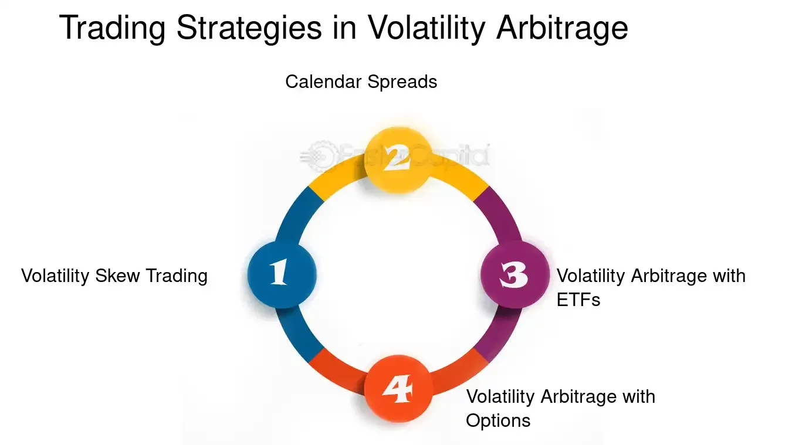

## Table of Contents

## What is volatility arbitrage?

Volatility arbitrage is a trading strategy where investors try to make money by taking advantage of differences in how much the price of an asset is expected to move, compared to how much it actually moves. Traders use this strategy by buying and selling options or other financial instruments that are sensitive to changes in volatility. The goal is to profit from the difference between the predicted volatility (implied volatility) and the actual volatility experienced in the market.

For example, if a trader believes that the market's expectation of an asset's volatility is too high, they might sell options on that asset. If the actual volatility turns out to be lower than expected, the options they sold will become less valuable, and the trader can buy them back at a lower price to make a profit. Conversely, if a trader thinks the market underestimates an asset's volatility, they might buy options. If the asset's price then moves more than expected, the value of the options will increase, and the trader can sell them at a higher price for a profit.

## How does volatility arbitrage differ from other arbitrage strategies?

Volatility arbitrage is different from other arbitrage strategies because it focuses on the difference between expected and actual price movements, rather than price differences between markets. In traditional arbitrage, traders look for a price mismatch of the same asset in different markets or forms. For example, if a stock is cheaper on one exchange than another, a trader can buy it on the cheaper exchange and sell it on the more expensive one, making a profit from the price difference. This type of arbitrage aims to exploit inefficiencies in the pricing of the same asset across different platforms.

On the other hand, volatility arbitrage doesn't rely on price differences across markets. Instead, it targets the volatility of an asset's price. Traders using this strategy focus on options and other derivatives that are sensitive to volatility. They try to predict if the market's expectation of how much an asset's price will move (implied volatility) is too high or too low compared to the actual movement (realized volatility). If they are right, they can make money by buying or selling options based on their predictions. This strategy is more about forecasting future market behavior than exploiting current price discrepancies.

## What are the basic principles of quantitative trading?

Quantitative trading uses math and computer programs to make decisions about buying and selling things like stocks or options. The main idea is to use numbers and data to find patterns and make predictions about how prices will move. Traders use special formulas, called algorithms, to figure out when to buy or sell. These algorithms can look at a lot of information very quickly, much faster than a person could. This helps traders make decisions based on facts and numbers instead of feelings or guesses.

Another important part of quantitative trading is backtesting. This means using old data to see how well a trading strategy would have worked in the past. If a strategy did well with old data, traders might think it will work well in the future too. But, it's not perfect because the future can be different from the past. Also, quantitative trading often uses something called risk management. This means setting rules to limit how much money can be lost. By using these rules, traders try to keep their losses small even if their predictions are wrong sometimes.

## What types of financial instruments are typically used in volatility arbitrage?

Volatility arbitrage mainly uses options to make money. Options are agreements that give the buyer the right, but not the obligation, to buy or sell an asset at a set price before a certain date. Traders look at how much the price of the asset is expected to move, called implied volatility. They compare this to how much the price actually moves, called realized volatility. If they think the expected movement is too high or too low compared to the actual movement, they can buy or sell options to profit from the difference.

Besides options, traders might also use other financial instruments like futures, swaps, and exchange-traded products (ETPs) that focus on volatility. Futures are contracts to buy or sell an asset at a future date at a set price. Swaps are agreements to exchange cash flows based on different variables, like interest rates or stock prices. ETPs that track volatility, like the VIX, can also be used to bet on how much the market will move. All these instruments help traders make predictions about volatility and try to make money from their predictions.

## How can one identify mispriced options using volatility arbitrage?

To identify mispriced options using volatility arbitrage, traders first look at the implied volatility of an option. Implied volatility is what the market thinks the price of the asset will move in the future. Traders compare this to the historical or realized volatility, which is how much the price actually moved in the past. If the implied volatility is much higher than the realized volatility, the option might be overpriced. This means the market expects more movement than what has happened before, and the option's price might be too high. On the other hand, if the implied volatility is lower than the realized volatility, the option might be underpriced. This means the market expects less movement than what has happened before, and the option's price might be too low.

Traders use this information to make decisions. If they think an option is overpriced, they might sell it, hoping to buy it back later at a lower price when the market realizes the volatility was overestimated. If they think an option is underpriced, they might buy it, hoping to sell it later at a higher price when the market realizes the volatility was underestimated. To do this effectively, traders often use complex math and computer programs to analyze lots of data quickly. They also look at other factors like the time left until the option expires and the current price of the asset to make sure their predictions are as accurate as possible.

## What role does the volatility smile play in volatility arbitrage?

The volatility smile is a pattern that shows how the expected price movement, or implied volatility, of an option changes with different prices at which the option can be used, called strike prices. In a normal situation, you might expect the implied volatility to be the same for all strike prices, but often it's not. The volatility smile looks like a smile because the implied volatility is higher for options that are far away from the current price of the asset, both higher and lower. This pattern can tell traders that the market thinks big price changes are more likely than small ones.

In volatility arbitrage, the volatility smile is important because it can show if options are priced correctly. If the smile is very strong, it might mean that options with far-away strike prices are overpriced because the market expects a lot of big moves. Traders can use this information to make trades that take advantage of these mispricings. For example, if they think the market is overestimating big moves, they might sell those options and hope to buy them back cheaper later. By understanding the volatility smile, traders can better predict how prices might move and find good opportunities to make money.

## How can statistical models be used to predict volatility?

Statistical models help predict how much an asset's price might move, which is called volatility, by looking at past data. These models use math to find patterns in how prices have changed before. One common model is the GARCH model, which stands for Generalized Autoregressive Conditional Heteroskedasticity. It looks at how big the price changes were in the past and uses that information to guess how big they might be in the future. Another model is the stochastic volatility model, which thinks of volatility as something that changes randomly over time. By studying these patterns, the models can give traders a good idea of what might happen next.

These models are useful because they can take in a lot of information and make predictions quickly. Traders can use these predictions to decide when to buy or sell options or other financial instruments. For example, if a model predicts that an asset's price will move a lot in the future, a trader might buy options that will be worth more if that happens. On the other hand, if the model predicts small price movements, the trader might sell options. By using statistical models, traders can make smarter choices based on data rather than just guessing.

## What are the common strategies employed in volatility arbitrage?

Volatility arbitrage traders often use a strategy called delta hedging. This means they buy or sell the asset that the option is based on to balance out the risk of the option's price changing. If they think the option's price will go up, they might sell some of the asset to make sure they don't lose too much money if the price goes down instead. On the other hand, if they think the option's price will go down, they might buy some of the asset to protect themselves. By doing this, they focus on making money from the difference between what the market expects the price to do and what it actually does.

Another common strategy is called a volatility swap. This is when traders agree to exchange money based on how much the price of an asset moves. If they think the price will move more than what the market expects, they might enter into a swap that pays them more if the price moves a lot. If they think the price will move less than expected, they might enter into a swap that pays them more if the price stays pretty steady. By using these swaps, traders can bet on their predictions about volatility without having to worry about the direction the price will go.

## How does one manage risk in volatility arbitrage?

Managing risk in volatility arbitrage is really important because this kind of trading can be tricky. One way to manage risk is by using delta hedging. This means traders buy or sell the asset that the option is based on to balance out the risk of the option's price changing. If the option's price goes up, they might sell some of the asset to make sure they don't lose too much money if the price goes down instead. If the option's price goes down, they might buy some of the asset to protect themselves. This helps them focus on making money from the difference between what the market expects the price to do and what it actually does, without losing too much if they're wrong.

Another way to manage risk is by setting stop-loss orders. These are like safety nets that automatically sell an asset if its price drops too much. This helps traders limit how much money they can lose on a trade. Also, traders often use something called position sizing, which means they decide how much money to put into each trade based on how risky it is. By not putting too much money into any one trade, they can spread out their risk and keep their losses small even if their predictions are wrong sometimes.

## What are the technological requirements for implementing volatility arbitrage strategies?

To do volatility arbitrage, you need good technology. You need fast computers that can handle a lot of data quickly. This is because volatility arbitrage involves looking at lots of numbers and making fast decisions. Traders use special software that can run complex math formulas, called algorithms, to find the best times to buy and sell options. They also need a strong internet connection to get the latest price information from the market in real time. Without these tools, it would be hard to keep up with the fast-moving world of trading.

Another important part of the technology is the ability to backtest strategies. This means using old data to see how well a trading plan would have worked in the past. Traders need software that can do this quickly and accurately. They also need systems that can help them manage risk, like setting up stop-loss orders and figuring out how much money to put into each trade. All these technological tools help traders make smart decisions and manage their risks better in volatility arbitrage.

## How can machine learning enhance volatility arbitrage?

Machine learning can make volatility arbitrage better by finding patterns in big data that people might miss. It can look at lots of information about how prices have moved in the past and use that to predict how they might move in the future. This can help traders make smarter decisions about when to buy or sell options. Machine learning can also learn from its mistakes and get better over time, which means it can keep improving its predictions.

Another way machine learning helps is by figuring out how much risk there is in a trade. It can look at different factors that might affect the price of an asset and tell traders how likely it is that they will lose money. This helps traders set up their trades to limit how much they can lose. By using machine learning, traders can make more accurate predictions and manage their risks better, which can lead to more successful volatility arbitrage strategies.

## What are the advanced techniques for optimizing volatility arbitrage portfolios?

To make volatility arbitrage portfolios better, traders often use something called portfolio optimization. This means they use math to figure out the best way to mix different options and other financial instruments in their portfolio. They look at how each option might move and how it fits with the others to reduce risk and increase the chance of making money. One way to do this is by using a method called mean-variance optimization, which tries to find the right balance between the expected return and the risk of the portfolio. Traders can also use something called risk parity, where they make sure that each part of the portfolio contributes equally to the overall risk. By doing this, they can spread out the risk and make their portfolio more stable.

Another advanced technique is using machine learning to keep improving the portfolio. Machine learning can look at lots of data to find patterns and predict how prices might move in the future. This helps traders make better decisions about which options to buy or sell. Machine learning can also learn from its mistakes, so it gets better over time. Traders can use this to adjust their portfolio as the market changes, always trying to stay one step ahead. By combining these advanced techniques, traders can make their volatility arbitrage portfolios more effective and increase their chances of making money.

## What is the understanding of volatility in financial markets?

Volatility in financial markets refers to the degree of variation in the price of a financial asset over time. It is a statistical measure that indicates the risk or uncertainty associated with the size of changes in an asset's value. Two primary types of [volatility](/wiki/volatility-trading-strategies) are used in financial analysis: historical volatility and implied volatility.

**Historical Volatility (HV):** This measurement is derived from the past market prices of an asset. It calculates the standard deviation of price changes over a specific period, offering a backward-looking view of price fluctuations. For instance, the formula for historical volatility over $n$ time periods is given by:

$$
\sigma = \sqrt{\frac{\sum_{i=1}^{n} (R_i - \bar{R})^2}{n-1}} 
$$

where $R_i$ is the return in each period, $\bar{R}$ is the average return, and $n$ is the number of observations.

**Implied Volatility (IV):** Unlike historical volatility, implied volatility is forward-looking and is embedded in the prices of options. It reflects the market's expectations of future volatility. Calculations for implied volatility often rely on models such as the Black-Scholes, which can solve for volatility as an unknown variable, assuming current market prices are accurate.

**Factors Contributing to Market Volatility:**
1. **Economic Indicators:** Factors such as inflation rates, employment statistics, and Gross Domestic Product (GDP) forecasts play a significant role in shaping market sentiment and therefore volatility.
2. **Geopolitical Events:** Wars, trade conflicts, political instability, and pandemics can cause abrupt shifts in investor behavior, increasing market volatility.
3. **Corporate Performance:** Earnings reports, management changes, and other corporate announcements can cause significant price movements in stocks.
4. **Market Sentiment:** Psychological factors and herd behavior can lead to market overreactions or underreactions, further driving price volatility.

**Impact of Volatility on Asset Prices and Investor Behavior:**
Volatility significantly influences asset pricing models and risk management practices. High volatility is often associated with greater risk, which can lead to increased risk premiums demanded by investors. During volatile periods, asset prices can experience large swings, affecting portfolio valuations and triggering margin calls or stop-loss orders.

From the perspective of investor behavior, higher volatility typically results in higher uncertainty, which may cause panic-selling or overly cautious investing strategies. Investors might require greater expected returns to compensate for the increased risk, affecting their risk tolerance and investment horizons.

Understanding volatility is crucial for investors and traders to manage risk and make informed decisions. Tools and models that measure and predict volatility are integral to strategies aimed at capitalizing on or hedging against fluctuating market conditions.

## References & Further Reading

[1]: Hull, J. C. (2018). ["Options, Futures, and Other Derivatives"](https://www.amazon.com/Options-Futures-Derivatives-John-Hull/dp/013447208X). Pearson Education.

[2]: Black, F., & Scholes, M. (1973). ["The Pricing of Options and Corporate Liabilities."](https://www.jstor.org/stable/1831029) The Journal of Political Economy, 81(3), 637-654.

[3]: Bollerslev, T. (1986). ["Generalized Autoregressive Conditional Heteroskedasticity."](https://www.jstor.org/stable/1912773) Journal of Econometrics, 31(3), 307-327.

[4]: Avellaneda, M., & Lee, J. (2010). ["Statistical Arbitrage in the U.S. Equities Market."](https://math.nyu.edu/~avellane/AvellanedaLeeStatArb071108.pdf) Quantitative Finance, 10(7), 761-782.

[5]: Taleb, N. N. (2007). ["The Black Swan: The Impact of the Highly Improbable."](https://www.amazon.com/Black-Swan-Impact-Highly-Improbable/dp/1400063515) Random House.

[6]: Lopez de Prado, M. (2018). ["Advances in Financial Machine Learning."](https://www.amazon.com/Advances-Financial-Machine-Learning-Marcos/dp/1119482089) Wiley.

[7]: Gatheral, J. (2006). ["The Volatility Surface: A Practitioner’s Guide."](https://www.amazon.fr/Volatility-Surface-Practitioner%E2%80%B2s-Guide/dp/0471792519) Wiley.

[8]: Chan, E. (2009). ["Quantitative Trading: How to Build Your Own Algorithmic Trading Business."](https://www.amazon.com/Quantitative-Trading-Build-Algorithmic-Business/dp/0470284889) Wiley.