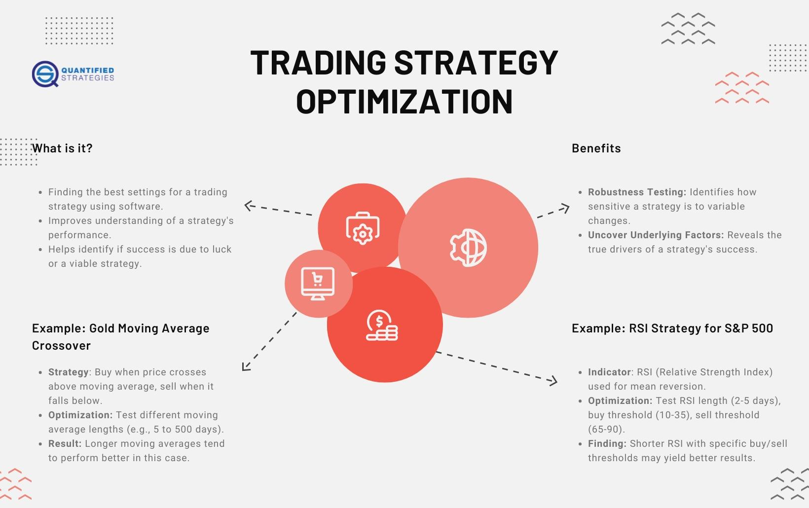

## Table of Contents

## What is a trading strategy?

A trading strategy is a set of rules that a trader uses to decide when to buy and sell assets like stocks or currencies. It helps traders make decisions based on data and analysis instead of emotions. For example, a simple strategy might be to buy a stock when its price goes up by 10% and sell it when it goes down by 5%.

There are many different types of trading strategies. Some are based on technical analysis, where traders look at charts and patterns to predict future price movements. Others use fundamental analysis, where traders look at a company's financial health and market conditions. No matter the type, a good trading strategy should be tested and adjusted over time to improve its performance and help traders make more profitable trades.

## Why is it important to assess the capacity of a trading strategy?

Assessing the capacity of a trading strategy is important because it helps traders understand how well their strategy will work with different amounts of money. If a strategy works well with a small amount of money, it might not work the same way with a larger amount. This is because bigger trades can affect the market more, making it harder to buy or sell at the desired prices.

By testing the capacity, traders can find out the maximum amount of money they can use with their strategy without losing its effectiveness. This helps them avoid putting too much money into a strategy that might fail when scaled up. Knowing the capacity also helps traders plan their investments better and manage their risks more effectively.

## What are the basic metrics used to evaluate a trading strategy?

When you want to see if a trading strategy is good, you look at some basic numbers called metrics. One important metric is the return, which shows how much money you made or lost. Another one is the risk, which tells you how much you could lose. A common way to look at both return and risk together is the risk-reward ratio. This tells you if the possible reward is worth the risk you are taking.

Another key metric is the win rate, which is the percentage of trades that make money. Even if your win rate is high, you also need to look at the average win and the average loss. If your losses are much bigger than your wins, you might still lose money even with a high win rate. The Sharpe ratio is another useful metric. It measures how much better your strategy does compared to just putting your money in a safe investment like a bank account, after considering the risk.

Lastly, it's good to know how often you can use your strategy. This is called the trading frequency. If you can trade often, you might make money faster, but it also means you need to watch the market more closely. All these metrics together help you understand if your trading strategy is working well and if it's worth using.

## How can historical data be used to assess a trading strategy?

Historical data is super helpful when you want to check if your trading strategy works well. You can use old price information from stocks, currencies, or other things you trade to see how your strategy would have done in the past. This is called [backtesting](/wiki/backtesting). You pretend to use your strategy with the old data to see if it would have made money or lost money. By doing this, you can find out if your strategy is good or if you need to change it.

But remember, just because a strategy worked well in the past doesn't mean it will work the same way in the future. Markets change, and what worked before might not work now. So, it's smart to test your strategy with different time periods and different types of markets. This helps you see if your strategy can handle different situations. Using historical data this way helps you make your trading strategy better and more reliable.

## What is the difference between backtesting and forward testing?

Backtesting and forward testing are two ways to check if a trading strategy works well, but they do it in different ways. Backtesting means you use old data to see how your strategy would have done in the past. You pretend to trade with the old prices to see if you would have made or lost money. It's like looking back in time to see if your strategy was good. Backtesting helps you find out if there are any problems with your strategy and lets you make changes before you start trading for real.

Forward testing, on the other hand, is about trying out your strategy in real time but without using real money. It's also called paper trading. You use the current market conditions to see how your strategy works as the market moves. This way, you can see how your strategy deals with what's happening right now in the market. Forward testing is great because it shows you how your strategy might work in the future, not just in the past. Both backtesting and forward testing are important to make sure your strategy is ready for real trading.

## How do market conditions affect the capacity of a trading strategy?

Market conditions can really change how well a trading strategy works. If the market is calm and prices don't move much, a strategy that depends on big price swings might not do well. But if the market is very active with lots of ups and downs, the same strategy might make more money. Also, if lots of people are trading the same thing at the same time, it can be harder to buy or sell at the prices you want. This is called [liquidity](/wiki/liquidity-risk-premium), and it can affect how much money you can use with your strategy.

For example, if you have a strategy that works well with a small amount of money, using more money might change how the market acts. When you trade with a lot of money, you might move the market prices just by buying or selling. This can make it harder to follow your strategy the way you planned. So, you need to think about how the market is doing and how much money you are using to make sure your strategy still works the way you want it to.

## What role does risk management play in assessing a trading strategy?

Risk management is a big part of checking if a trading strategy is good. It's all about figuring out how much money you could lose and making plans to keep those losses small. When you look at a strategy, you need to see if it can handle bad times in the market without losing too much money. This means setting rules like stop-loss orders, which automatically sell your trade if it goes down too much. By doing this, you make sure that one bad trade doesn't wipe out all your money.

Also, risk management helps you decide how much money to use in each trade. If you put too much money into one trade, you could lose a lot if it goes wrong. By spreading your money across different trades, you lower the risk. When you assess a trading strategy, you need to see if it fits with your risk plan. This way, you can use the strategy without taking too big of a risk. Good risk management makes your trading strategy safer and more likely to succeed in the long run.

## How can statistical measures like Sharpe Ratio and Sortino Ratio help in evaluating a strategy?

The Sharpe Ratio and Sortino Ratio are important tools that help you figure out how good a trading strategy is by looking at its returns and risks. The Sharpe Ratio tells you how much extra return you get for the risk you take. It does this by comparing the strategy's returns to a safe investment like a bank account. A higher Sharpe Ratio means the strategy is doing a good job of making more money than a safe investment, considering the risk involved. This helps you see if the extra risk you're taking is worth it.

The Sortino Ratio is similar, but it only looks at the bad risk, or the risk of losing money. It ignores the good ups and downs and focuses on how the strategy handles losses. A higher Sortino Ratio means the strategy is good at avoiding big losses while still making money. Both ratios help you understand if a trading strategy is worth using by showing you how well it balances making money with managing risk.

## What are the limitations of using historical performance to predict future strategy capacity?

Using past performance to guess how a trading strategy will do in the future can be tricky. The main problem is that markets change over time. What worked well before might not work now because things like the economy, world events, and new technology can make the market act differently. So, if you only look at old data, you might think your strategy is better than it really is for the future.

Another issue is that historical data might not have all the situations that could happen in the future. For example, if you've only tested your strategy during good times, you won't know how it does during a big market crash. Also, if you keep changing your strategy to fit the past data perfectly, it might not work well with new data. This is called overfitting, and it can make your strategy look good in the past but fail in the future. So, while looking at past performance is helpful, you need to be careful and use other ways to check your strategy too.

## How can machine learning models enhance the assessment of a trading strategy?

Machine learning models can make assessing a trading strategy better by finding patterns in big sets of data that people might miss. These models can look at lots of information from the past, like prices, trading volumes, and even news, to see what might happen next in the market. By doing this, [machine learning](/wiki/machine-learning) can help traders make better guesses about when to buy or sell. It can also help find the best times to trade and figure out how much risk to take, making the strategy more likely to work well.

But, machine learning isn't perfect. It can sometimes see patterns that aren't really there, which can lead to bad decisions. Also, these models need a lot of good data to work right, and if the data is old or not complete, the model might not predict the future well. So, while machine learning can help a lot, traders need to keep checking and updating their models to make sure they stay useful and accurate.

## What advanced techniques can be used to stress test a trading strategy under various economic scenarios?

Stress testing a trading strategy means checking how it would do in really tough times. One way to do this is by using simulations. You can make up different bad situations, like a big market crash or a sudden change in interest rates, and see how your strategy would handle them. This helps you find out if your strategy can survive big problems without losing too much money. Another technique is to use historical data from past economic crises, like the 2008 financial crisis, to see how your strategy would have done back then. This gives you a good idea of how it might do if something similar happens again.

Another advanced technique is called Monte Carlo simulation. This method uses random numbers to create lots of different possible future market situations. By running your strategy through these made-up scenarios, you can see how it might do in many different futures. This helps you understand the risks better and see if your strategy can handle a wide range of possible outcomes. It's like playing out thousands of different "what if" situations to make sure your strategy is ready for anything the market might throw at it.

## How do professional traders adjust their strategies based on ongoing capacity assessments?

Professional traders keep a close eye on how well their trading strategies are working by always checking their capacity. They do this by looking at how their strategy does with different amounts of money and in different market conditions. If they see that their strategy isn't doing as well as they hoped, they might decide to use less money with it or change the rules of the strategy. They might also look at new data or use different tools to see if they can make their strategy better. By doing this, they can keep their strategy working well and make sure they don't lose too much money.

Sometimes, professional traders find that their strategy works better in some markets than others. If they see that their strategy is doing really well in a certain type of market, they might decide to use more money in that market. But if the market changes and their strategy starts to lose money, they will quickly adjust how much money they are using or even stop using the strategy until the market gets better. This way, they can keep making money and avoid big losses by always being ready to change their plans based on what's happening in the market.

## References & Further Reading

[1]: Bergstra, J., Bardenet, R., Bengio, Y., & Kégl, B. (2011). ["Algorithms for Hyper-Parameter Optimization."](https://papers.nips.cc/paper_files/paper/2011/hash/86e8f7ab32cfd12577bc2619bc635690-Abstract.html) Advances in Neural Information Processing Systems 24.

[2]: ["Advances in Financial Machine Learning"](https://www.amazon.com/Advances-Financial-Machine-Learning-Marcos/dp/1119482089) by Marcos Lopez de Prado

[3]: ["Evidence-Based Technical Analysis: Applying the Scientific Method and Statistical Inference to Trading Signals"](https://www.wiley.com/en-gb/Evidence+Based+Technical+Analysis:+Applying+the+Scientific+Method+and+Statistical+Inference+to+Trading+Signals-p-9780470008744) by David Aronson

[4]: ["Machine Learning for Algorithmic Trading"](https://www.amazon.com/Machine-Learning-Algorithmic-Trading-intelligence/dp/9918608013) by Stefan Jansen

[5]: ["Quantitative Trading: How to Build Your Own Algorithmic Trading Business"](https://www.amazon.com/Quantitative-Trading-Build-Algorithmic-Business/dp/0470284889) by Ernest P. Chan