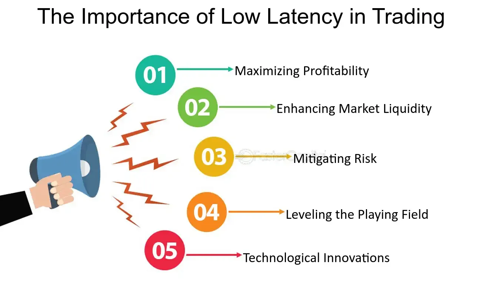

## Table of Contents

## What is latency in the context of trading?

In trading, latency refers to the time it takes for a trade order to be sent from a trader's computer to the exchange and for the confirmation of the trade to be sent back. This delay can be very short, often measured in milliseconds, but it's crucial in high-frequency trading where traders make many trades very quickly.

Low latency is important because even a small delay can affect the price at which a trade is executed. For example, if a trader wants to buy a stock at a certain price, but there's a delay, the price might change by the time the order reaches the exchange. This can result in the trader buying at a higher price or missing the opportunity altogether. So, traders often use special technology and strategies to reduce latency as much as possible.

## Why is latency important for trading strategies?

Latency is really important for trading strategies because it can affect how much money traders make or lose. In trading, time is money, and even a tiny delay can make a big difference. For example, if a trader wants to buy a stock at a certain price, but there's a delay, the price might go up before the order gets to the exchange. This means the trader might end up buying the stock at a higher price than they wanted, which can hurt their profits.

This is especially important for high-frequency trading, where traders make lots of trades very quickly. In this kind of trading, every millisecond counts. Traders use special technology and strategies to make their trades as fast as possible. By keeping latency low, they can get better prices and make more money. So, understanding and managing latency is a big part of making successful trading strategies.

## How can latency affect the execution of trades?

Latency can change how trades happen. When a trader wants to buy or sell something, they send an order to the exchange. If there's a delay, the price might change before the order gets there. For example, if a trader wants to buy a stock at $100, but there's a delay, the price might go up to $101 by the time the order reaches the exchange. This means the trader might have to buy at the higher price, which can make them lose money.

This is a big deal in high-frequency trading, where traders make lots of trades very quickly. In this kind of trading, even a tiny delay can make a big difference. Traders use special technology to make their trades as fast as possible. By keeping latency low, they can get better prices and make more money. So, managing latency is really important for making sure trades happen the way traders want them to.

## What are common sources of latency in trading systems?

Latency in trading systems can come from many places. One big source is the internet. When a trader sends an order, it has to travel through the internet to get to the exchange. This trip can take time, and things like slow internet connections or busy networks can make it even slower. Another source of latency is the computer hardware. If a trader's computer or the exchange's servers are old or not powerful enough, they can slow down the process of sending and receiving orders.

Software can also cause latency. Trading software has to do a lot of work, like checking prices and making sure orders are correct. If the software is not well-made or if it's doing too many things at once, it can add to the delay. Finally, the distance between the trader and the exchange can make a difference. The farther away they are, the longer it takes for the order to travel. That's why some traders put their computers very close to the exchange, to cut down on this kind of latency.

## What tools can be used to measure latency in trading?

To measure latency in trading, traders use special tools that track how long it takes for an order to go from their computer to the exchange and back. One common tool is a network latency monitor, which checks the time it takes for data to travel through the internet. This tool can show traders if their internet connection is slow or if there are problems with the network that could be causing delays.

Another tool traders use is a timestamping system. This system puts a time stamp on an order when it leaves the trader's computer and another when it gets to the exchange. By comparing these times, traders can see exactly how long the trip took. Some traders also use software that simulates trading to test how fast their system is. This helps them find and fix any parts of their setup that might be slowing things down.

## How can one simulate different latency conditions to test a trading strategy?

To test a trading strategy under different latency conditions, traders can use special software that lets them pretend there's more or less delay in their trades. This software can slow down the computer or the internet connection to see how the trading strategy works when things take longer. By doing this, traders can find out if their strategy still makes money even when there's a delay, or if they need to change it to work better with slower conditions.

For example, a trader might use a program that adds a few milliseconds of delay to see how their high-frequency trading strategy holds up. They can watch how the strategy performs when orders take longer to reach the exchange and come back. This helps them understand if their strategy can handle real-world situations where latency might be higher than usual, like during busy trading times or if there's a problem with the internet. By testing in this way, traders can make their strategies stronger and more reliable.

## What metrics should be used to assess the impact of latency on trading performance?

To understand how latency affects trading performance, traders should look at a few key numbers. One important number is the order execution time, which is how long it takes for an order to go from the trader's computer to the exchange and back. If this time is longer, it might mean the trader is losing money because the price changed while waiting. Another number to watch is the slippage, which is the difference between the price the trader wanted and the price they actually got. Higher latency can lead to more slippage, making trades less profitable.

Another metric to consider is the fill rate, which shows how often orders are completed successfully. If latency is high, fewer orders might be filled at the desired price, leading to a lower fill rate. Traders also look at the profit and loss (P&L) impact, which measures how much money is made or lost because of latency. By keeping an eye on these numbers, traders can see how much latency is hurting their performance and make changes to their strategies to do better.

## How does latency impact different types of trading strategies (e.g., high-frequency trading vs. long-term investing)?

Latency has a big impact on high-frequency trading, where traders make lots of trades very quickly. In this type of trading, even a tiny delay can make a big difference. If there's a lot of latency, it can slow down the trades and make the trader buy or sell at a worse price than they wanted. This can lead to less profit or even losses. High-frequency traders use special technology to keep latency as low as possible because every millisecond counts in their strategy.

For long-term investing, latency is not as important. Long-term investors hold onto their investments for a long time, so small delays in buying or selling don't usually affect their strategy much. They care more about the overall performance of their investments over months or years, rather than the exact price they get at the moment of the trade. So, while latency can still have some effect, it's not a big deal for long-term investors like it is for high-frequency traders.

## What are the best practices for minimizing latency in a trading setup?

To minimize latency in a trading setup, it's important to use fast internet and good computer hardware. A fast internet connection helps orders get to the exchange quickly, so traders often use special services that are designed to be as fast as possible. The computer hardware should also be powerful, with a fast processor and lots of memory, because this helps the trading software work quickly. Some traders even put their computers very close to the exchange to cut down on the time it takes for orders to travel.

Another way to reduce latency is to use well-made trading software. The software should be designed to handle orders quickly and not do too many things at once that could slow it down. Traders can also use special tools to check their setup and find any parts that might be causing delays. By fixing these problems, traders can make their trades happen faster and get better prices.

## How can statistical analysis be used to quantify the effect of latency on trading outcomes?

Statistical analysis can help traders understand how latency affects their trades by looking at numbers like order execution time, slippage, fill rate, and profit and loss (P&L). For example, traders can collect data on how long it takes for their orders to go from their computer to the exchange and back. By comparing this data over time, they can see if longer delays lead to worse prices or fewer completed orders. This can show them how much money they might be losing because of latency.

Traders can also use statistical tools like regression analysis to find out how much latency impacts their profits. They can set up experiments where they change the latency and see how it affects their trading results. By doing this many times and looking at the data, they can figure out if there's a clear pattern. For example, they might find that for every millisecond of added latency, they lose a certain amount of money. This information can help them decide how much effort and money to put into reducing latency to improve their trading outcomes.

## What case studies exist that demonstrate the impact of latency on specific trading strategies?

One famous case study about latency in trading is about the New York Stock Exchange (NYSE) and the Chicago Mercantile Exchange (CME). A company called Spread Networks built a special fiber-optic cable between these two places to make trades happen faster. This cable was much straighter and shorter than the usual routes, cutting down the time it took for orders to travel. Traders who used this cable could get their orders to the exchange a few milliseconds faster than others. This small difference helped them make more money because they could buy and sell at better prices. This case shows how important even tiny amounts of latency can be in high-frequency trading.

Another case study is about Knight Capital Group, a trading firm that had a big problem because of latency. In 2012, they released new software that was supposed to help them trade faster. But the software had a mistake that made it send out lots of orders very quickly. Because of the high speed and low latency of their system, these orders caused big price changes in the market. Knight Capital lost a lot of money very quickly because of this. This case shows that while low latency can help traders make more money, it can also make mistakes happen faster and cause big problems if not managed carefully.

## How can machine learning be applied to predict and mitigate the effects of latency in real-time trading?

Machine learning can help traders predict and deal with latency in real-time trading by looking at past data. Traders can use [machine learning](/wiki/machine-learning) models to study how long it took for orders to go from their computer to the exchange and back in the past. The models can find patterns in this data, like how latency changes at different times of the day or during busy trading periods. By understanding these patterns, the models can predict when latency might be higher and help traders adjust their strategies to avoid losing money because of delays.

Once the machine learning model predicts higher latency, it can suggest ways to fix it. For example, the model might tell the trader to use a different internet connection or change their trading software to handle orders more quickly. The model can also help traders decide when to make trades, so they can avoid times when latency is likely to be high. By using machine learning to predict and manage latency, traders can make their trades happen faster and get better prices, which can help them make more money.

## References & Further Reading

[1]: Aldridge, I. (2013). ["High-Frequency Trading: A Practical Guide to Algorithmic Strategies and Trading Systems"](https://www.amazon.com/High-Frequency-Trading-Practical-Algorithmic-Strategies/dp/1118343506). Wiley.

[2]: Lewis, M. (2015). ["Flash Boys: A Wall Street Revolt"](https://www.amazon.com/Flash-Boys-Wall-Street-Revolt/dp/0393351599). W. W. Norton & Company.

[3]: Narang, R. K. (2013). ["Inside the Black Box: A Simple Guide to Quantitative and High-Frequency Trading"](https://www.amazon.com/Inside-Black-Box-Quantitative-Frequency/dp/1118362413). Wiley.

[4]: Kissell, R. L. (2013). ["The Science of Algorithmic Trading and Portfolio Management"](https://www.amazon.com/Science-Algorithmic-Trading-Portfolio-Management/dp/0124016898). Academic Press.

[5]: Johnson, B. R. (2010). ["Algorithmic Trading & DMA: An Introduction to Direct Access Trading Strategies"](https://www.amazon.com/Algorithmic-Trading-DMA-Introduction-Strategies/dp/0956399207). 4Myeloma Press.